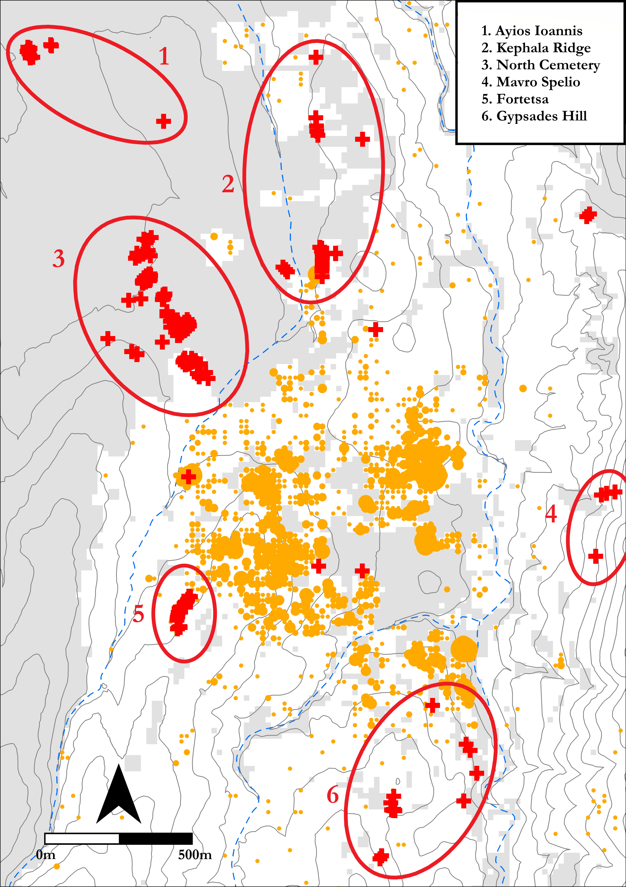

```{r setup, include=FALSE}
knitr::opts_chunk$set(
  collapse = TRUE,
  warning = FALSE,
  message = FALSE,
  echo = FALSE,
  fig.retina = 2,
  comment = "#>",
  fig.path = "../figures/",
  dev="png"
)

#The appropriate packages are installed. Extrafont allows the use of non-standard fonts in R plots, ggplot2 is a powerful figure and graph plotting tool, and RColorBrewer includes a number of colour pallettes which can be applied to plots. The colour scheme in this paper is chosen from those that are suitable for colour-blind readers. The font Garmond is installed and stored.
library(ggpubr)
library(ineq)
library(reshape)
library(data.table)
library(extrafont)
library(ggplot2)
library(RColorBrewer)
library(grid)
library(dplyr)
library(plyr)
library(ggforce)
library(png)
font_import(paths="../paper/font",pattern="GARA")
loadfonts(device="win")

tombs<-read.csv("../data/raw_data/KnossosTombs.csv",header=TRUE)
tombs<-subset(tombs,tombs$cem_condensed=="KNC"|tombs$cem_condensed=="FOR")

```

# Introduction
Three principal interests converge in this paper: a reorientation of the focus of Early Iron Age Cretan archaeology; the application of computational, and quantitative methods to supplement traditional modes of archaeological inference; and open-access data and reproducible research. To begin with the first of these, it may be felt that, of all ancient sites on Crete, Knossos is the last in need of further archaeological attention. The city and palace of Knossos, first excavated well over a century ago [@Evans1921; -@Evans1928; -@Evans1930], retain a pre-eminent position in popular and academic accounts the island’s Bronze Age, and few, if any, other Cretan sites have been so thoroughly dug, reconstructed, and contested. 

For one, though, this is not the Knossos of that illustrous, palatial period, but rather the town as it persisted and evolved during the subsequent Early Iron Age (EIA). Research into this once maligned period has grown apace in the last few decades, beginning with the pioneering works of Coldstream [-@Coldstream1977], Desborough [-@Desborough1972], and Snodgrass [-@Snodgrass1971] and culminating in the rejection by many scholars of the image of a society bereft of its former palatial glory. Certainly, few would any longer defend the appelation or interpretive bagguage of the ‘Dark Ages’ [on the origins of which, see @Kotsonas2016; @Morris1997].Nonetheless, our knowledge of many EIA settlements remains often underdeveloped in comparison with those of the second millennium BC. 

But more importantly, and welcome though they are, a number of recent publications on the socio-economic [@Wallace2010a] and settlement [@Nowicki2000] changes which accompanied the BA-EIA transition have directed scholarly attention toward a number of elevated, defensible settlements supposedly founded in response to the dangers of this turbulent period. This research agenda is likewise reflected in survey work, which has focussed extensively around the Bay of Mirabello, and the Isthmus of Ierapetra. This has, unfortunately, engendered a certain disregard for settlement characterised by quite different topographies, especially in the central region of the island. There remains, therefore, a need for studies addressing the social dynamics at such sites (Knossos, Phaistos, Grivila etc.), with a long-term view to comparative appraisal of the divergent trajectories of communities across the island in the EIA [@Kotsonas2011b; @Whitley2011, 667–8].

As for the second and third of my stated interests, several authors have recently demonstrated the great potential of quantitative, statistical, spatial, and network analyses in elucidating social dynamics, settlement patterning, and systems of inter-regional communication and exchange across Crete and the wider Aegean. Such work encourages the use of large (often pre-existing) datasets, and the sharing of both data and methods to facilitate reproducible, collaborative, and innovative research [@Bevan2013; @Knappett2011a]. The cemeteries of Knossos offer an opportunity to introduce such approaches into EIA research, where they have yet to make much of an impact [see @Kotsonas2011]. The Fortesta and North Cemetery complexes are both well-published [@Brock1957; @Coldstream1996a] and have been considered variously in relation to their 'oriental' imports [@Antoniadis2012], antique artefacts [@Crowe2016], and religious context [@Coldstream1984b]. But a lack of quantitative analyses, or systematic comparisons between different cemeteries, has left us with many intuited trends, some clearly exceptional tombs, but a general impression of un-patterned multiplicity. 

I suggest that the application of a range of quantitative and statistical methods may provide new insight into the social behaviours underlying the mortuary assemblages. With a dataset including information on every find and tomb recorded in the Fortetsa and Knossos North Cemetery publications [@Brock1957; @Coldstream1996a], the following analysis examines both the synchronic and diachronic variation among the tombs of both cemeteries. In doing so, I aim to demonstrate the potential for quantitative methods, firstly, to permit identification, and nuanced characterisation, of significant patterning in the archaeological material; secondly, to facilitate a more systematic appraisal of the cemeteries’ largest tombs and their distinctive histories; and, finally, to offer not just generalities, but tangible and context-specific considerations of the motivations and identities behind the burial groups themselves, with a view to eventually comparing such results with mortuary assemblages across the island. 

# Early Iron Age Knossos
## Settlement Evidence: 'A meagre filling in a very thick sandwich'

Settlement evidence at EIA Knossos is, in a word, insubstantial. Speaking of the town’s stratigraphic sequence, Coldstream lamented that “the remains of [this] period are like a meagre filling in a very thick sandwich” between Bronze Age and later Greek and Roman levels [@Coldstream1991, 287]. Most individual finds of Protogeometric or Geometric date take the form of flimsy foundations, patches of earth floor, wells or simple scatters of pottery, and for a long time it was believed the town contracted, moved, or even dissolved following the collapse of the palace. Indeed, Alexiou [@1950] thought it likely that the area comprised several dispersed villages, which later coalesced into a single city, as per Aristotle’s model of synoecism. 

However, a concentration of activity slightly to the west of the old palace presented a good case for continuing, nucleated settlement [@Hood1981], something strongly advocated by Coldstream [-@Coldstream1984a; -@Coldstream2000], while, more recently, findings of the Knossos Urban Landscape Project suggest a PG settlement of up to 40ha [@Kotsonas2011a, 5-8]. This estimate remains our best guess in the absence of substantial excavated deposits but, if it is accurate, then EIA Knossos was one of the largest sites of the contemporary Aegean. 


## The Early Iron Age Cemeteries


Survey aside, our most abundant evidence for EIA Knossos comes from the mortuary record (see Figure \@ref(fig:map). The transitional period between the LBA and EIA yields few if any securely datable interments, but later the evidence becomes more plentiful, with multiple burials known from the Kephala ridge [@Coldstream1963, 38; @Hogarth1899, 82-5], the modern suburbs of Ayios Ioannis and Atsalenio [@Boardman1960; @Davaras1968, 133–46], the cave of Mavro Spelio [@Antoniadis2012, 58-9], and the Khaniale Teke site with its well-known tholos, mooted as evidence for the presence immigrant craftsmen from the Near East [@Boardman1967;@Hutchinson1954; cf. @Hoffman1997 @Kotsonas2006]. Taken together, these scattered tombs point to a richly variegated set of funerary practices but, despite their reasonable number, are so dispersed and often isolated that they provide little scope for systematic quantitative analysis. 

Fortunately, far larger burial accumulations are to be found in the Fortetsa and the Knossos North cemeteries, which together comprise some 134 tombs, ranging in date from the Subminoan to Late Orienatalising periods. Though many were robbed in antiquity, and others destroyed by the digging of later burials, building work, or just the ravages of time, they still represent the most abundant source of evidence for not just mortuary practices, but for social life of any kind at EIA Knossos. They are thus the ideal candidates for a quantitative analysis of the kind advanced here.

## The Fortetsa and the Knossos North Cemeteries

The cemetery on the slope facing the eponymous village of Fortetsa is composed of twelve tombs excavated in 1933, and another eight uncovered in 1935 (Brock 1957, xi). These tombs cluster in three main groups. The largest of these, including tombs IX, VIII, VII, V, II, III, IV, V and P, is arranged on a north-south axis, with the *dromos* of each tomb extending downslope to the west. Further north lies the cluster of tombs OD, X, XI, LST and BLT. The third group lies south of the first, and comprises tombs Θ, Ϙ and F. Finally, three tombs excavated in 1933 – L, TFT and Π – which lie close to the main road north of the Acropolis hill [@Brock1957, 1-2], are now considered to belong the Knossos North Cemetery.

To the northeast of the Fortetsa cemetery, a collection of ten badly damaged tombs known, after the year of their excavation, as the Fortetsa 1967 tombs, were probably the southernmost burials of the North Cemetery. Unfortunately, all had been looted at the time of excavation, and no *in situ* deposit was found in any tomb. They are thus excluded from present analysis. Northwest of these tombs, and just south of the Teke Tholos, the Teke tombs represent the northern reaches of the KNC. The central section of the KNC comprises the ‘Medical Faculty’ site, named for the extension of the University of Crete that prompted major rescue excavations here in 1978. Some 89 tombs of Subminoan to Late Orientalising date were found, by far the largest single concentration of EIA tombs in the whole Knossos area [@Coldstream1996a, 53-55]. 

The tombs themselves fall into three main types, the chamber tomb, shaft grave, and pit cave or tomb; the latter two are largely Subminoam phenomena, with the former by far the most abundant. It comprises a descending ramp or passage, the *dromos*, leading to the chamber itself, cut into the *kouskouras* bedrock. The *dromos* and chamber are separated by the *stomion*, an opening often set a step or two lower than the *dromos*, which is covered by a large stone slab, smaller stacked stones, or combination of both [@Antoniadis2012, 47-8]. The majority of burials are cremations, a rite that appears at Knossos in the Subminoan period, in the Tomb 200+ complex (Ts. 200, 201 and 202 are three chambers of a single pit tomb) in the KNC [@Coldstream1994, 109]. Inhumation does not completely disappear in the EIA, but by the Orientalising period it appears restricted to child burials, and in those instances where it is attested (Ts. L, 45, 98, 112 and F67:5), these burials appear to be among the very earliest in each tomb [@Antoniadis2012, 69]. 

## Chronological developments in the cemeteries

The initial foundation of the cemeteries has received much attention. It has been claimed that no tomb crosses the LM IIIC-SM divide [@Coldstream1998, 58; @Coldstream2006, 582), though there is a possibility that this is a classificatory artefact [@Hallager2010]. Instances of BA tombs reused the EIA are known (e.g. the Khaniale Teke tholos), and Cavanagh [-@Cavanagh1996], based on a cluster analysis of tomb dimensions, could not reject the possibility of some KNC tombs being of BA date, though other evidence would suggest this is unlikely (Whitelaw, pers. comm.).

During the use of the cemeteries, correspondences have been highlighted between changing pottery styles, and patterns of tomb construction and abandonment. The Protogeometric B style, first defined by Brock [-@Brock1957], 143], who hailed it as “the most remarkable phase in Cretan vase-painting”, is apparently a Cretan anomaly, and evinces a melding of Attic geometric motifs, experimental patterns possibly deriving from Near Eastern metalwork, and iconography drawn seemingly from the Minoan repertoire (Coldstream 1984, 93–4). Coldstream has argued that the concurrence of this style with a rash of newly founded tombs points to a reformulation of elite mortuary display, noting how, in this period also, redeposited Minoan larnakes began appearing in and around some tombs, in one case even inspiring the decoration of a PGB vessel (in T. 107; see @Coldstream1984b; -@Coldstream1994, 112–3). Whether simply nostalgia [@Coldstream1998, 60], or a more tactical strategy by newly emerging elite groups [@Coldstream1994, 114-5], it seems that the Bronze Age past possessed a significant cultural cachet mobilised by various actors over the lives of these cemeteries. 

The final mystery of the chronological sequence at the KNC and Fortetsa is the quite abrupt cessation of burials around 630 BCE. There had been changes in tomb use in both cemeteries in the preceding century, with few new tombs built, though interments in old tombs continued [@Brock1957, 4; @Cavanagh1996; 651-3]. This curiosity has, along with the equally scanty evidence for the period in the wider settlement, become known as the ‘Archaic Gap'. The causes of this lacuna, which persists until the recrudescence of archaeological evidence in the Late Archaic period, remain unknown. Although various explanations have been forwarded, [@Coldstream1999, 301-2; @Huxley1994, 126; @Kotsonas2002, 41-4], there are now strong reasons to doubt the settlement was abandoned (Whitelaw, pers comm.).

## Heroes and Heirlooms: Object Biographies and Exceptional Burials

A popular approach to the study of Knossos’ EIA tombs has been the investigation of ‘object biography’, a term derived from Appadurai [-@Appadurai1986] and Kopytoff [-@Kopytoff1986]. Influenced by Mauss’ [-@Mauss1954] formulation of ‘the gift’, these authors stressed the mutuable nature of an object’s social meanings, and its capacity for acquiring a ‘biography’, through the transformations of its social existence. These ideas proved attractive with their evocation of the Homeric motif of gift-giving [@Whitley2002, 220-1], and the remarkable archaeological parallels for such objects – such as the boar’s tusk helmet from Tomb 200+ and that given to Odysseus by Meriones (*Iliad* 10.260-271). Thus, a particular interpretive lens, melding Homeric and anthropological ideas, has been applied to certain elaborate burials. 

Catling’s discussion of the Tomb 200+ complex is a notable example. Tomb 201 contained the remains of at least two adults, and possibly a child. Objects included a bronze sword, spearhead, and arrowhead, an iron dirk or knife, fragments of an antique bronze stand, probably of Cypriot origin, and pieces of the aforementioned helmet [@Catling1995, 123]. Catling identifies similarities between this tomb and burials at Tiryns, Kaloriziki, and the famous *hērōön* of Lefkandi. All contained imported items at an early date, were of ‘warrior grave’ type, and formed loci for later burials. Catling argues that those individuals who dared to travel abroad in this time of more limited seafaring, accruing precious artefacts and stories of distant lands, would have been accorded exceptional treatment in death [@Catling1995, 127–8]. 

Complementing the theme of heroes abroad has been a similar interest in foreigners at home. Two caches of gold jewellery, found in pits flanking the entrance to the Teke Tholos, were argued by Boardman [-@Boardman1967] to be foundation deposits – a Near Eastern custom – for the burial place of an immigrant craftsman, probably Phoenician in ancestry. Kotsonas has revisited this attribution, suggesting that the tholos is more likely the resting place of an elite individual or family with a monopoly over a metal workshop’s output [-@Kotsonas2006, 155–9]. While certainty in such individual cases may be moot, it seems unlikely that traders or craftsmen of non-Cretan heritage never visited or resided at Knossos during the EIA [@Hoffman1997, 176–85; @Schreiber2003, 293-306].


## Number Crunching: Quantitative Analyses of the Cemeteries

Generally speaking, the above analyses have tended to rely more on particular finds, tombs, or observable, but limited, patterns in the data. Only a few authors have applied more quantative approaches, but these point toward their potential utility. Cluster analyses have been employed by both Cavanagh [-@Coldstream1996, 653-7] and Antoniadis [-@Antoniadis2012, 193-7], the most sophisticated statistical techniques so far applied to the present material. Cavanagh’s analysis of tomb architecture has been mentioned, while Antoniadis’ more holistic approach corroborates quantitatively some of the intuitive correspondences noted between specific tombs in previous studies. Antoniadis [-@Antoniadis2012, 172-6] also divided the EIA tombs of Knossos into three groups, those with fewer than 10 pots, fewer than 50, and more than 50, and found that, in each successive case, the proportions of tombs containing 'oriental' imports and imitations increased, the implication being that a hierarchy existed, with unequal access to such prestigious goods. Yet even here the available data could be further interrogated, such as with the relationship between imported items and so-called tomb ‘wealth’. The present study seeks to extend and nuance a number of observations that have been made in previous studies, as well as revealing patterns thus far unacknowledged, through use of a more systematic approach to quantitative analysis.


# Methods

## Databases

The cornerstone of the present study is a database (or, rather, three linked databases) based on the excavation reports for the Fortetsa and Knossos North cemeteries [@Brock1957; @Coldstream1996a]. The first includes an entry for each individual ceramic vessel, by far the largest portion of all known finds. Each entry includes: the tomb from which the vessel came; the vessel shape; whether it was an open or closed vessel; its main dimensions; its ceramic period and corresponding absolute dating measures (see below). In addition, all imports, Oriental imitations, and antique (that is, Bronze Age) artefacts were accordingly categorised, using the studies of Antoniadis (2012), Jones (2000), and Crowe (2016) to supplement omissions in the original excavation reports. In total, this database comprises just over 4540 individual artefacts. 

The second database is similar, but with each entry corresponding to a find other than a ceramic vessel. A ‘material’ variable was also added, as of course these finds were not all made of the same substance. This database included some 1620 individual artefacts. 

The final database concerns the tombs themselves. Each tomb was accorded its own entry, with variables including dating (both in relative and absolute terms), surviving dimensions, and the known and estimated number of interments, as well as a tally of the objects recorded in the other two databases. These tallies were arranged by shape for the pottery, and by material and category (e.g. weapon, adornment, seal, funerary paraphernalia) for the other objects. Finally, the total number of imports, imitations and antiques in each tomb was calculated.

Taken together, these databases constitute a detailed record of all the finds from the Fortetsa and KNC excavations, and offer the opportunity for carrying out a range of robust quantitative analyses. It must be conceded that, with many of the tombs evidently looted, dug into or destroyed over the centuries, this cannot be a complete picture of the tombs’ original contents. If we assume, though, that natural or accidental destruction was relatively indiscriminate, and that, even in cases of looting, certain object classes (particularly cinerary urns) were seldom robbed, then the data are by no means rendered useless. As Snodgrass (1996) notes, the situation means we should be extremely cautious about making negative arguments – that is, conclusions drawn about the lack of features in certain tombs – but may be somewhat more hopeful in the forming of positive ones.

## Reproducibility and data-sharing

An ever-growing number of archaeologists have begun to advocate the utility, indeed the necessity, of making available not just the data underpinning their professional output, but the full methodologies by which their analyses were conducted, and in formats which facilitate reproducibilty and further investigation. It is felt that, with the opportunities afforded by current technologies (digital databases, statistical software packages, online repositories etc.), there remain ever fewer obstacles - and excuses - preventing the full and free sharing of both data and workflows. In Marwick's words [-@Marwick2017, 445], "[t]he technical problems are largely solved; the challenge now is to change the norms of the discipline to make high reproducibility a canonical attribute of high-quality scholarly work".

This is not the place for a detailed investigation into the lack of reproducible research in archaeology (for this, see ...). Bu this article is, among other things, an attempt to bring these principles of maximal reproducibility to the archaeology of Early Iron Age Crete. Within this field, catalogues and excavation reports abound and, though many of these may be forgiven based on their dates of publication, the lack of readily utilisable digital data from a number of recent articles and monographs, indeed, the failure to even present the data such that they could be manually digitsed, is less pardonable. Preparation of databases such as those of the present study can (and did) involve prolongued trawling of printed tables (often without consistent formatting, coding or presentation which would enable easy digitisation), cross-referencing artefacts listed inconsistently in different contexts, or else grappling with catalogues which, through their unexplained lack of critical contextual information, offer little research potential beyond their descriptive face-value.

There are, of course, complications to the sharing of data and methods. There are real and valid reservations around issues of copyright, the protection of sites from looting, the possibility of being scooped with one's own data, or simply the significant investment of time demanded by the preparation of open-access research. But I would argue that the potential gains outweigh these concerns, and that research on the EIA would benefit greatly from the greater accessability of datasets and workflows. 

In this vein, the present article has been composed making use of Ben Marwick's "rrtools", an open-source package for the statistical software R Studio, which provides the author with the tools to create a self-contained "compendium", which can be freely downloaded, and from which anyone can accurately reproduce the entire workflow of the present analysis. This analysis was conducted in R, and the full code, as well as the raw and derived datasets, complete bibliography (in BibTex format, for export to any major reference manager), figures, and article as originally written are included in the package. It can be downloaded as a repository from GitHub, at the following address: https://github.com/DCPollard94/knossoscemeteries, and the raw datasets have been stored with the online repository Figshare, here: 

Though not visible in the present paper, every chart and table herein was produced directly, through written code, from the raw data using R. The full code can be viewed and followed by downloading the repository from GitHub, and all the data are made available through an MIT license, which permits unlimited use, ammendation, and dissemination thereof, yet frees the present author from any responsibilty for that use, or for any perceived errors or inaccuracies in the data. It is sincerely hoped that others may find interest in, further explore, and expand upon the research presented here by downloading this compedium.

## Estimating interments

A first important step in preparing the data for analysis was the estimation of the number of individuals buried in each tomb. The method chosen broadly follows that of Cavanagh [-@Cavanagh1996, 659-660], who took the number of pithoi (the most common urn type) and the number of pithoi, amphorae and kraters (which were in some cases used as urns) as middle and upper estimates of the number of interments, with all securely identified interments (in the form of ashes or osteological material) being the lower limit (Figure \@ref(fig:burialestimate)). In the present study, the mean of these three estimates was taken, to provide a single aggregate measure for the purposes of analysis (where no interments were known, this variable was still assigned a value of "1", for all tombs must have contained at least one burial).

Insert Figure \@ref(fig:burialestimate) around here

For most diachronic analyses, however, pithoi alone were taken as the best proxy for burial numbers. In most cases, and often simply by virtue of the methods employed, any tombs lacking identified remains or a single vessel suitable for use as an urn were not considered, thus excluding what are presumably among the most heavily damaged and looted tombs.

##Aoristic approaches to dating

A central concern of the present study was how to deal with the temporal uncertainty implicit within the assigning of individual vessels to stylistically-defined periods. A vessel dated to the Protogeometric B period could, on our best estimates of absolute chronology, date to any point between 840 and 810 BC. This situation results in major challenges to the visualisation and analysis of such data through mean which normally rely on event- and not range-based data inputs. A simple, if unsatisfying, solution is to use the midpoint of the range assigned to each vessel (i.e. 825 for our PGB example). This method is used in a couple of instances in the present paper when the course-grained sorting of the data (into 50 year periods) renders the inaccuracies of such a method less significant.

Insert Figure \@ref(fig:allpithoi) about here

But the artificial clustering this technique engenders around select absolute dates proves misleading when, for instance, the total number of pithoi deposited by date are plotted via a histogram (Figure \@ref(fig:allpithoi)); the apparent cessation of burial activity for 30 years in the 8th century is simply a fiction generated by the processing of the data.

A alternative way of dealing with temporal uncertainty, and the method employed extensively in this paper, is the use of so-called "aoristic analysis" [for original use in criminology, see @Ratcliffe2000; for archaeological applications, see @Crema2010; @Crema2012; @Johnson2004a]. Here, rather than assign a pot a single date, the entire time span under investigation is divided into equal chunks (in this case, decades), and probability values summing to 1 are then assigned for each vessel, per chunk of time, based on its accordant date range. So, our PGB vessel, datable between 840 and 810 BC would register a value of 0.33 for each of the three decades within which it was likely produced. These values for individual vessels can can then simply be summed to produce tomb- or cemetery-level signatures. The major contribution of this method is that it incorporates temporal uncertainty into the size of the resulting values, that is, "events with tight temporal definition contribute more to the total probability over their range than do loosely defined events" [@Johnson2004a, 450].

Insert Figure \@ref(fig:aoristallcems) around here

As seen in Figure \@ref(fig:aoristallcems), the artificial peaks and troughs of the simple averaging method are avoided, and different patterns become visible. Though these methods present their own limitations (see @Crema2010, 1123-1124), they are considered a more robust and productive approach to the temporal uncertainty of ceramic dating and, as such, are used for much of the present analysis.


#Analysis

##Introduction
The great advantage of the large, quantitative data set compiled for the present analysis is that it permits investigation of several nested levels of potentially significant patterning in the material. From individual burials, to collective tombs, to the cemeteries as a whole, and between cemeteries in the landscape, we have the opportunity to study and compare both the synchronic and diachronic variation across these various levels. In so doing, I first investigate the broad temporal trends in tomb construction, burial, and pottery deposition across both cemeteries. Through this, a number of notable tombs are isolated, which I then examine in an attempt to understand what sets them apart from the rest. Tomb dimensions, rates of burials, and changes in the composition of assemblages through time are all considered, to produce an account which speaks to the changing social landscape of EIA Knossos, drawing together issues of group identity, external relations, and the communication of wealth and status through funerary practice. 

##Temporal developments in the Knossian Cemeteries

An obvious place to begin is with the chronology of the burials themselves. The rate and number of burials being made through time provides the background against which to consider all other developments. 

Insert Figure \@ref(fig:aoristbycem) around here

Figure \@ref(fig:aoristbycem) presents the aoristic sums of pithoi (as a proxy for burials) and of all vessels, respectively. Despite differences in scale and timing, it is immediately apparent that the Fortetsa and Knossos North Cemeteries experieced similar chronological developments in the volume of burials and, to a slightly lesser degree, grave goods. In both cemeteries, the rate of cremation burial began rising around the end of the 9th century, plateaued slightly in the early 8th, and then rose again to a peak in the late 8th and early 7th centuries. Across all vessels, the developments are more volatile, but again there was growth beginning in the later 10th century - reaching an especially marked peak in the KNC by the end of the 9th - then a slight decline and levelling into the 8th century, before a final early 7th century flourit of depositional activity. 

The near total absence of pithoi from the 11th and early 10th centuries reflects the delayed onset of cremation burial, with inhumations representing a significant proportion of earlier interments. Nonetheless, the clear inference would appear to be that, at both cemeteries, the late 8th and early 7th centuries witnessed an unprecedented level of burial activity, something which makes the sudden and total decline of chamber-tomb burials around 630 BC even more notable. We might assume that these developments would be mirrored in the construction of new tombs, but this proves not to be the case.

Insert Figure \@ref(fig:tombconstruction) around here

Figure \@ref(fig:tombconstruction) presents two ways of dating the construction of the tombs. On the left, counts are based on the ceramic phase considered most likely to correspond to the tomb's first use, including the broad labels "PG", "G" and "O" where no greater specificity is possible. On the right, aoristic sums are presented, with the uncertainty associated with those general assignations spread across the sub-periods they encompass. In both cases, the trend appears clear. The North Cemetery began with a rash of building during the, admittedly prolongued, SM period, followed by a protracted decline in rates of consruction, offset by small resurgences in the late 9th and 8th centuries. It should be noted, too, that many of the later "tombs" are not chamber tombs, but a mix of pit, larnax, and pithos burials. The Fortetsa, meanwhile, saw next to no new chamber tomb construction from the 8th century onwards. The abatement of chamber tomb construction has been noted before (Brock 1957, 4; Cavanagh 1996, 652–3) and has been somewhat implicitly read as evidence of restructuring of the funerary rite, if not a decline in the fortunes of the wider community. But this image of a waigning investment in chamber burials sits uneasily with the observable growth in mortuary activity in the late 8th century.

Insert Figure \@ref(fig:tombsinuse) around here

Such countervalent trends are observable too in the number of tombs receiving in each period. Figure \@ref(fig:tombsinuse) presents the estimated number of tombs in use throughout the EIA at both cemeteries. At the Forteta, this number remained relatively stable from the MPG to LG periods before declining (and bear in mind, there were only around 20 tombs belonging to this cemetery throughout the period), while at the KNC, the numbers of tombs in use rose to a preak in the late 8th century before declining. The cessation of burials there certainly appears more sudden and marked than at Fortetsa, though, again, it was always a larger cemetery. But this is not the whole story.

Insert Figure \@ref(fig:tombsinusebybuilddate) around here

Figure \@ref(fig:tombsinusebybuilddate) shows the number of tombs in use in each period, divided into the centuries in which those tombs were constructed, all overlaid on the total number of tombs in use across both cemeteries. A wave-like pattern can be observed with each century marked by the construction of new tombs which then steadily go out of use, as new ones are built. This would seem to accord with Cavanagh's suggestion that "[t]he length of time the tombs last seems [...] to reflect the duration of the social group which had access to the sepulchre", and that, if such access was lineally inehrited, frequent fission would result in limited trans-generational use. We might expect, then, that it was the 8th and 7th century tombs coming into use that spurred the dramatic rise in burial rates previoulsy noted in this period. But this is not the case. 

Insert Figure \@ref(fig:potsbydateandtombdate) around here

Figure \@ref(fig:potsbydateandtombdate) shows, firstly, the number of vessels dating to each century across both cemeteries, based on their assigned ceramic period. But on the right, those pots are divided into the centuries to which the tombs they were found in originally date. So as can be seen, though the late 8th and early 7th centuries represented the apex of burial activity across both cemeteries, it was not the tombs built in those centuries which received the lion's share of the burials and associated ceramics. This is all the more notable when, returning to Figure \@ref(fig:tombsinusebybuilddate), we see that the number of 9th and 10th century tombs in use by the late 8th and early 7th centuries was declining.

Insert Table 1 around here

The significance of these findings can be seen in Table 1. Using pithoi as a proxy for burials, we can estimate the changing rates of burial through the centuries based on how many tombs yielded how many pithoi of each period. And while for the most part burial rates remained around three per tomb per century, in the 8th and 7th centuries, tombs founded in the 9th century saw a rapid rise in the rate of burial, peaking at over 11 per tomb per century. Though these estimates are no doubt very rough, the marked nature of this divergence suggests it is not simply an artefact of imperfect data.

Also apparent from Table 1, though, are the markedly low rates of burial which predominated at both cemeteries. Two to four burials per tomb per century amounts to a very selective burial rite, even considering the restricted portion of the population probably represented by these cemeteries [@Cavanagh1996, 664]. It seems unlikely, then, that the rising rates of burial noted above are, for instance, the direct result of population growth; the increase seems too rapid, and is concentrated only in certain (older) tombs, not to mention that, based on KULP’s survey data, the major population increase at EIA Knossos should be dated a century or more before the late 8th century peak in burial, in the Protogeometric period (Whitelaw, per comm.).

##Isolating the phenomenon

We are yet to draw out *which tombs exactly* are responsible for the observible patterning so far discussed. We might assume that the tombs which became the focus of intense burial activity in the late 8th and early 7th centuries would be those which yielded the most burials and grave goods when excavated and, happily, this supposition proves true. 

Insert Figure \@ref(fig:toptombs) around here

```{r calc}

tombs$group<-ifelse(tombs$tomb=="P"|tombs$tomb=="292"|tombs$tomb=="75"|tombs$tomb=="107"|tombs$tomb=="285"|tombs$tomb=="II"|tombs$tomb=="218","A","B")
total_pottery_by_groups<-aggregate(tombs$total_pottery, by=list(tombs$group), FUN=sum)
calc1<-(total_pottery_by_groups[1,2]/sum(total_pottery_by_groups$x))*100

```
The 12 tombs with the most associated vessels are all chamber tombs, with 10 dating to the 9th century, and two to the 10th. And, in Figure \@ref(fig:toptombs), we see that seven of the 12 did exhibit late, intense episodes of deposition. Tombs P, 292, 75, 107, 285, II, 218, and 104 between them accrount for `r round(calc1,digits=2)`% of the entire pottery assemblage recovered from the `r nrow(tombs)` tombs considered here. All but Tomb 285 date to the 9th century, and together they underpinned the late spate of burials here considered. Interestingly, Tombs X, G, Q, 104 and 283, however, evince a different pattern, with their respective peaks coming in the PGB and EG periods, around a century earlier. We have seen already in Figure \@ref(fig:aoristbycem) that, particularly in the KNC, the end of the 9th century was another period of increased burial activity. What, then, set these two groups of tombs apart? The recipients of the greatest numbers of burials and grave goods in both cemeteries, they nonetheless seem to have achieved that distinction via different histories. By looking more closely at the periods in which they were built, and in which they were most popular, I hope to shed light on the broader social contexts in which these tombs were flourished.

##Not all tombs are created equal

The indices discussed so far – the distribution of of artefacts between the tombs, and the construction and use of the tombs through time – only inform us of the temporal or aggregate features of the cemeteries; they tell us little of the tombs as they were built or first used. Synchronic comparisons are harder to make with the available data, but the dimensions of the tombs offer some scope for doing so. Perhaps the tombs which went on to receive the most burials were notably large or grand when first built, reflecting the status of the associated burying group.

Insert Figure \@ref(fig:tombdimensions) around here

Looking at Figure \@ref(fig:tombdimensions), however, it seems that no clear relationship existed between the physical size of a tomb and its buried population at EIA Knossos. It is true that over half of all tombs do not exceed 2.6 sq m in area, while nine of the ten tombs with the most burials do surpass this value. But many of the very largest tombs are decidedly middling when it comes to burial numbers. Things are even less clear for the *dromos*, the most visible part of the tomb, and a plausible arena for demonstrations of scale and grandeur during the burial itself. The very largest two tombs by burial numbers also had exceptionally long *dromoi*, but the next eight tombs with the largest *dromoi* do not rank highly when it comes to interments. There are difficulties here in that the *dromoi* especially were common victims of encroachment by later tombs, and our estimates of their original length are tentative in many cases. 

Insert Figure \@ref(fig:dimensionsboxplots) around here

Looking at Figure \@ref(fig:dimensionsboxplots), though, we can see that, through the centuries, the dimensions of the tombs varied, and sometimes consistently, as with the trend toward narrower *dromoi*. The 9th-century tombs, including all but one of those seven noted above, do not particularly stand out. It does seem that chambers were, on average, larger in this period as well as varying more in size than in any other period. Then again, even the largest chambers are not exactly cavernous, and the extra labour expended on the construction of the larger chambers would have been limited. The *dromos* is a plausible area for conspicuous demonstrations of scale but, with their frequently poor preservation, we cannot be confident in assessing this. It appears at any rate that they were gradually declining in size, albeit with some notable outliers.

So perhaps, at their time of building, such aspects of tomb construction carried social meaning but, even if they did, these Figures suggest this proved irrelevant to their later reuse. Several tombs had niches cut into their *dromoi*, or the *stomion* extended, to fit in later burial urns. Sometimes, urns from within the tomb were placed in such niches to make space for new interments in the chamber itself. There is an impression of individuals vying to be included in the chamber itself, of competition was for inclusion into the sepulchral group, supporting the idea that the tombs’ original builders little anticipated their eventual popularity and so did not scale their tombs accordingly. 

Insert Figure \@ref(fig:tombscompthroughtime) around here


##Imports, interments, and indices of wealth

Though it may not be immediately apparent from the dimensions of the tombs, however, the late 9th and early 8th centuries are consistently interpreted as periods of artistic development, increased overseas trade, and renewed vigour in the construction of tombs and the visibility of the burial rite. The PGB style reflects a uniquely Cretan blend of Attic and Near Eastern forms, while the appearance of Bronze Age 'antiques' in the tombs from this period onwards is felt to reflect renewed, even competitive interest in the Minoan past, as a tool for mortuary display or even lineage affirmation.

Insert Figure \@ref(fig:imports) around here

The rise in imported items is clearly seen in the tomb assemblages, with a succession of increased Greek and Near Eastern imports respectively in the late 9th and early 8th centuries (see Figure \@ref(fig:imports)). Yet beyond conforming to our prior inferences about the LPG-EG periods, the deposition of these imported wares may also cast light on the original pattern drawn out in the present analysis: the late surge in burial activity among some select 9th and 10th century tombs.

Insert Figure \@ref(fig:importstombcenturies) around here

In Figure \@ref(fig:importstombcenturies), we see that the tombs already built by the end of the PGB period, particularly those built in the 9th and, to a lesser extent, 10th centuries, were major beneficiaries of the influx of imported items during this time, but that, in the following centuries, in line with the rest of the cemetery, the number of imported items deposited within them declined. Imported ceramics are used here as something of a proxy for items of status value, a shorthand that would ideally be bolstered by other artefacts (such as precious vessels, weapons, jewellery etc.) which, owing to their less developed chronologies, must unfortunately be left out of such diachronic analyses for now. But, nonetheless, this pattern hints towards a possibility that shall now be explored, that the surge in burial activity seen across both cemeteries in the late 8th and early 7th centuries would appear to be of a different kind to that of a century earlier.

Inset Figure \@ref(fig:bigbox)

Figure \@ref(fig:bigbox) is a boxplot for the aoristic sums of each decade across both cemeteries, colour-coded by ceramic phase. Note that, for visual clarity, the outliers tomb G in the EG period, and tomb P in the late EO-LO period are excluded, with values ranging from 29-34, and 36-44 respectively. The important observation is that the PGB and EG exhibit the largest interquartile ranges (IQRs) of any period, and each possess only a single outlier (beyond 1.5 times the IQR). The Orientalising period, on the other hand, exhibits much reduced IQRs, and a proliferation of outliers far and above the range of the other tombs. In other words, while both the PGB-EG and EO-LO periods witnessed an expanding volume and range of burial activity, in the earlier period this was distributed somewhat more evenly across the total burying population. One speaks of increasing plurality, the other of divergence.

Insert Figure \@ref(fig:gini) around here

This possibility is supported further by considering the gini coefficient of the distribution of pottery between the tombs. Using the aoristic sums as a probablistically-weighted estimate of the volume of material deposited in each tomb in each decade, use of the gini coefficient can give an (albeit rough) estimate of how unequally distributed that material was. And what we see is that, though values were always relatively high (i.e. unequal) within the cemeteries, the major spike in the gini coefficient seen in the Orientalising period contrasts markedly with the modest rise and plateau of the PGB-EG. The gini coefficient is most commonly used in the assessment of income inequality, but I want to stress here that it is not "wealth" in any meaningful sense that we are talking about here. Indeed, if anything, the late flourit of burial activity here discussed may be a case of quantity, and not quality.

Insert Figure \@ref(fig:comps) around here

Figure \@ref(fig:comps) shows the composition of the total pottery assemblage from each cemetery, and from the seven tombs drawn out earlier, through the centuries. In all cases, there appears to be the steady crystallisation of a basic 'burial kit', comprising a pithos and lid, an oil vessel, a jug, and a drinking vessel. The proportion of grave goods comprising 'other' vessels - pyxides, askoi, trays, stands, dinoi, kernoi, kraters, lekanai and more - declines to become only a minor part of the standardised repertoire of the 7th century. The seven tombs that underpinned the dramatic increase in burial activity in the later 8th century did not break with this mould, and their assemblages seem as conventional as any other during the last century of use in the cemeteries.

It has no doubt been apparent that the main focus of this article has been on pottery and not other artefacts of metal, stone, glass, and organic materials. This is largely because the chronologies for these artefacts are insufficiently developed to allow for the kind of diachronic analysis made thus far. But I do want to briefly comment on one aspect of the distribution of non-ceramic artefacts that may make more sense in the light of the foregoing discussion. There is, perhaps unsurprisingly, a relatively strong (Spearman's ρ=`r spearmanobjectspots`) correlation between the number of ceramic and non-ceramic finds across the tombs, and, certainly, many of the most unique and precious objects were recovered from among the larger tombs. But, the monopoly those tombs would appear to have over such objects, perhaps tempting one initially to speak of 'elite' or 'high-status' tombs, evaporates when the number of those objects is divided by the number of burials represented.

Insert Figure \@ref(fig:hists) around here

Figure \@ref(fig:hists) thus supports the view which has emerged from the foregoing analysis, that the major increase in burial activity at both Fortetsa and the KNC was not a phenomenon linked in any straightforward way to simple principles of 'elite' or 'wealthy' burial. To summarise, towards the end of 8th century BC, a select group of tombs, all of which had been constructed back in the 9th or 10th, became the foci of a major increase in burials, something which did not occur among the tombs built around that time. We have seen how this surge in acivity occurred against the backdrop of a declining number of older tombs in use, and I have suggested that the rates of change are too rapid, and unevenly distributed, to be explicable through population growth alone. We have seen how little about the physical dimensions or early use of these tombs presaged their later popularity, and that, while a similar, if smaller, increase in burial activity occurred around a century earlier, in the PGB-EG periods, this contrasted in the comparative diversity of its associated assemblages, and their distribution across the tombs. The later burials were marked by great uniformity in the associated grave goods, and this apparently limited and consistent repertoire may explain why many of the most used tombs prove exceptional only in the absolute quantity of artefacts, and not the accoutrements of each individual burial.

# Discussion

The preceding analysis has revealed a number of potentially significant patterns in the use of the Fortetsa and Knossos North Cemeteries, in particular the exceptional trajectories of a select group of 10th and 9th century tombs. It only remains to consider how we whould characterise the burying groups responsible for these observed trends. The traditional view is that such groups were immediate families (Brock 1957, 41; Boardman 1967, 63; Coldstream & Huxley 1999; 291). The relatively short lifespan of many tombs (often only two or three generations) has been taken as evidence for direct, lineal inheritance, with the tomb going out of use as families moved, individuals founded new tombs, or the line came to an end. The idea of lineal groups is supported by the, admittedly circumstantial, evidence of men, women and children being found within single tombs, and one (contentious) instance of an apparently hereditary mandibular deformity in three non-contemporary skulls in the same tomb (Musgrave 1996).

The model of lineal inheritance has been recently challenged by Kotsonas (2011, 131), however, who considers it ‘probably the greatest factoid in the archaeology of Crete of the given period’. He argues that the rise in interments during the 8th century, noted also in the present study, is too great to be explained by population growth, as would be necessary for the possibility of direct lineal inheritance to be preserved. Certainly, it seems illogical that population increases would lead to the consolidation of burials within only extant tombs, rather than increasing tomb construction. The trend instead must reflect choices made by the burying groups themselves, which Kotsonas feels may have comprised various elements, including perhaps age- and sex-grades. But it seems probable that such corporate groups, if they existed intersected with, and existed alongside, real or fictive kinship networks.

Yet it is hard to be conclusive, as our current understanding of the social organisation of the early Cretan *poleis* is patchy at best. Perlman and Gagarin's [-@Gagarin2016] recent study of the Cretan law codes reminds us, importantly, if lamentably, that there is an often underappreciated degree of diversity apparent from the Archaic inscriptions in the offices, institutions, and social groups of the early city-states. In the traditional view, political authority was concentrated in the hands of the *kosmoi*, aristocratic magistrates selected from the leading, hereditary *startoi*, or ‘clans’, networks of extended lineages controlling the ancestral estates on which worked the serfs and/or slaves who made up the lower rungs of the social hierarchy (Willetts 1982, 240). But despite elements of this account probably being accurate, others remain equivocal, such as the nature of the *pyla*, or 'tribe', and its relation to the *startos* (which may itself be a military grouping), the distinction between an *astos* and a *poliatas*, both clearly some kind of formulation of the rights-bearing civic actor, and the ancestry and spread of the *agelai*, apparently an adolescent age-grade so far only attested at Eltynia [@Gagarin2016, 36; 78-80]. Indeed, many terms which might illuminate social divisions and groupings within the Archaic Cretan populace are only attested at one or two sites, and even then sometimes appear to differ in their form or function. Frustrating though this can be, it has also seen the image of Cretan austerity and uniformity begin to be challenged, or at least nuanced, by an appreciation of the regional variety and idiosyncracy apparent from the laws. 

It wouldn't be helpful at present, then, to draw any simple parallel between the Knossian burial groups and, say, powerful *startoi*, a term which is not even attested outside of Gortyn in this period (ibid., 1-2). But archaeological and textual evidence suggests that, in general terms, such supra-familial kinship groups were undergoing a transition during this period, in ways reflected at Knossos, and thus supporting the attribution of the chamber tombs to such groups. Elsewhere on Crete, changes around this time include a shift to unmarked, individual burials, and more austere grave goods, as well as an apparent reorientation of sanctuary deposits away from extra-mural to suburban spaces, and a rise in utilitarian, mass-produced votives (Perlman & Gagarin 2016, 34-6). At Azoria, major urban remodelling in the 7th century saw the earlier, agglutinative house forms of neighbouring Kavousi Vronda and Kastro give way to larger, more formally planned dwellings with little evidence of renovation or remodelling, while larger, apprently civic, buildings were constructed to accommodate major public gatherings. At Knossos, a small number of pithos burials in pits do appear in the KNC and Fortetsa volumes (Brock 1957, 98; Coldstream & Catling 1996, 162), and recent re-excavation of the Teke plot identified numerous small pit burials around three chamber tombs (Evely 2012), raising the possibility that many more such burials filled the interstices between larger chamber tombs elsewhere, but have gone unrecognised. The insecure dates of these pits, however, makes it unclear whether they represent a genuine Archaic trend.

These varied lines of evidence may all suggest that with the emergence of the archaic *poleis* on Crete, there was a concomitant restructuring of wider social groups, institutions, and behaviours. Perlman and Gagarin (Gagarin & Perlman 2016, 32-7) argue that, at least by the Classical period, supra-household kinship units such as the *startos* or *pyla*, whatever their exact formulations, had become mostly ceremonial, political entities, and had little influence over the social organisation of the Cretan city states. Was this transformation linked to an emerging emphasis on the citizen, the state, and ideologies of relative egality, within which communal gatherings, intra-mural ritual, and individual burial replaced ostentatious, kin-centred acts of gathering, dedication, and burial? It is plausible, though as Perlman and Gagarin (32-37) concede, the decline of ostentatious burial could just as well represent a voluntary abandonment by groups assured of their economic and political influence, finding the symbolic expression of kin-relations in death no longer a necessary expense. 

These issues, naturally, recall the conclusions of Morris (1987, 171-211), who argued 30 years ago that the emergence of the *polis* across the Aegean led to a tension between elite preferences for conspicuous display, and a downplaying of social difference in death, as promoted by the ‘middling’ ideology that the *polis* engendered and promulgated. In many areas, this resulted in increasing restriction of elaborate tombs, despite a ‘rise in aristocratic family consciousness’ that saw certain wealthy tombs buck the trend, until ‘such overt groupings were subsumed within the larger “citizen cemeteries”’ (ibid., 185). In his well-known model of the *agathoi* and *kakoi*, Morris argued that, at various times, the relevant spheres of kinship demonstrated in burial could widen and constrict, with more and less distantly related lineages drawn into association through changing social strategies, until the pre-eminence of kinship relations in the structuring of political power declined.

Returning to Knossos, while aspects of the noted expansion in the burying population would seem readily explicable within a model like Morris', certain observations sit more uneasily. Firstly, the burials at issue here are in many ways *not* ostentatious in comparison to the norm. We have seen that the 'richest' tombs in terms of finds are not so 'rich' after all, when one takes account of the number of burials. They are not phyiscally larger, and do not exhibit monopolies over any of a range of potentially 'valuable' offerings. Likewise, Morris claims that periods of expansion in the rite of burial will correspond to greater variety in the associated assemblages, yet, at Knossos, we have seen that the range of grave goods in fact diminished and crystallised during the late 8th and early 7th centuries. Perhaps the expansion was driven by a widening of access to the burial rite by the so-called *agathoi*, with the standardised burial assemblages coming to reflect their shared affinal relations. Or else, the widening of access to these tombs actually heralds the breakdown in traditional kin-based stewardship thereof, perhaps with new, non-lineal corporate groups becoming  the custodians of the tombs, with the limited funereal repertoire thus reflecting the levelling ideology of the emergent state. The exclusive focus of the expansion in a very limited number of older tombs, though, would seem to argue in favour of the former. What seems certain is that this was a period of transition wherein, whatever their identity, certain actors invested heavily in a final flurry of chamber tomb burials, with an emphasis on tradition, an established repertoire of items, rites, and venues for one's passage to the afterlife. 

And this image ties into the broader picture developing of the island at this time. It is telling that the peak for imported items in the tombs came in the 9th century; the 'Orientalising' as a time period feels increasingly misapplied to Crete, when, at Knossos at least, it witnessed far lower rates of oriental imports, and only limited adoption of the figural motifs which characterise its appearance elsewhere. The observed rise in imitations of Near Eastern vessels in the late 8th and early 7th century further accords with our growing awareness of the selective nature of archaic and classical Crete's external relations. Erickson has, contrary to many, argued that *symposia* were practised on Crete, but that their practitioners simply favoured simpler vessel forms. The local, selective adoption of, and responses to, wider social and material trends across the contemporary Aegean is perhaps becoming the hallmark of archaic Crete, and finds further justification in the trends identified in the EIA cemeteries at Knossos.

# Conclusion

It is important that the present study was a comparative investigation of both the Fortetsa and Knossos North Cemetery. It is notable how similar the observed trends are across both these cemeteries, adding significant credence to the inferences drawn. That both underwent similar developments during the EIA suggests not only that they catered to similar sub-sections of the Knossian population, but that some of the socio-economic and political changes inferred and discussed were real, and community-wide. We should be cautious in speculating as to whether, for instance, particular families, lineages, groups, or classes made persistent use of these different necropoleis, but such possiblities are not inconceivable. Further work should seek to extend these comparisons, both into trends unexplored in the present study (such as, for instance, the curious reuse of a number of 11th century tombs in the late 8th and early 7th centuries), and out to the wider funerary landscape of Knossos. I hope to make just such a study but, for the time being, the datasets I am making available alongside this article include the other published EIA tombs in the area, so that others may also explore their possible significance.

There were undeniable limitations to the present study, also. For one, non-ceramic artefacts were underrepresented, mostly because they lack accurate dating in the manner of pottery and future work could focus on dating these artefacts more closely, permitting their future inclusion into temporal analyses. Issues of gender were sadly also little considered, though this was largely due to limitations in the data themselves. There have also been a number of tombs discovered in the last 20 years that fill in the spaces between the Teke plot and the Medical Faculty Site, and ideally these unpublished tombs should be included in further analyses as they, along with the unconsidered Teke tholos and associated tombs, are almost surely part of a single contiguous cemetery (Blackman 1999, 113; Catling 1983, 51; Evely 2012; French 1991, 68–9). Finally, a preliminary study was recently taken by the author of select boxes marked as 'unpublished' from the KNC deposits kept at the British School at Athens at Knossos. Despite going unmentioned in the publication, this material was, at least in the boxes seen, not inconsiderable and so, regretably, future study will be necessary to determine whether it threatens the integrity of quantitative analyses such as this. Suffice to say that, at present, it is another pinch of salt with which to take the findings.

These limitations notwithstanding, the foregoing analysis demonstrates the value of quantitative approaches to the archaeological record of the period. Such methods allow us not only to identify types of variability in the archaeological material, but also assess the scale of that variability. With large datasets, such as those used in the present study, we are able to locate and visualise covariance and significant correlations between different variables, plot changes in the data through time and, ultimately, draw on our findings to inform discussions of social processes. Though the construction of databases can be time consuming, once made they offer the opportunity to subdivide, compare, and plot the data in numerous ways quickly and easily, facilitating investigation of the material from multiple angles. Such methods are also more independently verifiable than conclusions drawn from more qualitative analyses, for two main reasons. Firstly, though explanations for any patterning in the data still require interpretation, the existence of such patterns may be more easily and reliably assessed via the use of quantitative and statistical tests of correlation and covariance. And secondly, by making datasets available for use by others, as with the data and code for the present study, one’s conclusions can be independently tested, and alternative interpretations can be forwarded, by other scholars. It is hoped that the present study demonstrates the wealth of insights yet to be uncovered by the application of more systematic, quantitative methods. The databases produced for the above analysis contain a large of amount of unutilised data that could facilitate a range of future investigations, and all are welcome to it. With more such analyses, we could begin to a construct a fuller account of the regional diversity in mortuary, and wider social, practices that characterised the communities of EIA and archaic Crete.


# Acknowledgements

<!-- The following line inserts a page break when the output is MS Word. For page breaks in PDF, use \newpage on its own line.  -->
##### pagebreak

# References 
<!-- The following line ensures the references appear here for the MS Word or HTML output files, rather than right at the end of the document (this will not work for PDF files):  -->
<div id="refs"></div>

##### pagebreak

# Captions

##### pagebreak

# Figures

```{r map, fig.cap="Map of the Knossos area showing the locations of the various tomb clusters and cemeteries, with EIA pottery distributions from the KULP marked in orange"}

```

```{r burialestimate, fig.dim = c(7, 4), dpi=300, fig.align='center', fig.cap="Relationship between known interments, counts of pithoi, and counts of pithoi, amphorae and kraters. The straight line represents the mean estimate based on these three values."}

#The tombs database is imported and, for the purposes of this article, the entire database is subsetted to include only those tombs from the Knossos North and Fortetsa cemeteries (excluding the Tekke Tombs).

tombs<-read.csv("../data/raw_data/KnossosTombs.csv",header=TRUE)
tombs<-subset(tombs,tombs$cem_condensed=="KNC"|tombs$cem_condensed=="FOR")

#Figure 1 is plotted, with axis limits set (excluding tomb P, resulting in the warning message delivered) and the style of the plot adjusted (including font and text size, the appearance of the gridlines, selecting a colour palette etc.)

p<-ggplot(tombs)+geom_point(aes(est_burials,all_urns,color="All urns"))+
  geom_point(aes(est_burials,total_burials,color="Known interments"))+
    geom_point(aes(est_burials,pithoi,colour="Pithoi"))+
      geom_line(aes(est_burials,est_burials),alpha=0.4)+
       scale_x_continuous(expand=c(0,0),limits=c(0,55))+
        scale_y_continuous(expand=c(0,0),limits=c(0,55))+theme_bw()+
         theme(legend.title=element_blank(),
          text=element_text(family="Garamond", size=12))+
              labs(x="Mean Burial Estimate", y="Interment/Vessel Count")+
                 scale_color_brewer(palette = "Set2")
          
#The coordinates of the plot are adjusted to render the axes equal, and the corresponding gridlines as squares, and then the figure is plotted.

p<-p+coord_fixed()
plot(p)

```

```{r allpithoi,fig.dim = c(7, 4), dpi=300, fig.align='center', fig.cap="Counts of pithoi across both cemeteries through time. Vessel dates have here been based on the midpoint of the absolute date range accompanying their respective ceramic periods."}

#The database of all vessels is imported and, again only those tombs from the KNC and Fortetsa cemetery are selected. A new object "pithoi" is made by subsetting only those vessels labelled "Pithos", and a similar object "all_urns" by subsetting all pithoi, amphorae and kraters.

pots<-read.csv("../data/raw_data/KnossosPots.csv",header=TRUE)
pots<-subset(pots,pots$cem_condensed=="FOR"|pots$cem_condensed=="NC")
pithoi<-subset(pots,pots$shape=="Pithos")
all_urns<-subset(pots,pots$shape=="Pithos"|pots$shape=="Amphora"|pots$shape=="Krater")

#The figure is plotted by creating a histogram of all vessels based on their average dates ("ave_date"), which is simply the midpoint of the absolute chronological range associated with their respective ceramic phase. Similar stylistic adjustments are made (font, labels, colour palette, removing a legend, setting the x and y scales, and expanding the borders of the plot slightly to prevent the "600" label being cut off, which would occur without the final line of code.)

ggplot(pots, aes(ave_date,fill="Pots"))+geom_histogram()+
  theme_bw()+theme(legend.title=element_blank(),
      text=element_text(family="Garamond", size=12))+
          labs(x="Date (Years BC)", y="Vessel Count")+
              scale_fill_brewer(palette = "Set3")+ 
                theme(legend.position="none")+
                  scale_y_continuous(expand=c(0,0),limits=c(0,600))+
                    scale_x_reverse(expand = c(0, 0),limits=c(1100,600))+
                      theme(plot.margin=unit(c(0.1,1,0.1,0.1),"cm"))

```

```{r aoristallcems, fig.dim = c(7, 4), dpi=300, fig.align='center', fig.cap="Aoristic sums of all vessels across both cemeteries. This represents a probabilistically weighted visualisation of depositional activity through time."}

#The aoristic values for every tomb are summed by decade, and then this object is converted to a data frame.

aorist_all_tombs<-colSums(tombs[158:207])
aorist_all_tombs<-data.frame(aorist_all_tombs)
        
#The column of values is labelled "aoristic_sum", an vector named "dates" is created with values between 1100 and 610 (in that order) at intervals of 10, and then this used to rename the rows of the data frame. Finally, these "row names" are converted into a functioning row in their own right within the data frame (this makes them plottable as a variable) and then are converted into numeric variables, allowing the plotting of them along a continuous scale.

colnames(aorist_all_tombs)<-c("aoristic_sum")
dates<-seq(from = 1100, to = 610, by = -10)
row.names(aorist_all_tombs)<-dates
setDT(aorist_all_tombs, keep.rownames = "decade")
aorist_all_tombs$decade<-as.numeric(aorist_all_tombs$decade)

#The plot is produced, following the same stylistic adjustments of the previous plot.

ggplot(aorist_all_tombs,aes(decade,aoristic_sum, fill="Aoristic Sum"))+
  geom_col()+theme_bw()+theme(legend.title=element_blank(),
      text=element_text(family="Garamond", size=12))+
          labs(x="Date (Years BC)", y="Aoristic Sum")+
              scale_fill_brewer(palette = "Set3")+ 
                theme(legend.position="none")+
                  scale_y_continuous(expand=c(0,0),limits=c(0,225))+
                    scale_x_reverse(expand = c(0, 0),limits=c(1100,600))+
                      theme(plot.margin=unit(c(0.1,1,0.1,0.1),"cm"))

```

```{r aoristbycem, fig.cap="Aorist sums of pithoi (left) as a proxy for cremation burials, and all vessels (right). The sums are colour coded to show the values of the two cemeteries, and the total values.", fig.dim=c(8,4)}
KNC<-subset(tombs,tombs$cem_condensed=="KNC")

aorist_KNC_pithoi <- colSums(KNC[208:257])
aorist_KNC_pithoi<-data.frame(aorist_KNC_pithoi)

colnames(aorist_KNC_pithoi)<-c("aoristic_sum")
row.names(aorist_KNC_pithoi)<-dates
aorist_KNC_pithoi<-data.frame(aorist_KNC_pithoi)
setDT(aorist_KNC_pithoi, keep.rownames = "decade")
aorist_KNC_pithoi$decade<-as.numeric(aorist_KNC_pithoi$decade)


FOR<-subset(tombs,tombs$cem_condensed=="FOR")

aorist_FOR_pithoi <-colSums(FOR[208:257])
aorist_FOR_pithoi<-data.frame(aorist_FOR_pithoi)

colnames(aorist_FOR_pithoi)<-c("aoristic_sum")
row.names(aorist_FOR_pithoi)<-dates
aorist_FOR_pithoi<-data.frame(aorist_FOR_pithoi)
setDT(aorist_FOR_pithoi, keep.rownames = "decade")
aorist_FOR_pithoi$decade<-as.numeric(aorist_FOR_pithoi$decade)


aorist_all_pithoi <- colSums(tombs[208:257])
aorist_all_pithoi<-data.frame(aorist_all_pithoi)

colnames(aorist_all_pithoi)<-c("aoristic_sum")

row.names(aorist_all_pithoi)<-dates
aorist_all_pithoi<-data.frame(aorist_all_pithoi)
setDT(aorist_all_pithoi, keep.rownames = "decade")
aorist_all_pithoi$decade<-as.numeric(aorist_all_pithoi$decade)

aorist_pithoi_plot<-ggplot(NULL)+
  geom_col(data=aorist_all_pithoi,aes(decade,aoristic_sum,fill=" All tombs  "))+
    geom_col(data=aorist_KNC_pithoi,aes(decade,aoristic_sum,fill=" KNC  "))+
      geom_col(data=aorist_FOR_pithoi,aes(decade,aoristic_sum, fill=" Fortetsa  "))+
        theme_bw()+theme(legend.title=element_blank(),
          text=element_text(family="Garamond", size=12))+
            labs(x="Date (Years BC)", y="Aoristic Sum (Pithoi)")+
              scale_fill_brewer(palette = "Set2")+ 
                  scale_y_continuous(expand=c(0,0),limits=c(0,45))+
                    scale_x_reverse(expand = c(0, 0),limits=c(1100,600))+
                      theme(plot.margin=unit(c(0.1,1,0.1,0.1),"cm"))

aorist_KNC <- colSums(KNC[158:207])
aorist_KNC<-data.frame(aorist_KNC)

colnames(aorist_KNC)<-c("aoristic_sum")
row.names(aorist_KNC)<-dates
aorist_KNC<-data.frame(aorist_KNC)
setDT(aorist_KNC, keep.rownames = "decade")
aorist_KNC$decade<-as.numeric(aorist_KNC$decade)


FOR<-subset(tombs,tombs$cem_condensed=="FOR")

aorist_FOR <-colSums(FOR[158:207])
aorist_FOR<-data.frame(aorist_FOR)

colnames(aorist_FOR)<-c("aoristic_sum")
row.names(aorist_FOR)<-dates
aorist_FOR<-data.frame(aorist_FOR)
setDT(aorist_FOR, keep.rownames = "decade")
aorist_FOR$decade<-as.numeric(aorist_FOR$decade)

aorist_pots_plot<-ggplot(NULL)+
  geom_col(data=aorist_all_tombs,aes(decade,aoristic_sum,fill=" All tombs  "))+
    geom_col(data=aorist_KNC,aes(decade,aoristic_sum,fill=" KNC  "))+
      geom_col(data=aorist_FOR,aes(decade,aoristic_sum, fill=" Fortetsa  "))+
        theme_bw()+theme(legend.title=element_blank(),
          text=element_text(family="Garamond", size=12))+
            labs(x="Date (Years BC)", y="Aoristic Sum (All Vessels)")+
              scale_fill_brewer(palette = "Set2")+ 
                  scale_y_continuous(expand=c(0,0),limits=c(0,225))+
                    scale_x_reverse(expand = c(0, 0),limits=c(1100,600))+
                      theme(plot.margin=unit(c(0.1,1,0.1,0.1),"cm"))

ggarrange(aorist_pithoi_plot,aorist_pots_plot,ncol=2,common.legend=TRUE, legend="bottom")
```

```{r tombconstruction, fig.dim=c(7.5,4), dpi=300, fig.cap="Visulations of tomb construction through time at both cemeteries. On the left are counts based on the earliest dated pottery in each tomb, while on the left are aoristic sums likewise based on the earliest ceramic-based assignations. In both cases, tombs lacking any securely dateable pottery (i.e. N/As) are excluded."}

tomb_dates_aorist<-read.csv("../data/derived_data/tomb_dates_aorist.csv",header=TRUE)
tomb_dates_aorist_KNC<-subset(tomb_dates_aorist,tomb_dates_aorist$cem_condensed=="NC")
tomb_dates_aorist_FOR<-subset(tomb_dates_aorist,tomb_dates_aorist$cem_condensed=="FOR")

aorist_tomb_periods<-colSums(tomb_dates_aorist_KNC[5:14])
aorist_tomb_periods<-data.frame(aorist_tomb_periods)
aorist_tomb_periods$FOR<-colSums(tomb_dates_aorist_FOR[5:14])
colnames(aorist_tomb_periods)<-c("KNC","FOR")
setDT(aorist_tomb_periods, keep.rownames = "period")
aorist_tomb_periods$period<-factor(aorist_tomb_periods$period,levels=c("SM", "EPG", "MPG", "LPG", "PGB", "EG", "MG", "LG", "EO", "LO"))
aorist_tomb_periods_melt<-melt(aorist_tomb_periods)
colnames(aorist_tomb_periods_melt)<-c("period","cemetery","aoristic_sum")

tombs$start_period<-factor(tombs$start_period,levels=c("SM", "EPG", "MPG", "PG","LPG", "PGB", "EG", "MG","G", "LG", "EO","O","LO"))

tombs$cem_condensed<-factor(tombs$cem_condensed,levels=c("KNC","FOR"))

new_tomb_counts_plot<-ggplot(data=subset(tombs,!is.na(start_period)),aes(start_period, fill=cem_condensed))+geom_bar(position="identity")+theme_classic()+
        theme_bw()+theme(legend.title=element_blank(),
          text=element_text(family="Garamond", size=12))+
            labs(x="Period", y="Count of New Tombs")+
              scale_fill_brewer(palette = "Set2",labels=c(" KNC  "," Fortetsa"))+ 
                 scale_y_continuous(expand=c(0,0),limits=c(0,30))

new_tomb_aorist_plot<-ggplot(aorist_tomb_periods_melt,aes(period,aoristic_sum, fill=cemetery))+geom_col(position="identity")+
  theme_bw()+theme(legend.title=element_blank(),
          text=element_text(family="Garamond", size=12))+
            labs(x="Period", y="Aoristic Sum of New Tombs")+
              scale_fill_brewer(palette = "Set2",labels=c(" KNC  "," Fortetsa"))+ 
                 scale_y_continuous(expand=c(0,0),limits=c(0,30))

ggarrange(new_tomb_counts_plot,new_tomb_aorist_plot,ncol=2,common.legend=TRUE, legend="bottom")


```

```{r tombsinuse, fig.dim=c(7,4), dpi=300, fig.cap="Estimates of the number of tombs in use during each of the ceramic phases attested in both cemetaries."}


KNC_tombs_in_use<-colSums(KNC[6:15]!="")
KNC_tombs_in_use<-data.frame(KNC_tombs_in_use)
colnames(KNC_tombs_in_use)<-c("no_tombs")
setDT(KNC_tombs_in_use, keep.rownames = "period")
KNC_tombs_in_use$period<-factor(KNC_tombs_in_use$period,levels=c("SM", "EPG", "MPG", "LPG", "PGB", "EG", "MG", "LG", "EO", "LO"))
KNC_tombs_in_use$cemetery<-"KNC"

FOR_tombs_in_use<-colSums(FOR[6:15]!="")
FOR_tombs_in_use<-data.frame(FOR_tombs_in_use)
colnames(FOR_tombs_in_use)<-c("no_tombs")
setDT(FOR_tombs_in_use, keep.rownames = "period")
FOR_tombs_in_use$period<-factor(FOR_tombs_in_use$period,levels=c("SM", "EPG", "MPG", "LPG", "PGB", "EG", "MG", "LG", "EO", "LO"))
FOR_tombs_in_use$cemetery<-"FOR"

tombs_in_use_cem<-rbind(KNC_tombs_in_use,FOR_tombs_in_use)
tombs_in_use_cem$cemetery<-factor(tombs_in_use_cem$cemetery,levels=c("KNC","FOR"))


ggplot(tombs_in_use_cem,aes(period,no_tombs, fill=cemetery))+geom_col(position="dodge")+theme_classic()+
       theme_bw()+theme(legend.title=element_blank(),
          text=element_text(family="Garamond", size=12))+
            labs(x="Period", y="Tombs in Use")+
              scale_fill_brewer(palette = "Set2",labels=c(" KNC  "," Fortetsa"))+ 
                 scale_y_continuous(expand=c(0,0),limits=c(0,45))
```

```{r tombsinusebybuilddate, fig.dim=c(7,4), dpi=300, fig.cap="Estimates of the number of tombs in use through time across both cemeteries. The grey background represents the total number of tombs in use in each period, while the smaller coloured bars correspond to tombs built in each of the five centuries of EIA activity at the cemeteries."}
tombs_11th<-subset(tombs,tombs$century_built=="11th")
tombs_10th<-subset(tombs,tombs$century_built=="10th")
tombs_9th<-subset(tombs,tombs$century_built=="9th")
tombs_8th<-subset(tombs,tombs$century_built=="8th")
tombs_7th<-subset(tombs,tombs$century_built=="7th")

tombs_in_use_11th<-colSums(tombs_11th[6:15]!="")
tombs_in_use_11th<-data.frame(tombs_in_use_11th)
colnames(tombs_in_use_11th)<-c("no_tombs")
setDT(tombs_in_use_11th, keep.rownames = "period")
tombs_in_use_11th$period<-factor(tombs_in_use_11th$period,levels=c("SM", "EPG", "MPG", "LPG", "PGB", "EG", "MG", "LG", "EO", "LO"))
tombs_in_use_11th$tomb_century<-"11th"

tombs_in_use_10th<-colSums(tombs_10th[6:15]!="")
tombs_in_use_10th<-data.frame(tombs_in_use_10th)
colnames(tombs_in_use_10th)<-c("no_tombs")
setDT(tombs_in_use_10th, keep.rownames = "period")
tombs_in_use_10th$period<-factor(tombs_in_use_10th$period,levels=c("SM", "EPG", "MPG", "LPG", "PGB", "EG", "MG", "LG", "EO", "LO"))
tombs_in_use_10th$tomb_century<-"10th"

tombs_in_use_9th<-colSums(tombs_9th[6:15]!="")
tombs_in_use_9th<-data.frame(tombs_in_use_9th)
colnames(tombs_in_use_9th)<-c("no_tombs")
setDT(tombs_in_use_9th, keep.rownames = "period")
tombs_in_use_9th$period<-factor(tombs_in_use_9th$period,levels=c("SM", "EPG", "MPG", "LPG", "PGB", "EG", "MG", "LG", "EO", "LO"))
tombs_in_use_9th$tomb_century<-"9th"

tombs_in_use_8th<-colSums(tombs_8th[6:15]!="")
tombs_in_use_8th<-data.frame(tombs_in_use_8th)
colnames(tombs_in_use_8th)<-c("no_tombs")
setDT(tombs_in_use_8th, keep.rownames = "period")
tombs_in_use_8th$period<-factor(tombs_in_use_8th$period,levels=c("SM", "EPG", "MPG", "LPG", "PGB", "EG", "MG", "LG", "EO", "LO"))
tombs_in_use_8th$tomb_century<-"8th"

tombs_in_use_7th<-colSums(tombs_7th[6:15]!="")
tombs_in_use_7th<-data.frame(tombs_in_use_7th)
colnames(tombs_in_use_7th)<-c("no_tombs")
setDT(tombs_in_use_7th, keep.rownames = "period")
tombs_in_use_7th$period<-factor(tombs_in_use_7th$period,levels=c("SM", "EPG", "MPG", "LPG", "PGB", "EG", "MG", "LG", "EO", "LO"))
tombs_in_use_7th$tomb_century<-"7th"

tomb_use<-rbind(tombs_in_use_11th,tombs_in_use_10th,tombs_in_use_9th,tombs_in_use_8th,tombs_in_use_7th)
tomb_use$tomb_century<-factor(tomb_use$tomb_century,levels=c("11th","10th","9th","8th","7th"))

ggplot(data=tomb_use,aes(period,no_tombs))+geom_col(alpha=0.2)+
            geom_col(data=tomb_use,aes(period,no_tombs,fill=tomb_century),position="dodge")+
              theme_bw()+theme(text=element_text(family="Garamond", size=12))+
                 labs(x="Period", y="Estimated No. of Tombs in Use")+
                  scale_fill_brewer(name="Century 
Built",palette = "Set2")+ 
                    scale_y_continuous(expand=c(0,0),limits=c(0,60))


```

```{r potsbydateandtombdate,  fig.dim=c(7,4), dpi=300, fig.cap="Counts of vessels from across all tombs in both cemeteries, arranged, on the left, by the century to which they are assigned based on their ceramic period and, on the right, by the centuries in which the tombs they come from were built."}

pots$century<-factor(pots$century,levels=c("11th","10th","9th","8th","7th"))
pots$tomb_century<-factor(pots$tomb_century,levels=c("11th","10th","9th","8th","7th"))

date_by_vessel<-ggplot(data=subset(pots,pots$century!=""),aes(century,fill="Date"))+geom_bar()+
  theme_bw()+theme(legend.position="none",
               text=element_text(family="Garamond", size=12))+
                 labs(x="Century BC (Date of Vessel)", y="Vessel Count")+
                  scale_fill_brewer(palette = "Set2")+ 
                    scale_y_continuous(expand=c(0,0),limits=c(0,2800))
  
date_by_tomb<-ggplot(data=subset(pots,pots$century!=""),aes(tomb_century,fill="Date"))+geom_bar()+
  theme_bw()+theme(legend.position="none",
               text=element_text(family="Garamond", size=12))+
                 labs(x="Century BC (Date of Tomb)", y="Vessel Count")+
                  scale_fill_brewer(palette = "Set2")+ 
                    scale_y_continuous(expand=c(0,0),limits=c(0,2800))

ggarrange(date_by_vessel,date_by_tomb,ncol=2)


```

```{r toptombs, fig.dim = c(7, 5), dpi=300, fig.align='center',fig.cap="Aoristic sums for the 12 largest tombs (in terms of grave goods), arranged in decreasing order of total recovered artefacts. Note, for the sake of better illustrating the relative patterns, rather than absolute values, the scales on each plot are distinct."}

tombs_ranked<-tombs[with(tombs, order(-tombs$total_pottery)), ]
tombs_top_12<-head(tombs_ranked,12)
top12<-as.vector(tombs_top_12$tomb)
pots_top_12<-pots[is.element(pots$tomb, top12),]
pots_top_12$tomb<-factor(pots_top_12$tomb,levels=top12)

cols<-c(1,158:207)
aorist_all_tomb_names<-tombs_top_12[,cols]
aorist_all_tomb_names<-data.frame(aorist_all_tomb_names)
colnames(aorist_all_tomb_names)<-c("tomb",dates)

aorist_all_tomb_melt<-melt(aorist_all_tomb_names)
aorist_all_tomb_melt$variable<-as.numeric(as.character(aorist_all_tomb_melt$variable))


top_12<-tombs_top_12$tomb
aorist_all_tomb_melt$tomb<-factor(aorist_all_tomb_melt$tomb,levels=top_12)


ggplot(aorist_all_tomb_melt,aes(variable, value))+geom_col()+theme(legend.position = "none")+facet_wrap(~tomb,scales="free_y")+
  geom_col()+theme_bw()+theme(legend.title=element_blank(),
      text=element_text(family="Garamond", size=12))+
          labs(x="Date (Years BC)", y="Aoristic Sums")+
              scale_fill_brewer(palette = "Set3")+ 
                theme(legend.position="none")+
                  coord_cartesian(xlim=c(1100,610))+scale_y_continuous()+
                    scale_x_reverse(expand = c(0, 0),limits=c(1100,610))+
                      theme(plot.margin=unit(c(0.1,1,0.1,0.1),"cm"))
                  

```

```{r tombdimensions, fig.dim = c(7.5, 4), dpi=300, fig.align='center', fig.cap="Scatterplots comparing tomb dimensions (chamber area and *dromos* length) to estimated total burials by tomb."}

tombareas<-ggplot(subset(tombs,tombs$est_burials>1),aes(chamber_area,est_burials,color=cem_condensed))+geom_point()+
  theme_bw()+theme(legend.title=element_blank(),
        text=element_text(family="Garamond", size=12))+
            labs(x=bquote('Chamber Area ('*m^2*')'), y="Estimated Total Burials")+
               scale_color_brewer(palette = "Set2",labels=c(" KNC  "," Fortetsa"))+
                scale_x_continuous(expand=c(0,0),limits=c(0,10))+
                  scale_y_continuous(expand=c(0,0),limits=c(0,50))+
                      theme(plot.margin=unit(c(0.1,1,0.1,0.1),"cm"))
  
dromoslengths<-ggplot(subset(tombs,tombs$est_burials>1),aes(dromos_length,est_burials,color=cem_condensed))+geom_point()+
  theme_bw()+theme(legend.title=element_blank(),
        text=element_text(family="Garamond", size=12))+
            labs(x="Dromos Length (m)", y="Estimated Total Burials")+
               scale_color_brewer(palette = "Set2",labels=c(" KNC  "," Fortetsa"))+
                scale_x_continuous(expand=c(0,0),limits=c(0,10))+
                  scale_y_continuous(expand=c(0,0),limits=c(0,50))+
                      theme(plot.margin=unit(c(0.1,1,0.1,0.1),"cm"))
  

ggarrange(tombareas,dromoslengths,ncol=2,common.legend = TRUE,legend="bottom")


```

```{r dimensionsboxplots, fig.dim=c(6,5),dpi=300, fig.align='center',fig.cap="Boxplots comparing various tomb dimensions as they vary by the century of tomb construction."}

tombs$century_built<-factor(tombs$century_built,levels=c("11th","10th","9th","8th","7th"))
dromwidth<-ggplot(data=subset(tombs, !is.na(century_built)),aes(century_built,dromos_width,fill=century_built))+geom_boxplot()+
  theme_bw()+theme(legend.position="none",
               text=element_text(family="Garamond", size=12))+
                 labs(x="Century of Tomb Construction", y="Dromos Width (m)")+
                  scale_fill_brewer(palette = "Set2")+ 
                    scale_y_continuous(expand=c(0,0.1))
dromlength<-ggplot(data=subset(tombs, !is.na(century_built)),aes(century_built,dromos_length,fill=century_built))+geom_boxplot()+
  theme_bw()+theme(legend.position="none",
               text=element_text(family="Garamond", size=12))+
                 labs(x="Century of Tomb Construction", y="Dromos Length (m)")+
                  scale_fill_brewer(palette = "Set2")+ 
                    scale_y_continuous(expand=c(0,0.5))
stomwidth<-ggplot(data=subset(tombs, !is.na(century_built)),aes(century_built,stomion_width,fill=century_built))+geom_boxplot()+
  theme_bw()+theme(legend.position="none",
               text=element_text(family="Garamond", size=12))+
                 labs(x="Century of Tomb Construction", y="Stomion Width (m)")+
                  scale_fill_brewer(palette = "Set2")+ 
                    scale_y_continuous(expand=c(0,0.1))
chamarea<-ggplot(data=subset(tombs, !is.na(century_built)),aes(century_built,chamber_area,fill=century_built))+geom_boxplot()+
  theme_bw()+theme(legend.position="none",
               text=element_text(family="Garamond", size=12))+
                 labs(x="Century of Tomb Construction", y=bquote('Chamber Area ('*m^2*')'))+
                  scale_fill_brewer(palette = "Set2")+ 
                    scale_y_continuous(expand=c(0,0.5))

ggarrange(dromwidth,dromlength,stomwidth,chamarea,nrow=2,ncol=2)

```

```{r tombscompthroughtime, fig.dim=c(7,4),dpi=300,fig.align='center',fig.cap="Counts of vessels belonging to the 9th, 8th and 7th centuries, found in tombs dating to the 10th or 9th century which yielded upwards of 50 vessels when excavated. The seven large tombs with late peaks in burial activity identified earlier are shown in green."}


pots$group<-ifelse(pots$tomb=="P"|pots$tomb=="292"|pots$tomb=="75"|pots$tomb=="107"|pots$tomb=="285"|pots$tomb=="II"|pots$tomb=="218","A","B")
tombs9th10th<-subset(tombs,century_built=="9th" & total_pottery>50|century_built=="10th" & total_pottery>50)
pots9th10th<-subset(pots,tomb_century=="9th"|tomb_century=="10th")

tombs9th10th_ranked<-tombs9th10th[with(tombs9th10th, order(-tombs9th10th$total_pottery)), ]
tombs9th10th_ranked<-as.vector(tombs9th10th_ranked$tomb)
pots9th10th$tomb<-factor(pots9th10th$tomb,levels=tombs9th10th_ranked)
pots9th10th<-subset(pots9th10th,century=="9th" & tomb!="NA"|century=="8th" & tomb!="NA"|century=="7th" & tomb!="NA")
pots9th10th$century<-mapvalues(pots9th10th$century, from = c("9th","8th","7th"), to = c("9th Century", "8th Century","7th Century"))


ggplot(pots9th10th,aes(tomb,fill=group))+geom_bar()+
  theme_bw()+theme(legend.position="none",
               text=element_text(family="Garamond", size=12),
               axis.text.x = element_text(angle = 90,hjust=1,vjust=0.4))+
                 labs(x="Tomb", y="Vessel Count")+
                  scale_fill_brewer(palette = "Set2")+ 
                    scale_y_continuous(expand=c(0,0))+facet_grid(~century,scales="free_x",space="free")
```

```{r imports, fig.dim=c(7,4),dpi=300, fig.align='center',fig.cap="Aoristic sums of imported ceramics through time across both cemeteries, colour-coded by the broad regional origin of the vessels."}

imports<-subset(pots,pots$import!="")
greekimports<-subset(imports,imports$import_region=="Greece")
NEimports<-subset(imports,imports$import_region=="Near East")

import_aorist<-colSums(imports[27:76])
import_aorist<-data.frame(import_aorist)
colnames(import_aorist)<-c("aoristic_sum")
row.names(import_aorist)<-dates
setDT(import_aorist, keep.rownames = "decade")
import_aorist$decade<-as.numeric(import_aorist$decade)

greekimport_aorist<-colSums(greekimports[27:76])
greekimport_aorist<-data.frame(greekimport_aorist)
colnames(greekimport_aorist)<-c("aoristic_sum")
row.names(greekimport_aorist)<-dates
setDT(greekimport_aorist, keep.rownames = "decade")
greekimport_aorist$decade<-as.numeric(greekimport_aorist$decade)

NEimport_aorist<-colSums(NEimports[27:76])
NEimport_aorist<-data.frame(NEimport_aorist)
colnames(NEimport_aorist)<-c("aoristic_sum")
row.names(NEimport_aorist)<-dates
setDT(NEimport_aorist, keep.rownames = "decade")
NEimport_aorist$decade<-as.numeric(NEimport_aorist$decade)

greekimport_aorist$origin<-"Greece"
NEimport_aorist$origin<-"Near East"
allimport_aorist<-rbind(greekimport_aorist,NEimport_aorist)

imitations<-subset(pots,pots$imitation!="")
imitation_aorist<-colSums(imitations[27:76])
imitation_aorist<-data.frame(imitation_aorist)
colnames(imitation_aorist)<-c("aoristic_sum")
row.names(imitation_aorist)<-dates
setDT(imitation_aorist, keep.rownames = "decade")
imitation_aorist$decade<-as.numeric(imitation_aorist$decade)


ggplot()+geom_col(data=import_aorist,aes(decade,aoristic_sum),alpha=0.2)+
          geom_col(data=allimport_aorist,aes(decade,aoristic_sum, fill=origin),position="dodge")+
            geom_col(data=imitation_aorist,aes(decade,aoristic_sum))+
            theme_bw()+theme(text=element_text(family="Garamond", size=12))+
                labs(x="Date (Years BC)", y="Aoristic Sum")+
                  scale_fill_brewer(name="Origin",palette = "Set2")+
                   scale_y_continuous(expand=c(0,0),limits=c(0,20))+
                    scale_x_reverse(expand = c(0, 0),limits=c(1000,600))

```

```{r importstombcenturies, fig.dim=c(8,4),dpi=300, fig.align='center',fig.cap="Aoristic sums of imported vessels through time, from tombs built in the 11th through 9th centuries."}

imports<-subset(pots,import!="")

import_aorist<-colSums(imports[27:76])
import_aorist<-data.frame(import_aorist)
colnames(import_aorist)<-c("aoristic_sum")
row.names(import_aorist)<-dates
setDT(import_aorist, keep.rownames = "decade")
import_aorist$decade<-as.numeric(import_aorist$decade)

imports_11th<-subset(imports,tomb_century=="11th")
imports_10th<-subset(imports,tomb_century=="10th")
imports_9th<-subset(imports,tomb_century=="9th")
imports_8th<-subset(imports,tomb_century=="8th")
imports_7th<-subset(imports,tomb_century=="7th")

import_11th_aorist<-colSums(imports_11th[27:76])
import_11th_aorist<-data.frame(import_11th_aorist)
colnames(import_11th_aorist)<-c("aoristic_sum")
row.names(import_11th_aorist)<-dates
setDT(import_11th_aorist, keep.rownames = "decade")
import_11th_aorist$decade<-as.numeric(import_11th_aorist$decade)

import_11th_aorist$century<-"11th"

import_10th_aorist<-colSums(imports_10th[27:76])
import_10th_aorist<-data.frame(import_10th_aorist)
colnames(import_10th_aorist)<-c("aoristic_sum")
row.names(import_10th_aorist)<-dates
setDT(import_10th_aorist, keep.rownames = "decade")
import_10th_aorist$decade<-as.numeric(import_10th_aorist$decade)

import_10th_aorist$century<-"10th"

import_9th_aorist<-colSums(imports_9th[27:76])
import_9th_aorist<-data.frame(import_9th_aorist)
colnames(import_9th_aorist)<-c("aoristic_sum")
row.names(import_9th_aorist)<-dates
setDT(import_9th_aorist, keep.rownames = "decade")
import_9th_aorist$decade<-as.numeric(import_9th_aorist$decade)

import_9th_aorist$century<-"9th"

import_8th_aorist<-colSums(imports_8th[27:76])
import_8th_aorist<-data.frame(import_8th_aorist)
colnames(import_8th_aorist)<-c("aoristic_sum")
row.names(import_8th_aorist)<-dates
setDT(import_8th_aorist, keep.rownames = "decade")
import_8th_aorist$decade<-as.numeric(import_8th_aorist$decade)

import_8th_aorist$century<-"8th"

import_7th_aorist<-colSums(imports_7th[27:76])
import_7th_aorist<-data.frame(import_7th_aorist)
colnames(import_7th_aorist)<-c("aoristic_sum")
row.names(import_7th_aorist)<-dates
setDT(import_7th_aorist, keep.rownames = "decade")
import_7th_aorist$decade<-as.numeric(import_7th_aorist$decade)

import_7th_aorist$century<-"7th"

all_import_aorist<-rbind(import_11th_aorist,import_10th_aorist,import_9th_aorist,import_8th_aorist,import_7th_aorist)
all_import_aorist$century<-factor(all_import_aorist$century,levels=c("11th","10th","9th","8th","7th"))

ggplot()+ geom_col(data=subset(all_import_aorist,century!="7th" & century!="8th"),aes(decade,aoristic_sum,fill=century),position="dodge")+
  scale_x_reverse(limits=c(1000,630))+scale_fill_brewer(palette="Set2")+
  theme_bw()+theme(legend.position="bottom",text=element_text(family="Garamond", size=12))+
            labs(x="Date (Years BC)", y="Aoristic Sum")+
  guides(fill=guide_legend(title="Century of Tomb Construction"))+
              scale_fill_brewer(palette = "Set2")+ 
                  scale_y_continuous(expand=c(0,0),limits=c(0,12))+
                    scale_x_reverse(expand = c(0, 0),limits=c(1000,600))+
                      theme(plot.margin=unit(c(0.1,1,0.1,0.1),"cm"))
  

```

```{r bigbox, fig.dim=c(7,4),dpi=300, fig.align='center',fig.cap="Boxplot for the aoristic sums of all vessels across both cemeteries through time, colour-coded by ceramic period. Boxes represent the interquartile range, horizontal lines the median value, whiskers values within 1.5 times the interquartile range, and points outliers beyond this."}

aorist_tomb_values<-tombs[c(1,158:207)]
aorist_tomb_values[aorist_tomb_values == 0] <- NA

aorist_tomb_values<-data.frame(aorist_tomb_values)
colnames(aorist_tomb_values)[2:51]<-dates

aorist_melt<-melt(aorist_tomb_values)
aorist_melt$variable<-as.numeric(as.character(aorist_melt$variable))

aorist_melt$period<-ifelse(aorist_melt$variable<=1100 & aorist_melt$variable>=980,"SM",
		ifelse(aorist_melt$variable<=970 & aorist_melt$variable>=930,"EPG",
		ifelse(aorist_melt$variable<=920 & aorist_melt$variable>=880,"MPG",
		ifelse(aorist_melt$variable<=870 & aorist_melt$variable>=850,"LPG",
		ifelse(aorist_melt$variable<=840 & aorist_melt$variable>=820,"PGB",
	  ifelse(aorist_melt$variable<=810 & aorist_melt$variable>=800,"EG",
	  ifelse(aorist_melt$variable<=790 & aorist_melt$variable>=750,"MG",
	  ifelse(aorist_melt$variable<=740 & aorist_melt$variable>=720,"LG",
	  ifelse(aorist_melt$variable<=710 & aorist_melt$variable>=680,"EO",
	  ifelse(aorist_melt$variable<=670 & aorist_melt$variable>=640,"LO",
	  ifelse(aorist_melt$variable<=630 & aorist_melt$variable>=600,"A",""
		)))))))))))

decade_ranges<-seq(from = 600, to = 1100, by = 10)
decade_ranges<-rev(decade_ranges)
decade_ranges<-as.factor(decade_ranges)
aorist_melt$variable<-as.factor(aorist_melt$variable)
aorist_melt$variable<-factor(aorist_melt$variable, levels=(decade_ranges))
aorist_melt$period<-factor(aorist_melt$period,levels=c("SM", "EPG", "MPG", "LPG", "PGB", "EG", "MG", "LG", "EO", "LO","A"))
aorist_melt$variable<-as.numeric(as.character(aorist_melt$variable))


ggplot(aorist_melt,aes(variable,value,fill=period))+geom_boxplot(aes(group = cut_width(variable, 10)),outlier.size=0.8)+theme_bw()+
      theme(text=element_text(family="Garamond", size=12))+
            labs(x="Date (Years BC)", y="Aoristic Sums per Tomb")+
               scale_fill_brewer(name="Period",palette = "Set3")+
                scale_x_reverse(expand=c(0,0))+
                  scale_y_continuous(expand=c(0,0),limits=c(0,20))


```

```{r gini, fig.dim=c(7,4),dpi=300, fig.align='center',fig.cap="Gini coefficient values through time based on the aoristic sums for all vessels across both cemeteries. Background colours correspond to ceramic periods."}

aorist_tomb_values<-tombs[c(1,158:207)]
aorist_tomb_values[aorist_tomb_values == 0] <- NA

aorist_tomb_values<-data.frame(aorist_tomb_values)
colnames(aorist_tomb_values)[2:51]<-dates

tombs_gini<-matrix(0, ncol = 0, nrow = 1)
tombs_gini<-data.frame(tombs_gini)
for(i in colnames(aorist_tomb_values[2:51])) {
  tombs_gini[[paste0(i)]] <- ineq(aorist_tomb_values[[i]],type="Gini")
}


tombs_gini<-t(tombs_gini)
tombs_gini<-data.frame(tombs_gini)

colnames(tombs_gini)<-c("gini_coefficient")
row.names(tombs_gini)<-dates
tombs_gini<-data.frame(tombs_gini)
setDT(tombs_gini, keep.rownames = "decade")
tombs_gini$decade<-as.numeric(tombs_gini$decade)


rects <- data.frame(xstart = c(1100,970,920,875,840,810,790,745,70,670,630), 
                    xend = c(970,920,875,840,810,790,745,710,670,630,600), 
                    col = c("SM", "EPG", "MPG", "LPG", "PGB", "EG", "MG", "LG", "EO", "LO","A"))
rects$col<-factor(rects$col,levels=c("SM", "EPG", "MPG", "LPG", "PGB", "EG", "MG", "LG", "EO", "LO","A"))

ggplot() + 
  geom_rect(data = rects, aes(xmin = xstart, xmax = xend, ymin = -Inf, ymax = Inf, fill = col), alpha = 0.4) +
     geom_line(data = tombs_gini, aes(decade,gini_coefficient),size=0.5)+
      theme_bw()+theme(text=element_text(family="Garamond", size=12))+
              labs(x="Date (Years BC)", y="Gini Coefficient")+
                 scale_fill_brewer(name="Period",palette = "Set3")+ coord_cartesian(
                    xlim = c(1100, 600), ylim = c(0.5,0.8))+ scale_x_reverse(expand = c(0, 0),limits=c(1100,600))+
                       scale_y_continuous(expand=c(0,0))
```

```{r comps, fig.dim=c(7,4),dpi=300, fig.align='center',fig.cap="Plots showing the composition of the total pottery assemblage for each century across both cemeteries, and among the 7 notable tombs drawn out earlier in the analysis."}
pots$group<-ifelse(pots$tomb=="P"|pots$tomb=="292"|pots$tomb=="75"|pots$tomb=="107"|pots$tomb=="285"|pots$tomb=="II"|pots$tomb=="218","A","B")

potcompKNC<-ggplot(subset(pots,century!="" & cem_condensed=="NC"),aes(century,fill=type))+geom_bar(position="fill")+
  theme_bw()+theme(plot.title = element_text(hjust=0.5),legend.title = element_blank(),
               text=element_text(family="Garamond", size=12))+
                 labs(title="KNC",x="", y="Proportion of Total Assemblage")+
                  scale_fill_brewer(palette = "Set2",labels=c(" Amphora  "," Jug  "," Oil vessel  ", " Pithos"," Drinking vessel  "," Lid  "," Other"))+ 
                    scale_y_continuous(expand=c(0,0.0))
potcompFOR<-ggplot(subset(pots,century!="" & cem_condensed=="FOR"),aes(century,fill=type))+geom_bar(position="fill")+
  theme_bw()+theme(plot.title = element_text(hjust=0.5),legend.title=element_blank(),
               text=element_text(family="Garamond", size=12))+
                 labs(title="Fortetsa",x="Century BC", y="")+
                  scale_fill_brewer(palette = "Set2", labels=c(" Amphora  "," Jug  "," Oil vessel  ", " Pithos"," Drinking vessel  "," Lid  "," Other"))+ 
                    scale_y_continuous(expand=c(0,0.0))

potcomptop7<-ggplot(subset(pots,century!="" & century!="11th"& group=="A"),aes(century,fill=type))+geom_bar(position="fill")+
  theme_bw()+theme(plot.title = element_text(hjust=0.5),legend.title=element_blank(),
               text=element_text(family="Garamond", size=12))+
                 labs(title="7 Tombs",x="", y="")+
                  scale_fill_brewer(palette = "Set2",labels=c(" Amphora  "," Jug  "," Oil vessel  ", " Pithos"," Drinking vessel  "," Lid  "," Other"))+ 
                    scale_y_continuous(expand=c(0,0.0))

ggarrange(potcompKNC,potcompFOR,potcomptop7,ncol=3,common.legend =TRUE,legend="bottom")

spearmanobjectspots<-cor(tombs$total_object,tombs$total_pottery,method="spearman")
```

```{r hists, fig.dim=c(6,4),dpi=300, fig.align='center',fig.cap="Histograms relating, first, to counts of non-ceramic artefacts, metal objects, and imported items across all tombs in both cemeteries and, secondly, to those counts divided by the estimated number of burials in each tomb."}
tombs$group<-factor(tombs$group,levels=c("A","B"))
total_object<-ggplot(subset(tombs,est_burials>1 & total_object>0),aes(total_object, fill=group))+geom_histogram()+
  theme_bw()+theme(legend.title=element_blank(),
               text=element_text(family="Garamond", size=12))+
                 labs(x="Total Non-Ceramic Finds", y="Number of Tombs")+
                  scale_fill_brewer(palette = "Set2",labels=c(" 7 Tombs  ", " Other Tombs"))+
                    scale_y_continuous(expand=c(0,0))+scale_x_continuous(expand=c(0,0))
total_metal<-ggplot(subset(tombs,est_burials>1 & weapon>0),aes(weapon, fill=group))+geom_histogram()+
  theme_bw()+theme(legend.title=element_blank(),
               text=element_text(family="Garamond", size=12))+
                 labs(x="Total Metal Artefacts", y="Number of Tombs")+
                  scale_fill_brewer(palette = "Set2",labels=c(" 7 Tombs  ", " Other Tombs"))+
                    scale_y_continuous(expand=c(0,0))+scale_x_continuous(expand=c(0,0))
total_import<-ggplot(subset(tombs,est_burials>1 & total_import>0),aes(total_import, fill=group))+geom_histogram()+
  theme_bw()+theme(legend.title=element_blank(),
               text=element_text(family="Garamond", size=12))+
                 labs(x="Total Imports", y="Number of Tombs")+
                  scale_fill_brewer(palette = "Set2",labels=c(" 7 Tombs  ", " Other Tombs"))+
                    scale_y_continuous(expand=c(0,0))+scale_x_continuous(expand=c(0,0))

objectsbyburial<-ggplot(subset(tombs,est_burials>1 & total_object>0),aes(total_object/est_burials, fill=group))+geom_histogram()+
  theme_bw()+theme(legend.title=element_blank(),
               text=element_text(family="Garamond", size=12))+
                 labs(x="Total Non-Ceramics/Burials", y="Number of Tombs")+
                  scale_fill_brewer(palette = "Set2",labels=c(" 7 Tombs  ", " Other Tombs"))+
                    scale_y_continuous(expand=c(0,0))+scale_x_continuous(expand=c(0,0))
metalbyburial<-ggplot(subset(tombs,est_burials>1 & weapon>0),aes(weapon/est_burials, fill=group))+geom_histogram()+
  theme_bw()+theme(legend.title=element_blank(),
               text=element_text(family="Garamond", size=12))+
                 labs(x="Total Metal Artefacts/Burials", y="Number of Tombs")+
                  scale_fill_brewer(palette = "Set2",labels=c(" 7 Tombs  ", " Other Tombs"))+
                    scale_y_continuous(expand=c(0,0))+scale_x_continuous(expand=c(0,0))

importsbyburial<-ggplot(subset(tombs,est_burials>1 & total_import>0),aes(total_import/est_burials, fill=group))+geom_histogram()+
  theme_bw()+theme(legend.title=element_blank(),
               text=element_text(family="Garamond", size=12))+
                 labs(x="Total Imports/Burials", y="Number of Tombs")+
                  scale_fill_brewer(palette = "Set2",labels=c(" 7 Tombs  ", " Other Tombs"))+
                    scale_y_continuous(expand=c(0,0))+scale_x_continuous(expand=c(0,0))

ggarrange(total_import,total_metal,total_object,importsbyburial,metalbyburial,objectsbyburial,ncol=3,nrow=2,common.legend = TRUE,legend="bottom")
```

##### pagebreak

# Tables

```{r table1}

pots10th10th<-sum(pithoi$tomb_century=="10th" & pithoi$century=="10th",na.rm=TRUE)
pots10th9th<-sum(pithoi$tomb_century=="10th" & pithoi$century=="9th",na.rm=TRUE)
pots10th8th<-sum(pithoi$tomb_century=="10th" & pithoi$century=="8th",na.rm=TRUE)
pots10th7th<-sum(pithoi$tomb_century=="10th" & pithoi$century=="7th",na.rm=TRUE)

notombs10th10th<-nrow(unique(subset(pithoi,tomb_century=="10th" & century=="10th",select=tomb)))
notombs10th9th<-nrow(unique(subset(pithoi,tomb_century=="10th" & century=="9th",select=tomb)))
notombs10th8th<-nrow(unique(subset(pithoi,tomb_century=="10th" & century=="8th",select=tomb)))
notombs10th7th<-nrow(unique(subset(pithoi,tomb_century=="10th" & century=="7th",select=tomb)))

pots9th9th<-sum(pithoi$tomb_century=="9th" & pithoi$century=="9th",na.rm=TRUE)
pots9th8th<-sum(pithoi$tomb_century=="9th" & pithoi$century=="8th",na.rm=TRUE)
pots9th7th<-sum(pithoi$tomb_century=="9th" & pithoi$century=="7th",na.rm=TRUE)

notombs9th9th<-nrow(unique(subset(pithoi,tomb_century=="9th" & century=="9th",select=tomb)))
notombs9th8th<-nrow(unique(subset(pithoi,tomb_century=="9th" & century=="8th",select=tomb)))
notombs9th7th<-nrow(unique(subset(pithoi,tomb_century=="9th" & century=="7th",select=tomb)))


pots8th8th<-sum(pithoi$tomb_century=="8th" & pithoi$century=="8th",na.rm=TRUE)
pots8th7th<-sum(pithoi$tomb_century=="8th" & pithoi$century=="7th",na.rm=TRUE)

notombs8th8th<-nrow(unique(subset(pithoi,tomb_century=="8th" & century=="8th",select=tomb)))
notombs8th7th<-nrow(unique(subset(pithoi,tomb_century=="8th" & century=="7th",select=tomb)))


pots7th7th<-sum(pithoi$tomb_century=="7th" & pithoi$century=="7th",na.rm=TRUE)

notombs7th7th<-nrow(unique(subset(pithoi,tomb_century=="7th" & century=="7th",select=tomb)))

```

##### pagebreak

|**Tombs**          | **Date of pithoi (burials)**| **No. of pithoi (burials)**| **Number of tombs represented** | **Burials per tomb**                   |
|-------------------|--------------------------|-------------------------|-----------------------------|--------------------------------------------------|
|*10th century tombs*|                         |                         |                             |                                                  |
|                   |10th century              | `r pots10th10th`        | `r notombs10th10th`         | `r round(pots10th10th/notombs10th10th,digits=2)` |
|                   |9th century               | `r pots10th9th`         | `r notombs10th9th`          | `r round(pots10th9th/notombs10th9th,digits=2)`   |
|                   |8th century               | `r pots10th8th`         | `r notombs10th8th`          | `r round(pots10th8th/notombs10th8th,digits=2)`   |
|                   |7th century               | `r pots10th7th`         | `r notombs10th7th`          | `r round(pots10th7th/notombs10th7th,digits=2)`   |
|*9th century tombs*|                          |                         |                             |                                                  |
|                   |9th century               | `r pots9th9th`          | `r notombs9th9th`           | `r round(pots9th9th/notombs9th9th,digits=2)`     |
|                   |8th century               | `r pots9th8th`          | `r notombs9th8th`           | `r round(pots9th8th/notombs9th8th,digits=2)`     |
|                   |7th century               | `r pots9th7th`          | `r notombs9th7th`           | `r round(pots9th7th/notombs9th7th,digits=2)`     |
|*8th century tombs*|                          |                         |                             |                                                  |
|                   |8th century               | `r pots8th8th`          | `r notombs8th8th`           | `r round(pots8th8th/notombs8th8th,digits=2)`     |
|                   |7th century               | `r pots8th7th`          | `r notombs8th7th`           | `r round(pots8th7th/notombs8th7th,digits=2)`     |
|*7th century tombs*|                          |                         |                             |                                                  |
|                   |7th century               | `r pots7th7th`          | `r notombs7th7th`           | `r round(pots7th7th/notombs7th7th,digits=2)`     |

Table: Table 1 The number of pithoi (as a proxy for burials) deposited in tombs dating to the 10th, 9th, 8th and 7th centuries, through each of the centuries they were in use, as well as the number of tombs from which these burials came, allowing calculation of the changing rate of burial through time.

### Colophon

This report was generated on `r Sys.time()` using the following computational environment and dependencies: 

```{r colophon, cache = FALSE}
# which R packages and versions?
devtools::session_info()
```

The current Git commit details are:

```{r}
# what commit is this file at? 
git2r::repository(here::here())
```
