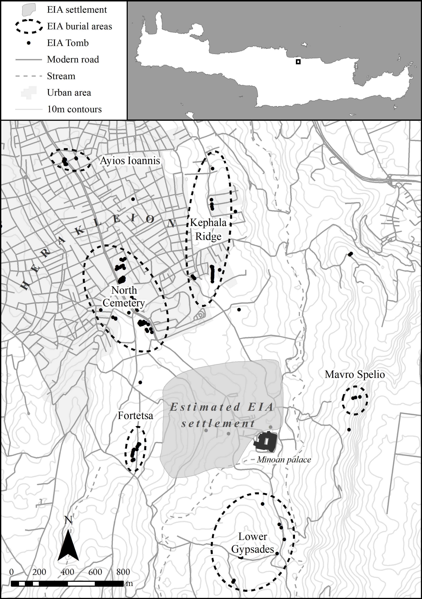
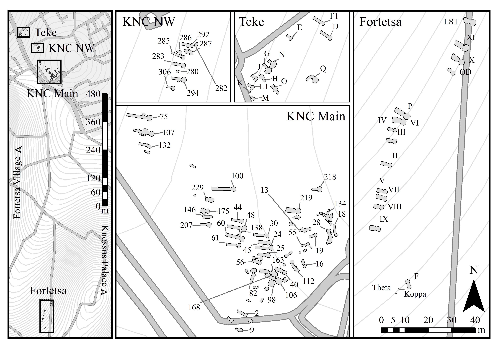

# Keywords: 
Early Iron Age; Knossos; Burial; Crete; Quantitative Methods; Open-Access

```{r setup, include=FALSE}
knitr::opts_chunk$set(
  collapse = TRUE,
  warning = FALSE,
  message = FALSE,
  echo = FALSE,
  comment = "#>",
  fig.path = "../figures/",
  dev="jpeg"
)

#The appropriate packages are installed. Extrafont allows the use of non-standard fonts in R plots, ggplot2 is a powerful figure and graph plotting tool, and RColorBrewer includes a number of colour pallettes which can be applied to plots. The colour scheme in this paper is chosen from those that are suitable for colour-blind readers.
library(ggpubr)
library(ineq)
library(reshape2)
library(data.table)
library(ggplot2)
library(RColorBrewer)
library(grid)
library(dplyr)
library(plyr)
library(ggforce)
library(jpeg)
library(ggrepel)
library(forcats)
library(factoextra)
library(cluster)

```

##### pagebreak

# 1. Introduction
This paper presents a novel quantitative analysis of the Early Iron Age (EIA) cemeteries of Knossos, Crete. Within this period, these cemeteries represent not only the richest source of archaeological material at the site, but also the largest published mortuary assemblage across the entire island. However, despite well-published excavation reports on the two largest Knossian burial grounds, and a number of studies dealing with various artefacts and individual tombs therein, no substantial comparative, quantitative analysis of these cemeteries has yet been published.

## 1.1 Early Iron Age Research in Crete
The EIA of Greece has witnessed a dramatic growth in archaeological interest in recent decades. This era is bookended by the collapse of the Late Bronze Age (LBA) palace societies of the Aegean – the so-called Minoan and Mycenaean cultures of Crete and mainland Greece respectively – and the emergence of the nascent Greek city-states or *poleis* [@Dickinson2006; @Lemos2020; for Crete, see @Wallace2010a]. This corresponds broadly to the 11th through 8th centuries BCE, though use of the term varies, and here it is applied to all periods from the Subminoan to the Orientalising (see Table 1 for chronology and abbreviations used throughout).

The EIA was once often termed the ‘Greek Dark Ages’ [@Bintliff2012 209-213; @Morris1997], a time of assumed instability and hardship following the loss of literate, state administration at the end of the Bronze Age (BA), with accompanying declines in population, technology and craftsmanship, and inter-regional connectivity. In turn, signs of increasing settlement size, flourishing seaborne trade, and the growing breadth and refinement of artistic and ceramic styles in the 8th century were taken to herald a ‘Greek Renaissance’, presaging the development of the numerous and diverse city-states of the Classical period [@Kotsonas2020, 79; @Ure1921]. 

Though not challenging this characterisation as such, the pioneering works of Coldstream [-@Coldstream1977], Desborough [-@Desborough1972], and Snodgrass [-@Snodgrass1971a] nonetheless marked the start of a shift in focus for research on the EIA. For one, these scholars prioritised archaeological assemblages at a time when reasoning back from later historical and Homeric sources was the norm, but more importantly they asserted, particularly in the case of Snodgrass, that Greece's EIA communities were descended directly from their LBA predecessors and that, in turn, understanding these groups was essential for theorising the development of the later *poleis*. 

Interest in the period grew in subsequent decades, as excavation at sites like the Toumba cemetery at Lefkandi in Euboea [e.g. @Desborough1970], and the North Cemetery at Knossos - discussed in this paper - yielded evidence for the maintenance of long-distance networks of exchange and interaction at the dawn of the EIA, as well as artefacts and rituals redolent of the Homeric epics [@Catling1995]. The growth of archaeological survey, with its broad chronological purview, began revealing long-term settlement dynamics in many regions, often transcending the traditional divides of the LBA, EIA and Classical era. Meanwhile a new generation of scholars in the 1980s and 1990s, particularly under the supervision of Snodgrass, pursued studies in burial practice, social organisation, the emergence of sanctuaries, and civic identities in the EIA [@Morgan1990; @Morgan2003; @Morris1987; @Whitley1991a]. All this work has culminated in the active rejection by many scholars of the appellation and interpretive baggage of the so-called ‘Dark Ages’ [see @Kotsonas2016; @Morris1997], and excavation and survey work pertaining to the EIA continue to grow apace [e.g. on Crete: @Haggis2016; @Zographaki2013].

Crete has had a complex relationship with these broader trends. Here, the EIA was long eclipsed not so much by the Classical era as the Minoan Bronze Age, from which it was seen to mark a severe decline in political complexity and cultural achievement. In turn, the representation of the island in ancient Greek texts as archaising, idiosyncratic and parochial – not to mention, piratical – has seen it generally side-lined from discussions of the political development of Greece in the first millennium [@Prent2005 69-70; @Whitley2009 273-74]. Indeed, in Lemos’ [-@Lemos2002 1] overview of Protogeometric Greece, the island is excluded altogether as 'its character . . . is different from most of the rest of the Aegean’. 

These differences include an early and notable shift in settlement at the end of the BA towards inland, defensible locations [@Nowicki2000]; mixed populations which may at various points in the EIA have included native Cretans, mainlanders of various origins, Phoenicians, and even groups from the Central Mediterranean [@DAgata2012; @Kanta2003; @Stampolidis2006]; a precocious engagement with Near Eastern material culture, artistic styles and perhaps even modes of mortuary and religious practice [@Morris1992 110; @Stampolidis1990]; the worship of local deities into the Classical period, as well as specifically Cretan forms of several of the Olympians [@Prent2005]; and a number of city-states codifying and inscribing law codes at an early date, which detail constitutions in some ways akin, but in others strikingly different, to accounts of Spartan law [@Gagarin2016]. Rather than being dismissed as atypical, such features have much to offer to the development of alternative, decentred accounts of early Greek state-formation, approaches to which have been historically Atheno-centric.

## 1.2 The Present Study
There are, given the history of research outlined above, limitations in the data available and the methods so far employed in the study of the Cretan EIA, and this article aims to confront certain of these head-on. Excavated mortuary contexts far outstrip those of settlements for the period, and yet, despite the volume of material, these have seldom been submitted to statistical analyses or even proper quantification [see @Kotsonas2011]. The Fortetsa and North Cemetery complexes, the two largest EIA cemeteries at Knossos, are a case in point. Both are well-published [@Brock1957; @Coldstream1996a] and have been the subject of multiple studies concerning particular tombs, object classes, and even single artefacts, but a lack of systematic, quantitative comparisons between them has left us with many intuited trends, some exceptional tombs, and yet a general impression of an un-patterned multiplicity in burial practices. 

The city and palace of Knossos, first excavated well over a century ago [@Evans1921; @Evans1928; @Evans1930], retain a pre-eminent position in popular and academic accounts of the island’s Bronze Age, but the city remains of great importance in the subsequent EIA, being one of only two sites to have boasted a Minoan palace and later to have become a *polis*, with an uninterrupted sequence of occupation in between [@Cucuzza2013 31]. It can therefore offer significant insights into not only the processes of resilience, consolidation, and redevelopment in the aftermath of state collapse, but also into what has been termed the role of ‘the past in the present’, that is, the encounters between the later Knossian community and its BA heritage. The ruined palace remained visible for centuries after its destruction, while BA artefacts have repeatedly been found in EIA contexts – particularly tombs [@Cucuzza2013; @Crowe2018]. And of course, though the myths of King Minos are now afforded no place in the real history of the site, those myths were part of the identity of the Classical Greek community, as evidenced, for instance, in the minting of coins depicting the labyrinth [@Mielczarek2013]. Finally, the present analysis has implications for understanding the relationship between burial rites and wider socio-political developments, particularly in the context of state-formation, something doubtless pertinent to other periods and regions.

Utilising a dataset including information on every find and tomb recorded in the Fortetsa and Knossos North Cemetery publications [@Brock1957; @Coldstream1996a], I here aim to demonstrate the potential for quantitative methods, firstly, to permit the identification and nuanced characterisation of significant patterning in the archaeological material; secondly, to facilitate a more systematic appraisal of the cemeteries’ largest tombs and their distinctive histories; and, finally, to offer tangible and context-specific evidence as to the behaviours and identities of the burying groups, with a view to eventually comparing such results with mortuary assemblages across Crete.


# 2. Early Iron Age Knossos
## 2.1 Settlement Evidence: 'A meagre filling in a very thick sandwich'

Survey and excavation at Knossos suggest that, despite the final destruction of the palace and a contraction in size at the end of the BA, occupation into the EIA was continuous [for an overview, see @Hatzaki2020]. But compared to the preceding era, archaeological contexts from the EIA town are, in a word, insubstantial. Coldstream lamented that the period's 'remains [...] are like a meagre filling in a very thick sandwich' between BA and later Greaco-Roman levels [@Coldstream1991 287]. Most individual finds of PG or G date take the form of flimsy foundations, patches of earth floor, wells or pottery scatters, and for a time it was argued that the area in the EIA comprised several dispersed villages, which later coalesced as per Aristotle’s model of synoecism [@Alexiou1950].   

However, a concentration of activity slightly to the west of the palace has long presented a good case for continuing, nucleated settlement [@Hood1981], something strongly advocated by Coldstream [-@Coldstream1984a; -@Coldstream2000]. More recently, findings of the Knossos Urban Landscape Project (KULP) suggest a PG settlement of up to 40ha in size [@Kotsonas2018]. If accurate, this suggests that EIA Knossos was one of the largest sites of the contemporary Aegean.


```{r map, fig.align= "centre", fig.cap="Map of the Knossos area, showing the locations of the various EIA cemeteries and clusters of tombs. The area of the EIA settlement is based upon Kotsonas et al. [-@Kotsonas2018, Fig. 2]."}


```

## 2.2 The Early Iron Age Cemeteries

Survey aside, our most abundant evidence for the period comes from the mortuary record (see Fig. \@ref(fig:map)). The final BA - Late Minoan IIIC - yields few if any securely datable interments, but from the start of the EIA evidence becomes more plentiful, with burials known from the Kephala ridge [@Coldstream1963 38; @Hogarth1899 82-85], the modern suburbs of Ayios Ioannis and Atsalenio [@Boardman1960a; @Davaras1968 133–46], the cave of Mavro Spelio [@Coldstream2000 291-94], and the Khaniale Teke site with its well-known *tholos* [@Boardman1967;@Hutchinson1954; cf. @Hoffman1997;@Kotsonas2006]. Together these tombs point to a richly variegated set of funerary practices but, despite their reasonable number, their scattered locations present difficulties for analysing the behaviours of distinct burying groups within shared mortuary contexts.

Fortunately, larger and more concentrated areas of burial activity are to be found in the form of the Fortetsa and Knossos North cemeteries (Fig. \@ref(fig:map2)), which together comprise over 130 tombs, ranging in date from the SM to LO periods. Collectively, they represent the most abundant source of evidence for not just mortuary, but social practices of any kind at EIA Knossos.

## 2.3 The Fortetsa and Knossos North Cemeteries

The cemetery on the slope facing the eponymous village of Fortetsa comprises twelve tombs excavated in 1933, and another eight uncovered in 1935 [@Brock1957 xi, 1-2], grouped into three main clusters running north to south. Three of those excavated in 1933 – L, TFT and Π – which lie close to the main road north of the Acropolis hill and southwest of the university hospital, are now considered to belong to the Knossos North Cemetery (KNC).

```{r map2, fig.align= "centre", fig.cap="Closer view of the Knossos North and Fortetsa cemeteries. Tombs were digitised and georeferenced from the original publications, Coldstream and Catling (1996) and Brock (1957)."}



```

To the northeast of the Fortetsa cemetery, a collection of ten badly damaged tombs known as the Fortetsa 1967 tombs were probably a south-western extension of the KNC. Unfortunately, all had been thoroughly looted at the time of excavation and are thus excluded from the present analysis. Northwest of these, and just south of the Teke Tholos, the Teke tombs belong to the northern part of KNC. The central section of the KNC comprises the ‘Medical Faculty’ site (KNC Main and NW in Fig. \@ref(fig:map2)), named for the extension of the University of Crete that prompted major rescue excavations there in 1978 [@Coldstream1996a 53-55]. 

As considered here, the Fortetsa and North Cemeteries comprise 20 and 103 tombs respectively. It is possible the Fortetsa tombs form part of a larger cemetery but clear evidence of this has yet to be identified. At both cemeteries, the rock-cut chamber tomb is the most common type; indeed, it is the only type at Fortetsa, while at the KNC it accounts for 63% of all tombs. The chamber tomb comprises a descending ramp or passage, the *dromos*, leading to the chamber itself, cut into the *kouskouras* bedrock. The *dromos* and chamber are separated by the *stomion*, an opening often set a step or two lower than the *dromos*, which is blocked by a large stone slab, smaller stacked stones, or combination of both. The larger size of the KNC is matched by a greater diversity of burial types, which vary by period. In the earliest, SM phase, shaft graves and pit caves are the second and third most common type. Later, in the Geometric period, various simpler pits, sometimes containing *pithoi* or *larnakes* as burial containers, are also encountered. The vast majority of burials are cremations deposited in *pithoi* or other urns, a rite that appears in the SM period, in the Tomb 200+ complex in the KNC [@Coldstream1994 109]. Inhumation, which began as the majority rite, declined from the 10th century. Though it did not completely disappear in the EIA, by the Orientalising period inhumation appears restricted solely to child burials [@Cavanagh1996 652]. 

## 2.4 Chronological Developments in the Cemeteries

The foundation of the cemeteries has received much attention. It has been claimed that no tomb at Knossos was used continuously from LM IIIC to SM [@Coldstream1998 58; @Coldstream2006 582], though there is a possibility that this is a classificatory artefact [@Hallager2010]. Instances of BA tombs reused in the EIA have been suggested (e.g. the Khaniale Teke tholos), and Cavanagh [-@Cavanagh1996], based on a cluster analysis of tomb dimensions, could not reject the possibility of some KNC tombs being of BA date, though ongoing study of the retained sherds from the KNC excavation suggests very little Late Minoan III activity in the area of the later cemetery (Whitelaw, pers. comm.).

As contentious as their founding is the seemingly abrupt abandonment of both cemeteries around 630 BCE. Admittedly, few new tombs had been built in the preceding century, though interments in old tombs had certainly continued [@Brock1957 4; @Cavanagh1996 651-53]. The ensuing period, accompanied by equally scanty settlement evidence at Knossos, has been dubbed by some the ‘Archaic Gap'. The causes of this lacuna, which persists until the resurgence of archaeological evidence in the Late Archaic period, remain unknown. Although various explanations have been forwarded [@Coldstream1999 301-302; @Huxley1994 126; @Kotsonas2002 41-44], there are now strong reasons to doubt the settlement was abandoned [@Kotsonas2018], and we should always be open to the possibility of revisions in the Archaic ceramic chronology, which remains less secure than that of earlier periods [@Whitley2009 276-77].

## 2.5 Heroes Abroad, Immigrants at Home

A popular approach to the study of Knossos’ EIA tombs has been the investigation of ‘object biography’ [@Appadurai1986; @Kopytoff1986; @Mauss1954], an anthropological lens emphasising the mutable nature of an object’s value, the transformations latent within its social existence. Inspired by the Homeric motif of gift-giving [@Whitley2002 220-21], and the remarkable archaeological parallels for such items – such as between the boar’s tusk helmet from KNC Tomb 201 and that given to Odysseus by Meriones (*Iliad* 10.260-271) - such approaches have been brought to bear on certain elaborate burials of the EIA [most recently @Kotsonas2018]. For instance, Tomb 201 in the KNC contained various weapons, fragments of an antique bronze stand, probably of Cypriot origin, and pieces of the aforementioned helmet [@Catling1995 123]. Based on similarities between this tomb and burials at Tiryns, Kaloriziki, and the Toumba building at Lefkandi, Catling has argued that these burials represent individuals who dared to travel abroad in a time of more limited seafaring, accruing exotica and stories from distant lands, and so were accorded exceptional treatment in death [@Catling1995 127–8].

Complementing the theme of heroes abroad has been that of foreigners at home. Two caches of gold jewellery, found in pits flanking the entrance to the Teke Tholos, were argued by Boardman [-@Boardman1967] to be foundation deposits – a Near Eastern custom – for the tomb of an immigrant Phoenician craftsman. Kotsonas has revisited this attribution, arguing the tomb was rather that of an elite individual or family with a monopoly over a metal workshop’s output [-@Kotsonas2006 155–59]. Either way, it seems unlikely that foreign traders or craftsmen never visited or resided at Knossos during the EIA [@Hoffman1997 176–85; @Schreiber2003 293-306; @Stampolidis2006]. Recent re-examinations of the mortuary material from Lefkandi [@Arrington2016], and Perati in Attica [@Murray2018] have further raised the possibility of heterogenous communities existing in the EIA which, by way of travel or exchange, acquired and expressed a diversity of burial habits within individual sites, in a manner which undermines traditional associations of 'exotic imports' with an elite class. Similar complications to the notion of 'elite' or 'wealthy' tombs will be explored below.


## 2.6 Quantitative Analyses of the Cemeteries

To practitioners in other regions, the application of quantitative methods to analysis of mortuary assemblages may not seem particularly novel. However, in archaeological work on the EIA of Greece more generally, and Crete in particular, such approaches remain far from common. Snodgrass' [e.g. -@Snodgrass1980 22-24] attempts to extrapolate demographic trends for 8th century Attica from estimated burial rates represents a pioneering case, but his assumptions were in time challenged, most notably by Morris [-@Morris1987]. Morris examined the relationship between mortuary visibility and processes of inclusivity and exclusion in access to the burial rites, arguing that ideological, and not demographic, forces were behind the patterns Snodgrass had observed. Meanwhile, Whitley (1991) considered the relationship between pottery style and mortuary practice, which he similarly took to vary according to periods of more open and restricted access to certain burial rites. The work of Whitley and Morris, both students of Snodgrass, remains after 30 years perhaps the most systematic quantitative work yet applied to EIA Greek burial. While not outwardly rejected, such quantitative methods have been little utilised in EIA archaeology since, often from a sense that the available data are insufficient [e.g. @Eaby2007 20-21; though note @Kotsonas2011; @Murray2015].

This situation is reflected at Knossos, where analyses have tended to rely on particular finds [@Coldstream1984b], tombs [@Catling1995], or observable, but limited, patterns in the data [@Cavanagh1996]. Cluster analyses, the most sophisticated statistical techniques so far applied to the material from Knossos, have been employed by Cavanagh [-@Coldstream1996 653-57], Antoniadis [-@Antoniadis2017 131-34] and Whitley, though the state of publication of the KNC at the time of Whitley's doctoral study precluded him from publishing the analyses in full in the eventual monograph. Cavanagh undertook some analysis of the use of the tombs through time, the nature of individual burial assemblages, and changes in burial rites, though as part of the KNC publication, his report is only preliminary. Meanwhile, Antoniadis [-@Antoniadis2017 116-119]  divided the EIA tombs of Knossos into three groups, those with fewer than 10 pots, fewer than 50, and more than 50, and found that, in each successive case, the proportions of tombs containing Near Eastern imports and imitations increased, suggesting unequal access to such prestigious goods. Yet even here the data could be further interrogated (considering, for example, the number of imported items *per burial*). Through a more systematic quantitative analysis, and a range of statistical methods, the present paper seeks to extend and nuance a number of observations that have been made in previous studies of the Knossos cemeteries, as well as revealing patterns thus far unrecognised.


# 3. Methods

## 3.1 Databases


The cornerstone of the present study is a database created from the excavation reports for the Fortetsa and Knossos North cemeteries [@Brock1957; @Coldstream1996a], supplemented by the studies of Jones [-@Jones2000], Antoniadis (2017) and Crowe [-@Crowe2016] to identify all imported vessels, vessels imitating Near Eastern prototypes, and BA antiques respectively. It includes information on every published ceramic vessel (n=4481), non-ceramic object (n=1606), and tomb (n=123), with this last including tallies and summary data based on the first two. 

Taken together, these databases make possible a diverse range of quantitative analyses. Sadly, with many of the tombs evidently looted or damaged, this cannot be a complete picture of their original contents. If we assume, though, that natural or accidental destruction was relatively indiscriminate, and that, even in cases of looting, certain object classes (particularly cinerary urns) were seldom robbed, then the data are by no means rendered useless. As Snodgrass [-@Snodgrass1996] cautions, we should be chary of making negative arguments – that is, conclusions drawn about the *lack* of features in certain tombs – but may be somewhat more hopeful in the forming of positive ones. The great advantage of the large, quantitative dataset employed here is that it permits investigation of several nested levels of potentially significant patterning. From individual burials, to collective tombs, to whole cemeteries, we have the opportunity to study and compare both synchronic and diachronic variation across these various levels.

## 3.2 Reproducibility and Data-sharing

Ever more archaeologists have begun to advocate the utility, indeed the necessity, of making available not just the data, but the full methodologies underpinning their published work. With the opportunities afforded by current technologies (digital databases, statistical software packages, online repositories etc.), there remain ever fewer obstacles to the full and free sharing of both data and workflows [@article]. In Marwick's words [-@Marwick2017 445], "[t]he technical problems are largely solved; the challenge now is to change the norms of the discipline to make high reproducibility a canonical attribute of high-quality scholarly work."

In this vein, the present article was written using Marwick's [-@Marwick2017; @inbook] 'rrtools', an open-source package for the statistical software R Studio. This provides the author with the tools to create a self-contained 'compendium', which can be freely downloaded, and from which anyone can reproduce the entire workflow of the published analysis. Every graph presented below was produced directly, through written code, from the raw data using R (and note also that these are presented in colour-blind friendly palettes). This code, as well as the raw and derived datasets, complete bibliography (in BibTex format, for export to any major reference manager), figures, and original article are included in the compendium. It can be downloaded as a repository from GitHub, at the following address: https://github.com/DCPollard94/knossoscemeteries, and the raw datasets have been stored with the online repository Figshare, here: https://doi.org/10.6084/m9.figshare.13019588.v1.

## 3.3 Estimating Interments

A first important step in preparing the data for analysis was the estimation of the number of individuals buried in each tomb. The method employed here broadly follows that of Cavanagh [-@Cavanagh1996 659-60], who took the number of *pithoi* (the most common cremation urn) and the number of *pithoi*, amphorae and kraters (which were sometimes used as such) as middle and upper estimates of the number of burials, with all securely identified interments being the lower limit. Here, the mean of these three estimates was taken, to provide a single aggregate measure for the purposes of analysis.

For most diachronic analyses, however, *pithoi* alone were used as the best proxy for burial numbers. As such, in the following discussion, '*pithoi*' should be taken to indicate urns, while 'vessels' embraces the total ceramic assemblage in each tomb. In most cases, any tombs lacking identified remains or a single vessel suitable for use as an urn were not considered, thus excluding the most heavily damaged and looted tombs.

Two points of caution should be noted. Firstly, and as already mentioned, cremation began as a minority rite in the 11th century, and only came to systematically replace inhumation during the 10th century. However, it appears to be only from around the mid-9th century that *pithoi* became the *de facto* cremation urn. Earlier, ashes may have been placed in other vessels, or even loose in the tombs [@Cavanagh1996 651-52, 659-60]. This change can be seen in Fig. \@ref(fig:aoristbycem)A below, with the sharp uptick in deposited *pithoi* around 850 BCE. Thus we must be careful in making quantitative comparisons between the rates of burial pre- and post-850, because of the differential preservation of inhumations or loose cremations versus ceramic urns. Secondly, *pithoi* were not always used as urns; occasionally they served simply as grave goods like any other vessel, while from the end of the 8th century a class of polychrome *pithoi* could occur in pairs, but accompanying only a single cremation. These caveats should be borne in mind, but needn't undermine the present analysis. The main trends examined here post-date the 9th century shift towards *pithos*-based cremation, while even halving the counts of all polychrome *pithoi* would not greatly affect the ranking of tombs by their estimated number of burials, and not all such vessels were deposited in twos.


## 3.4 Aoristic Approaches to Dating

Another major concern is the temporal uncertainty implicit in the assigning of individual vessels to ceramic periods. A PGB vessel could, on our current best estimates, date anywhere between 840 and 810 BCE. This situation poses challenges to visualisation and analysis. A simple, if coarse, solution is to take the mean date (i.e. 825 for our PGB example). This is used in a couple of instances in the present paper, for assigning vessels to broad, century-long windows.

```{r allpots,fig.dim = c(5.4, 6), dpi=600, fig.align='center', fig.cap="A) Counts of all vessels per decade across both cemeteries. Vessels' dates have here been based on the mean of the absolute date range corresponding to their respective ceramic periods. B) The same but with aoristic sums replacing raw counts. This represents a probabilistically weighted visualisation of depositional activity through time."}

#The tombs database is imported and, for the purposes of this article, the entire database is subsetted to include only those tombs from the Knossos North and Fortetsa cemeteries (excluding the Tekke Tombs).

tombs<-read.csv("../data/raw_data/KnossosTombs.csv",header=TRUE)
tombs<-subset(tombs,tombs$cem_condensed=="KNC"|tombs$cem_condensed=="FOR")

#The database of all vessels is imported and, again only those tombs from the KNC and Fortetsa cemetery are selected. A new object "pithoi" is made by subsetting only those vessels labelled "Pithos", and a similar object "all_urns" by subsetting all pithoi, amphorae and kraters.

pots<-read.csv("../data/raw_data/KnossosPots.csv",header=TRUE)
pots<-subset(pots,pots$cem_condensed=="FOR"|pots$cem_condensed=="KNC")
pithoi<-subset(pots,pots$shape=="Pithos")
all_urns<-subset(pots,pots$shape=="Pithos"|pots$shape=="Amphora"|pots$shape=="Krater")

assemblages<-read.csv("../data/derived_data/KnossosAssemblages.csv",header=TRUE)
objects<-read.csv("../data/raw_data/KnossosObjects.csv")


#The figure is plotted by creating a histogram of all vessels based on their average dates ("ave_date"), which is simply the midpoint of the absolute chronological range associated with their respective ceramic phase. Similar stylistic adjustments are made (font, labels, colour palette, removing a legend, setting the x and y scales, and expanding the borders of the plot slightly to prevent the "600" label being cut off, which would occur without the final line of code.)

rects <- data.frame(xstart = c(1100,970,920,875,840,810,790,745,710,670,630), 
                    xend =    c(970,920,875,840,810,790,745,710,670,630,600), 
                    xmid =   c(1035,945,897.5,857.5,825,800,767.5,727.5,690,650,615),
                    col = c("SM", "EPG", "MPG", "LPG", "PGB", "EG", "MG", "LG", "EO", "LO","A"))
rects$col<-factor(rects$col,levels=c("SM", "EPG", "MPG", "LPG", "PGB", "EG", "MG", "LG", "EO", "LO","A"))


non_aorist_fig<-ggplot()+
  geom_rect(data = rects, aes(xmin = xstart, xmax = xend, ymin = -Inf, ymax = Inf), fill=NA, colour="grey90",alpha = 0.4) +
  geom_rect(data = rects, aes(xmin = xstart, xmax = xend, ymin = 585, ymax = 620), fill=NA, colour="black",size=0.5) +
  geom_histogram(data=pots, aes(ave_date,fill="Pots",color="Pots"),fill="grey90",color="black",binwidth = 10,size=0.4)+
  geom_text(data=rects,aes(xmid, 602,label=col),family="serif",size=2.8)+
  theme_bw()+theme(legend.title=element_blank(),
      text=element_text(family="serif", size=11),
          plot.margin=unit(c(0.1,0.5,0.1,0.2),"cm"))+
          labs(x="Date (Years BCE)", y="Vessel count per decade")+
                theme(legend.position="none",panel.grid.major = element_blank(), panel.grid.minor = element_blank())+
                  scale_y_continuous(expand=c(0,0),limits=c(0,620))+
                    scale_x_reverse(expand = c(0, 0),limits=c(1100,600))

#The aoristic values for every tomb are summed by decade, and then this object is converted to a data frame.

aorist_all_tombs<-colSums(tombs[160:209])
aorist_all_tombs<-data.frame(aorist_all_tombs)
        
#The column of values is labelled "aoristic_sum", an vector named "dates" is created with values between 1100 and 610 (in that order) at intervals of 10, and then this used to rename the rows of the data frame. Finally, these "row names" are converted into a functioning row in their own right within the data frame (this makes them plottable as a variable) and then are converted into numeric variables, allowing the plotting of them along a continuous scale.

colnames(aorist_all_tombs)<-c("aoristic_sum")
dates<-seq(from = 1100, to = 610, by = -10)
row.names(aorist_all_tombs)<-dates
setDT(aorist_all_tombs, keep.rownames = "decade")
aorist_all_tombs$decade<-as.numeric(aorist_all_tombs$decade)

#The plot is produced, following the same stylistic adjustments of the previous plot.

aorist_fig<-ggplot()+
   geom_rect(data = rects, aes(xmin = xstart, xmax = xend, ymin = -Inf, ymax = Inf), fill=NA, colour="grey90",alpha = 0.4) +
  geom_rect(data = rects, aes(xmin = xstart, xmax = xend, ymin = 212, ymax = 226), fill=NA, colour="black",size=0.4) +
  geom_text(data=rects,aes(xmid, 219,label=col),family="serif",size=2.8)+
  geom_col(data=aorist_all_tombs,aes(decade,aoristic_sum, fill="Aoristic Sum",color="Aoristic Sum"),
           fill="grey90",color="black",width=10,size=0.4)+
  theme_bw()+theme(legend.title=element_blank(),
      text=element_text(family="serif", size=11),
          plot.margin=unit(c(0.1,0.5,0.1,0.2),"cm"))+
          labs(x="Date (Years BCE)", y="Aoristic sum per decade")+
              theme(legend.position="none",panel.grid.major = element_blank(), panel.grid.minor = element_blank())+
                  scale_y_continuous(expand=c(0,0),limits=c(0,226))+
                    scale_x_reverse(expand = c(0, 0),limits=c(1100,600))

ggarrange(non_aorist_fig,aorist_fig,nrow=2,labels=c("A","B"),align="v",common.legend=FALSE)

```

But the artificial clustering this technique engenders around select absolute dates can prove misleading, as in the many apparent oscillations and interruptions in depositional activity visible in Fig. \@ref(fig:allpots)A.

An alternative approach, employed extensively in this paper, is the use of so-called 'aoristic analysis' [for original use in criminology, see @Ratcliffe2000; for archaeological applications, see @Crema2010; @Crema2012; @Johnson2004a]. Here, rather than give a pot a single date, the entire time span under investigation is divided into equal chunks (in this case, decades), and probability values summing to one are then assigned per chunk of time, based on the vessel's date range. So, our PGB vessel, datable between 840 and 810 BCE, would register a value of 0.33 for each of the three decades this encompasses. These values for individual vessels can then be summed to produce tomb- or cemetery-level signatures. A particular attraction of this method is that it incorporates temporal uncertainty into the size of the resulting values, that is, 'events with tight temporal definition contribute more to the total probability over their range than do loosely defined events' [@Johnson2004a 450].

As seen in Fig. \@ref(fig:allpots)B, the artificial peaks and troughs of the simple averaging method are avoided, and different patterns become visible. Though these methods present their own limitations [@Crema2010 1123-24], they are considered a more robust and productive approach to the temporal uncertainties implicit in ceramic dating.


# 4. Analysis

The present analysis proceeds by first identifying two distinctive trends in burial activity among certain tombs at Fortetsa and the KNC, before advancing to questions of what their use can reveal about broader changes in the social context and significance of burial within the Knossian community.

## 4.1 Temporal Developments in the Knossian Cemeteries

An obvious place to begin is with the construction of the tombs themselves. Sadly, the establishment of a secure chronology in this regard at Fortetsa and the KNC is quite difficult, given the frequency of later reuse, looting or other disturbances. 

```{r tombconstruction, fig.dim=c(7,4), dpi=600, fig.cap="Tomb construction through time at both cemeteries. A) Counts based on the ceramic phase considered most likely to correspond to the tomb's first use (including simply 'PG', 'G' and 'O' where no greater specificity was possible). B) Aoristic sums of the same, where the uncertainty associated with general period assignations is spread across the corresponding sub-periods. In both cases, tombs lacking any securely dateable pottery are excluded."}

tomb_dates_aorist<-read.csv("../data/derived_data/tomb_dates_aorist.csv",header=TRUE)
tomb_dates_aorist_KNC<-subset(tomb_dates_aorist,tomb_dates_aorist$cem_condensed=="NC")
tomb_dates_aorist_FOR<-subset(tomb_dates_aorist,tomb_dates_aorist$cem_condensed=="FOR")

KNC<-subset(tombs,tombs$cem_condensed=="KNC")
FOR<-subset(tombs,tombs$cem_condensed=="FOR")

aorist_tomb_periods<-colSums(tomb_dates_aorist_KNC[5:14])
aorist_tomb_periods<-data.frame(aorist_tomb_periods)
aorist_tomb_periods$FOR<-colSums(tomb_dates_aorist_FOR[5:14])
colnames(aorist_tomb_periods)<-c("KNC","FOR")
setDT(aorist_tomb_periods, keep.rownames = "period")
aorist_tomb_periods$period<-factor(aorist_tomb_periods$period,levels=c("SM", "EPG", "MPG", "LPG", "PGB", "EG", "MG", "LG", "EO", "LO"))
aorist_tomb_periods_melt<-melt(aorist_tomb_periods)
colnames(aorist_tomb_periods_melt)<-c("period","cemetery","aoristic_sum")

tombs$start_period<-factor(tombs$start_period,levels=c("SM", "EPG", "MPG", "PG","LPG", "PGB", "EG", "MG","G", "LG", "EO","O","LO"))

tombs$cem_condensed<-factor(tombs$cem_condensed,levels=c("KNC","FOR"))

cbPalette <- c("#999999","#E69F00", "#56B4E9", "#009E73", "#F0E442", "#0072B2", "#D55E00", "#CC79A7")

new_tomb_counts_plot<-ggplot(data=subset(tombs,!is.na(start_period)),aes(start_period, fill=forcats::fct_rev(tomb_type_condensed),color=forcats::fct_rev(tomb_type_condensed)))+geom_bar(width=1,size=0.4)+
  scale_color_manual(values=c("black","black","black","black","black","black","black","black"),labels=c("Unknown","Shaft Grave","Pit Cave","Pithos Burial","Pit","Other","Larnax Burial","Chamber Tomb"))+
        theme_bw()+theme(legend.title=element_blank(),legend.spacing.x = unit(0.1,"cm"), text=element_text(family="serif", size=12),
          axis.text.x=element_text(angle=90, vjust=0.5, hjust=1),
          panel.grid.major = element_blank(), panel.grid.minor = element_blank())+
            labs(x="Period", y="Count of new tombs")+scale_fill_manual(values=cbPalette,
                                                                                        labels=c("Unknown","Shaft Grave","Pit Cave",
                                                                                        "Pithos Burial","Pit","Other","Larnax Burial","Chamber Tomb"))+
             scale_y_continuous(expand=c(0,0),limits=c(0,25))+scale_x_discrete(expand=c(0,0))+
facet_wrap(~cem_condensed)+
               theme(strip.background = element_blank(), panel.border = element_rect(colour = "black", fill = NA))


new_tomb_aorist_plot<-ggplot()+geom_line(data=aorist_tomb_periods_melt,aes(period,aoristic_sum,group=cemetery,linetype=cemetery))+
  theme_bw()+theme(legend.title=element_blank(),
          text=element_text(family="serif", size=12),
          axis.text.x=element_text(angle=90, vjust=0.5, hjust=1),
          panel.grid.major = element_blank(), panel.grid.minor = element_blank())+
            labs(x="Period", y="Aoristic sum of new tombs")+
               scale_fill_manual(values =c("gray50","gray80"),labels=c(" KNC  "," FC"))+ 
                 scale_y_continuous(expand=c(0,0))+scale_x_discrete(expand=c(0,0))

ggarrange(new_tomb_counts_plot,new_tomb_aorist_plot,ncol=2,align="h",labels=c("A","B"), widths=c(1.6,1),common.legend=FALSE, legend="bottom")


```

The periods of construction shown in Fig. \@ref(fig:tombconstruction) correspond, therefore, largely with the earliest surviving pottery from each tomb. On this basis, it would appear that the KNC began with many tombs built during the - admittedly prolonged - SM period, followed by a protracted decline in construction, offset by resurgences in the LPG and LG periods. The Fortetsa tombs, which were all of chamber type, mostly date to PG, with almost no new tomb construction post-PGB. Indeed, it has been suggested that chamber tombs actually ceased to be created into the 8th century, with those appearing as MG or later in date being heavily looted and thus, in reality, older (Brock 1957, p.4; Cavanagh 1996, pp.652–53). What is clear is that many later tombs in the KNC are not chambers, but a mix of pit, *larnax*, and *pithos* burials, as well as unidentified forms. It is tempting to hypothesise similar burials having been overlooked at Fortetsa, but as a smaller cemetery it may have simply served a more restricted burying population and, thus, hosted more limited rites. The patterns at both cemeteries are by no means identical, then, even if there is some similarity in the declining investment in chamber tomb construction in the latter part of the EIA. 

```{r tombsinusebybuilddate, fig.dim=c(7,3), dpi=600, fig.cap=" A) Estimates of the number of tombs in use through time at the KNC and B) at Fortetsa. The grey background represents the total number of tombs in use, while the lines correspond to tombs built in each of the five centuries of EIA activity at the cemeteries. C) The KNC again, but only showing chamber tombs definitely built before the 8th century."}

KNC_tombs_in_use<-data.frame(colSums(KNC[6:15]!=""))
colnames(KNC_tombs_in_use)<-c("no_tombs")
setDT(KNC_tombs_in_use, keep.rownames = "period")
KNC_tombs_in_use$period<-factor(KNC_tombs_in_use$period,levels=c("SM", "EPG", "MPG", "LPG", "PGB", "EG", "MG", "LG", "EO", "LO"))
KNC_tombs_in_use$cemetery<-"KNC"

FOR_tombs_in_use<-data.frame(colSums(FOR[6:15]!=""))
colnames(FOR_tombs_in_use)<-c("no_tombs")
setDT(FOR_tombs_in_use, keep.rownames = "period")
FOR_tombs_in_use$period<-factor(FOR_tombs_in_use$period,levels=c("SM", "EPG", "MPG", "LPG", "PGB", "EG", "MG", "LG", "EO", "LO"))
FOR_tombs_in_use$cemetery<-"FOR"

tombs_in_use_cem<-rbind(KNC_tombs_in_use,FOR_tombs_in_use)
tombs_in_use_cem$cemetery<-factor(tombs_in_use_cem$cemetery,levels=c("KNC","FOR"))

tombs_in_use<-data.frame(colSums(tombs[6:15]!=""))
colnames(tombs_in_use)<-c("no_tombs")
setDT(tombs_in_use, keep.rownames = "period")
tombs_in_use$period<-factor(tombs_in_use$period,levels=c("SM", "EPG", "MPG", "LPG", "PGB", "EG", "MG", "LG", "EO", "LO"))

tombs_11th<-subset(KNC,century_built=="11th")
tombs_10th<-subset(KNC,century_built=="10th")
tombs_9th<-subset(KNC,century_built=="9th")
tombs_8th<-subset(KNC,century_built=="8th")
tombs_7th<-subset(KNC,century_built=="7th")

tombs_in_use_11th<-colSums(tombs_11th[6:15]!="")
tombs_in_use_11th<-data.frame(tombs_in_use_11th)
colnames(tombs_in_use_11th)<-c("no_tombs")
setDT(tombs_in_use_11th, keep.rownames = "period")
tombs_in_use_11th$period<-factor(tombs_in_use_11th$period,levels=c("SM", "EPG", "MPG", "LPG", "PGB", "EG", "MG", "LG", "EO", "LO"))
tombs_in_use_11th$tomb_century<-"11th"

tombs_in_use_10th<-colSums(tombs_10th[6:15]!="")
tombs_in_use_10th<-data.frame(tombs_in_use_10th)
colnames(tombs_in_use_10th)<-c("no_tombs")
setDT(tombs_in_use_10th, keep.rownames = "period")
tombs_in_use_10th$period<-factor(tombs_in_use_10th$period,levels=c("SM", "EPG", "MPG", "LPG", "PGB", "EG", "MG", "LG", "EO", "LO"))
tombs_in_use_10th$tomb_century<-"10th"

tombs_in_use_9th<-colSums(tombs_9th[6:15]!="")
tombs_in_use_9th<-data.frame(tombs_in_use_9th)
colnames(tombs_in_use_9th)<-c("no_tombs")
setDT(tombs_in_use_9th, keep.rownames = "period")
tombs_in_use_9th$period<-factor(tombs_in_use_9th$period,levels=c("SM", "EPG", "MPG", "LPG", "PGB", "EG", "MG", "LG", "EO", "LO"))
tombs_in_use_9th$tomb_century<-"9th"

tombs_in_use_8th<-colSums(tombs_8th[6:15]!="")
tombs_in_use_8th<-data.frame(tombs_in_use_8th)
colnames(tombs_in_use_8th)<-c("no_tombs")
setDT(tombs_in_use_8th, keep.rownames = "period")
tombs_in_use_8th$period<-factor(tombs_in_use_8th$period,levels=c("SM", "EPG", "MPG", "LPG", "PGB", "EG", "MG", "LG", "EO", "LO"))
tombs_in_use_8th$tomb_century<-"8th"

tombs_in_use_7th<-colSums(tombs_7th[6:15]!="")
tombs_in_use_7th<-data.frame(tombs_in_use_7th)
colnames(tombs_in_use_7th)<-c("no_tombs")
setDT(tombs_in_use_7th, keep.rownames = "period")
tombs_in_use_7th$period<-factor(tombs_in_use_7th$period,levels=c("SM", "EPG", "MPG", "LPG", "PGB", "EG", "MG", "LG", "EO", "LO"))
tombs_in_use_7th$tomb_century<-"7th"

tomb_use<-rbind(tombs_in_use_11th,tombs_in_use_10th,tombs_in_use_9th,tombs_in_use_8th,tombs_in_use_7th)
tomb_use$tomb_century<-factor(tomb_use$tomb_century,levels=c("11th","10th","9th","8th","7th"))

KNC_use<-ggplot()+geom_area(data=subset(tombs_in_use_cem,cemetery=="KNC"),aes(period,no_tombs,fill="All tombs",group=cemetery),alpha=0.2)+
            geom_line(data=tomb_use,aes(period,no_tombs,linetype=tomb_century,group=tomb_century))+
              theme_bw()+theme(text=element_text(family="serif", size=11),axis.text.x=element_text(angle=90, vjust=0.5, hjust=1),
          panel.grid.major = element_blank(), panel.grid.minor = element_blank(),legend.position = "bottom",
          legend.text=element_text(size=10))+
                 labs(x="Period", y="Tombs in use",linetype="Century of tomb construction",fill="")+
                  scale_fill_manual(values="#999999")+
                    scale_y_continuous(expand=c(0,0),limits=c(0,60))+
                      scale_x_discrete(expand=c(0,0))


Ftombs_11th<-subset(FOR,century_built=="11th")
Ftombs_10th<-subset(FOR,century_built=="10th")
Ftombs_9th<-subset(FOR,century_built=="9th")
Ftombs_8th<-subset(FOR,century_built=="8th")


Ftombs_in_use_11th<-colSums(Ftombs_11th[6:15]!="")
Ftombs_in_use_11th<-data.frame(Ftombs_in_use_11th)
colnames(Ftombs_in_use_11th)<-c("no_tombs")
setDT(Ftombs_in_use_11th, keep.rownames = "period")
Ftombs_in_use_11th$period<-factor(Ftombs_in_use_11th$period,levels=c("SM", "EPG", "MPG", "LPG", "PGB", "EG", "MG", "LG", "EO", "LO"))
Ftombs_in_use_11th$tomb_century<-"11th"

Ftombs_in_use_10th<-colSums(Ftombs_10th[6:15]!="")
Ftombs_in_use_10th<-data.frame(Ftombs_in_use_10th)
colnames(Ftombs_in_use_10th)<-c("no_tombs")
setDT(Ftombs_in_use_10th, keep.rownames = "period")
Ftombs_in_use_10th$period<-factor(Ftombs_in_use_10th$period,levels=c("SM", "EPG", "MPG", "LPG", "PGB", "EG", "MG", "LG", "EO", "LO"))
Ftombs_in_use_10th$tomb_century<-"10th"

Ftombs_in_use_9th<-colSums(Ftombs_9th[6:15]!="")
Ftombs_in_use_9th<-data.frame(Ftombs_in_use_9th)
colnames(Ftombs_in_use_9th)<-c("no_tombs")
setDT(Ftombs_in_use_9th, keep.rownames = "period")
Ftombs_in_use_9th$period<-factor(Ftombs_in_use_9th$period,levels=c("SM", "EPG", "MPG", "LPG", "PGB", "EG", "MG", "LG", "EO", "LO"))
Ftombs_in_use_9th$tomb_century<-"9th"

Ftombs_in_use_8th<-colSums(Ftombs_8th[6:15]!="")
Ftombs_in_use_8th<-data.frame(Ftombs_in_use_8th)
colnames(Ftombs_in_use_8th)<-c("no_tombs")
setDT(Ftombs_in_use_8th, keep.rownames = "period")
Ftombs_in_use_8th$period<-factor(Ftombs_in_use_8th$period,levels=c("SM", "EPG", "MPG", "LPG", "PGB", "EG", "MG", "LG", "EO", "LO"))
Ftombs_in_use_8th$tomb_century<-"8th"


Ftomb_use<-rbind(Ftombs_in_use_11th,Ftombs_in_use_10th,Ftombs_in_use_9th,Ftombs_in_use_8th)
Ftomb_use$tomb_century<-factor(Ftomb_use$tomb_century,levels=c("11th","10th","9th","8th"))

FOR_use<-ggplot()+geom_area(data=subset(tombs_in_use_cem,cemetery=="FOR"),aes(period,no_tombs,fill="All tombs",group=cemetery),alpha=0.2)+
            geom_line(data=Ftomb_use,aes(period,no_tombs,linetype=tomb_century,group=tomb_century))+
              theme_bw()+theme(text=element_text(family="serif", size=11),axis.text.x=element_text(angle=90, vjust=0.5, hjust=1),
          panel.grid.major = element_blank(), panel.grid.minor = element_blank(),legend.position = "bottom",
          legend.text=element_text(size=10))+
                 labs(x="Period", y="Tombs in use",linetype="Century of tomb construction",fill="")+
                  scale_fill_manual(values="#999999")+
                    scale_y_continuous(expand=c(0,0),limits=c(0,20))+
                      scale_x_discrete(expand=c(0,0))

KNC_CT<-subset(KNC,tomb_type_condensed=="CT" & KNC$start_date>799)
KNC_tombs_in_use_CT<-data.frame(colSums(KNC_CT[6:15]!=""))
colnames(KNC_tombs_in_use_CT)<-c("no_tombs")
setDT(KNC_tombs_in_use_CT, keep.rownames = "period")
KNC_tombs_in_use_CT$period<-factor(KNC_tombs_in_use_CT$period,levels=c("SM", "EPG", "MPG", "LPG", "PGB", "EG", "MG", "LG", "EO", "LO"))

tombs_11th_CT<-subset(KNC_CT,century_built=="11th")
tombs_10th_CT<-subset(KNC_CT,century_built=="10th")
tombs_9th_CT<-subset(KNC_CT,century_built=="9th")

tombs_in_use_11th_CT<-colSums(tombs_11th_CT[6:15]!="")
tombs_in_use_11th_CT<-data.frame(tombs_in_use_11th_CT)
colnames(tombs_in_use_11th_CT)<-c("no_tombs")
setDT(tombs_in_use_11th_CT, keep.rownames = "period")
tombs_in_use_11th_CT$period<-factor(tombs_in_use_11th_CT$period,levels=c("SM", "EPG", "MPG", "LPG", "PGB", "EG", "MG", "LG", "EO", "LO"))
tombs_in_use_11th_CT$tomb_century<-"11th"

tombs_in_use_10th_CT<-colSums(tombs_10th_CT[6:15]!="")
tombs_in_use_10th_CT<-data.frame(tombs_in_use_10th_CT)
colnames(tombs_in_use_10th_CT)<-c("no_tombs")
setDT(tombs_in_use_10th_CT, keep.rownames = "period")
tombs_in_use_10th_CT$period<-factor(tombs_in_use_10th_CT$period,levels=c("SM", "EPG", "MPG", "LPG", "PGB", "EG", "MG", "LG", "EO", "LO"))
tombs_in_use_10th_CT$tomb_century<-"10th"

tombs_in_use_9th_CT<-colSums(tombs_9th_CT[6:15]!="")
tombs_in_use_9th_CT<-data.frame(tombs_in_use_9th_CT)
colnames(tombs_in_use_9th_CT)<-c("no_tombs")
setDT(tombs_in_use_9th_CT, keep.rownames = "period")
tombs_in_use_9th_CT$period<-factor(tombs_in_use_9th_CT$period,levels=c("SM", "EPG", "MPG", "LPG", "PGB", "EG", "MG", "LG", "EO", "LO"))
tombs_in_use_9th_CT$tomb_century<-"9th"

tomb_use_CT<-rbind(tombs_in_use_11th_CT,tombs_in_use_10th_CT,tombs_in_use_9th_CT)
tomb_use_CT$tomb_century<-factor(tomb_use_CT$tomb_century,levels=c("11th","10th","9th"))

KNC_CT_use<-ggplot()+geom_area(data=(KNC_tombs_in_use_CT),aes(period,no_tombs,fill="All tombs",group=1),alpha=0.2)+
  geom_line(data=tomb_use_CT,aes(period,no_tombs,linetype=tomb_century,group=tomb_century))+
  theme_bw()+theme(text=element_text(family="serif", size=11),axis.text.x=element_text(angle=90, vjust=0.5, hjust=1),
                   panel.grid.major = element_blank(), panel.grid.minor = element_blank(),legend.position = "bottom",
                   legend.text=element_text(size=10))+
  labs(x="Period", y="Tombs in use",linetype="Century of tomb construction",fill="")+
  scale_fill_manual(values="#999999")+
  scale_y_continuous(expand=c(0,0),limits=c(0,60))+
  scale_x_discrete(expand=c(0,0))


ggarrange(KNC_use,FOR_use,KNC_CT_use,ncol=3,common.legend = TRUE,legend="bottom", labels=c("A","B","C"))
```

A further contrast is seen in the number of tombs in use in each period (Fig. \@ref(fig:tombsinusebybuilddate)). While at Fortetsa the pattern skews early, with several graves apparently active solely during the PG period, at the KNC the number of tombs in use rose to a peak in the late 8th century before declining. This increase belies a more complex reality, however, with older tombs being steadily abandoned as new ones were constructed (Fig. \@ref(fig:tombsinusebybuilddate)A). This is discernible too at Fortetsa, though in a more sporadic manner largely attributable to the smaller number of tombs (Fig. \@ref(fig:tombsinusebybuilddate)B). The rise in tombs in use at the KNC, and lack thereof at Fortetsa, is thus primarily due to the construction of later tombs, as shown in Fig. \@ref(fig:tombsinusebybuilddate)C, where only pre-8th century chamber tombs at the KNC are presented, and the pattern is more similar to that at Fortetsa. However, an additional phenomenon at the KNC (Figs \@ref(fig:tombsinusebybuilddate)A and C) is the reuse of some SM tombs at much later dates, with an abandonment in between. This reuse is unlikely to have been knowingly undertaken by distant descendants of the original occupants and so raises questions of how the right of access to a sepulchre was maintained, or re-established.


```{r aoristbycem, fig.dim=c(5.5,6.2), dpi=600, fig.align="center", fig.cap="A) Aoristic sums of pithoi, as a proxy for cremation burials, through time for Fortetsa, the KNC, and all tombs together. B) Aoristic sums of all vessels through time."}

aorist_KNC_pithoi <- colSums(KNC[210:259])
aorist_KNC_pithoi<-data.frame(aorist_KNC_pithoi)

colnames(aorist_KNC_pithoi)<-c("aoristic_sum")
row.names(aorist_KNC_pithoi)<-dates
aorist_KNC_pithoi<-data.frame(aorist_KNC_pithoi)
setDT(aorist_KNC_pithoi, keep.rownames = "decade")
aorist_KNC_pithoi$decade<-as.numeric(aorist_KNC_pithoi$decade)


FOR<-subset(tombs,tombs$cem_condensed=="FOR")

aorist_FOR_pithoi <-colSums(FOR[210:259])
aorist_FOR_pithoi<-data.frame(aorist_FOR_pithoi)

colnames(aorist_FOR_pithoi)<-c("aoristic_sum")
row.names(aorist_FOR_pithoi)<-dates
aorist_FOR_pithoi<-data.frame(aorist_FOR_pithoi)
setDT(aorist_FOR_pithoi, keep.rownames = "decade")
aorist_FOR_pithoi$decade<-as.numeric(aorist_FOR_pithoi$decade)


aorist_all_pithoi <- colSums(tombs[210:259])
aorist_all_pithoi<-data.frame(aorist_all_pithoi)

colnames(aorist_all_pithoi)<-c("aoristic_sum")

row.names(aorist_all_pithoi)<-dates
aorist_all_pithoi<-data.frame(aorist_all_pithoi)
setDT(aorist_all_pithoi, keep.rownames = "decade")
aorist_all_pithoi$decade<-as.numeric(aorist_all_pithoi$decade)

aorist_FOR_pithoi$cemetery<-"FOR"
aorist_KNC_pithoi$cemetery<-"KNC"
aorist_all_pithoi$cemetery<-"All tombs"
aorist_pithoi<-rbind(aorist_all_pithoi,aorist_KNC_pithoi,aorist_FOR_pithoi)
aorist_pithoi$cemetery<-factor(aorist_pithoi$cemetery,levels=c("All tombs", "KNC", "FOR"))


aorist_pithoi_plot<-ggplot(NULL)+
  geom_rect(data = rects, aes(xmin = xstart, xmax = xend, ymin = -Inf, ymax = Inf), fill=NA, colour="grey90",alpha = 0.4) +
  geom_rect(data = rects, aes(xmin = xstart, xmax = xend, ymin = 42.6, ymax = 45), fill=NA, colour="black",size = 0.5) +
  geom_text(data=rects,aes(xmid, 43.8,label=col),family="serif",size=2.9)+
  geom_line(data=aorist_pithoi,aes(decade,aoristic_sum,linetype=cemetery))+ 
       theme_bw()+theme(legend.title=element_blank(),
          text=element_text(family="serif", size=12),panel.grid.major = element_blank(), panel.grid.minor = element_blank(),
          plot.margin=unit(c(0.1,0.2,0.1,0.2),"cm"))+
            labs(x="Date (Years BCE)", y="Aoristic sum (Pithoi)")+
                scale_y_continuous(expand=c(0,0),limits=c(0,45))+
                    scale_x_reverse(expand = c(0, 0),limits=c(1100,600))

aorist_KNC <- colSums(KNC[160:209])
aorist_KNC<-data.frame(aorist_KNC)

colnames(aorist_KNC)<-c("aoristic_sum")
row.names(aorist_KNC)<-dates
aorist_KNC<-data.frame(aorist_KNC)
setDT(aorist_KNC, keep.rownames = "decade")
aorist_KNC$decade<-as.numeric(aorist_KNC$decade)

FOR<-subset(tombs,tombs$cem_condensed=="FOR")

aorist_FOR <-colSums(FOR[160:209])
aorist_FOR<-data.frame(aorist_FOR)

colnames(aorist_FOR)<-c("aoristic_sum")
row.names(aorist_FOR)<-dates
aorist_FOR<-data.frame(aorist_FOR)
setDT(aorist_FOR, keep.rownames = "decade")
aorist_FOR$decade<-as.numeric(aorist_FOR$decade)

aorist_FOR$cemetery<-"FOR"
aorist_KNC$cemetery<-"KNC"
aorist_all_tombs$cemetery<-"All tombs"
aorist_tombs<-rbind(aorist_all_tombs,aorist_KNC,aorist_FOR)
aorist_tombs$cemetery<-factor(aorist_pithoi$cemetery,levels=c("All tombs", "KNC", "FOR"))

aorist_pots_plot<-ggplot(NULL)+
   geom_rect(data = rects, aes(xmin = xstart, xmax = xend, ymin = -Inf, ymax = Inf), fill=NA, colour="grey90",alpha = 0.4) +
  geom_rect(data = rects, aes(xmin = xstart, xmax = xend, ymin = 218, ymax = 230), fill=NA, colour="black",size = 0.5) +
  geom_text(data=rects,aes(xmid, 224,label=col),family="serif",size=2.9)+
  geom_line(data=aorist_tombs,aes(decade,aoristic_sum,linetype=cemetery))+
        theme_bw()+theme(legend.title=element_blank(),
          text=element_text(family="serif", size=12),panel.grid.major = element_blank(), panel.grid.minor = element_blank(),
          plot.margin=unit(c(0.1,0.2,0.1,0.2),"cm"))+
            labs(x="Date (Years BCE)", y="Aoristic sum (All vessels)")+
              scale_fill_manual(values = c("gray50","gray65","gray80"))+  
                  scale_y_continuous(expand=c(0,0),limits=c(0,230))+
                    scale_x_reverse(expand = c(0, 0),limits=c(1100,600))

ggarrange(aorist_pithoi_plot,aorist_pots_plot,nrow=2,labels=c("A","B"),align="v",common.legend=TRUE, legend="bottom")
```

Turning to the burials themselves, and despite differences in scale and timing, Fortetsa and the KNC underwent similar chronological developments with regard to cremations (*pithoi*) and, to a slightly lesser degree, associated vessels (Fig. \@ref(fig:aoristbycem)). In both cemeteries, the rate of cremation burial began rising in the mid-9th century, plateaued slightly in the early 8th, and then rose again to a peak in the late 8th (KNC) and early 7th (Fortetsa). Regarding all ceramic vessels, the developments align less well; Fortetsa lacks the peak seen in the KNC in PGB-EG, depositions instead remaining relatively steady until the second half of the 8th century. What both cemeteries share, then, is a notable increase in both cremation burials and associated vessels in the LG-EO periods, with a subsequent decline. While in the case of the KNC, these developments seemingly correspond with the number of tombs in use, at Fortetsa there is a disparity, with burial activity increasing despite little change (and ultimately a decline) in tomb-use.

```{r potsbydateandtombdate,  fig.dim=c(6.5,4.6), dpi=600, fig.cap="Counts of pithoi from all tombs arranged A) by the century to which they are assigned based on their ceramic period and B) by the centuries in which the tombs they come from were built. C) and D) represent the same but for all ceramic vessels."}

pots$century<-factor(pots$century,levels=c("11th","10th","9th","8th","7th"))
pots$tomb_century<-factor(pots$tomb_century,levels=c("11th","10th","9th","8th","7th"))
pots$tomb_type <- tombs$tomb_type[match(pots$tomb,tombs$tomb)]
pots$tomb_type<-as.character(pots$tomb_type)
pots$tomb_type[pots$tomb_type!="CT"]<-"Other"
pots$tomb_type<-as.factor(pots$tomb_type)
pots$tomb_type<-factor(pots$tomb_type,levels=c("Other","CT"))

date_by_vessel<-ggplot(data=subset(pots,pots$century!="" & !is.na(tomb_type)),
                       aes(century,fill=tomb_type,color=tomb_type))+geom_bar(size=0.5)+
  theme_bw()+theme(panel.grid.major = element_blank(), panel.grid.minor = element_blank(),
               text=element_text(family="serif", size=10),axis.text.y=element_text(angle=90, vjust=0, hjust=0.5),
               legend.title = element_blank(),legend.text=element_text(size=10))+
                 labs(x="Date of vessel (century BCE)", y="Count")+
  scale_fill_manual(values=c("white","grey90"),labels=c("Other","Chamber tomb"),guide = guide_legend(reverse = TRUE))+
  scale_color_manual(values=c("black","black"),labels=c("Other","Chamber tomb"),guide = guide_legend(reverse = TRUE))+
                    scale_y_continuous(expand=c(0,0),limits=c(0,1800))+facet_wrap(~cem_condensed)+
                       theme(strip.background = element_blank(), panel.border = element_rect(colour = "black", fill = NA),
                             strip.text.x = element_text(size=9,margin = margin(0.05,0,0.1,0, "cm")))
  
date_by_tomb<-ggplot(data=subset(pots,pots$century!="" & !is.na(tomb_type)),
                     aes(tomb_century,fill=tomb_type,color=tomb_type))+geom_bar(size=0.5)+
  theme_bw()+theme(panel.grid.major = element_blank(), panel.grid.minor = element_blank(),
               text=element_text(family="serif", size=10),axis.text.y=element_text(angle=90, vjust=0, hjust=0.5),
               legend.title = element_blank(),legend.text=element_text(size=10))+
                 labs(x="Date of tomb (century BCE)", y="Count")+
  scale_fill_manual(values=c("white","grey90"),labels=c("Other","Chamber tomb"),guide = guide_legend(reverse = TRUE))+
    scale_color_manual(values=c("black","black"),labels=c("Other","Chamber tomb"),guide = guide_legend(reverse = TRUE))+
                    scale_y_continuous(expand=c(0,0),limits=c(0,1800))+facet_wrap(~cem_condensed)+
                       theme(strip.background = element_blank(), panel.border = element_rect(colour = "black", fill = NA),
                             strip.text.x = element_text(size=9,margin = margin(0.05,0,0.1,0, "cm")))

date_by_pithos<-ggplot(data=subset(pots,century!="" & shape=="Pithos" & !is.na(tomb_type)),
                       aes(century,fill=tomb_type,color=tomb_type))+geom_bar(size=0.5)+
  theme_bw()+theme(panel.grid.major = element_blank(), panel.grid.minor = element_blank(),
               text=element_text(family="serif", size=10),axis.text.y=element_text(angle=90, vjust=0, hjust=0.5),
               legend.title = element_blank(),legend.text=element_text(size=10))+
                 labs(x="Date of pithos (century BCE)", y="Count")+
  scale_fill_manual(values=c("white","grey90"),labels=c("Other","Chamber tomb"),guide = guide_legend(reverse = TRUE))+
    scale_color_manual(values=c("black","black"),labels=c("Other","Chamber tomb"),guide = guide_legend(reverse = TRUE))+
                    scale_y_continuous(expand=c(0,0),limits=c(0,310))+facet_wrap(~cem_condensed)+
                       theme(strip.background = element_blank(), panel.border = element_rect(colour = "black", fill = NA),
                             strip.text.x = element_text(size=9,margin = margin(0.05,0,0.1,0, "cm")))
  
date_by_tomb_pithos<-ggplot(data=subset(pots,pots$century!="" & shape=="Pithos" & !is.na(tomb_type)),
                            aes(tomb_century,fill=tomb_type,color=tomb_type))+geom_bar(size=0.5)+
  theme_bw()+theme(panel.grid.major = element_blank(), panel.grid.minor = element_blank(),
               text=element_text(family="serif", size=10),axis.text.y=element_text(angle=90, vjust=0, hjust=0.5),
               legend.title = element_blank(),legend.text=element_text(size=10))+
                 labs(x="Date of tomb (century BCE)", y="Count")+
  scale_fill_manual(values=c("white","grey90"),labels=c("Other","Chamber tomb"),guide = guide_legend(reverse = TRUE))+
    scale_color_manual(values=c("black","black"),labels=c("Other","Chamber tomb"),guide = guide_legend(reverse = TRUE))+
                    scale_y_continuous(expand=c(0,0),limits=c(0,310))+facet_wrap(~cem_condensed)+
                       theme(strip.background = element_blank(), panel.border = element_rect(colour = "black", fill = NA),
                             strip.text.x = element_text(size=9,margin = margin(0.05,0,0.1,0, "cm")))

ggarrange(date_by_pithos, date_by_tomb_pithos,date_by_vessel,date_by_tomb,nrow=2,ncol=2,labels=c("A","B","C","D"),
          common.legend = TRUE,legend="bottom")


```

This shared rise in burial activity was not, however, evenly distributed amongst all tombs (Fig. \@ref(fig:potsbydateandtombdate)). That is, though largely deposited during the late 8th and early 7th centuries, the greatest proportion of cremation *pithoi* and associated vessels ended up in chamber tombs built back in the 9th and 10th. The similarities in this pattern at Fortetsa and the KNC may prove significant, but an obvious objection is that chamber tombs - which dominate the total assemblage at the KNC, and are the only type at Fortetsa - may have ceased to be constructed in the 8th century, and so any later rise in interments would naturally be concentrated in older tombs. Therefore, it is necessary to establish whether all or merely some tombs of this type received large quantities of later burials.


## 4.2 Isolating the Phenomenon

A first step might be to reason that those tombs which became the focus of increased later burial activity would end up yielding the most *pithoi* and grave goods when excavated.

```{r centsize,fig.dim=c(5,5), dpi=600, fig.cap="Scatterplots showing the relationship between the number of vessels dated to the A) 10th, B) 9th, C) 8th, and D) 7th centuries in tombs and the total number of vessels found therein. In each case, only tombs built by the century in question are plotted."}

tombs$vessels_10th<-rowSums(tombs[,170:179])
tombs$vessels_9th<-rowSums(tombs[,180:189])
tombs$vessels_8th<-rowSums(tombs[,190:199])
tombs$vessels_7th<-rowSums(tombs[,200:209])


cbPalette <- c("#E69F00", "#56B4E9")

cor10th<-ggplot()+geom_point(data=subset(tombs,start_date>900),aes(vessels_10th,total_pottery,color=cem_condensed),size=0.95)+
  stat_cor(data=subset(tombs,start_date>900),aes(vessels_10th,total_pottery),method="pearson",
           label.x.npc=0.4,label.y.npc=0.9,family="serif",size=3,label.sep="\n")+
        theme_bw()+theme(text=element_text(family="serif", size=10),legend.title = element_blank(),
                       panel.grid.major = element_blank(), panel.grid.minor = element_blank(),
                       legend.text=element_text(size=10))+
              labs(y="Total vessels", x="10th century vessels")+
                               scale_x_continuous(expand = expansion(mult = c(0.001, 0.05)))+
                        scale_y_continuous(expand = expansion(mult = c(0.001, 0.05)),limits=c(0,470))+
  scale_color_manual(values=cbPalette)

cor9th<-ggplot()+geom_point(data=subset(tombs,start_date>800),aes(vessels_9th,total_pottery,color=cem_condensed),size=0.95)+
  stat_cor(data=subset(tombs,start_date>800),aes(vessels_9th,total_pottery),method="pearson",
           label.x.npc=0.7,label.y.npc=0.9,family="serif",size=3,label.sep="\n")+
        theme_bw()+theme(text=element_text(family="serif", size=10),legend.title = element_blank(),
                       panel.grid.major = element_blank(), panel.grid.minor = element_blank(),
                       legend.text=element_text(size=10))+
              labs(y="Total vessels", x="9th century vessels")+
                               scale_x_continuous(expand = expansion(mult = c(0.001, 0.05)))+
                        scale_y_continuous(expand = expansion(mult = c(0.001, 0.05)),limits=c(0,470))+
  scale_color_manual(values=cbPalette)

cor8th<-ggplot()+geom_point(data=subset(tombs,start_date>700),aes(vessels_8th,total_pottery,color=cem_condensed),size=0.95)+
  stat_cor(data=subset(tombs,start_date>700),aes(vessels_8th,total_pottery),method="pearson",
           label.x.npc=0.2,label.y.npc=0.9,family="serif",size=3,label.sep="\n")+
        theme_bw()+theme(text=element_text(family="serif", size=10),legend.title = element_blank(),
                       panel.grid.major = element_blank(), panel.grid.minor = element_blank(),
                       legend.text=element_text(size=10))+
              labs(y="Total vessels", x="8th century vessels")+
                               scale_x_continuous(expand = expansion(mult = c(0.001, 0.05)))+
                        scale_y_continuous(expand = expansion(mult = c(0.001, 0.05)),limits=c(0,470))+
  scale_color_manual(values=cbPalette)

cor7th<-ggplot()+geom_point(data=tombs,aes(vessels_7th,total_pottery,color=cem_condensed),size=0.95)+
  stat_cor(data=tombs,aes(vessels_7th,total_pottery),method="pearson",
           label.x.npc=0.6,label.y.npc=0.3,family="serif",size=3,label.sep="\n")+
        theme_bw()+theme(text=element_text(family="serif", size=10),legend.title = element_blank(),
                       panel.grid.major = element_blank(), panel.grid.minor = element_blank(),
                       legend.text=element_text(size=10))+
              labs(y="Total vessels", x="7th century vessels")+
                               scale_x_continuous(expand = expansion(mult = c(0.001, 0.05)))+
                        scale_y_continuous(expand = expansion(mult = c(0.001, 0.05)),limits=c(0,470))+
  scale_color_manual(values=cbPalette)

ggarrange(cor10th,cor9th,cor8th,cor7th,nrow=2,ncol=2,labels=c("A","B","C","D"),common.legend = TRUE,legend="bottom")
```

This suspicion is well supported by Fig. \@ref(fig:centsize), where the strongest correlations are seen between tombs which received more 8th and 7th century vessels, and which had the largest assemblages overall. Therefore, the cemeteries' largest tombs seem a sensible starting point for investigating the dynamics of this late rise in burial activity.


```{r toptombs, fig.dim = c(7, 5), dpi=600, fig.align='center',fig.cap="Aoristic sums through time for the 20 tombs with the largest ceramic assemblages when excavated, arranged in decreasing order. Tomb names/numbers are shown above each plot. Note, for the sake of better illustrating the relative temporal patterns, rather than absolute values, the scales on each plot are distinct. The total number of vessels in each case is shown."}

tombs_ranked<-tombs[with(tombs, order(-tombs$total_pottery)), ]
tombs_top_20<-head(tombs_ranked,20)
top20<-as.vector(tombs_top_20$tomb)
pots_top_20<-pots[is.element(pots$tomb, top20),]
pots_top_20$tomb<-factor(pots_top_20$tomb,levels=top20)

cols<-c(1,160:209)
aorist_all_tomb_names<-tombs_top_20[,cols]
aorist_all_tomb_names<-data.frame(aorist_all_tomb_names)
colnames(aorist_all_tomb_names)<-c("tomb",dates)

aorist_all_tomb_names$cemetery<-tombs_top_20$cem_condensed

aorist_all_tomb_melt<-melt(aorist_all_tomb_names)
aorist_all_tomb_melt$variable<-as.numeric(as.character(aorist_all_tomb_melt$variable))

top_20<-tombs_top_20$tomb
aorist_all_tomb_melt$tomb<-factor(aorist_all_tomb_melt$tomb,levels=top_20)

tombs_top_20[, "max"] <- apply(tombs_top_20[, 160:209], 1, max)
tombs_top_20$total_pottery <- paste0("n=", as.factor(tombs_top_20$total_pottery))

ggplot()+
  geom_area(data=aorist_all_tomb_melt,aes(variable, value,fill=cemetery))+theme(legend.position = "none")+
  geom_text(data=tombs_top_20,aes(x=1000,y=max*0.9,label=total_pottery),family="serif",size=3)+
  theme_bw()+theme(legend.title=element_blank(),legend.position="bottom", legend.text = element_text(family="serif",size=9),
      text=element_text(family="serif", size=11), panel.grid.major = element_blank(), panel.grid.minor = element_blank(),
      axis.text.x=element_text(angle=45, vjust=1.2, hjust=1), legend.margin=margin(0.5,0,0,0),legend.box.margin=margin(1,-10,1,-10))+
          labs(x="Date (Years BCE)", y="Aoristic sum")+
              scale_fill_manual(values = c("gray80","gray50"),labels=c(" KNC  "," Fortetsa"))+ 
                  coord_cartesian(xlim=c(1100,610))+scale_y_continuous(expand = expansion(mult = c(0, 0.05)))+
                    scale_x_reverse(expand = c(0, 0),limits=c(1100,610))+
                      theme(plot.margin=unit(c(0.1,1,0.1,0.1),"cm"))+facet_wrap(~tomb,scales="free_y")+
                       theme(strip.background = element_blank(), panel.border = element_rect(colour = "black", fill = NA),
                             strip.text.x = element_text(size=8,margin = margin(0.05,0,0.05,0, "cm")))

```

The 20 tombs which yielded the most ceramic vessels are all chamber tombs, except for the unidentified T.134, and all but 294, 207 and P2 date to the 10th or 9th centuries (Fig. \@ref(fig:toptombs)). Several likewise evince late episodes of substantial use: Tombs P, 292, 75, 107, II and 218 for instance. Meanwhile, tombs including X, G, Q, 283 and 100 show more marked activity about a century earlier, in the 9th century. These patterns are suggestive, but a more robust method of sorting the tombs presents itself in the use of cluster analysis. As discussed above, this technique been employed by Cavanagh (1996) and Antoniadis (2017), in the first instance using tomb dimensions to discriminate EIA from LBA tombs, and in the second using a combination of artefact counts and dimensions to identify tombs of similar character and use. The aoristic sums calculated for the period under investigation amount to a new class of quantitative data with which to perform such an analysis, one which should ideally group tombs based on their chronological patterns of use. 

```{r cluster, fig.dim=c(3.5,4.1),dpi=600,fig.align='center',out.width="0.5%", fig.cap="Results of cluster analysis based on aoristic sums per decade for each tomb. Ward's method was used and tombs that yielded no pots at all were excluded. Four groups derived using a k-means clustering. Names/numbers of all tombs aside from those of Cluster 1 are shown." }

df_prep<-subset(tombs,total_pottery>0)
df<-df_prep[-c(2:159,210:260)]
row.names(df)<-df[,1]
df[,1]<-NULL
df<-scale(df)
hc3 <- agnes(df, method = "ward")
sub_grp <- cutree(hc3, k = 4)

df_prep$cluster<-sub_grp
df_prep2<-df_prep
df_prep2 <- within(df_prep2, tomb[cluster<2] <- NA)

cbPalette <- c("#E69F00","#999999", "#56B4E9", "#009E73", "#F0E442", "#0072B2", "#D55E00", "#CC79A7")

fviz_cluster(list(data = df, cluster = sub_grp),ellipse.alpha=0.1,pointsize=1,
             show.clust.cent=FALSE,main=NULL,xlab="Dimension 1",ylab="Dimension 2",
             ggtheme=theme_bw()+theme(panel.grid.major = element_blank(),panel.grid.minor = element_blank(),
                                      text=element_text(family="serif", size=10),legend.position = "bottom"),
             geom="point",legend.text=element_text(size=10))+
  geom_text_repel(label=df_prep2$tomb,color="Black",family="serif",size=2.5)+
                scale_fill_manual('Cluster',values = cbPalette)+scale_color_manual('Cluster',values = cbPalette)+
  scale_shape_manual('Cluster', values=c(15,16,17,18))+scale_y_reverse()

```

This analysis was done using Ward's method, and Fig. \@ref(fig:cluster) presents the results as a scatterplot, with the four groups separated by way of a k-means clustering. Cluster 1 comprises the vast majority of tombs in both cemeteries, while tombs Π (Pi) and 40 appear to be outliers. However, Clusters 3 and 4 reflect remarkably closely the preliminary observations above; Cluster 3 includes all those tombs which in Fig. \@ref(fig:toptombs) exhibit a late period of increased burial activity, while Cluster 4 largely comprises those with an earlier peak in depositions. All tombs in both clusters are chamber tombs, dating mostly to the 10th century in Cluster 4, and all to the 9th century in Cluster 3. Given that just the aoristic sums were submitted to analysis, it is encouraging that the results follow so closely an intuitive assessment of the data, and that tombs from both cemeteries appear in each group, suggesting from the outset that the differences between these may speak to social forces operating across the Knossian community. Tomb II is perhaps a notable absence, being the top-left-most point of Cluster 1, and we might choose to consider it a close relative of Cluster 3, but for the time being the results of the analysis will be adhered to. From now on, Clusters 3 and 4 shall be referred to as Groups A and B respectively.

```{r groupsab, fig.dim=c(5,6),dpi=600, fig.align='center', fig.cap="A) Aoristic sums through time for the Group A and Group B tombs, as identified through the cluster analysis discussed above, and all remaining tombs. B) Aoristic sums divided in each decade by the number of tombs from which they were calculated (i.e. excluding all those with values of 0)."}

GroupA<-subset(df_prep,cluster==3)

aorist_GroupA <- colSums(GroupA[160:209])
aorist_GroupA<-data.frame(aorist_GroupA)

colnames(aorist_GroupA)<-c("aoristic_sum")
row.names(aorist_GroupA)<-dates
aorist_GroupA<-data.frame(aorist_GroupA)
setDT(aorist_GroupA, keep.rownames = "decade")
aorist_GroupA$decade<-as.numeric(aorist_GroupA$decade)
aorist_GroupA$no_tombs<-colSums(GroupA[160:209]!=0)

aorist_GroupA$sum_over_tombs<-ifelse(is.na(aorist_GroupA$aoristic_sum/aorist_GroupA$no_tombs),0,
                                     (aorist_GroupA$aoristic_sum/aorist_GroupA$no_tombs))

aorist_GroupA$group<-"Group A"

GroupB<-subset(df_prep,cluster==4)

aorist_GroupB <-colSums(GroupB[160:209])
aorist_GroupB<-data.frame(aorist_GroupB)

colnames(aorist_GroupB)<-c("aoristic_sum")
row.names(aorist_GroupB)<-dates
aorist_GroupB<-data.frame(aorist_GroupB)
setDT(aorist_GroupB, keep.rownames = "decade")
aorist_GroupB$decade<-as.numeric(aorist_GroupB$decade)
aorist_GroupB$no_tombs<-colSums(GroupB[160:209]!=0)

aorist_GroupB$sum_over_tombs<-ifelse(is.na(aorist_GroupB$aoristic_sum/aorist_GroupB$no_tombs),0,
                                     (aorist_GroupB$aoristic_sum/aorist_GroupB$no_tombs))

aorist_GroupB$group<-"Group B"

Other<-subset(df_prep,cluster==1|cluster==2)

aorist_Other <-colSums(Other[160:209])
aorist_Other<-data.frame(aorist_Other)

colnames(aorist_Other)<-c("aoristic_sum")
row.names(aorist_Other)<-dates
aorist_Other<-data.frame(aorist_Other)
setDT(aorist_Other, keep.rownames = "decade")
aorist_Other$decade<-as.numeric(aorist_Other$decade)
aorist_Other$no_tombs<-colSums(Other[160:209]!=0)

aorist_Other$sum_over_tombs<-ifelse(is.na(aorist_Other$aoristic_sum/aorist_Other$no_tombs),0,
                                     (aorist_Other$aoristic_sum/aorist_Other$no_tombs))

aorist_Other$group<-"Other"

aorist_groups<-rbind(aorist_GroupA,aorist_GroupB,aorist_Other)

unscaled<-ggplot()+geom_rect(data = rects, aes(xmin = xstart, xmax = xend, ymin = -Inf, ymax = Inf), fill=NA, colour="grey90",alpha = 0.4) +
  geom_rect(data = rects, aes(xmin = xstart, xmax = xend, ymin = 118, ymax = 126), fill=NA, colour="black",size = 0.5) +
  geom_text(data=rects,aes(xmid, 122,label=col),family="serif",size=2.5)+
  geom_line(data=aorist_groups,aes(decade,aoristic_sum,linetype=group,group=group))+
  theme_bw()+theme_bw()+theme(text=element_text(family="serif", size=10),
                              panel.grid.major = element_blank(), panel.grid.minor = element_blank(),
                              legend.title = element_blank(),
                              plot.margin=unit(c(0.1,0.3,0.1,0.1),"cm"))+
    labs(x="Date (Years BCE)", y="Aoristic sum/No. of tombs")+
  scale_y_continuous(expand=c(0,0),limits=c(0,126))+
  scale_x_reverse(expand = c(0, 0),limits=c(1100,600))

scaled<-ggplot()+  geom_rect(data = rects, aes(xmin = xstart, xmax = xend, ymin = -Inf, ymax = Inf), fill=NA, colour="grey90",alpha = 0.4) +
  geom_rect(data = rects, aes(xmin = xstart, xmax = xend, ymin = 13.1, ymax = 14), fill=NA, colour="black",size = 0.5) +
  geom_text(data=rects,aes(xmid, 13.55,label=col),family="serif",size=2.5)+
  geom_line(data=aorist_groups,aes(decade,sum_over_tombs,linetype=group,group=group),
            plot.margin=unit(c(0.1,0.3,0.1,0.1),"cm"))+
  theme_bw()+theme_bw()+theme(text=element_text(family="serif", size=10),
                              panel.grid.major = element_blank(), panel.grid.minor = element_blank(),
                              legend.title = element_blank())+
    labs(x="Date (Years BCE)", y="Aoristic sum/No. of tombs")+
  scale_y_continuous(expand=c(0,0),limits=c(0,14))+
  scale_x_reverse(expand = c(0, 0),limits=c(1100,600))

ggarrange(unscaled,scaled,nrow=2,labels=c("A","B"),align="v",common.legend=TRUE, legend="bottom")

```

The divergence in use between Groups A and B can be seen in Fig. \@ref(fig:groupsab), which shows the aoristic sums through time of these two groups, as well as of the remaining tombs. Where Group A embodies the late rise in burial activity already noted, Group B peaked instead in the PGB-EG periods, and then declined. The final group, as an aggregate of all remaining tombs, understandably presents an intermediate pattern. The different scale of the depositions made in the tombs of Group A and B can be seen clearly in Fig. \@ref(fig:groupsab)B, where the aoristic sums in each decade are divided by the number of tombs from which they came. Groups A and B roughly retain their relative scale, while the signal from the remaining tombs appears much reduced. That is, these other tombs received far fewer burials or offerings per tomb.

```{r table2}

pots$cluster <- df_prep$cluster[match(pots$tomb,df_prep$tomb)]
pots$cluster[is.na(pots$cluster)]<- "Other"
pots$cluster[pots$cluster<3]<- "Other"
pots$cluster[pots$cluster==3]<- "Group A"
pots$cluster[pots$cluster==4]<- "Group B"

pithoi$cluster <- df_prep$cluster[match(pithoi$tomb,df_prep$tomb)]
pithoi$cluster[is.na(pithoi$cluster)]<- "Other"
pithoi$cluster[pithoi$cluster<3]<- "Other"
pithoi$cluster[pithoi$cluster==3]<- "Group A"
pithoi$cluster[pithoi$cluster==4]<- "Group B"

tombs$cluster <- df_prep$cluster[match(tombs$tomb,df_prep$tomb)]
tombs$cluster[is.na(tombs$cluster)]<- "Other"
tombs$cluster[tombs$cluster<3]<- "Other"
tombs$cluster[tombs$cluster==3]<- "Group A"
tombs$cluster[tombs$cluster==4]<- "Group B"

potsA10th<-sum(pithoi$cluster=="Group A" & pithoi$century=="10th",na.rm=TRUE)
potsA9th<-sum(pithoi$cluster=="Group A" & pithoi$century=="9th",na.rm=TRUE)
potsA8th<-sum(pithoi$cluster=="Group A" & pithoi$century=="8th",na.rm=TRUE)
potsA7th<-sum(pithoi$cluster=="Group A" & pithoi$century=="7th",na.rm=TRUE)

notombsA10th<-nrow(unique(subset(pithoi,cluster=="Group A" & century=="10th",select=tomb)))
notombsA9th<-nrow(unique(subset(pithoi,cluster=="Group A" & century=="9th",select=tomb)))
notombsA8th<-nrow(unique(subset(pithoi,cluster=="Group A" & century=="8th",select=tomb)))
notombsA7th<-nrow(unique(subset(pithoi,cluster=="Group A" & century=="7th",select=tomb)))

potsB10th<-sum(pithoi$cluster=="Group B" & pithoi$century=="10th",na.rm=TRUE)
potsB9th<-sum(pithoi$cluster=="Group B" & pithoi$century=="9th",na.rm=TRUE)
potsB8th<-sum(pithoi$cluster=="Group B" & pithoi$century=="8th",na.rm=TRUE)
potsB7th<-sum(pithoi$cluster=="Group B" & pithoi$century=="7th",na.rm=TRUE)

notombsB10th<-nrow(unique(subset(pithoi,cluster=="Group B" & century=="10th",select=tomb)))
notombsB9th<-nrow(unique(subset(pithoi,cluster=="Group B" & century=="9th",select=tomb)))
notombsB8th<-nrow(unique(subset(pithoi,cluster=="Group B" & century=="8th",select=tomb)))
notombsB7th<-nrow(unique(subset(pithoi,cluster=="Group B" & century=="7th",select=tomb)))

potsother10th<-sum(pithoi$cluster=="Other" & pithoi$century=="10th",na.rm=TRUE)
potsother9th<-sum(pithoi$cluster=="Other" & pithoi$century=="9th",na.rm=TRUE)
potsother8th<-sum(pithoi$cluster=="Other" & pithoi$century=="8th",na.rm=TRUE)
potsother7th<-sum(pithoi$cluster=="Other" & pithoi$century=="7th",na.rm=TRUE)

notombsother10th<-nrow(unique(subset(pithoi,cluster=="Other" & century=="10th",select=tomb)))
notombsother9th<-nrow(unique(subset(pithoi,cluster=="Other" & century=="9th",select=tomb)))
notombsother8th<-nrow(unique(subset(pithoi,cluster=="Other" & century=="8th",select=tomb)))
notombsother7th<-nrow(unique(subset(pithoi,cluster=="Other" & century=="7th",select=tomb)))


```

|**Tombs**          | **Date of *pithoi* (burials)**| **No. of *pithoi* (burials)**| **Number of tombs represented** | **Burials per tomb**                   |
|-------------------|--------------------------|-------------------------|-----------------------------|--------------------------------------------------|
|*Group A*|                         |                         |                             |                                                  |
|                   |9th century               | `r potsA9th`         | `r notombsA9th`          | `r round(potsA9th/notombsA9th,digits=2)`   |
|                   |8th century               | `r potsA8th`         | `r notombsA8th`          | `r round(potsA8th/notombsA8th,digits=2)`   |
|                   |7th century               | `r potsA7th`         | `r notombsA7th`          | `r round(potsA7th/notombsA7th,digits=2)`   |
|*Group B*|                          |                         |                             |                                                  |
|                   |10th century              | `r potsB10th`        | `r notombsB10th`         | `r round(potsB10th/notombsB10th,digits=2)` |
|                   |9th century               | `r potsB9th`          | `r notombsB9th`           | `r round(potsB9th/notombsB9th,digits=2)`     |
|                   |8th century               | `r potsB8th`          | `r notombsB8th`           | `r round(potsB8th/notombsB8th,digits=2)`     |
|                   |7th century               | `r potsB7th`          | `r notombsB7th`           | `r round(potsB7th/notombsB7th,digits=2)`     |
|*Other tombs*|                          |                         |                             |                                                  |
|                   |10th century              | `r potsother10th`        | `r notombsother10th`         | `r round(potsother10th/notombsother10th,digits=2)` |
|                   |9th century               | `r potsother9th`          | `r notombsother9th`           | `r round(potsother9th/notombsother9th,digits=2)`     |
|                   |8th century               | `r potsother8th`          | `r notombsother8th`           | `r round(potsother8th/notombsother8th,digits=2)`     |
|                   |7th century               | `r potsother7th`          | `r notombsother7th`           | `r round(potsother7th/notombsother7th,digits=2)`     |


*Table 2. The number of pithoi (as a proxy for burials) deposited in the tombs of Group A, Group B, and all other tombs. For each of the centuries the tombs were in use (column two), counts of pithoi (column three) are divided by the number of tombs from which these vessels came (column four), allowing calculation of the changing rate of cremation burial through time (column five).*

The singular pattern of use among the Group A tombs is apparent in Table 2. We can be quite certain that the burying populations already represented a small sub-section of the Knossian community, and for most tombs in most periods the burial rite itself was even more selective. Rates of cremation burial never top 3.5 per tomb per century among the vast majority of the tombs - barely one per generation - while among those of Group B they peak at 6.5. In the Group A tombs, however, the large numbers of *pithoi* deposited in the 8th and 7th centuries represent up to 18 burials per tomb per century, or one every five to six years. A general increase in cremation burials in the 8th century has been noted before (Cavanagh 1996), and more recently argued to be too great and rapid to be explained by population growth alone [@Kotsonas2011]. Based on Table 2, it would be more accurate to say that it is the disproportionate concentration of this increase among the Group A tombs that makes purely demographic explanations unlikely.

## 4.3 Not All Tombs are Created Equal

Having thus sketched out these differing patterns of use, particularly the contrasting trajectories of the Group A and B tombs, it is necessary to examine in what other ways, if any, these tombs might have differed from those around them. Though many are not large, the physical dimensions of the tombs as built represent a plausible context for the negotiation and display of social power and group membership, both in terms of the labour expended in construction, and the greater impression larger or more elaborate tombs may have made.


```{r tombgroupdimensions, fig.dim = c(7, 4),dpi=600, fig.align='center', fig.cap="A) Histograms showing the distribution of chamber tomb chamber areas, in square meters. B) The same but for dromos areas. In each case, these measurements are planimetric rather than volumetric, as accurate heights and depths for chambers and dromoi are so rarely recorded."}

cbPalette <- c("#56B4E9", "#009E73","#E69F00")

chamber_area<-ggplot(data=subset(tombs, chamber_area>0),aes(chamber_area,fill=cluster,color=cluster))+
  geom_histogram(binwidth = 0.5,size=0.4)+
    theme_bw()+theme(text=element_text(family="serif", size=10),legend.position = "bottom",legend.title = element_blank(),
                     panel.grid.major = element_blank(), panel.grid.minor = element_blank(),
                     legend.text=element_text(size=10))+
            labs(x="Chamber area ("~m^2~")", y="Count of tombs per 0.5"~m^2~"")+
                        scale_fill_manual(values=cbPalette)+scale_color_manual(values=c("black","black","black"))+
                             scale_x_continuous(expand=expansion(mult=c(0,0.05)),breaks = seq(0, 10, by = 2))+
                  scale_y_continuous(expand=expansion(mult=c(0,0.05)),breaks = seq(0, 14, by = 2),limits=c(0,14))

dromos_area<-ggplot(data=subset(tombs, dromos_area>0),aes(dromos_area,fill=cluster,color=cluster))+
  geom_histogram(binwidth = 0.5,size=0.4)+
    theme_bw()+theme(text=element_text(family="serif", size=10),legend.position = "bottom",legend.title = element_blank(),
                     panel.grid.major = element_blank(), panel.grid.minor = element_blank(),
                     legend.text=element_text(size=10))+
            labs(x="Dromos area ("~m^2~")", y="Count of tombs per 0.5"~m^2~"")+
                        scale_fill_manual(values=cbPalette)+scale_color_manual(values=c("black","black","black"))+
                             scale_x_continuous(expand=expansion(mult=c(0,0.05)),breaks = seq(0, 12, by = 2))+
                  scale_y_continuous(expand=expansion(mult=c(0,0.05)),breaks = seq(0, 14, by = 2),limits=c(0,14))


ggarrange(chamber_area,dromos_area,ncol=2, labels=c("A","B"),align="hv",common.legend = TRUE, legend="bottom",widths=c(10,12))

```

However, in considering those tombs where chamber and *dromos* area are calculable (Fig. \@ref(fig:tombgroupdimensions)), Groups A and B do not seem systematically marked out by their scale. The *dromos*, as the most visible area with regard to the funerary rite, might be considered the more indicative measure, and indeed three Group A and B tombs (75, 219 and 100) had very substantial *dromoi.* These features were also commonly disturbed by later activity, meaning other long *dromoi* may have gone unrecognised, but on the present evidence there is no general demarcation between the tombs based on size.

```{r tombdimensions, fig.dim = c(7, 4), dpi=600, fig.align='center', fig.cap="Scatterplots showing A) chamber areas of 10th century tombs, plotted against the number of 10th and 9th century vessels they yielded respectively. B) The same but using combined chamber and *dromos* areas. C) As A, but with tombs of the 9th century and vessels of the 9th and 8th centuries. D) As B, but with tombs of the 9th century and vessels of the 9th and 8th centuries."}


cbPalette <- c("#56B4E9", "#009E73","#E69F00")

  cham_9th_pots_9th<-ggplot()+geom_point(data=subset(tombs,century_built=="9th"),aes(chamber_area,vessels_9th,color=cluster),size=1)+  stat_cor(data=subset(tombs,century_built=="9th"),aes(chamber_area,vessels_9th),method="pearson",label.x.npc=0.1,label.y.npc=0.9,family="serif",size=3,label.sep="\n")+
        theme_bw()+theme(text=element_text(family="serif", size=10),legend.position = "bottom",legend.title = element_blank(),
                       panel.grid.major = element_blank(), panel.grid.minor = element_blank(),
                       legend.text=element_text(size=10))+
              labs(x="Chamber area ("~m^2~")", y="9th century vessels")+
                          scale_color_manual(values=cbPalette)+
                               scale_x_continuous(expand = expansion(mult = c(0, 0.05)))+
                        scale_y_continuous(expand = expansion(mult = c(0, 0.05)))
  
  cham_9th_pots_8th<-ggplot()+geom_point(data=subset(tombs,century_built=="9th"),aes(chamber_area,vessels_8th,color=cluster),size=1)+  stat_cor(data=subset(tombs,century_built=="9th"),aes(chamber_area,vessels_8th),method="pearson",label.x.npc=0.6,label.y.npc=0.9,family="serif",size=3,label.sep="\n")+
        theme_bw()+theme(text=element_text(family="serif", size=10),legend.position = "bottom",legend.title = element_blank(),
                       panel.grid.major = element_blank(), panel.grid.minor = element_blank(),
                       legend.text=element_text(size=10))+
              labs(x="Chamber area ("~m^2~")", y="8th century vessels")+
                          scale_color_manual(values=cbPalette)+
                               scale_x_continuous(expand = expansion(mult = c(0, 0.05)))+
                        scale_y_continuous(expand = expansion(mult = c(0, 0.05)))

    dim_9th_pots_9th<-ggplot()+geom_point(data=subset(tombs,century_built=="9th"),aes(chamber_area+dromos_area,vessels_9th,color=cluster),size=1)+  stat_cor(data=subset(tombs,century_built=="9th"),aes(chamber_area+dromos_area,vessels_9th),method="pearson",label.x.npc=0.1,label.y.npc=0.9,family="serif",size=3,label.sep="\n")+
        theme_bw()+theme(text=element_text(family="serif", size=10),legend.position = "bottom",legend.title = element_blank(),
                       panel.grid.major = element_blank(), panel.grid.minor = element_blank(),
                       legend.text=element_text(size=10),axis.title.x = element_text(hjust=1))+
              labs(x="Dromos+chamber area ("~m^2~")", y="9th century vessels")+
                          scale_color_manual(values=cbPalette)+
                               scale_x_continuous(expand = expansion(mult = c(0, 0.05)))+
                        scale_y_continuous(expand = expansion(mult = c(0, 0.05)))
  
  dim_9th_pots_8th<-ggplot()+geom_point(data=subset(tombs,century_built=="9th"),aes(chamber_area+dromos_area,vessels_8th,color=cluster),size=1)+  stat_cor(data=subset(tombs,century_built=="9th"),aes(chamber_area+dromos_area,vessels_8th),method="pearson",label.x.npc=0.1,label.y.npc=0.8,family="serif",size=3,label.sep="\n")+
        theme_bw()+theme(text=element_text(family="serif", size=10),legend.position = "bottom",legend.title = element_blank(),
                       panel.grid.major = element_blank(), panel.grid.minor = element_blank(),
                       legend.text=element_text(size=10),axis.title.x = element_text(hjust=1))+
              labs(x="Dromos+chamber area ("~m^2~")", y="8th century vessels")+
                          scale_color_manual(values=cbPalette)+
                               scale_x_continuous(expand = expansion(mult = c(0, 0.05)))+
                        scale_y_continuous(expand = expansion(mult = c(0, 0.05)))
  
  

  
  cbPalette <- c("#009E73","#E69F00")
  
  cham_10th_pots_10th<-ggplot()+geom_point(data=subset(tombs,century_built=="10th"),aes(chamber_area,vessels_10th,color=cluster),size=1)+  stat_cor(data=subset(tombs,century_built=="10th"),aes(chamber_area,vessels_10th),method="pearson",label.x.npc=0.6,label.y.npc=0.9,family="serif",size=3,label.sep="\n")+
        theme_bw()+theme(text=element_text(family="serif", size=10),legend.position = "bottom",legend.title = element_blank(),
                       panel.grid.major = element_blank(), panel.grid.minor = element_blank(),
                       legend.text=element_text(size=10))+
              labs(x="Chamber area ("~m^2~")", y="10th century vessels")+
                          scale_color_manual(values=cbPalette)+
                               scale_x_continuous(expand = expansion(mult = c(0, 0.05)))+
                        scale_y_continuous(expand = expansion(mult = c(0, 0.05)))
  
  cham_10th_pots_9th<-ggplot()+geom_point(data=subset(tombs,century_built=="10th"),aes(chamber_area,vessels_9th,color=cluster),size=1)+  stat_cor(data=subset(tombs,century_built=="10th"),aes(chamber_area,vessels_9th),method="pearson",label.x.npc=0.1,label.y.npc=0.85,family="serif",size=3,label.sep="\n")+
        theme_bw()+theme(text=element_text(family="serif", size=10),legend.position = "bottom",legend.title = element_blank(),
                       panel.grid.major = element_blank(), panel.grid.minor = element_blank(),
                       legend.text=element_text(size=10))+
              labs(x="Chamber area ("~m^2~")", y="9th century vessels")+
                          scale_color_manual(values=cbPalette)+
                               scale_x_continuous(expand = expansion(mult = c(0, 0.05)))+
                        scale_y_continuous(expand = expansion(mult = c(0, 0.05)))

    dim_10th_pots_10th<-ggplot()+geom_point(data=subset(tombs,century_built=="10th"),aes(chamber_area+dromos_area,vessels_10th,color=cluster),size=1)+  stat_cor(data=subset(tombs,century_built=="10th"),aes(chamber_area+dromos_area,vessels_10th),method="pearson",label.x.npc=0.6,label.y.npc=0.9,family="serif",size=3,label.sep="\n")+
        theme_bw()+theme(text=element_text(family="serif", size=10),legend.position = "bottom",legend.title = element_blank(),
                       panel.grid.major = element_blank(), panel.grid.minor = element_blank(),
                       legend.text=element_text(size=10),axis.title.x = element_text(hjust=1))+
              labs(x="Dromos+chamber area ("~m^2~")", y="10th century vessels")+
                          scale_color_manual(values=cbPalette)+
                               scale_x_continuous(expand = expansion(mult = c(0, 0.05)))+
                        scale_y_continuous(expand = expansion(mult = c(0, 0.05)))
  
  dim_10th_pots_9th<-ggplot()+geom_point(data=subset(tombs,century_built=="10th"),aes(chamber_area+dromos_area,vessels_9th,color=cluster),size=1)+  stat_cor(data=subset(tombs,century_built=="10th"),aes(chamber_area+dromos_area,vessels_9th),method="pearson",label.x.npc=0.1,label.y.npc=0.8,family="serif",size=3,label.sep="\n")+
        theme_bw()+theme(text=element_text(family="serif", size=10),legend.position = "bottom",legend.title = element_blank(),
                       panel.grid.major = element_blank(), panel.grid.minor = element_blank(),
                       legend.text=element_text(size=10),axis.title.x = element_text(hjust=1))+
              labs(x="Dromos+chamber area ("~m^2~")", y="9th century vessels")+
                          scale_color_manual(values=cbPalette)+
                               scale_x_continuous(expand = expansion(mult = c(0, 0.05)))+
                        scale_y_continuous(expand = expansion(mult = c(0, 0.05)))

  
 scatters<-ggarrange(ggarrange(cham_10th_pots_10th,cham_10th_pots_9th,dim_10th_pots_10th,dim_10th_pots_9th,
                    ncol=2,nrow=2,align="hv",common.legend = TRUE,legend="bottom",labels=c("A","","B",""),label.y=1.1),
ggarrange(cham_9th_pots_9th,cham_9th_pots_8th,dim_9th_pots_9th,dim_9th_pots_8th,
                    ncol=2,nrow=2,align="hv",common.legend = TRUE,legend="bottom",labels=c("C","","D",""),label.y=1.1),align="hv",widths=c(9.5,10))
 
 annotate_figure(scatters, top=text_grob("10th Century Tombs                                                            9th Century Tombs",
                 x=0.51,family="serif"))


```

There are hints of differentiation among contemporary tombs, however. Fig. \@ref(fig:tombdimensions)A shows that the Group B tombs of the 10th century were among the largest of the time, and went on to receive the greatest quantities of vessels in the subsequent 9th century. It is difficult to say if this correlation suggests the tombs' builders pre-empted their later use, or if they were motivated by some kind of competitive display (or a combination of these things); however, a similar situation is not immediately clear in the case of the Group A tombs. They were not marked out by their size, even against contemporary tombs, and their later use thus appears unforeseen. This fact is supported by the presence of niches cut into the *dromoi* of some Group A tombs, to fit in later burial urns (including T. 292, 283 and 107; Cavanagh 1996, p.658), while sometimes urns from within the chamber itself were removed to make space for new interments (including T. 75 and TFT; ibid., p.658; Brock 1957, pp.3–4). The impression is of competition for inclusion into the sepulchral group, demand outstripping supply as it were, further confirming that, whatever accounted for the 8th-7th century growth in burial activity, the tombs' original builders little anticipated it.

## 4.4 Imports, Interments, and Indices of Wealth

In the past it has been conventional to talk about the tombs with the most finds (i.e. those of Groups A and B) as the 'richest' or possessing the most 'wealth items' [e.g. @Coldstream1996d 718; @Wallace2010a 304-311]. They certainly yielded more vessels, more imports, more weapons and so on than other tombs. However, it will be suggested here that such statements fail to capture the complex realities behind the use of these tombs through time, and their relationship to wider trends across both cemeteries. To begin on a fundamental level, raw quantities of grave goods, in which Groups A and B are doubtless unmatched, have seldom been divided by the estimated number of burials within each tomb.

```{r histpots, fig.dim=c(5,5),dpi=600, fig.align='center',fig.cap="Empirical cumulative distribution function (ECDF) plots showing the distribution of A) total pottery counts across tombs of Group A, Group B, and Others and B) those counts divided by the estimated number of burials in each tomb. C) and D) show the same, but with all grave goods aside from ceramic vessels. These plots are akin to cumulative frequency graphs, with all tombs plotted left to right in ascending order. However, unlike cumulative frequency plots, the totals are not summed; rather the 'tread' of each step corresponds to the actual value registered by one or more tombs. Furthermore, the x-axis does not present counts of tombs, but rather the proportion of all tombs registering less than or equal to the value at that point on the axis. This permits samples of different sizes to be plotted side-by-side, as with the three groups of tombs presented here."}

tombs$cluster <- df_prep$cluster[match(tombs$tomb,df_prep$tomb)]
tombs$cluster[is.na(tombs$cluster)]<- "Other"
tombs$cluster[tombs$cluster<3]<- "Other"
tombs$cluster[tombs$cluster==3]<- "Group A"
tombs$cluster[tombs$cluster==4]<- "Group B"

cbPalette <- c("#56B4E9", "#009E73","#E69F00")

no_pith<-aggregate(pots$shape!="Pithos", by=list(tomb=pots$tomb), FUN=sum)
tombs$pots_no_pith<-no_pith$x[match(tombs$tomb,no_pith$tomb)]

total_pottery<-ggplot(subset(tombs,pots_no_pith>0),aes(pots_no_pith,color=cluster))+stat_ecdf(cex=0.8,alpha=0.6)+coord_flip()+
  theme_bw()+theme(legend.title=element_blank(),
                   text=element_text(family="serif", size=10),panel.grid = element_blank(),
                   legend.text=element_text(size=10))+
  labs(x="Total pottery", y="Proportion of tombs")+
  scale_color_manual(values = cbPalette)+
  scale_y_continuous(expand=expansion(mult=c(0,0.05)))+scale_x_continuous(expand=c(0,0))

pottery_by_burial<-ggplot(subset(tombs,pots_no_pith>0),aes(pots_no_pith/est_burials,color=cluster))+
  stat_ecdf(cex=0.8,alpha=0.6)+coord_flip()+
  theme_bw()+theme(legend.title=element_blank(),
                   text=element_text(family="serif", size=10),panel.grid = element_blank(),
                   legend.text=element_text(size=10))+
  labs(x="Total pottery/burials", y="Proportion of tombs")+
  scale_color_manual(values = cbPalette)+
  scale_y_continuous(expand=expansion(mult=c(0,0.05)))+scale_x_continuous(expand=c(0,0))

total_object<-ggplot(subset(tombs,total_object>0),aes(total_object,color=cluster))+stat_ecdf(cex=0.8,alpha=0.6)+coord_flip()+
  theme_bw()+theme(legend.title=element_blank(),
                   text=element_text(family="serif", size=10),panel.grid = element_blank(),
                   legend.text=element_text(size=10))+
  labs(x="Total objects", y="Proportion of tombs")+
  scale_color_manual(values = cbPalette)+
  scale_y_continuous(expand=expansion(mult=c(0,0.05)))+scale_x_continuous(expand=c(0,0))

object_by_burial<-ggplot(subset(tombs,total_object>0),aes(total_object/est_burials,color=cluster))+
  stat_ecdf(cex=0.8,alpha=0.6)+coord_flip()+
  theme_bw()+theme(legend.title=element_blank(),
                   text=element_text(family="serif", size=10),panel.grid = element_blank(),
                   legend.text=element_text(size=10))+
  labs(x="Total objects/burials", y="Proportion of tombs")+
  scale_color_manual(values = cbPalette)+
  scale_y_continuous(expand=expansion(mult=c(0,0.05)))+scale_x_continuous(expand=c(0,0))

ggarrange(total_pottery,pottery_by_burial,total_object,object_by_burial,labels=c("A","B","C","D"),common.legend = TRUE,legend="bottom",ncol=2,nrow = 2,widths=c(10,9.6))
```

As seen in Fig. \@ref(fig:histpots), even this simple step quite significantly alters the gap between Groups A and B and the remaining tombs. In the case of pottery, the disparity is much reduced; in that of all grave goods besides pottery, it is almost eradicated. Furthermore, in both instances, the relationship between the Group A and B tombs is reversed, with the latter tending to have yielded more finds *per burial*, if only slightly.

```{r secureassems, fig.dim=c(3,3.2),dpi=600,fig.align='center',fig.cap="ECDF plot showing the size of securely identified single burial assemblages, divided into the tombs of Group A, Group B and all other tombs."}

assemblages$cluster <- df_prep$cluster[match(assemblages$tomb,df_prep$tomb)]
assemblages$cluster[is.na(assemblages$cluster)]<- "Other"
assemblages$cluster[assemblages$cluster<3]<- "Other"
assemblages$cluster[assemblages$cluster==3]<- "Group A"
assemblages$cluster[assemblages$cluster==4]<- "Group B"

assem2<-unique(assemblages$assemblage)

assem2<-data.frame(assem2)
colnames(assem2)<-"assemblage"
assem2$cluster <- assemblages$cluster[match(assem2$assemblage,assemblages$assemblage)]
counts<-count(assemblages,"assemblage")
assem_counts<-merge(assem2,counts)


ggplot(assem_counts,aes(freq,color=cluster))+stat_ecdf(cex=0.8,alpha=0.6)+coord_flip()+
  theme_bw()+theme(legend.title=element_blank(),legend.position = "bottom",
                   text=element_text(family="serif", size=10),panel.grid = element_blank(),
        legend.box.margin=margin(-10,-10,-10,-10),
                   legend.text=element_text(size=10))+
  labs(x="Assemblage size", y="Proportion of tombs")+
  scale_color_manual(values = cbPalette)+
  scale_y_continuous(expand=expansion(mult=c(0,0.05)))+scale_x_continuous(expand=c(0,0))


```

It might be argued these figures are based on tomb-level counts, and thus average out the differences between individual burials. This is certainly true, and there are a number of more securely identified individual burial assemblages across Fortetsa and the KNC. However, if anything these cases urge greater caution. As seen in Fig. \@ref(fig:secureassems), the grave goods accompanying individual burials could in some cases be numerous, but nothing about Group A or B suggests they were uncommonly characterised by such offerings. They adhere closely to the more general trend. In all cases, between around 75% and 82% of these secure assemblages numbered five items or fewer.

```{r hists, fig.dim=c(7,5),dpi=600, fig.align='center',fig.cap="ECDF plots showing the distribution of A) items of adornment (beads, necklaces, rings, pins, fibulae etc.), weapons, and imported items by tomb across both cemeteries, and B) those counts divided by the estimated number of burials in each tomb."}


total_jewellery<-ggplot(subset(tombs,adornment>0 & jewellery>0),aes(adornment+jewellery,color=cluster))+
  stat_ecdf(cex=0.6,alpha=0.6)+coord_flip()+
  theme_bw()+theme(legend.title=element_blank(),
                   text=element_text(family="serif", size=10),panel.grid = element_blank(),
                   legend.text=element_text(size=10))+
  labs(x="Total adornment", y="Proportion of tombs")+
  scale_color_manual(values = cbPalette)+
  scale_y_continuous(expand=expansion(mult=c(0,0.05)))+scale_x_continuous(expand=c(0,0))

total_weapon<-ggplot(subset(tombs,weapon>0),aes(weapon,color=cluster))+stat_ecdf(cex=0.6,alpha=0.6)+coord_flip()+
  theme_bw()+theme(legend.title=element_blank(),
                   text=element_text(family="serif", size=10),panel.grid = element_blank(),
                   legend.text=element_text(size=10))+
  labs(x="Total weapons", y="Proportion of tombs")+
  scale_color_manual(values = cbPalette)+
  scale_y_continuous(expand=expansion(mult=c(0,0.05)))+scale_x_continuous(expand=c(0,0))


total_import<-ggplot(subset(tombs,total_import>0),aes(total_import,color=cluster))+stat_ecdf(cex=0.6,alpha=0.6)+coord_flip()+
  theme_bw()+theme(legend.title=element_blank(),
                   text=element_text(family="serif", size=10),panel.grid = element_blank(),
                   legend.text=element_text(size=10))+
  labs(x="Total imports", y="Proportion of tombs")+
  scale_color_manual(values = cbPalette)+
  scale_y_continuous(expand=expansion(mult=c(0,0.05)))+scale_x_continuous(expand=c(0,0))


jewellerybyburial<-ggplot(subset(tombs,adornment>0 & jewellery>0),aes((adornment+jewellery)/est_burials,color=cluster))+
  stat_ecdf(cex=0.6,alpha=0.6)+coord_flip()+
  theme_bw()+theme(legend.title=element_blank(),
                   text=element_text(family="serif", size=10),panel.grid = element_blank(),
                   legend.text=element_text(size=10))+
  labs(x="Total adornment/burials", y="Proportion of tombs")+
  scale_color_manual(values = cbPalette)+
  scale_y_continuous(expand=expansion(mult=c(0,0.05)))+scale_x_continuous(expand=c(0,0))

weaponbyburial<-ggplot(subset(tombs,weapon>0),aes(weapon/est_burials,color=cluster))+
  stat_ecdf(cex=0.6,alpha=0.6)+coord_flip()+
  theme_bw()+theme(legend.title=element_blank(),
                   text=element_text(family="serif", size=10),panel.grid = element_blank(),
                   legend.text=element_text(size=10))+
  labs(x="Total weapons/burials", y="Proportion of tombs")+
  scale_color_manual(values = cbPalette)+
  scale_y_continuous(expand=expansion(mult=c(0,0.05)))+scale_x_continuous(expand=c(0,0))

importbyburial<-ggplot(subset(tombs,total_import>0),aes(total_import/est_burials,color=cluster))+
  stat_ecdf(cex=0.6,alpha=0.6)+coord_flip()+
  theme_bw()+theme(legend.title=element_blank(),
                   text=element_text(family="serif", size=10),panel.grid = element_blank(),
                   legend.text=element_text(size=10))+
  labs(x="Total imports/burials", y="Proportion of tombs")+
  scale_color_manual(values = cbPalette)+
  scale_y_continuous(expand=expansion(mult=c(0,0.05)))+scale_x_continuous(expand=c(0,0))

ggarrange(total_jewellery,total_weapon,total_import,jewellerybyburial,weaponbyburial,importbyburial,ncol=3,nrow=2,common.legend = TRUE,legend="bottom",align="hv",labels=c("A","","","B","",""))+
            theme(plot.margin=unit(c(0.1,0.1,0.1,0.1),"cm"))


```

Similar patterns are found among many classes of grave good (Fig. \@ref(fig:histpots)). In both Groups A and B, items of adornment (pins, fibulae, rings, beads etc.) and weapons, when divided by the estimated number of burials in each tomb, fall in line with, or even below, the distribution across all other tombs. As above, the tombs of Group B are less diminished and, indeed, in the case of imports, their pre-eminence is retained even when adjusted by estimated burials.

This last fact is notable for, as discussed, the Group B tombs were at their peak during the PGB and EG periods. These decades are consistently interpreted as a time of artistic development, increased overseas trade, and renewed vigour in the  visibility of the burial rite [@Brock1957 143-44; @Coldstream1994 110-12]. The PGB style, first defined by Brock [-@Brock1957 143], who hailed it as 'the most remarkable phase in Cretan vase-painting', is apparently unique to the island, evincing a melding of Attic Geometric motifs, patterns possibly derived from Near Eastern metalwork, and iconography drawn from the Minoan repertoire [@Coldstream1984b 93-94]. Coldstream has tied the emergence of this style to a reformulation of elite mortuary display, noting how, in this period also, redeposited Minoan *larnakes* began appearing in and around some tombs, in one case even inspiring the decoration of a PGB vessel [in T. 107; see @Coldstream1984b; -@Coldstream1994 112–13]. Whether simply nostalgia [@Coldstream1998 60], or a more tactical strategy by newly emerging elite groups [@Coldstream1994 114-15], the Bronze Age past appears to have possessed a significant cultural cachet for the EIA Knossians. 

Crowe [-@Crowe2018] has recently argued that these antiques cannot be linked in any obvious way to the wealth of the burying groups *per se*, with LBA *larnakes*, for instance, being found across some 21 tombs of varying richness (in terms of their quantities of grave goods). Rather, she suggests, BA artefacts found in or looted from earlier tombs formed a relatively unrestricted type of mortuary accessory, often incorporated into the burial rite in ways in-keeping with contemporary traditions. A plurality of burial accoutrements, then, seems a fair characterisation of the late 9th to early 8th centuries, within which BA antiques, vibrantly decorated pottery, and items imported from overseas were variously deployed in the elaboration of funerary rites and offerings.

```{r importaorist,fig.dim=c(5,4),dpi=600, fig.align='center',fig.cap="Aoristic sums through time of imports, divided by the number of tombs from which they came."}


GroupA_imports<-subset(pots,cluster=="Group A" & import=="Y")
GroupA_all<-subset(pots,cluster=="Group A" & shape=="Pithos")

imports_GroupA <- colSums(GroupA_imports[27:76])
imports_GroupA<-data.frame(imports_GroupA)

colnames(imports_GroupA)<-c("aoristic_sum")
row.names(imports_GroupA)<-dates
imports_GroupA<-data.frame(imports_GroupA)
setDT(imports_GroupA, keep.rownames = "decade")
imports_GroupA$decade<-as.numeric(imports_GroupA$decade)
imports_GroupA$no_tombs<-colSums(GroupA[160:209]!=0)

imports_GroupA$group<-"Group A"

GroupB_imports<-subset(pots,cluster=="Group B" & import=="Y")
GroupB_all<-subset(pots,cluster=="Group B" & shape=="Pithos")

imports_GroupB <-colSums(GroupB_imports[27:76])
imports_GroupB<-data.frame(imports_GroupB)

colnames(imports_GroupB)<-c("aoristic_sum")
row.names(imports_GroupB)<-dates
imports_GroupB<-data.frame(imports_GroupB)
setDT(imports_GroupB, keep.rownames = "decade")
imports_GroupB$decade<-as.numeric(imports_GroupB$decade)
imports_GroupB$no_tombs<-colSums(GroupB[160:209]!=0)

imports_GroupB$group<-"Group B"

Other_imports<-subset(pots,cluster=="Other" & import=="Y")
Other_all<-subset(pots,cluster=="Other" & shape=="Pithos")

imports_Other <-colSums(Other_imports[27:76])
imports_Other<-data.frame(imports_Other)

colnames(imports_Other)<-c("aoristic_sum")
row.names(imports_Other)<-dates
imports_Other<-data.frame(imports_Other)
setDT(imports_Other, keep.rownames = "decade")
imports_Other$decade<-as.numeric(imports_Other$decade)
imports_Other$no_tombs<-colSums(Other[160:209]!=0)

imports_Other$group<-"Other"

imports_groups<-rbind(imports_GroupA,imports_GroupB,imports_Other)

ggplot()+geom_rect(data = rects, aes(xmin = xstart, xmax = xend, ymin = -Inf, ymax = Inf), fill=NA, colour="grey90",alpha = 0.4) +
  geom_rect(data = rects, aes(xmin = xstart, xmax = xend, ymin = 1.15, ymax = 1.2), fill=NA, colour="black",alpha = 0.4) +
  geom_text(data=rects,aes(xmid, 1.175,label=col),family="serif",size=2.5)+
  geom_line(data=imports_groups,aes(decade,aoristic_sum/no_tombs,linetype=group))+
  theme_bw()+theme_bw()+theme(text=element_text(family="serif", size=10), legend.position = "bottom",
                              panel.grid.major = element_blank(), panel.grid.minor = element_blank(),
                              legend.title = element_blank(),
        legend.box.margin=margin(-10,-10,-10,-10),
                   legend.text=element_text(size=10))+
    labs(x="Date (Years BCE)", y="Aoristic sum of imports/No. of tombs")+
  scale_y_continuous(expand=c(0,0),limits=c(0,1.2),breaks = seq(0, 1.1, by = 0.2))+
  scale_x_reverse(expand = c(0, 0),limits=c(970,630))

```

It must be stressed that the Group A tombs were not dislocated from these trends. As shown in Fig. \@ref(fig:importaorist), by the middle of EG they were receiving more imports per tomb than even the Group B tombs, and both Groups' trajectories through the late 9th and early 8th centuries are similar with regard to these items. Following this period, imports declined, more muted burial forms proliferated as chamber tomb construction probably ceased, and the rate of burial among the Group A tombs grew substantially. All this suggests that, by the end of the 8th century, quite different social conditions had ensued.

```{r gini, fig.dim=c(5,3.2),dpi=600, fig.align='center',fig.cap="Gini coefficient values through time based on aoristic sums for all vessels across both cemeteries."}

cbPalette <- c("#56B4E9", "#009E73","#E69F00")


pots$cluster <- df_prep$cluster[match(pots$tomb,df_prep$tomb)]
pots$cluster[is.na(pots$cluster)]<- "Other"
pots$cluster[pots$cluster<3]<- "Other"
pots$cluster[pots$cluster==3]<- "Group A"
pots$cluster[pots$cluster==4]<- "Group B"

aorist_tomb_values<-tombs[c(1,160:209)]
aorist_tomb_values[aorist_tomb_values == 0] <- NA

aorist_tomb_values<-data.frame(aorist_tomb_values)
colnames(aorist_tomb_values)[2:51]<-dates

tombs_gini<-matrix(0, ncol = 0, nrow = 1)
tombs_gini<-data.frame(tombs_gini)
for(i in colnames(aorist_tomb_values[2:51])) {
  tombs_gini[[paste0(i)]] <- ineq(aorist_tomb_values[[i]],type="Gini")
}


tombs_gini<-t(tombs_gini)
tombs_gini<-data.frame(tombs_gini)

colnames(tombs_gini)<-c("gini_coefficient")
row.names(tombs_gini)<-dates
tombs_gini<-data.frame(tombs_gini)
setDT(tombs_gini, keep.rownames = "decade")
tombs_gini$decade<-as.numeric(tombs_gini$decade)


rects <- data.frame(xstart = c(1100,970,920,875,840,810,790,745,710,670,630), 
                    xend =    c(970,920,875,840,810,790,745,710,670,630,600), 
                    xmid =   c(1035,945,897.5,857.5,825,800,767.5,727.5,690,650,615),
                    col = c("SM", "EPG", "MPG", "LPG", "PGB", "EG", "MG", "LG", "EO", "LO","A"))
rects$col<-factor(rects$col,levels=c("SM", "EPG", "MPG", "LPG", "PGB", "EG", "MG", "LG", "EO", "LO","A"))


ggplot() + geom_rect(data = rects, aes(xmin = xstart, xmax = xend, ymin = -Inf, ymax = Inf), fill=NA, colour="grey90",alpha = 0.4) +
  geom_rect(data = rects, aes(xmin = xstart, xmax = xend, ymin = 0.786, ymax = 0.8), fill=NA, colour="black",alpha = 0.4) +
    geom_text(data=rects,aes(xmid, 0.793,label=col),family="serif",size=2.5)+
    geom_line(data = tombs_gini, aes(decade,gini_coefficient),size=0.5)+
      theme_bw()+theme(text=element_text(family="serif", size=10),
                       panel.grid = element_blank())+
              labs(x="Date (Years BCE)", y="Gini Coefficient")+ coord_cartesian(
                    xlim = c(1100, 600), ylim = c(0.5,0.8))+ scale_x_reverse(expand = c(0, 0),limits=c(1100,600))+
                       scale_y_continuous(expand=c(0,0))
```

The contrasts between these two periods are further evidenced in the Gini coefficient for the distribution of pottery between the tombs (Fig. \@ref(fig:gini)). Using aoristic sums as a probabilistically weighted estimate of the quantity of vessels deposited in each tomb in each decade, the Gini coefficient can give an (albeit rough) estimate of how unequally distributed those offerings were. Although values were always relatively high (i.e. unequal), the major spike in the Gini coefficient seen at the end of LG does contrast markedly with the plateau of the PGB-MG periods. This is not to suggest that the late 9th to early 8th centuries were egalitarian by any means - they do, after all, represent a slightly *more* unequal period than those preceding and succeeding them. But the general trend does intuitively accord with the image sketched above, of more plural modes of burial giving way to practices increasingly polarised between the overflowing tombs of Group A, and the remaining chamber tombs and more ephemeral types constructed in later years.

```{r comps, fig.dim=c(7,4),dpi=600, fig.align='center',fig.cap="The composition of the total pottery assemblage for each century across each cemetery (excluding Groups A and B), among the Group A and B tombs, and across all tombs in both cemeteries. The number of vessels in each case is indicated at the top of each bar."}

pots_no_pith<-subset(pots,type!="Pithos"&type!="Lid")

cbPalette <- c("#E69F00", "#56B4E9", "#009E73", "#F0E442", "#0072B2", "#D55E00", "#CC79A7")

potcompKNC<-ggplot(subset(pots_no_pith,century!="" & cem_condensed=="KNC" & cluster=="Other"),aes(century,fill=type))+geom_bar(position="fill")+
  theme_bw()+theme(plot.title = element_text(hjust=0.5), axis.title.x = element_blank(),
               text=element_text(family="serif", size=11),
               plot.margin=margin(0.1,0.1,0.1,0.1),legend.title.align=0.5)+
                 labs(y="Proportion of total assemblage")+ scale_fill_manual(values=cbPalette)+ 
                    scale_y_continuous(expand=c(0,0.0))+scale_x_discrete(expand=c(0,0.0))+
  guides(fill=guide_legend(title="Century BCE",title.position = "top",nrow=1))

potcompFOR<-ggplot(subset(pots_no_pith,century!="" & cem_condensed=="FOR" & cluster=="Other"),aes(century,fill=type))+geom_bar(position="fill")+
  theme_bw()+theme(plot.title = element_text(hjust=0.5),axis.title.x = element_blank(),axis.text.y = element_blank(),
               text=element_text(family="serif", size=11),
               plot.margin=margin(0.1,0.1,0.1,0.1),legend.title.align=0.5)+
                 labs(y="")+
                  scale_fill_manual(values=cbPalette)+ 
                    scale_y_continuous(expand=c(0,0.0))+scale_x_discrete(expand=c(0,0.0))+
  guides(fill=guide_legend(title="Century BCE",title.position = "top",nrow=1))

potcompA<-ggplot(subset(pots_no_pith,century!="" & cluster=="Group A"),aes(century,fill=type))+geom_bar(position="fill")+
  theme_bw()+theme(plot.title = element_text(hjust=0.5),axis.title.x = element_blank(),axis.text.y = element_blank(),
               text=element_text(family="serif", size=11),
               plot.margin=margin(0.1,0.1,0.1,0.1),legend.title.align=0.5)+
                 labs(y="")+
                  scale_fill_manual(values=cbPalette)+ scale_x_discrete(expand=c(0,0.0))+
                    scale_y_continuous(expand=c(0,0.0))+guides(fill=guide_legend(title="Century BCE",title.position = "top",nrow=1))

potcompB<-ggplot(subset(pots_no_pith,century!="" & cluster=="Group B"),aes(century,fill=type))+geom_bar(position="fill")+
  theme_bw()+theme(plot.title = element_text(hjust=0.5),axis.title.x = element_blank(),axis.text.y = element_blank(),
               text=element_text(family="serif", size=11),
               plot.margin=margin(0.1,0.1,0.1,0.1),legend.title.align=0.5)+
                 labs(y="")+
                  scale_fill_manual(values=cbPalette)+ scale_x_discrete(expand=c(0,0.0))+
                    scale_y_continuous(expand=c(0,0.0))+guides(fill=guide_legend(title="Century BCE",title.position = "top",nrow=1))


potcomp_all<-ggplot(subset(pots_no_pith,!is.na(century)),aes(century,fill=type))+geom_bar(position="fill")+
  theme_bw()+theme(plot.title = element_text(hjust=0.5),axis.title.x = element_blank(),axis.text.y = element_blank(),
               text=element_text(family="serif", size=11),
               plot.margin=margin(0.1,0.1,0.1,0.1),legend.title.align=0.5)+
                 labs(y="")+
                  scale_fill_manual(values=cbPalette)+ scale_x_discrete(expand=c(0,0.0))+
                    scale_y_continuous(expand=c(0,0.0))+guides(fill=guide_legend(title="Century BCE",title.position = "top",nrow=1))
###


counts <- ddply(pots_no_pith, .(pots_no_pith$cluster, pots_no_pith$cem_condensed, pots_no_pith$century), nrow)
names(counts) <- c("group","cem", "century", "Freq")
counts<-counts[complete.cases(counts), ]
counts$level<-10

counts2 <- ddply(pots_no_pith, .(pots_no_pith$cluster, pots_no_pith$century), nrow)
names(counts2) <- c("group", "century", "Freq")
counts2<-counts2[complete.cases(counts2), ]
counts2$level<-10

countsall <- ddply(pots_no_pith, .(pots_no_pith$century), nrow)
names(countsall) <- c("century", "Freq")
countsall$level<-10

potcompKNC_total<-ggplot(subset(counts,group=="Other" & cem=="KNC"),aes(century,level,label=Freq))+geom_text(family="serif",size=3)+
  theme_bw()+theme(plot.title = element_text(hjust=0.5),legend.title = element_blank(),
               plot.margin=margin(0.1,0.1,0.1,30.5), text=element_text(family="serif", size=9),
               axis.title.x=element_blank(),axis.text.x=element_blank(),axis.ticks.x=element_blank(),
               axis.title.y=element_blank(),axis.text.y=element_blank(),axis.ticks.y=element_blank(),
               panel.grid = element_blank())+geom_vline(xintercept = seq(0.5, length(counts$century),
                                                                         by = 1), color="black", size=.5)+
                scale_y_continuous(expand=c(0,0),limits=c(0,20))+scale_x_discrete(expand=c(0,0.5))+labs(title="KNC")

potcompFOR_total<-ggplot(subset(counts,group=="Other" & cem=="FOR"),aes(century,level,label=Freq))+geom_text(family="serif",size=3)+
  theme_bw()+theme(plot.title = element_text(hjust=0.5),legend.title = element_blank(),
               plot.margin=margin(0.1,0.1,0.1,12.5),text=element_text(family="serif", size=9),
               axis.title.x=element_blank(),axis.text.x=element_blank(),axis.ticks.x=element_blank(),
               axis.title.y=element_blank(),axis.text.y=element_blank(),axis.ticks.y=element_blank(),
               panel.grid = element_blank())+geom_vline(xintercept = seq(0.5, length(counts$century),
                                                                         by = 1), color="black", size=.5)+
                scale_y_continuous(expand=c(0,0),limits=c(0,20))+scale_x_discrete(expand=c(0,0.5))+labs(title="FOR")

potcompA_total<-
ggplot(subset(counts2,group=="Group A"),aes(century,level,label=Freq))+geom_text(family="serif",size=3)+
  theme_bw()+theme(plot.title = element_text(hjust=0.5),legend.title = element_blank(),
               plot.margin=margin(0.1,0.1,0.1,12.5),text=element_text(family="serif", size=9),
               axis.title.x=element_blank(),axis.text.x=element_blank(),axis.ticks.x=element_blank(),
               axis.title.y=element_blank(),axis.text.y=element_blank(),axis.ticks.y=element_blank(),
               panel.grid = element_blank())+geom_vline(xintercept = seq(0.5, length(counts2$century),
                                                                         by = 1), color="black", size=.5)+
                scale_y_continuous(expand=c(0,0),limits=c(0,20))+scale_x_discrete(expand=c(0,0.5))+labs(title="Group A")

potcompB_total<-ggplot(subset(counts2,group=="Group B"),aes(century,level,label=Freq))+geom_text(family="serif",size=3)+
  theme_bw()+theme(plot.title = element_text(hjust=0.5),legend.title = element_blank(),
               plot.margin=margin(0.1,0.1,0.1,12.5),text=element_text(family="serif", size=9),
               axis.title.x=element_blank(),axis.text.x=element_blank(),axis.ticks.x=element_blank(),
               axis.title.y=element_blank(),axis.text.y=element_blank(),axis.ticks.y=element_blank(),
               panel.grid = element_blank())+geom_vline(xintercept = seq(0.5, length(counts2$century),
                                                                         by = 1), color="black", size=.5)+
                scale_y_continuous(expand=c(0,0),limits=c(0,20))+scale_x_discrete(expand=c(0,0.5))+labs(title="Group B")

potcompall_total<-ggplot(subset(countsall,!is.na(countsall$century)),aes(century,level,label=Freq))+geom_text(family="serif",size=3)+
  theme_bw()+theme(plot.title = element_text(hjust=0.5),legend.title = element_blank(),
               plot.margin=margin(0.1,0.1,0.1,12.5),text=element_text(family="serif", size=9),
               axis.title.x=element_blank(),axis.text.x=element_blank(),axis.ticks.x=element_blank(),
               axis.title.y=element_blank(),axis.text.y=element_blank(),axis.ticks.y=element_blank(),
               panel.grid = element_blank())+geom_vline(xintercept = seq(0.5, length(counts2$century),
                                                                         by = 1), color="black", size=.5)+
                scale_y_continuous(expand=c(0,0),limits=c(0,20))+scale_x_discrete(expand=c(0,0.5))+labs(title="All Tombs")

ggarrange(ggarrange(potcompKNC_total,potcompFOR_total,potcompA_total,potcompB_total,potcompall_total, ncol=5,widths=c(2.35,2,2,2,2)),ggarrange(potcompKNC,potcompFOR,potcompA,potcompB,potcomp_all, ncol=5,common.legend =TRUE,legend="bottom",widths=c(2.36,2,2,2,2)),nrow=2,heights=c(1,9),align="hv")

```

The changing composition of the tomb assemblages through time contributes further to our understanding of these developments (Fig. \@ref(fig:comps)). It appears that something of a standardised 'burial kit' crystallised by the 8th or 7th century, comprising roughly an oil vessel or two, a jug, and a drinking vessel. The proportion of 'other' vessels - *pyxides*, *askoi*, trays, stands, *kernoi* and more - declined to become a very minor part of the repertoire of the 7th century. 

The 10th and 9th centuries were characterised by a more varied assemblage with, besides these 'other' shapes, mixing vessels (mostly kraters) being present in larger numbers. Though sometimes used as urns, finds of drinking sets inside kraters [e.g. the Group B T. 285: @Cavanagh1996 670-72] suggest these vessels occasionally served their more traditional function in acts of communal drinking at the graveside. Such vessels become far rarer at later dates, and are completely absent from the nearly 450 vessels datable to the 7th century from Group A. Indeed, in this regard, the assemblages of Group A in the 7th century appear, if anything, more restricted than those of the remaining KNC tombs, where kraters and other vessels were deposited in similar quantities to the preceding century. If modes of funerary conviviality persisted among the patrons of Group A, they evidently took on a somewhat different character.

```{r assemsize, fig.dim=c(3.5,3.9),dpi=600, fig.align='center',fig.cap="Aoristic sums of all vessels - except pithoi - through time, divided in each decade by the aoristic sums of pithoi from each group."}

pithoi_A<-subset(pithoi,cluster=="Group A")
pithoi_aorist_A<-colSums(pithoi_A[27:76])
pithoi_aorist_A<-data.frame(pithoi_aorist_A)
colnames(pithoi_aorist_A)<-c("aoristic_sum")
row.names(pithoi_aorist_A)<-dates
setDT(pithoi_aorist_A, keep.rownames = "decade")
pithoi_aorist_A$decade<-as.numeric(pithoi_aorist_A$decade)

pots_A<-subset(pots,cluster=="Group A")
pots_aorist_A<-colSums(pots_A[27:76])
pots_aorist_A<-data.frame(pots_aorist_A)
colnames(pots_aorist_A)<-c("aoristic_sum")
row.names(pots_aorist_A)<-dates
setDT(pots_aorist_A, keep.rownames = "decade")
pots_aorist_A$decade<-as.numeric(pots_aorist_A$decade)

pots_aorist_A$pots_over_pithoi<-ifelse(is.na(pots_aorist_A$aoristic_sum/pithoi_aorist_A$aoristic_sum),0,
                                       (pots_aorist_A$aoristic_sum/pithoi_aorist_A$aoristic_sum))

pithoi_B<-subset(pithoi,cluster=="Group B")
pithoi_aorist_B<-colSums(pithoi_B[27:76])
pithoi_aorist_B<-data.frame(pithoi_aorist_B)
colnames(pithoi_aorist_B)<-c("aoristic_sum")
row.names(pithoi_aorist_B)<-dates
setDT(pithoi_aorist_B, keep.rownames = "decade")
pithoi_aorist_B$decade<-as.numeric(pithoi_aorist_B$decade)

pots_B<-subset(pots,cluster=="Group B")
pots_aorist_B<-colSums(pots_B[27:76])
pots_aorist_B<-data.frame(pots_aorist_B)
colnames(pots_aorist_B)<-c("aoristic_sum")
row.names(pots_aorist_B)<-dates
setDT(pots_aorist_B, keep.rownames = "decade")
pots_aorist_B$decade<-as.numeric(pots_aorist_B$decade)

pots_aorist_B$pots_over_pithoi<-ifelse(is.na(pots_aorist_B$aoristic_sum/pithoi_aorist_B$aoristic_sum),0,
                                       (pots_aorist_B$aoristic_sum/pithoi_aorist_B$aoristic_sum))

pithoi_Other<-subset(pithoi,cluster=="Other")
pithoi_aorist_Other<-colSums(pithoi_Other[27:76])
pithoi_aorist_Other<-data.frame(pithoi_aorist_Other)
colnames(pithoi_aorist_Other)<-c("aoristic_sum")
row.names(pithoi_aorist_Other)<-dates
setDT(pithoi_aorist_Other, keep.rownames = "decade")
pithoi_aorist_Other$decade<-as.numeric(pithoi_aorist_Other$decade)

pots_Other<-subset(pots,cluster=="Other")
pots_aorist_Other<-colSums(pots_Other[27:76])
pots_aorist_Other<-data.frame(pots_aorist_Other)
colnames(pots_aorist_Other)<-c("aoristic_sum")
row.names(pots_aorist_Other)<-dates
setDT(pots_aorist_Other, keep.rownames = "decade")
pots_aorist_Other$decade<-as.numeric(pots_aorist_Other$decade)

pots_aorist_Other$pots_over_pithoi<-ifelse(is.na(pots_aorist_Other$aoristic_sum/pithoi_aorist_Other$aoristic_sum),0,
                                       (pots_aorist_Other$aoristic_sum/pithoi_aorist_Other$aoristic_sum))

pots_aorist_Other$pots_over_pithoi<-ifelse(pots_aorist_Other$pots_over_pithoi>50,0,pots_aorist_Other$pots_over_pithoi)


pots_aorist_A$cluster<-"Group A"
pots_aorist_B$cluster<-"Group B"
pots_aorist_Other$cluster<-"Other"
pots_aorist_all<-rbind(pots_aorist_A,pots_aorist_B,pots_aorist_Other)

ggplot()+geom_rect(data = rects, aes(xmin = xstart, xmax = xend, ymin = -Inf, ymax = Inf), fill=NA, colour="grey90",alpha = 0.4) +
  geom_rect(data = rects, aes(xmin = xstart, xmax = xend, ymin = 23.8, ymax = 25), fill=NA, colour="black",alpha = 0.4) +
  geom_text(data=rects,aes(xmid, 24.4,label=col),family="serif",size=2.8)+
  geom_line(data=pots_aorist_all,aes(decade,pots_over_pithoi,linetype=cluster))+
  theme_bw()+theme_bw()+theme(text=element_text(family="serif", size=10),
                              panel.grid.major = element_blank(), panel.grid.minor = element_blank(),
                              legend.title = element_blank(),legend.position = "bottom",
        legend.box.margin=margin(-10,-10,-10,-10),
                   legend.text=element_text(size=10))+
    labs(x="Date (Years BCE)", y="Aoristic sum of all vessels/pithoi")+
  scale_y_continuous(expand=c(0,0),limits=c(0,25))+
  scale_x_reverse(expand = c(0, 0),limits=c(840,630))

```

Not only did tomb assemblages become more homogenous in composition; they apparently also grew more limited and consistent in size. In Fig. \@ref(fig:histpots) the aoristic sums of all vessels - excluding *pithoi* - are divided in each decade by those of *pithoi* and show a steady convergence around approximately five vessels per *pithos* (remember, these are not counts of vessels *per se*), a figure consistent with the four-five vessel 'burial kit' suggested by Fig. \@ref(fig:comps). Again, the Group A and B tombs, which are marked in the PGB period by more plentiful assemblages, followed this general trend. Setting this against the significant rise in cremation burials made in the Group A tombs in the 8th and 7th centuries, it is clear this increase in no way equated to more substantial offerings.


```{r objects,fig.dim=c(6,5),dpi=600, fig.align='center',fig.cap="Total counts of different kinds of non-ceramic grave goods, divided into Group A, Group B, and all other tombs."}

objects$cluster <- df_prep$cluster[match(objects$tomb,df_prep$tomb)]
objects$cluster[is.na(objects$cluster)]<- "Other"
objects$cluster[objects$cluster<3]<- "Other"
objects$cluster[objects$cluster==3]<- "Group A"
objects$cluster[objects$cluster==4]<- "Group B"


ggplot(subset(objects,material!="Clay"),aes(category,color="black",fill="grey"))+geom_bar(size=0.4)+
  theme_bw()+theme(legend.title=element_blank(),legend.position="none",
      text=element_text(family="serif", size=11), panel.grid.major = element_blank(), panel.grid.minor = element_blank(),
      axis.text.x=element_text(angle=45, vjust=1, hjust=1))+
          labs(x="Object type", y="Count")+ scale_color_manual(values="black")+scale_fill_manual(values="grey90")+
         scale_y_continuous(expand = expansion(mult = c(0, 0.05)))+
                    scale_x_discrete(expand = c(0, 0))+
                      theme(plot.margin=unit(c(0.1,1,0.1,0.1),"cm"))+facet_col(~cluster)+
                       theme(strip.background = element_blank(), panel.border = element_rect(colour = "black", fill = NA),
                             strip.text.x = element_text(size=10,margin = margin(0.05,0,0.05,0, "cm")))

```

Finally, it is not only in the case of pottery that grave goods show remarkable consistencies across tombs. Though lack of dates for most non-ceramic finds precludes analysis of any changes through time, even the raw counts of different object classes reveal clear parallels between Groups A and B, and the remaining tombs (Fig. \@ref(fig:objects)). The one exception may be the case of 'cooking' items. This class comprises so-called *obeloi* and firedogs, interpreted as cooking spits and frames on which to rest them [@Snodgrass1996]. These are essentially absent in all tombs aside from those of Groups A and B, and there is a possibility that certain kinds of funerary commensality were characteristic of these burying groups, perhaps in the form of lavish feasts of roasted meat held for the deceased.

Considering the evidence outlined above, it seems the growth in burial activity among the Group A tombs cannot be linked in any straightforward way to simple principles of 'elite' or 'wealthy' burial. In fact, distinguishing higher and lower status tombs (especially among those of chamber type) is fraught with difficulty in any period. Many of the most-used tombs prove exceptional only in their absolute quantities of artefacts, and not the accoutrements of each individual interment. This is not to say there were no instances of burials accompanied by lavish displays of grave goods; Tomb 285, for instance, may have received many of its iron artefacts (of which it contained 61), as a single deposit (ibid., p591). But even where such cases occurred, the general consistency in assemblages across tombs and through time suggest they cannot have been the norm, and for every 'rich' burial in a Group A tomb, there must have been many more that differed little from the average.

# 5. Discussion

The excavators of the KNC have lamented that, across the cemetery, '[w]ith very few exceptions, the types of offering essentially repeat themselves - almost monotonously...Within such heavily used graves as T. 75 or T. 285 we look in vain for any urn treated with particular respect. The overwhelming impression of the North Cemetery's Dark Age population is of individuals who had much in common, not least their status, not all of whom were either able or willing to advertise their success in life by the same degree of consumption in death as some of their peers' [@Coldstream1996d 720]. The foregoing analysis suggests that, while in many ways this is true, there remain patterns in the data which can nuance our understanding of the chronological developments and wider social contexts of this cemetery and that at Fortetsa.

To summarise, it has been suggested that the tombs with the most substantial assemblages can broadly be divided into two groups. Firstly, a number of tombs constructed mostly in the 10th century went on to receive large quantities of burials and associated grave goods particularly in the PGB-EG periods, a time of comparative diversity in mortuary assemblages and practices, and then largely declined. Secondly, a group of later tombs built in the 9th century witnessed a growth in cremation burial in the 8th and early 7th centuries quite unmatched by the other tombs still in use at the time. This growth, however, did not entail larger individual sets of grave goods, and the composition of the assemblages in these tombs broadly reflected those of the cemeteries as a whole.

My argument, however, is not for the existence of two distinct populations within the Knossian community. These two 'groups' are really two prevailing trajectories in the use of certain chamber tombs. There was, after all, significant overlap between them. The Group A tombs in their early years also received many imports, while the Group B tombs which did persist late into the 8th and 7th centuries exhibited a retraction in assemblage size and diversity comparable to Group A. The similarities in their assemblages - not only in total, but as they changed through the centuries, and in specific artefact classes like *obeloi* and firedogs - suggest similar social collectives, with closely aligned mortuary rites. Their major divergence came in the chronological offset of their foundation, use, and abandonment. Cavanagh (1996: 659) has shown how most chamber tombs at the KNC lasted no more than three-four generations, with only around 15% used for over two centuries. The dwindling of the Group B tombs in the 8th century, then, would be nothing extraordinary. Furthermore, it may account for features like their greater numbers of imports and other grave goods per burial. Lacking the rise in repetitive, more homogenous offerings which characterised the Group A tombs, remnants of a period of more plural funerary rites may have left traces in the assemblages of Group B. Groups A and B reflect, in other words, two episodes in the life of the cemeteries, wherein wider socio-economic and political changes prompted reformulations of funerary practice, away from the more diverse modes of PGB-EG and toward the increased, iterative burial activity exemplified by Group A.  

This latter trend likely corresponded to a broadening of access to these tombs and their associated rites, a conclusion which naturally recalls the work of Morris [-@Morris1987 171-211], who argued 30 years ago that the emergence of the *polis* across the Aegean led to a tension between elite preferences for ostentatious display, and a downplaying of social difference in death, as promoted by the ‘middling’ ideology of the city-state. In his well-known model of the *agathoi* and *kakoi*, Morris claimed that, at various times, the relevant spheres of kinship demonstrated in burial could widen and constrict, with more and less distantly related lineages drawn into association through changing social strategies, until the pre-eminence of kinship relations in the structuring of political power declined, along with its manifestations in mortuary practice.

At Knossos, some aspects of the noted expansion in the burying population seem explicable via a model like Morris's. The basic principle, of elites employing access to burial as a strategic act of association and social signalling, is almost certainly in evidence here. That the noted spate of burials in the late 8th and early 7th centuries was concentrated solely in established, chamber tombs strongly implies that issues of tradition and lineage were at play. That is not to say that the Group A tombs were reused simply because they were old, however. The Group B tombs, after all, were older, but only saw more limited use throughout the 8th century. Rather, the Group A tombs seem to be a case of good timing, old enough to embody established rites of burial vis-à-vis new grave and tomb types, but also patronised by groups still evidently holding firm and active claims over their use, and no doubt looming large in the political community of the contemporary settlement. The wave of the Group B tombs had crested already, and their remaining patrons showed little capacity or will to engage in the concerted rise in burial seen in the Group A tombs. This, in turn, took on a life of its own, until some graves literally overflowed. In Tomb 107, the stratigraphy of the niches cut into the *dromos* suggests depositions continued to be made even after the main chamber fell into disrepair [@Coldstream1996a 150]. It was the symbolic and associative, rather than physical qualities of these tombs which became instrumental to their extensive reuse, and such qualities must have been vested in the patrons of the tombs themselves. The emphasising of group membership - of belonging - is surely crucial to understanding these trends.

Other features sit less easily with a model like Morris's, however. Firstly, the burials at issue are in many ways *not* ostentatious in comparison to the norm. We have seen that the ostensibly 'richest' tombs are far less so when one accounts for the number of burials represented. Similarly, Whitley [-@Whitley2004 437], while suggesting links between decorative styles of Orientalising *pithoi* and the number of offerings accompanying individual burials therein, conceded that the proportions of these different styles in Tomb P - the most-used tomb of all - were also replicated across Fortetsa as a whole. In other words, and as suggested in Fig. \@ref(fig:secureassems) above, though burials themselves could range in 'richness', such variation operated largely at the level of the individual, not the tomb or burial group. In addition, Morris claims that periods of expansion in the rite of burial will correspond to increased diversity in the associated assemblages. Yet, at Knossos, the range of grave goods diminished and crystallised during the late 8th and early 7th centuries. The PGB period better embodies such an expansion, with its greater variety and broader distribution of (local and imported) grave goods, not to mention the innovative ceramic decoration and reuse of BA artefacts. 

The limited applicability of Morris's model to the Knossian case raises the recurrent spectre of Cretan 'exceptionalism' [@Whitley2004], the oft-noted idiosyncrasies of the island both in the structure and constitution of its later *poleis*, and the historical developments which underpinned their emergence. Crete has long been recognised as precocious in the emergence of its stratified and apparently quite stable political institutions. In the traditional view, political authority was vested in the *kosmoi*, aristocratic magistrates selected from the leading, hereditary *startoi* or ‘clans’, networks of extended lineages controlling the ancestral estates on which worked attendant serfs and/or slaves [@Willetts1955; @Willetts1982]. Aspects of this account have been maintained, but many others have been challenged, from the nature of Cretan economy [@Perlman2004a] and slavery [@Lewis2018], to the role of symposia [@Erickson2011] and the reliability of the later historical sources [@Perlman1992; cf.  @Seelentag2015]. Gagarin and Perlman's [-@Gagarin2016] recent study of the Archaic Cretan law codes reminds us that there is an often-underappreciated degree of diversity in the offices, institutions, and social groups of the early city-states. The precise nature of many of these remains equivocal, such as the *pyla* or 'tribe' and its relation to the *startos* (which may itself be a military grouping), the distinction between *astos* and *poliatas*, both probably formulations of the rights-bearing civic actor, and the ancestry and spread of the *agelaos*, an adolescent age-grade currently only attested at Eltynia [@Gagarin2016 36, 78-80]. Indeed, many terms which might illuminate social divisions and groupings within the Archaic Cretan populace are only attested at one or two sites, and even then sometimes apparently differ in form or function.

In other words, the composition of the Archaic communities of Crete remains somewhat elusive, as do the socio-political, economic and religious developments which brought them into being. The foregoing analysis, while not resolving these issues, does suggest some possible aspects of the process at Knossos. A key consideration is how we might characterise the burying groups behind the observed trends. The traditional view is that the patrons of each tomb were immediate families [@Brock1957 41; @Boardman1967 63; @Cavanagh1996 291]. The relatively short lifespan of many tombs has been taken as evidence for direct, lineal inheritance, with the tomb going out of use as families moved, individuals founded new tombs, or the line fissioned or ended [@Cavanagh1996 659]. The idea of family groups is supported by the, admittedly circumstantial, evidence of men, women and children being found within single tombs, and one instance of a (putatively) hereditary mandibular deformity in three skulls in the same tomb [@Musgrave1996].

The model of lineal inheritance has been recently challenged by Kotsonas [-@Kotsonas2011 131], however, who considers it 'probably the greatest factoid in the archaeology of Crete of the given period'. He argues that the rise in interments during the 8th century is too great to be explained by population growth, as would be necessary for the possibility of direct lineal inheritance to be preserved. Rather, the trend must reflect reconfigurations of the burying groups themselves, which Kotsonas feels may have (also or instead) comprised age- and sex-grades. While, as noted earlier, Kotsonas' suggestion is likely correct, that we are witnessing changes in access to visible burial rather than population growth, this need not negate the idea that the burying groups comprised some kind of familial unit. If the figure of around four burials per century is taken as a rough average, this would correspond to but a single family member per generation (it could scarcely be less), reflecting a very restricted rite. The Group A tombs achieved something in the region of 17 burials per century, based on the estimates presented here. While a fourfold increase is no doubt significant, a simple extension of the funerary rite to all members of a nuclear family would roughly account for the change, while the inclusion of only slightly more distant kin could well do likewise. The possibility of familial groups cannot be ruled out on numbers alone then. However, assuming that the broadening of access to burial was a socially strategic act, it does seem more plausible that it would be done to mobilise and bind together more politically meaningful - and formerly more distant - entities, be they segmentary lineages, clans, or age- and sex-grades.

Evidence from elsewhere on the island does certainly suggest that, with the emergence of the archaic *poleis* on Crete, there was a concomitant restructuring of wider social groups, institutions, and behaviours, particularly among the elite classes. These trends include a shift to unmarked, individual burials and more austere grave goods, as well as an apparent reorientation of sanctuary deposits away from extra-mural to suburban spaces, and a rise in utilitarian, mass-produced votives [@Prent2005]. At Azoria, major urban remodelling in the 7th century saw the earlier, agglutinative house forms of neighbouring Kavousi Vronda and Kastro give way to larger, more formally planned dwellings with little evidence of remodelling, while larger, apparently civic, buildings were constructed to accommodate major public gatherings [@Haggis2011; @Haggis2011b; @Haggis2014]. These architectural changes have been suggested to accompany the codification of an elite, urban class engaged in modes of civic commensality which transcended traditional ties of kinship. 

It would be wrong, however, to assume that these changes occurred in a uniform or uncontested manner across the island. Recent scholarship has drawn attention to the precarious and performative aspects of aristocratic lifestyles in Greece's emerging city-states [@Duplouy2006], as well as the modes of tactical cooperation which developed to minimise competition between elites, whilst maintaining their material and social pre-eminence within wider society [@Seelentag2020]. The Knossos cemeteries provide evidence of both these countervalent forces. On the one hand, as discussed, the imports, BA antiques, kraters and drinking sets of the PGB-EG period gave way during the 8th and 7th centuries to more limited, repetitive rites, and it is tempting to read into this the gradual restriction of more ostentatious modes of funerary practice and display. At the same time, the significant expansion in access to the Group A tombs, set against the spread of simpler grave types and more modest use of other chamber tombs, suggests a period of tension and contestation in the relevant spheres of familial, corporate, and civic affiliation advertised in death. Though these other grave types are not apparent at Fortetsa as they are at the KNC, the distinct rise in later burial is just as visible - indeed, it is exemplified by Tomb P - and thus these developments would appear to have affected the Knossian community at large. 

Two interpretations of the Group A tombs present themselves, then, although at present it remains difficult to decide between them. On the one hand, they may have been the sites of retrenchment by established lineage groups, who broadened access to more distant family in the face of burial rites - and a political community - moving slowly away from such kin-centred modes of public ritual, of which the traditional chamber tomb burial was archetypal. Or else, their patrons were active adopters of more extended, supra-familial modes of political affiliation, with the retention of traditional rites and venues for burial serving as a means of legitimation, as rights of access changed. In either case, it is surely salient that these developments proved ultimately abortive, and there is an irony in that the most visible burials at both cemeteries in their final decades were also those most decidedly halted by their abandonment. That these trends are traceable throughout the 8th and 7th centuries reflects, I would suggest, the fitful and protracted birth of the political community of Archaic Knossos, and the modes of public ritual deemed appropriate therein. While the later burials themselves seem to profess relative equality in death, and thus in life - with occasional ostentatious exceptions - the growing disparities in who was permitted to be buried where, make clear that the reality was far more complicated.

# 6. Conclusion
Tombs have been discovered in the last 20 years which fill in some of the gaps between the several plots assigned to the KNC, and ideally these unpublished tombs should be included in further analyses as they, along with the Teke tholos and associated tombs, are probably part of a single contiguous cemetery [@Blackman1999 113; @Catling1983 51; @French1991 68-69]. Further work should likewise extend to the previously published tombs from the wider funerary landscape of Knossos, for which the KNC and Fortetsa may serve as points of reference and comparison. Such an extension of the current analysis will form a part of my doctoral thesis, which places mortuary data alongside settlement patterning, and archaeological and textual sources to investigate socio-political changes across Crete in the EIA. In the meantime, the datasets made available alongside this article include the other published EIA tombs in the Knossos area, so that others may also explore their possible significance.

The foregoing analysis demonstrates the clear value of applying quantitative approaches to the archaeological record of the period, and to mortuary contexts more generally. Aoristic methods enabled not only a clearer sense of chronological developments in the cemeteries, they provided new quantitative data through which a cluster analysis helped identify distinctive patterns of tomb use. Though some of the developments discussed here have been identified before, they have not until now been so thoroughly isolated and explored. Furthermore, far from reinforcing simple associations between the number of finds from a tomb and the supposed 'wealth' of its patrons, the application of quantitative methods has here challenged the relationship between grave goods and social status, suggesting a more complex picture wherein the modalities and meanings of different burial rites varied through time. As more is learnt about the Archaic towns and cities of Crete, it is hoped these patterns will form part of a narrative around the creation and consolidation of new civic identities, and their impact on forms of behaviour, including burial practice. Finally, the databases produced for the above analysis contain a large of amount of unutilised data that could facilitate a range of future investigations, and all are welcome to it. With more such analyses, we could begin to a construct a fuller account of the regional diversity in mortuary, and wider social, practices among the communities of EIA and Archaic Crete.

##### pagebreak
# Acknowledgements

I would like to thank Borja Legarra Herrero and Corinna Riva for their help and advice from the earliest stages of the present research, as well as the BSA at Knossos for permitting me to examine some of the material from the Medical Faculty excavations. Many thanks to Anna Bloxam for pointing me towards aoristic analysis. My thanks also to the Editors and anonymous reviewers of this paper, whose suggestions have improved it enormously. I am indebted most of all to Professor Todd Whitelaw, for his unstinting guidance, feedback and facilitation of my ongoing research. 

# Funding

This research did not receive any specific grant from funding agencies in the public, commercial, or not-for-profit sectors.

##### pagebreak
# References 
<!-- The following line ensures the references appear here for the MS Word or HTML output files, rather than right at the end of the document (this will not work for PDF files):  -->
<div id="refs"></div>

##### pagebreak
### Colophon

This report was generated on `r Sys.time()` using the following computational environment and dependencies: 

```{r colophon, cache = FALSE}
# which R packages and versions?
devtools::session_info()
```

The current Git commit details are:

```{r}
# what commit is this file at? 
git2r::repository(here::here())
```
