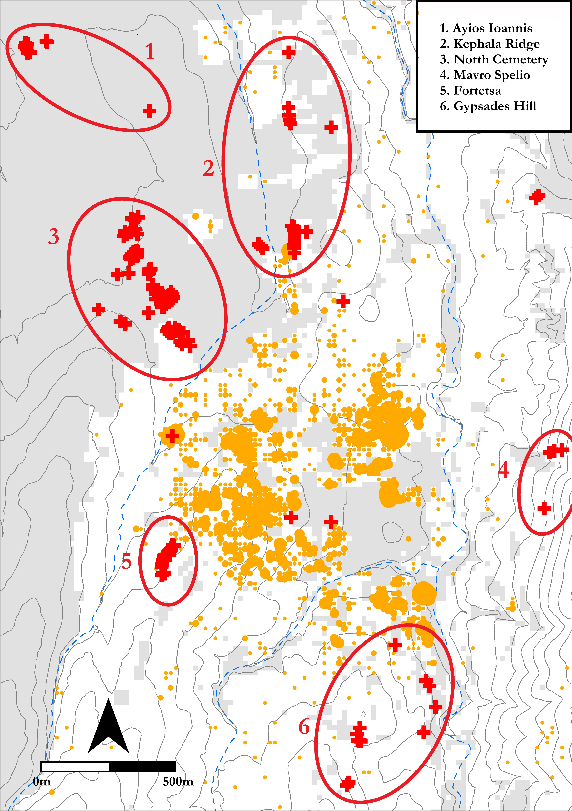

# Keywords: 
Early Iron Age; Knossos; Burial; Quantitative; Open-Access; Reproducibility

```{r setup, include=FALSE}
knitr::opts_chunk$set(
  collapse = TRUE,
  warning = FALSE,
  message = FALSE,
  echo = FALSE,
  fig.retina = 2,
  comment = "#>",
  fig.path = "../figures/",
  dev="png"
)

#The appropriate packages are installed. Extrafont allows the use of non-standard fonts in R plots, ggplot2 is a powerful figure and graph plotting tool, and RColorBrewer includes a number of colour pallettes which can be applied to plots. The colour scheme in this paper is chosen from those that are suitable for colour-blind readers. The font Garmond is installed and stored.
library(ggpubr)
library(ineq)
library(reshape)
library(data.table)
library(extrafont)
library(ggplot2)
library(RColorBrewer)
library(grid)
library(dplyr)
library(plyr)
library(ggforce)
library(png)
font_import(paths="../paper/font",pattern="GARA")
loadfonts(device="win")

```

##### pagebreak

# Introduction
Three principal interests converge in this paper: a reorientation of the focus of Early Iron Age Cretan archaeology; the application of computational, and quantitative methods to supplement traditional modes of archaeological inference; and open-access, reproducible research. To begin with the first, it may be felt that, of all ancient sites on Crete, Knossos is the last in need of further archaeological attention. The city and palace of Knossos, first excavated well over a century ago [@Evans1921; -@Evans1928; -@Evans1930], retain a pre-eminent position in popular and academic accounts the island’s Bronze Age (BA), and few, if any, other Cretan sites have been so thoroughly dug, reconstructed, and contested. 

For one, though, this is not the Knossos of that illustrous, palatial period, but rather the town as it persisted and evolved during the subsequent Early Iron Age (EIA). Research into this once maligned period has grown apace in recent decades, beginning with the pioneering works of Coldstream [-@Coldstream1977], Desborough [-@Desborough1972], and Snodgrass [-@Snodgrass1971a] and culminating in the rejection by most scholars of the appelation and interpretive bagguage of the so-called ‘Dark Ages’ [see @Kotsonas2016; @Morris1997]. Nonetheless, our knowledge of many EIA settlements remains often underdeveloped in comparison with those of the second millennium BC. 

Secondly, and welcome though they are, a number of recent publications on the socio-economic [@Wallace2010a] and settlement [@Nowicki2000] changes which accompanied the BA-EIA transition have directed scholarly attention toward a pattern of elevated, defensible settlements supposedly founded in response to the dangers of this turbulent period. This is reflected in survey work, which has focussed extensively around the Bay of Mirabello, where such sites are numerous [@Haggis2005; @Hayden2005; @Watrous2012]. This has, unfortunately, engendered a certain disregard for settlement characterised by different topographies, especially in the centre of the island. There remains, therefore, a need for studies addressing the social dynamics at such sites (Knossos, Phaistos, Grivila, Eleutherna etc.), with a long-term view to comparative appraisal of the divergent trajectories of communities across Crete in the EIA [@Kotsonas2011b; @Whitley2011, 667–68].

As to the second and third of my stated interests, several authors have recently demonstrated the great potential of quantitative, statistical, spatial, and network analyses to elucidate social dynamics, settlement patterning, and systems of inter-regional communication across Crete and the wider Aegean. Such work encourages the use of large (often pre-existing) datasets, and the sharing of both data and methods to facilitate reproducible, collaborative research [@Bevan2013; @Knappett2011a; @Knappett2011]. The cemeteries of Knossos offer an opportunity to introduce such approaches into EIA research on Crete, where they have yet to make much of an impact [see @Kotsonas2011]. The Fortesta and North Cemetery complexes are both well-published [@Brock1957; @Coldstream1996a] and studied, but a lack of systematic, quantitative comparisons between the cemeteries has left us with many intuited trends, some exceptional tombs, yet a general impression of un-patterned multiplicity. 

With a dataset including information on every find and tomb recorded in the Fortetsa and Knossos North Cemetery publications [@Brock1957; @Coldstream1996a], the following analysis addresses this present lack. In doing so, I aim to demonstrate the potential for quantitative methods, firstly, to permit identification, and nuanced characterisation, of significant patterning in the archaeological material; secondly, to facilitate a more systematic appraisal of the cemeteries’ largest tombs and their distinctive histories; and, finally, to offer tangible and context-specific evidence as to the behaviours and identities of the burying groups, with a view to eventually comparing such results with mortuary assemblages across Crete. 

# Early Iron Age Knossos
## Settlement Evidence: 'A meagre filling in a very thick sandwich'

Settlement evidence at EIA Knossos is, in a word, insubstantial. Speaking of the town’s stratigraphic sequence, Coldstream lamented that “the remains of [this] period are like a meagre filling in a very thick sandwich” between Bronze Age and later Greek and Roman levels [@Coldstream1991: 287]. Most individual finds of Protogeometric (PG) or Geometric date take the form of flimsy foundations, patches of earth floor, wells or pottery scatters, and for a time it was argued that the area in the EIA comprised several dispersed villages, which later coalesced into a single city, as per Aristotle’s model of synoecism [@1950]. 

However, a concentration of activity slightly to the west of the palace presented a good case for continuing, nucleated settlement [@Hood1981], something strongly advocated by Coldstream [-@Coldstream1984a; -@Coldstream2000], and, more recently, findings of the Knossos Urban Landscape Project suggest a PG settlement of up to 40ha [@Kotsonas2011a: 5-8]. This estimate remains our best guess in the absence of substantial excavated deposits but, if accurate, suggests that EIA Knossos was one of the largest sites of the contemporary Aegean. 

## The Early Iron Age Cemeteries

```{r map, fig.cap="goes around here"}

```

Survey aside, our most abundant evidence comes from the mortuary record (see Figure \@ref(fig:map)). The transitional period between the Late Bronze Age (LBA) and EIA yields few if any securely datable interments, but later evidence is more plentiful, with burials known from the Kephala ridge [@Coldstream1963: 38; @Hogarth1899: 82-5], the modern suburbs of Ayios Ioannis and Atsalenio [@Boardman1960a; @Davaras1968: 133–46], the cave of Mavro Spelio [@Antoniadis2012: 58-9], and the Khaniale Teke site with its well-known tholos [@Boardman1967;@Hutchinson1954; cf. @Hoffman1997 @Kotsonas2006]. Taken together, these scattered tombs point to a richly variegated set of funerary practices but, despite their reasonable number, are so dispersed that they provide little scope for systematic quantitative analysis. 

Fortunately, far larger burial accumulations are to be found in the Fortetsa and the Knossos North cemeteries, which together comprise some 134 tombs, ranging in date from the Subminoan (SM) to Late Orienatalising (LO) periods. Though many were robbed in antiquity, and others destroyed by the digging of later burials, building work, or just the ravages of time, they still represent the most abundant source of evidence for not just mortuary, but social practice of any kind at EIA Knossos.

## The Fortetsa and Knossos North Cemeteries

The cemetery on the slope facing the eponymous village of Fortetsa comprises twelve tombs excavated in 1933, and another eight uncovered in 1935 (Brock 1957: xi). These cluster in three main groups. The largest of these contains nine tombs, arranged on a north-south axis, with the *dromos* of each extending downslope to the west. To the north lies a cluster of five tombs and, to the south, another of three. Finally, three tombs excavated in 1933 – L, TFT and Π – which lie close to the main road north of the Acropolis hill [@Brock1957: 1-2], are now considered to belong the Knossos North Cemetery (KNC).

To the northeast of the Fortetsa cemetery, a collection of ten badly damaged tombs known as the Fortetsa 1967 tombs were probably the southernmost burials of the KNC. Unfortunately, all had been thoroughly looted at the time of excavation, and are thus excluded from present analysis. Northwest of these, and just south of the Teke Tholos, the Teke tombs represent the northern reaches of the KNC. The central section of the KNC comprises the ‘Medical Faculty’ site, named for the extension of the University of Crete that prompted major rescue excavations there in 1978 [@Coldstream1996a: 53-55]. 

The tombs themselves fall into three main types, the chamber tomb, shaft grave, and pit cave or tomb; the latter two are largely Subminoam phenomena, with the former by far the most abundant. It comprises a descending ramp or passage, the *dromos*, leading to the chamber itself, cut into the *kouskouras* bedrock. The *dromos* and chamber are separated by the *stomion*, an opening often set a step or two lower than the *dromos*, which is covered by a large stone slab, smaller stacked stones, or combination of both [@Antoniadis2012: 47-48]. The majority of burials are cremations, a rite that appears at Knossos in the Subminoan period, in the Tomb 200+ complex in the KNC [@Coldstream1994: 109]. Inhumation does not completely disappear in the EIA, but by the Orientalising period it appears restricted solely to child burials [@Antoniadis2012: 69]. 

## Chronological Developments in the Cemeteries

The foundation of the cemeteries has received much attention. It has been claimed that no tomb crosses the Late Minoan IIIC-SM divide [@Coldstream1998: 58; @Coldstream2006: 582], though there is a possibility that this is a classificatory artefact [@Hallager2010]. Instances of BA tombs reused in the EIA are known (e.g. the Khaniale Teke tholos), and Cavanagh [-@Cavanagh1996], based on a cluster analysis of tomb dimensions, could not reject the possibility of some KNC tombs being of BA date, though other evidence would suggest this is unlikely (Whitelaw, pers. comm.).

During the use of the cemeteries, correspondences have been highlighted between changing pottery styles and episodes of tomb construction and abandonment. The Protogeometric B (PGB) style, first defined by Brock [-@Brock1957: 143], who hailed it as “the most remarkable phase in Cretan vase-painting”, is apparently a Cretan anomaly, evincing a melding of Attic geometric motifs, patterns possibly deriving from Near Eastern metalwork, and iconography drawn from the Minoan repertoire [@Coldstream1984b: 93-94]. Coldstream has argued that the concurrence of this style with a rash of newly founded tombs points to a reformulation of elite mortuary display, noting how, in this period also, redeposited Minoan larnakes began appearing in and around some tombs, in one case even inspiring the decoration of a PGB vessel [in T. 107; see @Coldstream1984b; -@Coldstream1994: 112–13]. Whether simply nostalgia [@Coldstream1998: 60], or a more tactical strategy by newly emerging elite groups [@Coldstream1994: 114-15], the Bronze Age past clearly possessed a significant and enduring cultural cachet for the EIA Knossians. 

As contentious as their founding is the abrupt abandonment of both cemeteries around 630 BC. Admittedly, few new tombs had been built in the preceding century, though interments in old tombs had certainly continued [@Brock1957: 4; @Cavanagh1996: 651-53]. The ensuing period, accompanied by equally scanty settlement evidence, has become known as the ‘Archaic Gap'. The causes of this lacuna, which persists until the recrudescence of archaeological evidence in the Late Archaic period, remain unknown. Although various explanations have been forwarded, [@Coldstream1999: 301-302; @Huxley1994: 126; @Kotsonas2002: 41-44], there are now strong reasons to doubt the settlement was abandoned (Whitelaw, pers comm.).

## Heroes and Heirlooms: Object Biographies and Exceptional Burials

A popular approach to the study of Knossos’ EIA tombs has been the investigation of ‘object biography’ [@Appadurai1986; @Kopytoff1986l; @Mauss1954], an anthropological lens emphasising the mutuable nature of an object’s value, the transformations latent within its social existence. Fertilised by the Homeric motif of gift-giving [@Whitley2002: 220-21], and the remarkable archaeological parallels for such items – such as the boar’s tusk helmet from Tomb 200+ and that given to Odysseus by Meriones (*Iliad* 10.260-271) - such approaches have been brought to bear on certain elaborate burials of the EIA. 

For instance, Tomb 201 in the KNC contained a bronze sword, spearhead, and arrowhead, an iron dirk or knife, fragments of an antique bronze stand, probably of Cypriot origin, and pieces of the aforementioned helmet [@Catling1995: 123]. Catling identifies similarities between this tomb and burials at Tiryns, Kaloriziki, and the famous *hērōön* of Lefkandi; all contained imported items, were of ‘warrior grave’ type, and formed loci for later burials. He has argued that individuals who dared to travel abroad in this time of more limited seafaring, accruing exotica and stories from distant lands, would have been accorded exceptional treatment, including the deposition of such items, in death [@Catling1995: 127–8]. 

Complementing the theme of heroes abroad has been a similar interest in foreigners at home. Two caches of gold jewellery, found in pits flanking the entrance to the Teke Tholos, were argued by Boardman [-@Boardman1967] to be foundation deposits – a Near Eastern custom – for the tomb of an immigrant Phoenician craftsman. Kotsonas has revisited this attribution, deeming the tholos more probably that of an elite individual or family with a monopoly over a metal workshop’s output [-@Kotsonas2006: 155–9]. While certainty in such individual cases may be moot, it seems unlikely that foreign traders or craftsmen never visited or resided at Knossos during the EIA [@Hoffman1997: 176–85; @Schreiber2003: 293-306].


## Number Crunching: Quantitative Analyses of the Cemeteries

Generally speaking, the above analyses have tended to rely more on particular finds, tombs, or observable, but limited, patterns in the data; only a few authors have pursued more quantative approaches. Cluster analyses have been employed by both Cavanagh [-@Coldstream1996: 653-57] and Antoniadis [-@Antoniadis2012: 193-97], the most sophisticated statistical techniques so far applied to the material. Antoniadis [-@Antoniadis2012: 172-6] also divided the EIA tombs of Knossos into three groups, those with fewer than 10 pots, fewer than 50, and more than 50, and found that, in each successive case, the proportions of tombs containing 'oriental' imports and imitations increased, suggesting unequal access to such prestigious goods. Yet even here the available data could be further interrogated (with, for instance, the number of imported items *per burial*). The present paper thus seeks to extend and nuance a number of observations that have been made in previous studies, as well as revealing patterns thus far unacknowledged, through use of a more systematic approach to quantitative analysis.


# Methods

## Databases

The cornerstone of the present study is a database (or, rather, three linked databases) based on the excavation reports for the Fortetsa and Knossos North cemeteries [@Brock1957; @Coldstream1996a]. The first includes an entry for each individual ceramic vessel. Variables includes the tomb, the vessel shape, its surviving dimensions, its ceramic period and corresponding absolute dating measures. In addition, all imports, 'oriental' imitations, and antique (that is, Bronze Age) artefacts were categorised, using the studies of Antoniadis (2012), Jones [-@Jones2000], and Crowe [-@Crowe2016]. In total, this database comprises just over 4540 individual artefacts. 

The second database is similar, but with each entry corresponding to a find other than a ceramic vessel. A ‘material’ variable was added, as of course these finds were not all made of the same substance. This database included some 1620 individual artefacts. 

The final database concerns the tombs themselves. Each tomb was accorded its own entry, with variables including dating (both in relative and absolute terms), surviving dimensions, and the known and estimated number of interments, as well as a tally of the objects recorded in the other two databases. Finally, the total number of imports, imitations and antiques in each tomb was calculated.

Taken together, these databases make possible a diverse range of quantitative analyses. It must be conceded that, with many of the tombs evidently looted or damaged, this cannot be a complete picture of their original contents. If we assume, though, that natural or accidental destruction was relatively indiscriminate, and that, even in cases of looting, certain object classes (particularly cinerary urns) were seldom robbed, then the data are by no means rendered useless. As Snodgrass [-@Snodgrass1996] cautions, we should be extremely cautious about making negative arguments – that is, conclusions drawn about the *lack* of features in certain tombs – but may be somewhat more hopeful in the forming of positive ones.

## Reproducibility and Data-sharing

Ever more archaeologists have begun to advocate the utility, indeed the necessity, of making available not just the data, but the full methodologies underpinning our academic output. With the opportunities afforded by current technologies (digital databases, statistical software packages, online repositories etc.), there remain ever fewer obstacles to the full and free sharing of both data and workflows [see @article]. In Marwick's words [-@Marwick2017: 445], "[t]he technical problems are largely solved; the challenge now is to change the norms of the discipline to make high reproducibility a canonical attribute of high-quality scholarly work".

This article is, among other things, an attempt to bring these principles of maximal reproducibility to the archaeology of EIA Crete. Within this field, catalogues and excavation reports abound and, though many of these may be forgiven based on their dates of publication, the lack of readily utilisable digital data from a number of recent articles and monographs, indeed, the failure to even present data such that they could be manually digitsed, is less pardonable.

There are, of course, valid reservations regarding issues of copyright, the protection of sites from looting, the possibility of being scooped with one's own data, or simply the significant time investment of preparing open-access research. But I would argue that the potential gains outweigh these concerns, and that research on the EIA would benefit hugely from the greater accessability of datasets and workflows. 

In this vein, the present article has been composed making use of Ben Marwick's 'rrtools' [see @Marwick2017; @inbook], an open-source package for the statistical software R Studio. This provides the author with the tools to create a self-contained 'compendium', which can be freely downloaded, and from which anyone can reproduce the entire workflow of the following analysis. Though not visible in the present paper, every chart and table herein was produced directly, through written code, from the raw data using R (and note also that, wherever possible, these are presented in colour-blind friendly palettes). This code, as well as the raw and derived datasets, complete bibliography (in BibTex format, for export to any major reference manager), figures, and original article are included in the compendium. It can be downloaded as a repository from GitHub, at the following address: https://github.com/DCPollard94/knossoscemeteries, and the raw datasets have been stored with the online repository Figshare, here: (**NB a URL will be included pending acceptance of the article**). The data are made available through an MIT license, which permits unlimited use, ammendation, and dissemination thereof, yet frees the present author from any responsibilty for that use, or perceived errors or inaccuracies in the data. It is sincerely hoped that others may further explore and expand upon the research presented here by downloading this compendium.

## Estimating Interments

A first important step in preparing the data for analysis was the estimation of the number of individuals buried in each tomb. The method chosen broadly follows that of Cavanagh [-@Cavanagh1996: 659-60], who took the number of pithoi (the most common urn) and the number of pithoi, amphorae and kraters (which were sometimes used as such) as middle and upper estimates of the number of burials, with all securely identified interments being the lower limit (Figure \@ref(fig:burialestimate)). Here, the mean of these three estimates was taken, to provide a single aggregate measure for the purposes of analysis.

```{r burialestimate, fig.dim = c(7, 4), dpi=300, fig.align='center', fig.cap="goes around here"}

#The tombs database is imported and, for the purposes of this article, the entire database is subsetted to include only those tombs from the Knossos North and Fortetsa cemeteries (excluding the Tekke Tombs).

tombs<-read.csv("../data/raw_data/KnossosTombs.csv",header=TRUE)
tombs<-subset(tombs,tombs$cem_condensed=="KNC"|tombs$cem_condensed=="FOR")

#Figure 1 is plotted, with axis limits set (excluding tomb P, resulting in the warning message delivered) and the style of the plot adjusted (including font and text size, the appearance of the gridlines, selecting a colour palette etc.)

p<-ggplot(tombs)+geom_point(aes(est_burials,all_urns,color="All urns"))+
  geom_point(aes(est_burials,total_burials,color="Known interments"))+
    geom_point(aes(est_burials,pithoi,colour="Pithoi"))+
      geom_line(aes(est_burials,est_burials),alpha=0.4)+
       scale_x_continuous(expand=c(0,0),limits=c(0,55))+
        scale_y_continuous(expand=c(0,0),limits=c(0,55))+theme_bw()+
         theme(legend.title=element_blank(),
          text=element_text(family="Garamond", size=12))+
              labs(x="Mean Burial Estimate", y="Interment/Vessel Count")+
                 scale_color_brewer(palette = "Set2")
          
#The coordinates of the plot are adjusted to render the axes equal, and the corresponding gridlines as squares, and then the figure is plotted.

p<-p+coord_fixed()
plot(p)

```

For most diachronic analyses, however, pithoi alone were taken as the best proxy for burial numbers. In most cases, any tombs lacking identified remains or a single vessel suitable for use as an urn were not considered, thus excluding what are presumably among the most heavily damaged and looted tombs.

##Aoristic Approaches to Dating

Another major concern was the temporal uncertainty implicit in the assigning of individual vessels to ceramic periods. A Protogeometric B vessel could, on our best estimates, date anywhere between 840 and 810 BC. This situation results in major challenges to the visualisation and analysis of such data. A simple, if coarse, solution is to use the midpoint of the range assigned to each vessel (i.e. 825 for our PGB example). This is used in a couple of instances in the present paper, for assigning vessels to broad, century-long windows.

```{r allpithoi,fig.dim = c(7, 4), dpi=300, fig.align='center', fig.cap="goes around here"}

#The database of all vessels is imported and, again only those tombs from the KNC and Fortetsa cemetery are selected. A new object "pithoi" is made by subsetting only those vessels labelled "Pithos", and a similar object "all_urns" by subsetting all pithoi, amphorae and kraters.

pots<-read.csv("../data/raw_data/KnossosPots.csv",header=TRUE)
pots<-subset(pots,pots$cem_condensed=="FOR"|pots$cem_condensed=="NC")
pithoi<-subset(pots,pots$shape=="Pithos")
all_urns<-subset(pots,pots$shape=="Pithos"|pots$shape=="Amphora"|pots$shape=="Krater")

#The figure is plotted by creating a histogram of all vessels based on their average dates ("ave_date"), which is simply the midpoint of the absolute chronological range associated with their respective ceramic phase. Similar stylistic adjustments are made (font, labels, colour palette, removing a legend, setting the x and y scales, and expanding the borders of the plot slightly to prevent the "600" label being cut off, which would occur without the final line of code.)

ggplot(pots, aes(ave_date,fill="Pots"))+geom_histogram()+
  theme_bw()+theme(legend.title=element_blank(),
      text=element_text(family="Garamond", size=12))+
          labs(x="Date (Years BC)", y="Vessel Count")+
              scale_fill_brewer(palette = "Set3")+ 
                theme(legend.position="none")+
                  scale_y_continuous(expand=c(0,0),limits=c(0,600))+
                    scale_x_reverse(expand = c(0, 0),limits=c(1100,600))+
                      theme(plot.margin=unit(c(0.1,1,0.1,0.1),"cm"))

```

But the artificial clustering this technique engenders around select absolute dates can prove misleading, as in Figure \@ref(fig:allpithoi); the apparent cessation of depositions for 30 years in the 8th century is simply a fiction generated by the processing of the data.

A alternative approach, and the method employed extensively in this paper, is the use of so-called 'aoristic analysis' [for original use in criminology, see @Ratcliffe2000; for archaeological applications, see @Crema2010; @Crema2012; @Johnson2004a]. Here, rather than give a pot a single date, the entire time span under investigation is divided into equal chunks (in this case, decades), and probability values summing to one are then assigned for each vessel, per chunk of time, based on its accordant date range. So, our PGB vessel, datable between 840 and 810 BC, would register a value of 0.33 for each of those three decades. These values for individual vessels can then simply be summed to produce tomb- or cemetery-level signatures. A particular attraction of this method is that it incorporates temporal uncertainty into the size of the resulting values, that is, "events with tight temporal definition contribute more to the total probability over their range than do loosely defined events" [@Johnson2004a, 450].


```{r aoristallcems, fig.dim = c(7, 4), dpi=300, fig.align='center', fig.cap="goes around here"}

#The aoristic values for every tomb are summed by decade, and then this object is converted to a data frame.

aorist_all_tombs<-colSums(tombs[158:207])
aorist_all_tombs<-data.frame(aorist_all_tombs)
        
#The column of values is labelled "aoristic_sum", an vector named "dates" is created with values between 1100 and 610 (in that order) at intervals of 10, and then this used to rename the rows of the data frame. Finally, these "row names" are converted into a functioning row in their own right within the data frame (this makes them plottable as a variable) and then are converted into numeric variables, allowing the plotting of them along a continuous scale.

colnames(aorist_all_tombs)<-c("aoristic_sum")
dates<-seq(from = 1100, to = 610, by = -10)
row.names(aorist_all_tombs)<-dates
setDT(aorist_all_tombs, keep.rownames = "decade")
aorist_all_tombs$decade<-as.numeric(aorist_all_tombs$decade)

#The plot is produced, following the same stylistic adjustments of the previous plot.

ggplot(aorist_all_tombs,aes(decade,aoristic_sum, fill="Aoristic Sum"))+
  geom_col()+theme_bw()+theme(legend.title=element_blank(),
      text=element_text(family="Garamond", size=12))+
          labs(x="Date (Years BC)", y="Aoristic Sum")+
              scale_fill_brewer(palette = "Set3")+ 
                theme(legend.position="none")+
                  scale_y_continuous(expand=c(0,0),limits=c(0,225))+
                    scale_x_reverse(expand = c(0, 0),limits=c(1100,600))+
                      theme(plot.margin=unit(c(0.1,1,0.1,0.1),"cm"))

```

As seen in Figure \@ref(fig:aoristallcems), the artificial peaks and troughs of the simple averaging method are avoided, and different patterns become visible. Though these methods present their own limitations (see @Crema2010, 1123-24), they are considered a more robust and productive approach to the temporal uncertainty of ceramic dating and, as such, are used for much of the present analysis.


#Analysis

##Introduction
The great advantage of the large, quantitative dataset employed here is that it permits investigation of several nested levels of potentially significant patterning. From individual burials, to collective tombs, to whole cemeteries, we have the opportunity to study and compare both the synchronic and diachronic variation across these various levels. In so doing, I first investigate the broad temporal trends in tomb construction, burial, and pottery deposition across both cemeteries, isolating a notable trend among a select group of tombs. I then examine these more closely, in an attempt to understand what sets them apart from the rest. Tomb dimensions, rates of burial, and changes in the composition of assemblages through time are all considered, to produce an account which speaks to the changing social landscape of EIA Knossos, drawing together issues of group identity, external relations, and the communication of wealth and status through funerary practice. 

##Temporal Developments in the Knossian Cemeteries

An obvious place to begin is with the chronology of the burials themselves. The rate and number of interments being made through time provides the background against which to consider all other developments. 

```{r aoristbycem, dpi=300, fig.align="center", fig.cap="goesaround here.", fig.dim=c(8,4)}
KNC<-subset(tombs,tombs$cem_condensed=="KNC")

aorist_KNC_pithoi <- colSums(KNC[208:257])
aorist_KNC_pithoi<-data.frame(aorist_KNC_pithoi)

colnames(aorist_KNC_pithoi)<-c("aoristic_sum")
row.names(aorist_KNC_pithoi)<-dates
aorist_KNC_pithoi<-data.frame(aorist_KNC_pithoi)
setDT(aorist_KNC_pithoi, keep.rownames = "decade")
aorist_KNC_pithoi$decade<-as.numeric(aorist_KNC_pithoi$decade)


FOR<-subset(tombs,tombs$cem_condensed=="FOR")

aorist_FOR_pithoi <-colSums(FOR[208:257])
aorist_FOR_pithoi<-data.frame(aorist_FOR_pithoi)

colnames(aorist_FOR_pithoi)<-c("aoristic_sum")
row.names(aorist_FOR_pithoi)<-dates
aorist_FOR_pithoi<-data.frame(aorist_FOR_pithoi)
setDT(aorist_FOR_pithoi, keep.rownames = "decade")
aorist_FOR_pithoi$decade<-as.numeric(aorist_FOR_pithoi$decade)


aorist_all_pithoi <- colSums(tombs[208:257])
aorist_all_pithoi<-data.frame(aorist_all_pithoi)

colnames(aorist_all_pithoi)<-c("aoristic_sum")

row.names(aorist_all_pithoi)<-dates
aorist_all_pithoi<-data.frame(aorist_all_pithoi)
setDT(aorist_all_pithoi, keep.rownames = "decade")
aorist_all_pithoi$decade<-as.numeric(aorist_all_pithoi$decade)

aorist_pithoi_plot<-ggplot(NULL)+
  geom_col(data=aorist_all_pithoi,aes(decade,aoristic_sum,fill=" All tombs  "))+
    geom_col(data=aorist_KNC_pithoi,aes(decade,aoristic_sum,fill=" KNC  "))+
      geom_col(data=aorist_FOR_pithoi,aes(decade,aoristic_sum, fill=" Fortetsa  "))+
        theme_bw()+theme(legend.title=element_blank(),
          text=element_text(family="Garamond", size=12))+
            labs(x="Date (Years BC)", y="Aoristic Sum (Pithoi)")+
              scale_fill_brewer(palette = "Set2")+ 
                  scale_y_continuous(expand=c(0,0),limits=c(0,45))+
                    scale_x_reverse(expand = c(0, 0),limits=c(1100,600))+
                      theme(plot.margin=unit(c(0.1,1,0.1,0.1),"cm"))

aorist_KNC <- colSums(KNC[158:207])
aorist_KNC<-data.frame(aorist_KNC)

colnames(aorist_KNC)<-c("aoristic_sum")
row.names(aorist_KNC)<-dates
aorist_KNC<-data.frame(aorist_KNC)
setDT(aorist_KNC, keep.rownames = "decade")
aorist_KNC$decade<-as.numeric(aorist_KNC$decade)


FOR<-subset(tombs,tombs$cem_condensed=="FOR")

aorist_FOR <-colSums(FOR[158:207])
aorist_FOR<-data.frame(aorist_FOR)

colnames(aorist_FOR)<-c("aoristic_sum")
row.names(aorist_FOR)<-dates
aorist_FOR<-data.frame(aorist_FOR)
setDT(aorist_FOR, keep.rownames = "decade")
aorist_FOR$decade<-as.numeric(aorist_FOR$decade)

aorist_pots_plot<-ggplot(NULL)+
  geom_col(data=aorist_all_tombs,aes(decade,aoristic_sum,fill=" All tombs  "))+
    geom_col(data=aorist_KNC,aes(decade,aoristic_sum,fill=" KNC  "))+
      geom_col(data=aorist_FOR,aes(decade,aoristic_sum, fill=" Fortetsa  "))+
        theme_bw()+theme(legend.title=element_blank(),
          text=element_text(family="Garamond", size=12))+
            labs(x="Date (Years BC)", y="Aoristic Sum (All Vessels)")+
              scale_fill_brewer(palette = "Set2")+ 
                  scale_y_continuous(expand=c(0,0),limits=c(0,225))+
                    scale_x_reverse(expand = c(0, 0),limits=c(1100,600))+
                      theme(plot.margin=unit(c(0.1,1,0.1,0.1),"cm"))

ggarrange(aorist_pithoi_plot,aorist_pots_plot,ncol=2,common.legend=TRUE, legend="bottom")
```


Figure \@ref(fig:aoristbycem) presents the aoristic sums of pithoi (as a proxy for burials) and of all vessels, respectively. Despite differences in scale and timing, it is immediately apparent that Fortetsa and the KNC experieced similar chronological developments in burials and, to a slightly lesser degree, grave goods. In both cemeteries, the rate of cremation burial began rising around the end of the 9th century, plateaued slightly in the early 8th, and then rose again to a peak in the late 8th and early 7th. Across all vessels, the developments are more volatile, but largely similar, especially regarding the late spike in burial activity. We might assume that these trends would be mirrored in the construction of new tombs, but this proves not to be the case.

```{r tombconstruction, fig.dim=c(7.5,4), dpi=300, fig.cap="goes around here"}

tomb_dates_aorist<-read.csv("../data/derived_data/tomb_dates_aorist.csv",header=TRUE)
tomb_dates_aorist_KNC<-subset(tomb_dates_aorist,tomb_dates_aorist$cem_condensed=="NC")
tomb_dates_aorist_FOR<-subset(tomb_dates_aorist,tomb_dates_aorist$cem_condensed=="FOR")

aorist_tomb_periods<-colSums(tomb_dates_aorist_KNC[5:14])
aorist_tomb_periods<-data.frame(aorist_tomb_periods)
aorist_tomb_periods$FOR<-colSums(tomb_dates_aorist_FOR[5:14])
colnames(aorist_tomb_periods)<-c("KNC","FOR")
setDT(aorist_tomb_periods, keep.rownames = "period")
aorist_tomb_periods$period<-factor(aorist_tomb_periods$period,levels=c("SM", "EPG", "MPG", "LPG", "PGB", "EG", "MG", "LG", "EO", "LO"))
aorist_tomb_periods_melt<-melt(aorist_tomb_periods)
colnames(aorist_tomb_periods_melt)<-c("period","cemetery","aoristic_sum")

tombs$start_period<-factor(tombs$start_period,levels=c("SM", "EPG", "MPG", "PG","LPG", "PGB", "EG", "MG","G", "LG", "EO","O","LO"))

tombs$cem_condensed<-factor(tombs$cem_condensed,levels=c("KNC","FOR"))

new_tomb_counts_plot<-ggplot(data=subset(tombs,!is.na(start_period)),aes(start_period, fill=cem_condensed))+geom_bar(position="identity")+theme_classic()+
        theme_bw()+theme(legend.title=element_blank(),
          text=element_text(family="Garamond", size=12))+
            labs(x="Period", y="Count of New Tombs")+
              scale_fill_brewer(palette = "Set2",labels=c(" KNC  "," Fortetsa"))+ 
                 scale_y_continuous(expand=c(0,0),limits=c(0,30))

new_tomb_aorist_plot<-ggplot(aorist_tomb_periods_melt,aes(period,aoristic_sum, fill=cemetery))+geom_col(position="identity")+
  theme_bw()+theme(legend.title=element_blank(),
          text=element_text(family="Garamond", size=12))+
            labs(x="Period", y="Aoristic Sum of New Tombs")+
              scale_fill_brewer(palette = "Set2",labels=c(" KNC  "," Fortetsa"))+ 
                 scale_y_continuous(expand=c(0,0),limits=c(0,30))

ggarrange(new_tomb_counts_plot,new_tomb_aorist_plot,ncol=2,common.legend=TRUE, legend="bottom")


```

Figure \@ref(fig:tombconstruction) presents two ways of dating the construction of the tombs. In both cases, the trend appears clear. The KNC began with a large number of new tombs built during the, admittedly prolongued, SM period, followed by a protracted decline in rates of consruction, offset by small resurgences in the late 9th and 8th centuries. It should be noted, too, that many of the later "tombs" are not chamber tombs, but a mix of pit, larnax, and pithos burials. The Fortetsa, meanwhile, saw next to no new chamber tomb construction from the 8th century onwards. This abatement has been noted before (Brock 1957: 4; Cavanagh 1996: 652–53) and somewhat implicitly read as evidence of restructuring of the funerary rite, if not a decline in the fortunes of the wider community. But this image of a waigning investment in chamber tombs sits uneasily with the observable growth in mortuary activity.

```{r tombsinuse, fig.dim=c(7,4), dpi=300, fig.cap="goes around here"}


KNC_tombs_in_use<-colSums(KNC[6:15]!="")
KNC_tombs_in_use<-data.frame(KNC_tombs_in_use)
colnames(KNC_tombs_in_use)<-c("no_tombs")
setDT(KNC_tombs_in_use, keep.rownames = "period")
KNC_tombs_in_use$period<-factor(KNC_tombs_in_use$period,levels=c("SM", "EPG", "MPG", "LPG", "PGB", "EG", "MG", "LG", "EO", "LO"))
KNC_tombs_in_use$cemetery<-"KNC"

FOR_tombs_in_use<-colSums(FOR[6:15]!="")
FOR_tombs_in_use<-data.frame(FOR_tombs_in_use)
colnames(FOR_tombs_in_use)<-c("no_tombs")
setDT(FOR_tombs_in_use, keep.rownames = "period")
FOR_tombs_in_use$period<-factor(FOR_tombs_in_use$period,levels=c("SM", "EPG", "MPG", "LPG", "PGB", "EG", "MG", "LG", "EO", "LO"))
FOR_tombs_in_use$cemetery<-"FOR"

tombs_in_use_cem<-rbind(KNC_tombs_in_use,FOR_tombs_in_use)
tombs_in_use_cem$cemetery<-factor(tombs_in_use_cem$cemetery,levels=c("KNC","FOR"))


ggplot(tombs_in_use_cem,aes(period,no_tombs, fill=cemetery))+geom_col(position="dodge")+theme_classic()+
       theme_bw()+theme(legend.title=element_blank(),
          text=element_text(family="Garamond", size=12))+
            labs(x="Period", y="Tombs in Use")+
              scale_fill_brewer(palette = "Set2",labels=c(" KNC  "," Fortetsa"))+ 
                 scale_y_continuous(expand=c(0,0),limits=c(0,45))
```

These countervalent trends are observable too in the number of tombs receiving depositions in each period (Figure \@ref(fig:tombsinuse)). At Fortetsa, this number remained relatively stable from the MPG to LG periods before declining (and bear in mind, there were only ever around 20 tombs belonging to this cemetery), while at the KNC, the number of tombs in use rose to a preak in the late 8th century before declining. But this is not the whole story.

```{r tombsinusebybuilddate, fig.dim=c(7,4), dpi=300, fig.cap="goes around here"}
tombs_11th<-subset(tombs,tombs$century_built=="11th")
tombs_10th<-subset(tombs,tombs$century_built=="10th")
tombs_9th<-subset(tombs,tombs$century_built=="9th")
tombs_8th<-subset(tombs,tombs$century_built=="8th")
tombs_7th<-subset(tombs,tombs$century_built=="7th")

tombs_in_use_11th<-colSums(tombs_11th[6:15]!="")
tombs_in_use_11th<-data.frame(tombs_in_use_11th)
colnames(tombs_in_use_11th)<-c("no_tombs")
setDT(tombs_in_use_11th, keep.rownames = "period")
tombs_in_use_11th$period<-factor(tombs_in_use_11th$period,levels=c("SM", "EPG", "MPG", "LPG", "PGB", "EG", "MG", "LG", "EO", "LO"))
tombs_in_use_11th$tomb_century<-"11th"

tombs_in_use_10th<-colSums(tombs_10th[6:15]!="")
tombs_in_use_10th<-data.frame(tombs_in_use_10th)
colnames(tombs_in_use_10th)<-c("no_tombs")
setDT(tombs_in_use_10th, keep.rownames = "period")
tombs_in_use_10th$period<-factor(tombs_in_use_10th$period,levels=c("SM", "EPG", "MPG", "LPG", "PGB", "EG", "MG", "LG", "EO", "LO"))
tombs_in_use_10th$tomb_century<-"10th"

tombs_in_use_9th<-colSums(tombs_9th[6:15]!="")
tombs_in_use_9th<-data.frame(tombs_in_use_9th)
colnames(tombs_in_use_9th)<-c("no_tombs")
setDT(tombs_in_use_9th, keep.rownames = "period")
tombs_in_use_9th$period<-factor(tombs_in_use_9th$period,levels=c("SM", "EPG", "MPG", "LPG", "PGB", "EG", "MG", "LG", "EO", "LO"))
tombs_in_use_9th$tomb_century<-"9th"

tombs_in_use_8th<-colSums(tombs_8th[6:15]!="")
tombs_in_use_8th<-data.frame(tombs_in_use_8th)
colnames(tombs_in_use_8th)<-c("no_tombs")
setDT(tombs_in_use_8th, keep.rownames = "period")
tombs_in_use_8th$period<-factor(tombs_in_use_8th$period,levels=c("SM", "EPG", "MPG", "LPG", "PGB", "EG", "MG", "LG", "EO", "LO"))
tombs_in_use_8th$tomb_century<-"8th"

tombs_in_use_7th<-colSums(tombs_7th[6:15]!="")
tombs_in_use_7th<-data.frame(tombs_in_use_7th)
colnames(tombs_in_use_7th)<-c("no_tombs")
setDT(tombs_in_use_7th, keep.rownames = "period")
tombs_in_use_7th$period<-factor(tombs_in_use_7th$period,levels=c("SM", "EPG", "MPG", "LPG", "PGB", "EG", "MG", "LG", "EO", "LO"))
tombs_in_use_7th$tomb_century<-"7th"

tomb_use<-rbind(tombs_in_use_11th,tombs_in_use_10th,tombs_in_use_9th,tombs_in_use_8th,tombs_in_use_7th)
tomb_use$tomb_century<-factor(tomb_use$tomb_century,levels=c("11th","10th","9th","8th","7th"))

ggplot(data=tomb_use,aes(period,no_tombs))+geom_col(alpha=0.2)+
            geom_col(data=tomb_use,aes(period,no_tombs,fill=tomb_century),position="dodge")+
              theme_bw()+theme(text=element_text(family="Garamond", size=12))+
                 labs(x="Period", y="Estimated No. of Tombs in Use")+
                  scale_fill_brewer(name="Century 
Built",palette = "Set2")+ 
                    scale_y_continuous(expand=c(0,0),limits=c(0,60))


```

By dividing the tombs in use into the centuries during which they were built (Figure \@ref(fig:tombsinusebybuilddate)), we see a wave-like pattern with each cohort steadily going out of use as new ones were constructed. This would seem to accord with Cavanagh's (1996) suggestion that "[t]he length of time the tombs last seems [...] to reflect the duration of the social group which had access to the sepulchre", and that, if such access was lineally inehrited, frequent fission would result in limited trans-generational use. We might expect, then, that it was the 8th century tombs coming into use that spurred the dramatic rise in burial rates previoulsy noted.

```{r potsbydateandtombdate,  fig.dim=c(7,4), dpi=300, fig.cap="goes around here"}

pots$century<-factor(pots$century,levels=c("11th","10th","9th","8th","7th"))
pots$tomb_century<-factor(pots$tomb_century,levels=c("11th","10th","9th","8th","7th"))

date_by_vessel<-ggplot(data=subset(pots,pots$century!=""),aes(century,fill="Date"))+geom_bar()+
  theme_bw()+theme(legend.position="none",
               text=element_text(family="Garamond", size=12))+
                 labs(x="Century BC (Date of Vessel)", y="Vessel Count")+
                  scale_fill_brewer(palette = "Set2")+ 
                    scale_y_continuous(expand=c(0,0),limits=c(0,2800))
  
date_by_tomb<-ggplot(data=subset(pots,pots$century!=""),aes(tomb_century,fill="Date"))+geom_bar()+
  theme_bw()+theme(legend.position="none",
               text=element_text(family="Garamond", size=12))+
                 labs(x="Century BC (Date of Tomb)", y="Vessel Count")+
                  scale_fill_brewer(palette = "Set2")+ 
                    scale_y_continuous(expand=c(0,0),limits=c(0,2800))

ggarrange(date_by_vessel,date_by_tomb,ncol=2)


```

However, we see from Figure \@ref(fig:potsbydateandtombdate) that, although the late 8th and early 7th centuries represented the apex of burial activity across both cemeteries, it was tombs built back in the 9th and 10th which received the lion's share of the burials and associated ceramics. This is all the more notable when, returning to Figure \@ref(fig:tombsinusebybuilddate), we see that the number of 9th and 10th century tombs in use by this time was, in fact, declining.

```{r table1}

pots10th10th<-sum(pithoi$tomb_century=="10th" & pithoi$century=="10th",na.rm=TRUE)
pots10th9th<-sum(pithoi$tomb_century=="10th" & pithoi$century=="9th",na.rm=TRUE)
pots10th8th<-sum(pithoi$tomb_century=="10th" & pithoi$century=="8th",na.rm=TRUE)
pots10th7th<-sum(pithoi$tomb_century=="10th" & pithoi$century=="7th",na.rm=TRUE)

notombs10th10th<-nrow(unique(subset(pithoi,tomb_century=="10th" & century=="10th",select=tomb)))
notombs10th9th<-nrow(unique(subset(pithoi,tomb_century=="10th" & century=="9th",select=tomb)))
notombs10th8th<-nrow(unique(subset(pithoi,tomb_century=="10th" & century=="8th",select=tomb)))
notombs10th7th<-nrow(unique(subset(pithoi,tomb_century=="10th" & century=="7th",select=tomb)))

pots9th9th<-sum(pithoi$tomb_century=="9th" & pithoi$century=="9th",na.rm=TRUE)
pots9th8th<-sum(pithoi$tomb_century=="9th" & pithoi$century=="8th",na.rm=TRUE)
pots9th7th<-sum(pithoi$tomb_century=="9th" & pithoi$century=="7th",na.rm=TRUE)

notombs9th9th<-nrow(unique(subset(pithoi,tomb_century=="9th" & century=="9th",select=tomb)))
notombs9th8th<-nrow(unique(subset(pithoi,tomb_century=="9th" & century=="8th",select=tomb)))
notombs9th7th<-nrow(unique(subset(pithoi,tomb_century=="9th" & century=="7th",select=tomb)))


pots8th8th<-sum(pithoi$tomb_century=="8th" & pithoi$century=="8th",na.rm=TRUE)
pots8th7th<-sum(pithoi$tomb_century=="8th" & pithoi$century=="7th",na.rm=TRUE)

notombs8th8th<-nrow(unique(subset(pithoi,tomb_century=="8th" & century=="8th",select=tomb)))
notombs8th7th<-nrow(unique(subset(pithoi,tomb_century=="8th" & century=="7th",select=tomb)))


pots7th7th<-sum(pithoi$tomb_century=="7th" & pithoi$century=="7th",na.rm=TRUE)

notombs7th7th<-nrow(unique(subset(pithoi,tomb_century=="7th" & century=="7th",select=tomb)))

```

*Table 1 goes around here*

The significance of these findings can be seen in Table 1. Using pithoi as a proxy for burials, we can estimate the changing rates of burial through time. And while these mostly remained around three per tomb per century, in the 8th and 7th centuries, tombs founded in the 9th century saw a rapid rise in the rate of burial, peaking at over 11 per tomb per century. Though these estimates are no doubt very rough, the marked nature of this divergence suggests it is not simply an artefact of imperfect data.

But Table 1 also demonstrates the markedly low rates of burial which predominated at both cemeteries; two to four burials per tomb per century amounts to a very selective burial rite. It seems unlikely, then, that the rising rates of burial noted above are, for instance, the direct result of population growth; the increase is too rapid, and appears concentrated only in certain (older) tombs, not to mention that, based on KULP’s survey data, the major population increase at EIA Knossos probably occurred back in the Protogeometric period (Whitelaw, per comm.).

##Isolating the Phenomenon

We are yet to draw out which older tombs precisely are responsible for the trend so far discussed. We might assume the tombs which became the focus of intense later burial activity would be those which yielded the most burials and grave goods when excavated and, happily, this supposition proves true. 

```{r toptombs, fig.dim = c(7, 5), dpi=300, fig.align='center',fig.cap="goes around here"}

tombs_ranked<-tombs[with(tombs, order(-tombs$total_finds)), ]
tombs_top_12<-head(tombs_ranked,12)
top12<-as.vector(tombs_top_12$tomb)
pots_top_12<-pots[is.element(pots$tomb, top12),]
pots_top_12$tomb<-factor(pots_top_12$tomb,levels=top12)

cols<-c(1,158:207)
aorist_all_tomb_names<-tombs_top_12[,cols]
aorist_all_tomb_names<-data.frame(aorist_all_tomb_names)
colnames(aorist_all_tomb_names)<-c("tomb",dates)

aorist_all_tomb_names$cemetery<-tombs_top_12$cem_condensed

aorist_all_tomb_melt<-melt(aorist_all_tomb_names)
aorist_all_tomb_melt$variable<-as.numeric(as.character(aorist_all_tomb_melt$variable))

top_12<-tombs_top_12$tomb
aorist_all_tomb_melt$tomb<-factor(aorist_all_tomb_melt$tomb,levels=top_12)

ggplot(aorist_all_tomb_melt,aes(variable, value,fill=cemetery))+geom_col()+theme(legend.position = "none")+facet_wrap(~tomb,scales="free_y")+
  geom_col()+theme_bw()+theme(legend.title=element_blank(),legend.position="bottom",
      text=element_text(family="Garamond", size=12))+
          labs(x="Date (Years BC)", y="Aoristic Sums")+
              scale_fill_brewer(palette = "Set2",labels=c(" KNC  "," Fortetsa"))+ 
                  coord_cartesian(xlim=c(1100,610))+scale_y_continuous()+
                    scale_x_reverse(expand = c(0, 0),limits=c(1100,610))+
                      theme(plot.margin=unit(c(0.1,1,0.1,0.1),"cm"))


tombs$group<-ifelse(tombs$tomb=="P"|tombs$tomb=="292"|tombs$tomb=="75"|tombs$tomb=="107"|tombs$tomb=="285"|tombs$tomb=="II"|tombs$tomb=="218","A","B")
total_pottery_by_groups<-aggregate(tombs$total_pottery, by=list(tombs$group), FUN=sum)
calc1<-(total_pottery_by_groups[1,2]/sum(total_pottery_by_groups$x))*100

```

The 12 tombs with the most associated vessels are all chamber tombs, 10 dating to the 9th century and two to the 10th, and seven of them did exhibit late, intense episodes of deposition (Figure \@ref(fig:toptombs)). In fact, Tombs P, 292, 75, 107, 285, II and 218 (henceforth 'Group A') between them account for `r round(calc1,digits=2)`% of the entire ceramic assemblage from both cemeteries. All but Tomb 285 date to the 9th century, and together they underpinned the discussed late spate of burials. Interestingly, Tombs X, G, Q, 219 and 283 ('Group B'), however, evince a different pattern, with their respective peaks coming around a century earlier, which, as seen in Figure \@ref(fig:aoristbycem), was another period of increased burial activity. So despite receiving the greatest quantities of burials and grave goods, these tombs nonetheless seem to have achieved that distinction via different routes. And, indeed, the differences between them may shed light on the late surge in burial activity here discussed.

##Not All Tombs are Created Equal

The indices employed so far – the distribution of artefacts between tombs, and the construction and use of the tombs through time – inform us of the temporal or aggregate features of the cemeteries, but tell us little of the tombs as they were built or first used. In attempting more synchronic comparisons, we shall first consider the physical dimensions of the tombs as built - a potentially rich context for the negotiation of social power, status and group membership.

```{r dimensionsboxplots, fig.dim=c(6,5),dpi=300, fig.align='center',fig.cap="goes around here"}

tombs$century_built<-factor(tombs$century_built,levels=c("11th","10th","9th","8th","7th"))
dromwidth<-ggplot(data=subset(tombs, !is.na(century_built)),aes(century_built,dromos_width,fill=century_built))+geom_boxplot()+
  theme_bw()+theme(legend.position="none",
               text=element_text(family="Garamond", size=12))+
                 labs(x="Century of Tomb Construction", y="Dromos Width (m)")+
                  scale_fill_brewer(palette = "Set2")+ 
                    scale_y_continuous(expand=c(0,0.1))
dromlength<-ggplot(data=subset(tombs, !is.na(century_built)),aes(century_built,dromos_length,fill=century_built))+geom_boxplot()+
  theme_bw()+theme(legend.position="none",
               text=element_text(family="Garamond", size=12))+
                 labs(x="Century of Tomb Construction", y="Dromos Length (m)")+
                  scale_fill_brewer(palette = "Set2")+ 
                    scale_y_continuous(expand=c(0,0.5))
stomwidth<-ggplot(data=subset(tombs, !is.na(century_built)),aes(century_built,stomion_width,fill=century_built))+geom_boxplot()+
  theme_bw()+theme(legend.position="none",
               text=element_text(family="Garamond", size=12))+
                 labs(x="Century of Tomb Construction", y="Stomion Width (m)")+
                  scale_fill_brewer(palette = "Set2")+ 
                    scale_y_continuous(expand=c(0,0.1))
chamarea<-ggplot(data=subset(tombs, !is.na(century_built)),aes(century_built,chamber_area,fill=century_built))+geom_boxplot()+
  theme_bw()+theme(legend.position="none",
               text=element_text(family="Garamond", size=12))+
                 labs(x="Century of Tomb Construction", y="Chamber Area (sq m)")+
                  scale_fill_brewer(palette = "Set2")+ 
                    scale_y_continuous(expand=c(0,0.5))

ggarrange(dromwidth,dromlength,stomwidth,chamarea,nrow=2,ncol=2)

```

In Figure \@ref(fig:dimensionsboxplots), we see that, through the centuries, tomb dimensions did vary, and sometimes consistently, as with the trend toward narrower *dromoi*. The 9th-century tombs, though, which include all but two of the 12 discussed above, do not particularly stand out. It does seem that chambers were, on average, larger in this period as well as exhibiting greater variety than at any other time. Then again, even the largest chambers are not exactly cavernous, and the extra labour expended on construction would have been limited. The *dromos* is a plausible area for conspicuous demonstrations of scale but, with their frequently poor preservation, we cannot be confident in assessing this. It appears at any rate that they were gradually declining in size, albeit with some notable outliers.

```{r tombdimensions, fig.dim = c(7.5, 4), dpi=300, fig.align='center', fig.cap="goes around here"}

tombareas<-ggplot(subset(tombs,tombs$est_burials>1),aes(chamber_area,est_burials,color=cem_condensed))+geom_point()+
  theme_bw()+theme(legend.title=element_blank(),
        text=element_text(family="Garamond", size=12))+
            labs(x=bquote('Chamber Area ('*m^2*')'), y="Estimated Total Burials")+
               scale_color_brewer(palette = "Set2",labels=c(" KNC  "," Fortetsa"))+
                scale_x_continuous(expand=c(0,0),limits=c(0,10))+
                  scale_y_continuous(expand=c(0,0),limits=c(0,50))+
                      theme(plot.margin=unit(c(0.1,1,0.1,0.1),"cm"))
  
dromoslengths<-ggplot(subset(tombs,tombs$est_burials>1),aes(dromos_length,est_burials,color=cem_condensed))+geom_point()+
  theme_bw()+theme(legend.title=element_blank(),
        text=element_text(family="Garamond", size=12))+
            labs(x="Dromos Length (m)", y="Estimated Total Burials")+
               scale_color_brewer(palette = "Set2",labels=c(" KNC  "," Fortetsa"))+
                scale_x_continuous(expand=c(0,0),limits=c(0,10))+
                  scale_y_continuous(expand=c(0,0),limits=c(0,50))+
                      theme(plot.margin=unit(c(0.1,1,0.1,0.1),"cm"))
  

ggarrange(tombareas,dromoslengths,ncol=2,common.legend = TRUE,legend="bottom")


```

Furthermore, it seems that no clear relationship existed between the physical size of a tomb and its eventual buried population (see Figure \@ref(fig:tombdimensions)). True, over half of all tombs do not exceed 2.6 sq m in area, while nine of the ten tombs with the most burials do. But many of the very largest tombs are decidedly middling when it comes to burial numbers. Things are even less clear for the *dromos*; the largest two tombs by burial numbers also had exceptionally long *dromoi*, but the next eight tombs with the longest *dromoi* do not rank highly on interments.

It seems dubious, then, whether the scale of the tombs when built carried overt social meanings but, even if it did, this proved irrelevant to their later reuse. Several tombs had niches cut into their *dromoi*, or the *stomion* extended, to fit in later burial urns. Sometimes, urns from within the chamber were relocated to such niches to make space for new interments (e.g. T. TFT; Brock 1957: 3–4). The impression is of competition for inclusion into the sepulchral group, further implying the tombs’ original builders little anticipated their eventual popularity. 

##Imports, Interments, and Indices of Wealth

Dimensions aside, we can still consider the early use of these tombs through comparisons between the scale and composition of their respective assemblages through time. 

```{r tombscompthroughtime, fig.dim=c(7,4),dpi=300,fig.align='center',fig.cap="goes around here"}


pots$group<-ifelse(pots$tomb=="P"|pots$tomb=="292"|pots$tomb=="75"|pots$tomb=="107"|pots$tomb=="285"|pots$tomb=="II"|pots$tomb=="218","A",
       ifelse(pots$tomb=="X"|pots$tomb=="G"|pots$tomb=="219"|pots$tomb=="Q"|pots$tomb=="283","B","C"))
tombs9th10th<-subset(tombs,century_built=="9th" & total_pottery>50|century_built=="10th" & total_pottery>50)
pots9th10th<-subset(pots,tomb_century=="9th"|tomb_century=="10th")

tombs9th10th_ranked<-tombs9th10th[with(tombs9th10th, order(-tombs9th10th$total_pottery)), ]
tombs9th10th_ranked<-as.vector(tombs9th10th_ranked$tomb)
pots9th10th$tomb<-factor(pots9th10th$tomb,levels=tombs9th10th_ranked)
pots9th10th<-subset(pots9th10th,century=="9th" & tomb!="NA"|century=="8th" & tomb!="NA"|century=="7th" & tomb!="NA")
pots9th10th$century<-mapvalues(pots9th10th$century, from = c("9th","8th","7th"), to = c("9th Century", "8th Century","7th Century"))


ggplot(pots9th10th,aes(tomb,fill=group))+geom_bar()+
  theme_bw()+theme(legend.position="bottom",text=element_text(family="Garamond", size=12),
               axis.text.x = element_text(angle = 90,hjust=1,vjust=0.4))+
                 guides(fill=guide_legend(title="Group"))+labs(x="Tomb", y="Vessel Count")+
                  scale_fill_brewer(palette = "Set2")+ 
                    scale_y_continuous(expand=c(0,0))+facet_grid(~century,scales="free_x",space="free")
```

And in Figure \@ref(fig:tombscompthroughtime), we see that the tombs of Group A were by no means exceptional in the scale of their depositions during the 9th century, only diverging significantly from the rest in the subsequent two hundred years. Group B, meanwhile, had their respective peaks in the 9th or 8th centuries, with a near total decline afterwards. That is, they seem to have followed a more conventional trajectory, going out of use as new tombs were built. As a working hypothesis, let us suppose that these two distinct trajecotire correspond to behaviours born of differing socio-politcal and economic contexts. How far might this hypothesis take us in explicating these patterns, and how visible might it be?

```{r bigbox, fig.dim=c(7,4),dpi=300, fig.align='center',fig.cap="goes around here"}

aorist_tomb_values<-tombs[c(1,158:207)]
aorist_tomb_values[aorist_tomb_values == 0] <- NA

aorist_tomb_values<-data.frame(aorist_tomb_values)
colnames(aorist_tomb_values)[2:51]<-dates

aorist_melt<-melt(aorist_tomb_values)
aorist_melt$variable<-as.numeric(as.character(aorist_melt$variable))

aorist_melt$period<-ifelse(aorist_melt$variable<=1100 & aorist_melt$variable>=980,"SM",
		ifelse(aorist_melt$variable<=970 & aorist_melt$variable>=930,"EPG",
		ifelse(aorist_melt$variable<=920 & aorist_melt$variable>=880,"MPG",
		ifelse(aorist_melt$variable<=870 & aorist_melt$variable>=850,"LPG",
		ifelse(aorist_melt$variable<=840 & aorist_melt$variable>=820,"PGB",
	  ifelse(aorist_melt$variable<=810 & aorist_melt$variable>=800,"EG",
	  ifelse(aorist_melt$variable<=790 & aorist_melt$variable>=750,"MG",
	  ifelse(aorist_melt$variable<=740 & aorist_melt$variable>=720,"LG",
	  ifelse(aorist_melt$variable<=710 & aorist_melt$variable>=680,"EO",
	  ifelse(aorist_melt$variable<=670 & aorist_melt$variable>=640,"LO",
	  ifelse(aorist_melt$variable<=630 & aorist_melt$variable>=600,"A",""
		)))))))))))

decade_ranges<-seq(from = 600, to = 1100, by = 10)
decade_ranges<-rev(decade_ranges)
decade_ranges<-as.factor(decade_ranges)
aorist_melt$variable<-as.factor(aorist_melt$variable)
aorist_melt$variable<-factor(aorist_melt$variable, levels=(decade_ranges))
aorist_melt$period<-factor(aorist_melt$period,levels=c("SM", "EPG", "MPG", "LPG", "PGB", "EG", "MG", "LG", "EO", "LO","A"))
aorist_melt$variable<-as.numeric(as.character(aorist_melt$variable))


ggplot(aorist_melt,aes(variable,value,fill=period))+geom_boxplot(aes(group = cut_width(variable, 10)),outlier.size=0.8)+theme_bw()+
      theme(text=element_text(family="Garamond", size=12))+
            labs(x="Date (Years BC)", y="Aoristic Sums per Tomb")+
               scale_fill_brewer(name="Period",palette = "Set3")+
                scale_x_reverse(expand=c(0,0))+
                  scale_y_continuous(expand=c(0,0),limits=c(0,20))


```

Figure \@ref(fig:bigbox) presents a boxplot of the total aoristic sums across both cemeteries, colour-coded by ceramic phase. Looking at the PGB and EG periods, we see that they exhibit the largest interquartile ranges (IQRs) of any period, and each possess only a single outlier (beyond 1.5 times the IQR). The Orientalising period, on the other hand, exhibits much reduced IQRs, and a proliferation of outliers far and above the range of the other tombs. In other words, whilst both the PGB-EG and EO-LO periods witnessed an expanding volume and range of burial activity, in the earlier period this was distributed more evenly across the total burying population. One speaks of increasing plurality, the other of divergence.

```{r gini, fig.dim=c(7,4),dpi=300, fig.align='center',fig.cap="goes around here"}

aorist_tomb_values<-tombs[c(1,158:207)]
aorist_tomb_values[aorist_tomb_values == 0] <- NA

aorist_tomb_values<-data.frame(aorist_tomb_values)
colnames(aorist_tomb_values)[2:51]<-dates

tombs_gini<-matrix(0, ncol = 0, nrow = 1)
tombs_gini<-data.frame(tombs_gini)
for(i in colnames(aorist_tomb_values[2:51])) {
  tombs_gini[[paste0(i)]] <- ineq(aorist_tomb_values[[i]],type="Gini")
}


tombs_gini<-t(tombs_gini)
tombs_gini<-data.frame(tombs_gini)

colnames(tombs_gini)<-c("gini_coefficient")
row.names(tombs_gini)<-dates
tombs_gini<-data.frame(tombs_gini)
setDT(tombs_gini, keep.rownames = "decade")
tombs_gini$decade<-as.numeric(tombs_gini$decade)


rects <- data.frame(xstart = c(1100,970,920,875,840,810,790,745,700,670,630), 
                    xend = c(970,920,875,840,810,790,745,710,670,630,600), 
                    col = c("SM", "EPG", "MPG", "LPG", "PGB", "EG", "MG", "LG", "EO", "LO","A"))
rects$col<-factor(rects$col,levels=c("SM", "EPG", "MPG", "LPG", "PGB", "EG", "MG", "LG", "EO", "LO","A"))

ggplot() + 
  geom_rect(data = rects, aes(xmin = xstart, xmax = xend, ymin = -Inf, ymax = Inf, fill = col), alpha = 0.4) +
     geom_line(data = tombs_gini, aes(decade,gini_coefficient),size=0.5)+
      theme_bw()+theme(text=element_text(family="Garamond", size=12))+
              labs(x="Date (Years BC)", y="Gini Coefficient")+
                 scale_fill_brewer(name="Period",palette = "Set3")+ coord_cartesian(
                    xlim = c(1100, 600), ylim = c(0.5,0.8))+ scale_x_reverse(expand = c(0, 0),limits=c(1100,600))+
                       scale_y_continuous(expand=c(0,0))
```

This characterisation is supported further by considering the Gini coefficient of the distribution of pottery between the tombs (see Figure \@ref(fig:gini). Using aoristic sums as a probablistically-weighted estimate of the volume of material deposited in each tomb in each decade, the Gini coefficient can give an (albeit rough) estimate of how unequally distributed that material was. And, though values were always relatively high (i.e. unequal) within the cemeteries, the major spike in the Gini coefficient seen in the Orientalising period does contrast markedly with the modest rise and plateau of the PGB-EG. 

This is not to suggest that the late 9th to early 8th century was a time of modest, egalitarian burial practices. The PGB and EG are consistently interpreted as periods of artistic development, increased overseas trade, and renewed vigour in the construction of tombs and the visibility of the burial rite. The PGB style reflects a uniquely Cretan blend of Attic and Near Eastern forms, while the appearance of BA 'antiques' in the tombs from this period onwards is felt to reflect rejuvinated, even competitive interest in the Minoan past.

```{r imports, fig.dim=c(7,4),dpi=300, fig.align='center',fig.cap="goes around here"}

imports<-subset(pots,pots$import!="")
greekimports<-subset(imports,imports$import_region=="Greece")
NEimports<-subset(imports,imports$import_region=="Near East")
imitations<-subset(pots,pots$imitation!="")

import_aorist<-colSums(imports[27:76])
import_aorist<-data.frame(import_aorist)
colnames(import_aorist)<-c("aoristic_sum")
row.names(import_aorist)<-dates
setDT(import_aorist, keep.rownames = "decade")
import_aorist$decade<-as.numeric(import_aorist$decade)

greekimport_aorist<-colSums(greekimports[27:76])
greekimport_aorist<-data.frame(greekimport_aorist)
colnames(greekimport_aorist)<-c("aoristic_sum")
row.names(greekimport_aorist)<-dates
setDT(greekimport_aorist, keep.rownames = "decade")
greekimport_aorist$decade<-as.numeric(greekimport_aorist$decade)

NEimport_aorist<-colSums(NEimports[27:76])
NEimport_aorist<-data.frame(NEimport_aorist)
colnames(NEimport_aorist)<-c("aoristic_sum")
row.names(NEimport_aorist)<-dates
setDT(NEimport_aorist, keep.rownames = "decade")
NEimport_aorist$decade<-as.numeric(NEimport_aorist$decade)

imitation_aorist<-colSums(imitations[27:76])
imitation_aorist<-data.frame(imitation_aorist)
colnames(imitation_aorist)<-c("aoristic_sum")
row.names(imitation_aorist)<-dates
setDT(imitation_aorist, keep.rownames = "decade")
imitation_aorist$decade<-as.numeric(imitation_aorist$decade)


greekimport_aorist$origin<-"Greek Imports"
NEimport_aorist$origin<-"Near Eastern Imports"
imitation_aorist$origin<-"'Oriental' Imitations"
all_import_imitation<-rbind(greekimport_aorist,NEimport_aorist,imitation_aorist)


ggplot()+ geom_col(data=all_import_imitation,aes(decade,aoristic_sum, fill=origin),position="dodge")+
            theme_bw()+theme(text=element_text(family="Garamond", size=12), legend.position="bottom")+
                labs(x="Date (Years BC)", y="Aoristic Sum")+
                  scale_fill_brewer(name="Origin",palette = "Set2")+
                   scale_y_continuous(expand=c(0,0),limits=c(0,20))+
                    scale_x_reverse(expand = c(0, 0),limits=c(1000,600))

```

The rise in imported items is clearly seen in the tomb assemblages, with a succession of increased Greek and Near Eastern imports respectively in the late 9th and early 8th centuries (Figure \@ref(fig:imports)). Likewise, the concomitant decline in Near Eastern imports and rise in locally-made imitations thereof, is visible at the end of the 8th century. These trends being as a very coarse proxy for its engagement with the wider Mediterranean, the late 9th and early 8th centuries would seem to encompass the most outward-looking phase of the EIA Knossian community. This much has been relatively well understood for some time, at least at the KNC, but we can further examine how these imports were distributed among the various groups of tombs.

We have seen that the Group B tombs all experienced their respective peaks in burial activity around the end of the 9th century, before declining in use, while those of Group A went on to receive ever more burials into the late 8th. It is notable, then, that among the Group B tombs, imported items constituted `r nrow(subset(pots,pots$group=="B" & pots$import =="Y"))/nrow(subset(pots,pots$group=="B"))*100`% of the total assemblage, compared to `r nrow(subset(pots,pots$group=="C" & pots$import =="Y"))/nrow(subset(pots,pots$group=="C"))*100`% of Group C and only `r nrow(subset(pots,pots$group=="A" & pots$import =="Y"))/nrow(subset(pots,pots$group=="A"))*100`% of Group A. This may further endorse the characterisation of the PGB-EG periods, wherein the Group B tombs flourished, and after which they declined, as a time of competitive display between burying parties. The contents of the Group A tombs, though probably once also shaped by such strategies, appear to have been diluted, as it were, by their later use which, as is becoming increasingly apparent, was of a different kind.

```{r comps, fig.dim=c(7,4),dpi=300, fig.align='center',fig.cap="goes around here"}

pots$group<-ifelse(pots$tomb=="P"|pots$tomb=="292"|pots$tomb=="75"|pots$tomb=="107"|pots$tomb=="285"|pots$tomb=="II"|pots$tomb=="218","A",
       ifelse(pots$tomb=="X"|pots$tomb=="G"|pots$tomb=="219"|pots$tomb=="Q"|pots$tomb=="283","B","C"))

potcompKNC<-ggplot(subset(pots,century!="" & cem_condensed=="NC"),aes(century,fill=type))+geom_bar(position="fill")+
  theme_bw()+theme(plot.title = element_text(hjust=0.5),legend.title = element_blank(),
               text=element_text(family="Garamond", size=12))+
                 labs(title="KNC",x="", y="Proportion of Total Assemblage")+
                  scale_fill_brewer(palette = "Set2")+ 
                    scale_y_continuous(expand=c(0,0.0))
potcompFOR<-ggplot(subset(pots,century!="" & cem_condensed=="FOR"),aes(century,fill=type))+geom_bar(position="fill")+
  theme_bw()+theme(plot.title = element_text(hjust=0.5),legend.title=element_blank(),
               text=element_text(family="Garamond", size=12))+
                 labs(title="Fortetsa",x="Century BC", y="")+
                  scale_fill_brewer(palette = "Set2")+ 
                    scale_y_continuous(expand=c(0,0.0))

potcomptop7<-ggplot(subset(pots,century!="" & century!="11th"& group=="A"),aes(century,fill=type))+geom_bar(position="fill")+
  theme_bw()+theme(plot.title = element_text(hjust=0.5),legend.title=element_blank(),
               text=element_text(family="Garamond", size=12))+
                 labs(title="Group A",x="", y="")+
                  scale_fill_brewer(palette = "Set2")+ 
                    scale_y_continuous(expand=c(0,0.0))

ggarrange(potcompKNC,potcompFOR,potcomptop7,ncol=3,common.legend =TRUE,legend="bottom")

spearmanobjectspots<-cor(tombs$total_object,tombs$total_pottery,method="spearman")
```

This is reflected further in the changing composition of the mortuary assemblage through time (Figure \@ref(fig:comps)). Across both cemeteries, there appears to have been the steady crystallisation of a basic 'burial kit', comprising a pithos and lid, an oil vessel or two, a jug, and a drinking vessel. The proportion of grave goods comprising 'other' vessels - pyxides, askoi, trays, stands, dinoi, kernoi, kraters and more - declines to become only a minor part of the standardised repertoire of the 7th century. The tombs of Group A did not break with this mould, and their assemblages seem as conventional as any other during the last century of use in the cemeteries.

The main focus of this article has been on ceramics and not other artefacts of metal, stone, glass, and organic materials, due to their less well-developed chronologies, but even the raw distribution of such artefacts may make more sense in the light of the foregoing discussion. There is, perhaps unsurprisingly, a relatively strong (Spearman's ρ=`r spearmanobjectspots`) correlation between the number of ceramic and non-ceramic finds across the tombs, and, certainly, many of the most seemingly precious objects were recovered from among the larger tombs. But the monopoly those tombs would appear to have over such objects, perhaps tempting one initially to speak of 'elite' or 'high-status' tombs, evaporates when the number of those objects is divided by the number of burials represented. This fact has seldom, if ever, been appreciated in prior discussions of the cemeteries. 


```{r hists, fig.dim=c(6,4),dpi=300, fig.align='center',fig.cap="goes around here"}
tombs$group<-revalue(tombs$group,c("A"="A","B"="B","C"="B"))
total_object<-ggplot(subset(tombs,est_burials>1 & total_object>0),aes(total_object, fill=group))+geom_histogram()+
  theme_bw()+theme(legend.title=element_blank(),
               text=element_text(family="Garamond", size=12))+
                 labs(x="Total Non-Ceramic Finds", y="Number of Tombs")+
                  scale_fill_brewer(palette = "Set2",labels=c(" Group A  ", " Other Tombs"))+
                    scale_y_continuous(expand=c(0,0))+scale_x_continuous(expand=c(0,0))
total_metal<-ggplot(subset(tombs,est_burials>1 & total_metal>0),aes(total_metal, fill=group))+geom_histogram()+
  theme_bw()+theme(legend.title=element_blank(),
               text=element_text(family="Garamond", size=12))+
                 labs(x="Total Metal Artefacts", y="Number of Tombs")+
                  scale_fill_brewer(palette = "Set2",labels=c(" Group A  ", " Other Tombs"))+
                    scale_y_continuous(expand=c(0,0))+scale_x_continuous(expand=c(0,0))
total_import<-ggplot(subset(tombs,est_burials>1 & total_import>0),aes(total_import, fill=group))+geom_histogram()+
  theme_bw()+theme(legend.title=element_blank(),
               text=element_text(family="Garamond", size=12))+
                 labs(x="Total Imports", y="Number of Tombs")+
                  scale_fill_brewer(palette = "Set2",labels=c(" Group A  ", " Other Tombs"))+
                    scale_y_continuous(expand=c(0,0))+scale_x_continuous(expand=c(0,0))

objectsbyburial<-ggplot(subset(tombs,est_burials>1 & total_object>0),aes(total_object/est_burials, fill=group))+geom_histogram()+
  theme_bw()+theme(legend.title=element_blank(),
               text=element_text(family="Garamond", size=12))+
                 labs(x="Total Non-Ceramics/Burials", y="Number of Tombs")+
                  scale_fill_brewer(palette = "Set2",labels=c(" Group A  ", " Other Tombs"))+
                    scale_y_continuous(expand=c(0,0))+scale_x_continuous(expand=c(0,0))
metalbyburial<-ggplot(subset(tombs,est_burials>1 & total_metal>0),aes(total_metal/est_burials, fill=group))+geom_histogram()+
  theme_bw()+theme(legend.title=element_blank(),
               text=element_text(family="Garamond", size=12))+
                 labs(x="Total Metal Artefacts/Burials", y="Number of Tombs")+
                  scale_fill_brewer(palette = "Set2",labels=c(" Group A  ", " Other Tombs"))+
                    scale_y_continuous(expand=c(0,0))+scale_x_continuous(expand=c(0,0))

importsbyburial<-ggplot(subset(tombs,est_burials>1 & total_import>0),aes(total_import/est_burials, fill=group))+geom_histogram()+
  theme_bw()+theme(legend.title=element_blank(),
               text=element_text(family="Garamond", size=12))+
                 labs(x="Total Imports/Burials", y="Number of Tombs")+
                  scale_fill_brewer(palette = "Set2",labels=c(" Group A  ", " Other Tombs"))+
                    scale_y_continuous(expand=c(0,0))+scale_x_continuous(expand=c(0,0))

ggarrange(total_import,total_metal,total_object,importsbyburial,metalbyburial,objectsbyburial,ncol=3,nrow=2,common.legend = TRUE,legend="bottom")
```

Figure \@ref(fig:hists) thus supports the view which has emerged from the foregoing analysis, that the major increase in burial activity at both Fortetsa and the KNC was not a phenomenon linked in any straightforward way to simple principles of 'elite' or 'wealthy' burial. To summarise, towards the end of 8th century BC, a select group of tombs, all of which had been constructed back in the 9th or 10th, became the foci of a major increase in burials, something which did not occur among the tombs built around that time. We have seen how little about the physical dimensions or early use of these tombs presaged their later popularity, and that, while a similar, if smaller, increase in burial activity occurred around a century earlier, in the PGB-EG periods, this contrasted in the comparative diversity of its associated assemblages, and their distribution across the tombs. The later burials were marked by great uniformity in the associated grave goods - set against a backdrop of waining tomb construction and declining imports - and this apparently limited and consistent repertoire may explain why many of the most-used tombs prove exceptional only in their absolute quantities of artefacts, and not the accoutrements of each individual burial.

# Discussion

It remains to consider how we might characterise the burying groups responsible behind these various, intriguing trends. The traditional view is that such groups were immediate families (Brock 1957, 41; @Boardman1967: 63; @Coldstream1996: 291). The relatively short lifespan of many tombs (often only two or three generations) has been taken as evidence for direct, lineal inheritance, with the tomb going out of use as families moved, individuals founded new tombs, or the line came to an end. The idea of lineal groups is supported by the, admittedly circumstantial, evidence of men, women and children being found within single tombs, and one (contentious) instance of an apparently hereditary mandibular deformity in three non-contemporary skulls in the same tomb [@Musgrave1996].

The model of lineal inheritance has been recently challenged by Kotsonas [-@Kotsonas2011: 131], however, who considers it ‘probably the greatest factoid in the archaeology of Crete of the given period’. He argues that the rise in interments during the 8th century is too great to be explained by population growth, as would be necessary for the possibility of direct lineal inheritance to be preserved. Certainly, it seems illogical that population increases would lead to the consolidation of burials within only extant tombs. The trend instead must reflect reconfigurations of the burying groups themselves, which Kotsonas feels may have, also or instead, comprised age- and sex-grades. 

Yet it is hard to be conclusive, as our current understanding of the social organisation of the early Cretan *poleis* remains patchy. Perlman and Gagarin's [-@Gagarin2016] recent study of the Cretan law codes reminds us, importantly, if lamentably, that there is an often underappreciated degree of diversity apparent from the Archaic inscriptions in the offices, institutions, and social groups of the early city-states. In the traditional view, political authority was concentrated in the hands of the *kosmoi*, aristocratic magistrates selected from the leading, hereditary *startoi*, or ‘clans’, networks of extended lineages controlling the ancestral estates on which worked attendent serfs and/or slaves (Willetts 1982, 240). But despite elements of this account probably being accurate, others remain equivocal, such as the nature of the *pyla*, or 'tribe', and its relation to the *startos* (which may itself be a military grouping), the distinction between an *astos* and a *poliatas*, both clearly formulations of the rights-bearing civic actor, and the ancestry and spread of the *agelai*, seemingly an adolescent age-grade so far only attested at Eltynia [@Gagarin2016: 36; 78-80]. Indeed, many terms which might illuminate social divisions and groupings within the Archaic Cretan populace are only attested at one or two sites, and even then sometimes appear to differ in their form or function.

It wouldn't be helpful at present, then, to draw any simple parallel between the Knossian burial groups and, say, powerful *startoi*, a term which is not even attested outside of Gortyn in this period (ibid:, 1-2). But archaeological and textual evidence suggests that, in general terms, such supra-familial kinship groups were undergoing a transition during this period, suggesting some such attribution for the burying groups at Knossos is not unreasonable, given the noted changes there also. Elsewhere on Crete, we see a shift to unmarked, individual burials, and more austere grave goods, as well as an apparent reorientation of sanctuary deposits away from extra-mural to suburban spaces, and a rise in utilitarian, mass-produced votives (ibid.: 34-6). At Knossos, a small number of pithos burials in pits do appear in the KNC and Fortetsa volumes (Brock 1957: 98; Coldstream and Catling 1996: 162), and recent re-excavation of the Teke plot identified numerous small pit burials around three chamber tombs [@Evely2012], raising the possibility that others exist, but have gone unrecognised in prior excavations. At Azoria, major urban remodelling in the 7th century saw the earlier, agglutinative house forms of neighbouring Kavousi Vronda and Kastro give way to larger, more formally planned dwellings with little evidence of renovation or remodelling, while larger, apprently civic, buildings were constructed to accommodate major public gatherings [@Haggis2011; @Haggis2011b; @Haggis2014]. 

In the Knossian cemeteries, we have seen a somewhat diverse set of burial practices give way to a more prolific, yet more restricted, enumeration of such rites, focussed on a small number of long-established tombs, in the context of diminishing collective tomb construction, and shortly before a complete cessation of such depositions. Together, these varied threads suggest that with the emergence of the archaic *poleis* on Crete, there was a concomitant restructuring of wider social groups, institutions, and behaviours. It seems not unreasonable to infer an emergent emphasis on the citizen, the state, and ideologies of relative egality, within which communal gatherings, intra-mural ritual, and individual graves replaced ostentatious, kin-centred acts of gathering, dedication, and burial. 

These issues, naturally, recall the conclusions of Morris [-@Morris1987: 171-211], who argued 30 years ago that the emergence of the *polis* across the Aegean led to a tension between elite preferences for conspicuous display, and a downplaying of social difference in death, as promoted by the ‘middling’ ideology that the *polis* engendered and promulgated. In his well-known model of the *agathoi* and *kakoi*, Morris argued that, at various times, the relevant spheres of kinship demonstrated in burial could widen and constrict, with more and less distantly related lineages drawn into association through changing social strategies, until the pre-eminence of kinship relations in the structuring of political power declined, along with its manifestiations in mortuary practice.

At Knossos, while some aspects of the noted expansion in the burying population seem explicable within a model like Morris', others sit more uneasily. Firstly, the burials at issue here are in many ways *not* ostentatious in comparison to the norm. We have seen that the 'richest' tombs in terms of finds are far less so when one accounts for the number of burials represented. Likewise, Morris claims that periods of expansion in the rite of burial correspond to greater variety in the associated assemblages, yet, at Knossos, we have seen that the range of grave goods in fact diminished and crystallised during the late 8th and early 7th centuries. But whether this reflected some standard set of accoutrements intentionally shared by the hypothetical *agathoi* of Knossos, or else nascent, egalitarian strictures over elaborate burial is hard to judge. The PGB period seems a far better candidate for such an expansion, with its greater variety in chamber dimensions, relatively broad distribution of (local and imported) grave goods, not to mention the innovative ceramic decoration and reuse of BA artefacts noted elsewhere. One thing is clear; the social context which produced these signatures contrasted markedly with that of a century later, with its ever greater volume of interments in an ever-smaller cohort of tombs, its more uniform assemblages, and its decline of imported items.

It is tempting, though potentially perilous, to link the diminishing range of burial goods to Archaic Crete's purported austerity, its (quite literally) spartan lifestyles. But, as a more nuanced picture emerges of the island's relationship with the wider Mediterranean, subtler characterisations are possible. It is telling that the peak for imported items in the tombs came in the 9th century; the Orientalising as a time period feels increasingly misapplied to Crete, when, at Knossos at least, it witnessed far lower rates of 'oriental' imports, and only limited adoption of the figural motifs which characterise its appearance elsewhere. This decline in imports was, however, counterpointed by a rise in imitations of Near Eastern vessels [@Antoniadis2012: 170], something which further accords with our growing awareness of the selective nature of Archaic and Classical Crete's external relations. Erickson [@Erickson2010] has, likewise, argued that *symposia* were practised on Crete, something often disputed, but that their practitioners merely favoured simpler vessel forms than the figurally-decorated wares popular on the mainland. Local, selective adoption of, and responses to, wider social and material trends across the contemporary Aegean is perhaps becoming the hallmark of Archaic Crete, and finds further endorsement in the trends identified in the EIA cemeteries at Knossos. What seems certain is that this was a period of transition wherein, whatever their exact identity, certain actors invested heavily in a final flurry of burials in chamber tombs, with an emphasis on tradition, an established repertoire of items, rites, and venues for one's passage to the afterlife, before changing social forces effected their abandonment. 

# Conclusion

It is important that the present study was a comparative investigation of both the Fortetsa and Knossos North cemeteries. It is notable how similar the observed trends are at both locations. That both underwent similar developments during the EIA suggests, not only that they catered to similar sub-sections of the Knossian population, but that some of the socio-economic and political changes inferred and discussed were real, and community-wide. Further work should seek to extend these comparisons, both into trends unexplored in the present study, and out to the wider funerary landscape of Knossos. I hope to produced such a study but, for the time being, the datasets I am making available alongside this article include the other published EIA tombs in the area, so that others may also explore their possible significance.

There were undeniable limitations to the present work. For one, non-ceramic artefacts were underrepresented due to difficulties with dating, and future work could seek to address this. Issues of gender were sadly little considered, though this was largely due to limitations in the data themselves. There have also been a number of tombs discovered in the last 20 years that fill in the spaces between the Teke plot and the Medical Faculty Site, and ideally these unpublished tombs should be included in further analyses as they, along with the unconsidered Teke tholos and associated tombs, are almost surely part of a single contiguous cemetery [@Blackman1999: 113; @Catling1983: 51; @French1991: 68-69]. Finally, a preliminary study was recently taken by the author of select boxes marked as 'unpublished' from the KNC deposits kept at the British School at Athens at Knossos. Despite going unmentioned in the publication, this material was not inconsiderable and so, regretably, future study will be necessary to determine whether it threatens the integrity of quantitative analyses such as this. Suffice to say that, at present, it is another pinch of salt with which to take the present findings.

These limitations notwithstanding, the foregoing analysis demonstrates the value of quantitative approaches to the archaeological record of the period. With large datasets, we are able to locate and visualise covariance and significant correlations between different variables, plot changes in the data through time and, ultimately, draw on our findings to inform discussions of social processes. Though the construction of databases can be time consuming, once made they offer the opportunity to subdivide, compare, and plot the data in numerous ways quickly and easily, facilitating investigation of the material from multiple angles. By making datasets available for use by others, as with the data and code for the present study, one’s conclusions can also be independently tested, and alternative interpretations can be voiced. The databases produced for the above analysis contain a large of amount of unutilised data that could facilitate a range of future investigations, and all are welcome to it. With more such analyses, we could begin to a construct a fuller account of the regional diversity in mortuary, and wider social, practices that characterised the communities of EIA and archaic Crete.

##### pagebreak
# Acknowledgements

I would like to thank Borja Legarra Herrero and Corinna Riva for their help and advice from the earliest stages of the present research, as well as the BSA at Knossos for permitting me to examine some of the material from the Medical Faculty excavations. I am indebted most of all to Professor Todd Whitelaw, for his unstinting guidance, feedback and facilitation of my ongoing research. 

# About the Author

Dominic Pollard is a PhD candidate at University College London. His research focusses on the Early Iron Age of Crete, with particular interest in the use of computational methods to supplement traditional modes of archaeological inference.

##### pagebreak
# References 
<!-- The following line ensures the references appear here for the MS Word or HTML output files, rather than right at the end of the document (this will not work for PDF files):  -->
<div id="refs"></div>

##### pagebreak
# Captions

*Figure 1 Map of the Knossos area, showing the locations of the various EIA tomb clusters and cemeteries, with EIA pottery distributions from the Knossos Urban Landscape Project marked in orange, giving an impression of the contemporary urban extent (underlying image credit: T. Whitelaw).*

*Figure 2 Relationship between known interments, counts of pithoi, and counts of pithoi, amphorae and kraters across both cemeteries. The straight line represents the mean estimate based on these three values.*

*Figure 3 Counts of pithoi across both cemeteries through time. Vessel dates have here been based on the midpoint (or mean) of the absolute date range accompanying their respective ceramic periods.*

*Figure 4 Aoristic sums of all vessels across both cemeteries. This represents a probabilistically weighted visualisation of depositional activity through time.*

*Figure 5 Aoristic sums of pithoi (left), as a proxy for cremation burials, and of all vessels (right). The sums are colour coded to show the values of the two cemeteries, and the total values*

*Figure 6 Tomb construction through time at both cemeteries. On the left, counts are based on the ceramic phase considered most likely to correspond to the tomb's first use (including simply 'PG', 'G' and 'O' where no greater specificity was possible). On the right, aoristic sums are presented, spreading the uncertainty associated with those general assignations. In both cases, tombs lacking any securely dateable pottery are excluded.*

*Abbreviations*
*SM - Subminoan; (E/M/L)PG - (Early/Middle/Late) Protogeometric; PGB - Protogeometric B; (E/M/L)G - (Early/Middle/Late) Geometric; (E/L)O - (Early/Late) Orientalising*


*Figure 7 Estimates of the number of tombs in use during each of the ceramic phases attested in both cemetaries, based on counts of tombs yielding vessels of each period.*

*Figure 8 Estimates of the number of tombs in use through time across both cemeteries. The grey background represents the total number of tombs in use, while the smaller coloured bars correspond to tombs built in each of the five centuries of EIA activity at the cemeteries.*

*Figure 9 Counts of vessels from all tombs in both cemeteries, arranged, on the left, by the century to which they are assigned based on their ceramic period and, on the right, by the centuries in which the tombs they come from were built.*

*Figure 10 Aoristic sums for the 12 tombs with the largest ceramic assemblages, arranged in decreasing order. Note, for the sake of better illustrating the relative temporal patterns, rather than absolute values, the scales on each plot are distinct.*

*Figure 11 Boxplots comparing various tomb dimensions, divided, in each case, by the century of tomb construction.*

*Figure 12 Scatterplots comparing tomb dimensions (chamber area and *dromos* length) to the estimated total number of burials by tomb.*

*Figure 13 Counts of vessels dating to the 9th, 8th and 7th centuries respectively, found in tombs built in the 10th or 9th century which yielded upwards of 50 vessels when excavated. The seven tombs with late peaks in burial activity (Group A) are shown in green, the remaining five of the largest 12 (Group B) in orange, and all other tombs (Group C) in blue.*

*Figure 14 Aoristic sums of imported ceramics through time across both cemeteries, colour-coded by the broad regional origin of the vessels, and overlain on the grand totals in pale grey.*

*Figure 15 Aoristic sums of imported vessels through time. The sums are colour coded as per Figure 13 (thoug here Group C represents all other tombs, not just those with 50+ vessels).*

*Figure 16 Boxplot showing the aoristic sums of all vessels across both cemeteries through time, colour-coded by ceramic period. Boxes represent the interquartile range, horizontal lines the median value, whiskers values within 1.5 times the interquartile range, and points outliers beyond this. Note, the Y axis has been limited to 20 to aid readability, meaning the outliers Tomb G in the EG period, and Tomb P in the late EO-LO period are excluded, with values ranging from 29-34, and 36-44 respectively.*

*Figure 17 Gini coefficient values through time based on the aoristic sums for all vessels across both cemeteries. Background colours correspond to ceramic periods.*

*Figure 18 The composition of the total pottery assemblage for each century across both cemeteries, and among the 7 notable tombs (Group A) drawn out earlier in the analysis.*

*Figure 19 Histograms corresponding, first, to counts of non-ceramic artefacts, metal objects, and imported items by tomb across both cemeteries and, secondly, to those counts divided by the estimated number of burials in each tomb.*

##### pagebreak
# Figures


##### pagebreak
# Tables


|**Tombs**          | **Date of pithoi (burials)**| **No. of pithoi (burials)**| **Number of tombs represented** | **Burials per tomb**                   |
|-------------------|--------------------------|-------------------------|-----------------------------|--------------------------------------------------|
|*10th century tombs*|                         |                         |                             |                                                  |
|                   |10th century              | `r pots10th10th`        | `r notombs10th10th`         | `r round(pots10th10th/notombs10th10th,digits=2)` |
|                   |9th century               | `r pots10th9th`         | `r notombs10th9th`          | `r round(pots10th9th/notombs10th9th,digits=2)`   |
|                   |8th century               | `r pots10th8th`         | `r notombs10th8th`          | `r round(pots10th8th/notombs10th8th,digits=2)`   |
|                   |7th century               | `r pots10th7th`         | `r notombs10th7th`          | `r round(pots10th7th/notombs10th7th,digits=2)`   |
|*9th century tombs*|                          |                         |                             |                                                  |
|                   |9th century               | `r pots9th9th`          | `r notombs9th9th`           | `r round(pots9th9th/notombs9th9th,digits=2)`     |
|                   |8th century               | `r pots9th8th`          | `r notombs9th8th`           | `r round(pots9th8th/notombs9th8th,digits=2)`     |
|                   |7th century               | `r pots9th7th`          | `r notombs9th7th`           | `r round(pots9th7th/notombs9th7th,digits=2)`     |
|*8th century tombs*|                          |                         |                             |                                                  |
|                   |8th century               | `r pots8th8th`          | `r notombs8th8th`           | `r round(pots8th8th/notombs8th8th,digits=2)`     |
|                   |7th century               | `r pots8th7th`          | `r notombs8th7th`           | `r round(pots8th7th/notombs8th7th,digits=2)`     |
|*7th century tombs*|                          |                         |                             |                                                  |
|                   |7th century               | `r pots7th7th`          | `r notombs7th7th`           | `r round(pots7th7th/notombs7th7th,digits=2)`     |


*Table 1 The number of pithoi (as a proxy for burials) deposited in tombs dating to the 10th, 9th, 8th and 7th centuries, through each of the centuries they were in use, as well as the number of tombs from which these burials came, allowing calculation of the changing rate of burial through time.*


#####pagebreak

### Colophon

This report was generated on `r Sys.time()` using the following computational environment and dependencies: 

```{r colophon, cache = FALSE}
# which R packages and versions?
devtools::session_info()
```

The current Git commit details are:

```{r}
# what commit is this file at? 
git2r::repository(here::here())
```
