# Keywords: 
Early Iron Age; Knossos; Burial; Quantitative; Open-Access; Reproducibility


##### pagebreak

# Introduction
Three principal interests converge in this paper: a reorientation of the focus of Early Iron Age Cretan archaeology; the application of computational, and quantitative methods to supplement traditional modes of archaeological inference; and open-access, reproducible research. To begin with the first, it may be felt that, of all ancient sites on Crete, Knossos is the last in need of further archaeological attention. The city and palace of Knossos, first excavated well over a century ago [@Evans1921; -@Evans1928; -@Evans1930], retain a pre-eminent position in popular and academic accounts the island’s Bronze Age (BA), and few, if any, other Cretan sites have been so thoroughly dug, reconstructed, and contested. 

For one, though, this is not the Knossos of that illustrous, palatial period, but rather the town as it persisted and evolved during the subsequent Early Iron Age (EIA). Research into this once maligned period has grown apace in recent decades, beginning with the pioneering works of Coldstream [-@Coldstream1977], Desborough [-@Desborough1972], and Snodgrass [-@Snodgrass1971a] and culminating in the rejection by many scholars of the appelation and interpretive bagguage of the so-called ‘Dark Ages’ [see @Kotsonas2016; @Morris1997]. Nonetheless, our knowledge of many EIA settlements remains underdeveloped in comparison with those of the second millennium BC. 

Secondly, and welcome though they are, a number of recent publications on the socio-economic [@Wallace2010a] and settlement [@Nowicki2000] changes which accompanied the BA-EIA transition have directed scholarly attention toward a pattern of elevated, defensible settlements supposedly founded in response to the dangers of this turbulent period. This is reflected in survey work, which has focussed extensively around the Bay of Mirabello, where such sites are numerous [@Haggis2005; @Hayden2005; @Watrous2012]. This has, unfortunately, engendered a certain disregard for settlement characterised by different topographies, especially in the centre of the island. There remains, therefore, a need for studies addressing the social dynamics at such sites (Knossos, Phaistos, Grivila, Eleutherna etc.), with a long-term view to comparative appraisal of the divergent trajectories of communities across Crete in the EIA [@Kotsonas2011b; @Whitley2011, 667–68].

As to the second and third of my stated interests, several authors have recently demonstrated the great potential of quantitative, statistical, spatial, and network analyses to elucidate social dynamics, settlement patterning, and systems of inter-regional communication across Crete and the wider Aegean. Such work encourages the use of large (often pre-existing) datasets, and the sharing of both data and methods to facilitate reproducible, collaborative research [@Bevan2013; @Knappett2011a; @Knappett2011]. The cemeteries of Knossos offer an opportunity to introduce such approaches into EIA research on Crete, where they have yet to make much of an impact [see @Kotsonas2011]. The Fortesta and North Cemetery complexes are both well-published [@Brock1957; @Coldstream1996a] and studied, but a lack of systematic, quantitative comparisons between them has left us with many intuited trends, some exceptional tombs, yet a general impression of un-patterned multiplicity. 

With a dataset including information on every find and tomb recorded in the Fortetsa and Knossos North Cemetery publications [@Brock1957; @Coldstream1996a], the following analysis addresses this present lack. In doing so, I aim to demonstrate the potential for quantitative methods, firstly, to permit identification, and nuanced characterisation, of significant patterning in the archaeological material; secondly, to facilitate a more systematic appraisal of the cemeteries’ largest tombs and their distinctive histories; and, finally, to offer tangible and context-specific evidence as to the behaviours and identities of the burying groups, with a view to eventually comparing such results with mortuary assemblages across Crete. 

# Early Iron Age Knossos
## Settlement Evidence: 'A meagre filling in a very thick sandwich'

Settlement evidence at EIA Knossos is, in a word, insubstantial. Speaking of the town’s stratigraphic sequence, Coldstream lamented that its “remains [...] are like a meagre filling in a very thick sandwich” between Bronze Age and later Greek and Roman levels [@Coldstream1991: 287]. Most individual finds of Protogeometric (PG) or Geometric date take the form of flimsy foundations, patches of earth floor, wells or pottery scatters, and for a time it was argued that the area in the EIA comprised several dispersed villages, which later coalesced as per Aristotle’s model of synoecism [@1950]. 

However, a concentration of activity slightly to the west of the palace presented a good case for continuing, nucleated settlement [@Hood1981], something strongly advocated by Coldstream [-@Coldstream1984a; -@Coldstream2000], and, more recently, findings of the Knossos Urban Landscape Project (KULP) suggest a PG settlement of up to 40ha [@Kotsonas2011a: 5-8]. This estimate remains our best guess in the absence of substantial excavated deposits but, if accurate, suggests that EIA Knossos was one of the largest sites of the contemporary Aegean. 

## The Early Iron Age Cemeteries


Survey aside, our most abundant evidence comes from the mortuary record (see Figure \@ref(fig:map)). The transitional period between the Late Bronze Age (LBA) and EIA yields few if any securely datable interments, but later evidence is more plentiful, with burials known from the Kephala ridge [@Coldstream1963: 38; @Hogarth1899: 82-5], the modern suburbs of Ayios Ioannis and Atsalenio [@Boardman1960a; @Davaras1968: 133–46], the cave of Mavro Spelio [@Antoniadis2012: 58-9], and the Khaniale Teke site with its well-known tholos [@Boardman1967;@Hutchinson1954; cf. @Hoffman1997 @Kotsonas2006]. Taken together, these scattered tombs point to a richly variegated set of funerary practices but, despite their reasonable number, are so dispersed that they provide little scope for systematic quantitative analysis. 

Fortunately, far larger burial accumulations are to be found in the Fortetsa and the Knossos North cemeteries, which together comprise some 134 tombs, ranging in date from the Subminoan (SM) to Late Orienatalising (LO) periods. Though many were robbed in antiquity, and others destroyed by the digging of later burials, building work, or just the ravages of time, they still represent the most abundant source of evidence for not just mortuary, but social practice of any kind at EIA Knossos.

## The Fortetsa and Knossos North Cemeteries

The cemetery on the slope facing the eponymous village of Fortetsa comprises twelve tombs excavated in 1933, and another eight uncovered in 1935 (Brock 1957: xi), grouped into three main clusters running north to south. Three of those excavated in 1933 – L, TFT and Π – which lie close to the main road north of the Acropolis hill [@Brock1957: 1-2], are now considered to belong the Knossos North Cemetery (KNC).

To the northeast of the Fortetsa cemetery, a collection of ten badly damaged tombs known as the Fortetsa 1967 tombs were probably the southernmost burials of the KNC. Unfortunately, all had been thoroughly looted at the time of excavation and are thus excluded from present analysis. Northwest of these, and just south of the Teke Tholos, the Teke tombs represent the northern reaches of the KNC. The central section of the KNC comprises the ‘Medical Faculty’ site, named for the extension of the University of Crete that prompted major rescue excavations there in 1978 [@Coldstream1996a: 53-55]. 

The tombs themselves fall largely into three types, the chamber tomb, shaft grave, and pit cave or tomb; the latter two are largely Subminoam phenomena, with the former by far the most abundant. It comprises a descending ramp or passage, the *dromos*, leading to the chamber itself, cut into the *kouskouras* bedrock. The *dromos* and chamber are separated by the *stomion*, an opening often set a step or two lower than the *dromos*, which is covered by a large stone slab, smaller stacked stones, or combination of both [@Antoniadis2012: 47-48]. The majority of burials are cremations, a rite that appears at Knossos in the Subminoan period, in the Tomb 200+ complex in the KNC [@Coldstream1994: 109]. Inhumation does not completely disappear in the EIA, but by the Orientalising period it appears restricted solely to child burials [@Antoniadis2012: 69]. 

## Chronological Developments in the Cemeteries

The foundation of the cemeteries has received much attention. It has been claimed that no tomb crosses the Late Minoan IIIC-SM divide [@Coldstream1998: 58; @Coldstream2006: 582], though there is a possibility that this is a classificatory artefact [@Hallager2010]. Instances of BA tombs reused in the EIA are known (e.g. the Khaniale Teke tholos), and Cavanagh [-@Cavanagh1996], based on a cluster analysis of tomb dimensions, could not reject the possibility of some KNC tombs being of BA date, though other evidence would suggest this is unlikely (Whitelaw, pers. comm.).

During the use of the cemeteries, correspondences have been highlighted between changing pottery styles and episodes of tomb construction and abandonment. The Protogeometric B (PGB) style, first defined by Brock [-@Brock1957: 143], who hailed it as “the most remarkable phase in Cretan vase-painting”, is apparently a Cretan anomaly, evincing a melding of Attic geometric motifs, patterns possibly deriving from Near Eastern metalwork, and iconography drawn from the Minoan repertoire [@Coldstream1984b: 93-94]. Coldstream has argued that the concurrence of this style with a rash of newly founded tombs points to a reformulation of elite mortuary display, noting how, in this period also, redeposited Minoan larnakes began appearing in and around some tombs, in one case even inspiring the decoration of a PGB vessel [in T. 107; see @Coldstream1984b; -@Coldstream1994: 112–13]. Whether simply nostalgia [@Coldstream1998: 60], or a more tactical strategy by newly emerging elite groups [@Coldstream1994: 114-15], the Bronze Age past clearly possessed a significant and enduring cultural cachet for the EIA Knossians. 

As contentious as their founding is the abrupt abandonment of both cemeteries around 630 BC. Admittedly, few new tombs had been built in the preceding century, though interments in old tombs had certainly continued [@Brock1957: 4; @Cavanagh1996: 651-53]. The ensuing period, accompanied by equally scanty settlement evidence, has become known as the ‘Archaic Gap'. The causes of this lacuna, which persists until the recrudescence of archaeological evidence in the Late Archaic period, remain unknown. Although various explanations have been forwarded [@Coldstream1999: 301-302; @Huxley1994: 126; @Kotsonas2002: 41-44], there are now strong reasons to doubt the settlement was abandoned (Whitelaw, pers. comm.).

## Heroes Abroad, Immigrants at Home

A popular approach to the study of Knossos’ EIA tombs has been the investigation of ‘object biography’ [@Appadurai1986; @Kopytoff1986; @Mauss1954], an anthropological lens emphasising the mutuable nature of an object’s value, the transformations latent within its social existence. Fertilised by the Homeric motif of gift-giving [@Whitley2002: 220-21], and the remarkable archaeological parallels for such items – such as the boar’s tusk helmet from KNC Tomb 201 and that given to Odysseus by Meriones (*Iliad* 10.260-271) - such approaches have been brought to bear on certain elaborate burials of the EIA. 

For instance, Tomb 201 in the KNC contained a bronze sword, spearhead, and arrowhead, an iron dirk or knife, fragments of an antique bronze stand, probably of Cypriot origin, and pieces of the aforementioned helmet [@Catling1995: 123]. Catling identifies similarities between this tomb and burials at Tiryns, Kaloriziki, and the famous *hērōön* of Lefkandi; all contained imported items, were of ‘warrior grave’ type, and formed loci for later burials. He has argued that individuals who dared to travel abroad in this time of more limited seafaring, accruing exotica and stories from distant lands, would have been accorded exceptional treatment, including the deposition of such items, in death [@Catling1995: 127–8]. 

Complementing the theme of heroes abroad has been that of foreigners at home. Two caches of gold jewellery, found in pits flanking the entrance to the Teke Tholos, were argued by Boardman [-@Boardman1967] to be foundation deposits – a Near Eastern custom – for the tomb of an immigrant Phoenician craftsman. Kotsonas has revisited this attribution, deeming the tholos more probably that of an elite individual or family with a monopoly over a metal workshop’s output [-@Kotsonas2006: 155–59]. While certainty in such individual cases may be moot, it seems unlikely that foreign traders or craftsmen never visited or resided at Knossos during the EIA [@Hoffman1997: 176–85; @Schreiber2003: 293-306].


## Number Crunching: Quantitative Analyses of the Cemeteries

Generally speaking, the above analyses have tended to rely on particular finds, tombs, or observable, but limited, patterns in the data; few authors have pursued more quantative approaches. Cluster analyses have been employed by both Cavanagh [-@Coldstream1996: 653-57] and Antoniadis [-@Antoniadis2012: 193-97], the most sophisticated statistical techniques so far applied to the material. Antoniadis [-@Antoniadis2012: 172-76] also divided the EIA tombs of Knossos into three groups, those with fewer than 10 pots, fewer than 50, and more than 50, and found that, in each successive case, the proportions of tombs containing 'oriental' imports and imitations increased, suggesting unequal access to such prestigious goods. Yet even here the data could be further interrogated (with, for instance, the number of imported items *per burial*). The present paper thus seeks to extend and nuance a number of observations that have been made in previous studies, as well as revealing patterns thus far unacknowledged, through a more systematic quantitative analysis.


# Methods

## Databases

The cornerstone of the present study is a database (or, rather, three linked databases) based on the excavation reports for the Fortetsa and Knossos North cemeteries [@Brock1957; @Coldstream1996a]. The first includes an entry for each individual ceramic vessel. Variables include the tomb, the vessel shape, its surviving dimensions, its ceramic period and corresponding absolute dating measures. In addition, all imports, 'oriental' imitations, and antique (that is, Bronze Age) artefacts were categorised, using the studies of Antoniadis (2012), Jones [-@Jones2000], and Crowe [-@Crowe2016] respectively. In total, this database comprises just over 4540 individual artefacts. 

The second database is similar, but with each entry corresponding to a find other than a ceramic vessel. A ‘material’ variable was added as, of course, these finds were not all made of the same substance. This database included some 1620 individual artefacts. 

The final database concerns the tombs themselves. Each tomb was accorded its own entry, with variables including dating (both relative absolute), surviving dimensions, and the known and estimated number of interments, as well as tallies of the various artefact types recorded in the other two databases.

Taken together, these databases make possible a diverse range of quantitative analyses. Sadly, with many of the tombs evidently looted or damaged, this cannot be a complete picture of their original contents. If we assume, though, that natural or accidental destruction was relatively indiscriminate, and that, even in cases of looting, certain object classes (particularly cinerary urns) were seldom robbed, then the data are by no means rendered useless. As Snodgrass [-@Snodgrass1996] cautions, we should be extremely cautious about making negative arguments – that is, conclusions drawn about the *lack* of features in certain tombs – but may be somewhat more hopeful in the forming of positive ones.

## Reproducibility and Data-sharing

Ever more archaeologists have begun to advocate the utility, indeed the necessity, of making available not just the data, but the full methodologies underpinning our academic output. With the opportunities afforded by current technologies (digital databases, statistical software packages, online repositories etc.), there remain ever fewer obstacles to the full and free sharing of both data and workflows [@article]. In Marwick's words [-@Marwick2017: 445], "[t]he technical problems are largely solved; the challenge now is to change the norms of the discipline to make high reproducibility a canonical attribute of high-quality scholarly work".

This article is, among other things, an attempt to bring these principles of maximal reproducibility to the archaeology of EIA Crete. Within this field, catalogues and excavation reports abound and, though many of these may be forgiven based on their dates of publication, the lack of readily utilisable digital (or even digitisable) data from a number of recent articles and monographs is less pardonable.

There are, of course, valid reservations regarding issues of copyright, the protection of sites from looting, the possibility of being scooped with one's own data, or simply the significant time investment of preparing open-access research. But I would argue that the potential gains outweigh these concerns, and that research on the EIA would benefit hugely from the greater accessability of datasets and workflows. 

In this vein, the present article has been composed making use of Ben Marwick's 'rrtools' [@Marwick2017; @inbook], an open-source package for the statistical software R Studio. This provides the author with the tools to create a self-contained 'compendium', which can be freely downloaded, and from which anyone can reproduce the entire workflow of the following analysis. Though not visible in the present paper, every chart and table herein was produced directly, through written code, from the raw data using R (and note also that, wherever possible, these are presented in colour-blind friendly palettes). This code, as well as the raw and derived datasets, complete bibliography (in BibTex format, for export to any major reference manager), figures, and original article are included in the compendium. It can be downloaded as a repository from GitHub, at the following address: https://github.com/DCPollard94/knossoscemeteries, and the raw datasets have been stored with the online repository Figshare, here: (**NB a URL will be included pending acceptance of the article**). The data are made available through an MIT license, which permits unlimited use, ammendation, and dissemination thereof, yet frees the present author from any responsibilty for that use, or perceived errors or inaccuracies in the data. It is sincerely hoped that others may further explore and expand upon the research presented here by downloading this compendium.

## Estimating Interments

A first important step in preparing the data for analysis was the estimation of the number of individuals buried in each tomb. The method chosen broadly follows that of Cavanagh [-@Cavanagh1996: 659-60], who took the number of pithoi (the most common urn) and the number of pithoi, amphorae and kraters (which were sometimes used as such) as middle and upper estimates of the number of burials, with all securely identified interments being the lower limit (Figure \@ref(fig:burialestimate)). Here, the mean of these three estimates was taken, to provide a single aggregate measure for the purposes of analysis.


For most diachronic analyses, however, pithoi alone were taken as the best proxy for burial numbers. In most cases, any tombs lacking identified remains or a single vessel suitable for use as an urn were not considered, thus excluding the most heavily damaged and looted tombs.

##Aoristic Approaches to Dating

Another major concern was the temporal uncertainty implicit in the assigning of individual vessels to ceramic periods. A Protogeometric B vessel could, on our best estimates, date anywhere between 840 and 810 BC. This situation results in major challenges to the visualisation and analysis of such data. A simple, if coarse, solution is to take the midpoint of the range assigned to each vessel (i.e. 825 for our PGB example). This is used in a couple of instances in the present paper, for assigning vessels to broad, century-long windows.

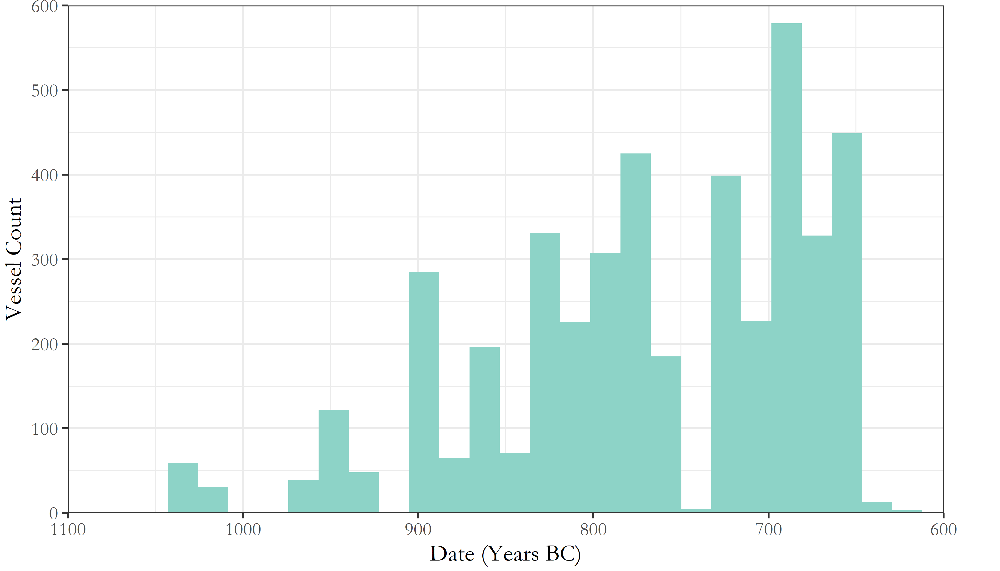

But the artificial clustering this technique engenders around select absolute dates can prove misleading, as in Figure \@ref(fig:allpithoi); the apparent cessation of depositions in the 8th century is simply a fiction generated by the processing of the data.

A alternative approach, employed extensively in this paper, is the use of so-called 'aoristic analysis' [for original use in criminology, see @Ratcliffe2000; for archaeological applications, see @Crema2010; @Crema2012; @Johnson2004a]. Here, rather than give a pot a single date, the entire time span under investigation is divided into equal chunks (in this case, decades), and probability values summing to one are then assigned per chunk of time, based on the vessel's date range. So, our PGB vessel, datable between 840 and 810 BC, would register a value of 0.33 for each of the three decades this encompasses. These values for individual vessels can then simply be summed to produce tomb- or cemetery-level signatures. A particular attraction of this method is that it incorporates temporal uncertainty into the size of the resulting values, that is, "events with tight temporal definition contribute more to the total probability over their range than do loosely defined events" [@Johnson2004a: 450].


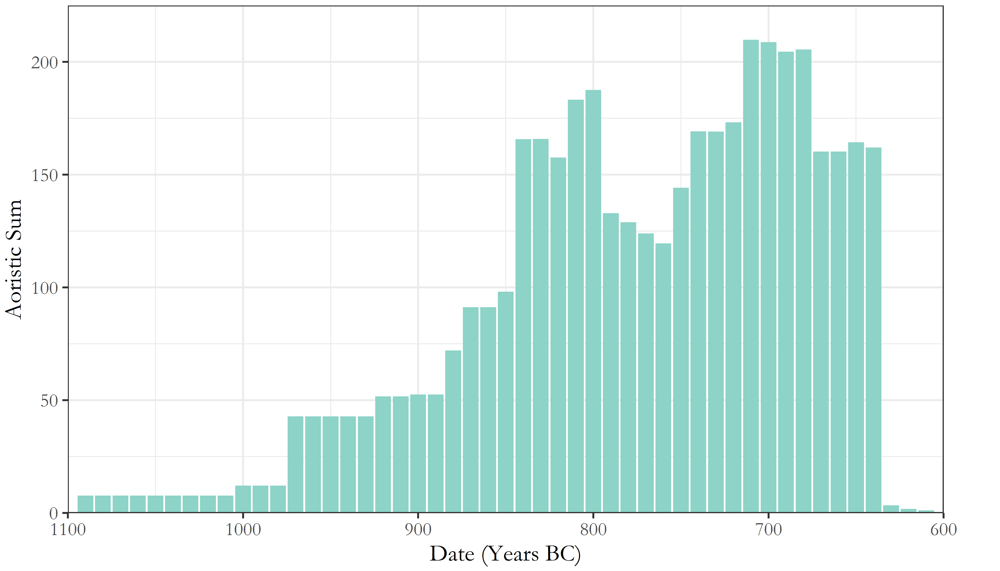

As seen in Figure \@ref(fig:aoristallcems), the artificial peaks and troughs of the simple averaging method are avoided, and different patterns become visible. Though these methods present their own limitations [@Crema2010: 1123-24], they are considered a more robust and productive approach to the temporal uncertainty of ceramic dating.


#Analysis

##Introduction
The great advantage of the large, quantitative dataset employed here is that it permits investigation of several nested levels of potentially significant patterning. From individual burials, to collective tombs, to whole cemeteries, we have the opportunity to study and compare both the synchronic and diachronic variation across these various levels. In so doing, I first investigate the broad temporal trends in tomb construction, burial, and pottery deposition across both cemeteries, isolating a notable trend among a select group of tombs. I then examine these more closely, in an attempt to understand what sets them apart from the rest. Tomb dimensions, artefact distributions, and changes in the composition of assemblages through time are all considered, to produce an account which speaks to the changing social landscape of EIA Knossos, drawing together issues of group identity, external relations, and the communication of wealth and status through funerary practice. 

##Temporal Developments in the Knossian Cemeteries

An obvious place to begin is with the chronology of the burials themselves. The rate and quantity of interments through time provides the background against which to consider all other developments. 

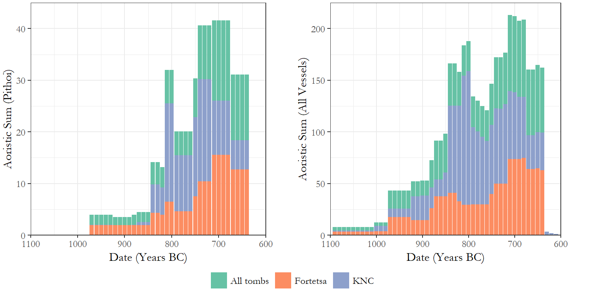


And, despite differences in scale and timing, it is immediately apparent from Figure \@ref(fig:aoristbycem) that Fortetsa and the KNC underwent similar chronological developments with regard to burials and, to a slightly lesser degree, grave goods. In both cemeteries, the rate of cremation burial began rising around the end of the 9th century, plateaued slightly in the early 8th, and then rose again to a peak in the late 8th and early 7th. Across all vessels, the developments are more volatile, but largely similar, especially regarding the late spike in burial activity. We might assume that these trends would be mirrored in the construction of new tombs, but this proves not to be the case.

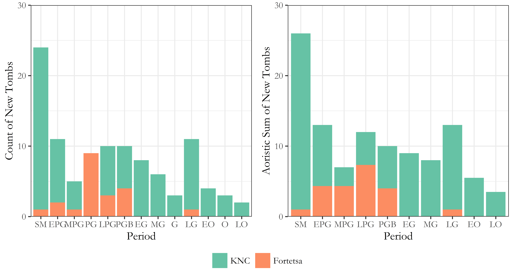

Figure \@ref(fig:tombconstruction) presents two ways of dating the construction of the tombs. In both cases, the trend appears clear. The KNC began with a large number of new tombs built during the, admittedly prolongued, SM period, followed by a protracted decline in rates of consruction, offset by small resurgences in the late 9th and 8th centuries. It should be noted, too, that many of the later 'tombs' are not chamber tombs, but a mix of pit, larnax, and pithos burials. The Fortetsa, meanwhile, saw almost no new tomb construction from the 8th century onwards. This abatement has been noted before (Brock 1957: 4; Cavanagh 1996: 652–53) and somewhat implicitly read as evidence of restructuring of the funerary rite, if not a decline in the fortunes of the wider community. But this image of a waining investment in chamber tombs sits uneasily with the observable growth in mortuary activity.

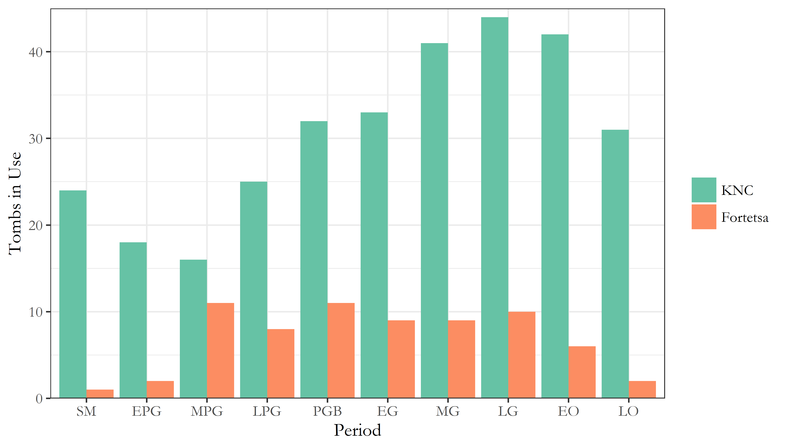

These countervalent trends are observable too in the number of tombs receiving depositions in each period (Figure \@ref(fig:tombsinuse)). At Fortetsa, this number remained relatively stable from the MPG to LG periods before declining (and bear in mind, there were only ever around 20 tombs belonging to this cemetery), while at the KNC, the number of tombs in use rose to a preak in the late 8th century before declining.

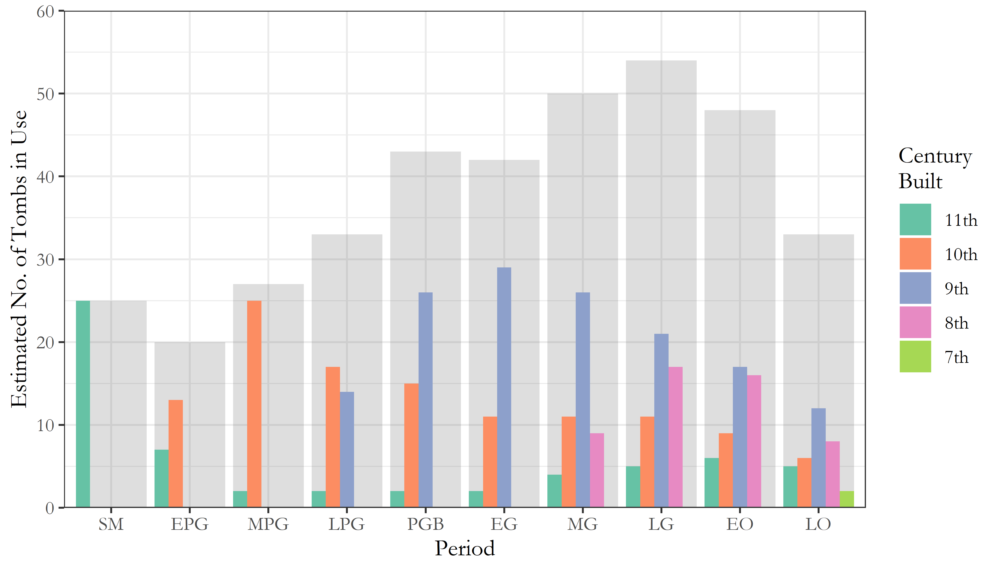

But the net increase in active tombs in the 8th century belies a more complex pattern (Figure \@ref(fig:tombsinusebybuilddate)). By dividing the tombs in use into the centuries during which they were built, we see a wave-like pattern with each cohort steadily going out of use as new ones were constructed. This would seem to accord with Cavanagh's (1996: 659) suggestion that "[t]he length of time the tombs last seems [...] to reflect the duration of the social group which had access to the sepulchre", and that, if such access was lineally inehrited, frequent fission would result in limited trans-generational use. We might expect, then, that it was the 8th century tombs coming into use that spurred the dramatic rise in burial rates.

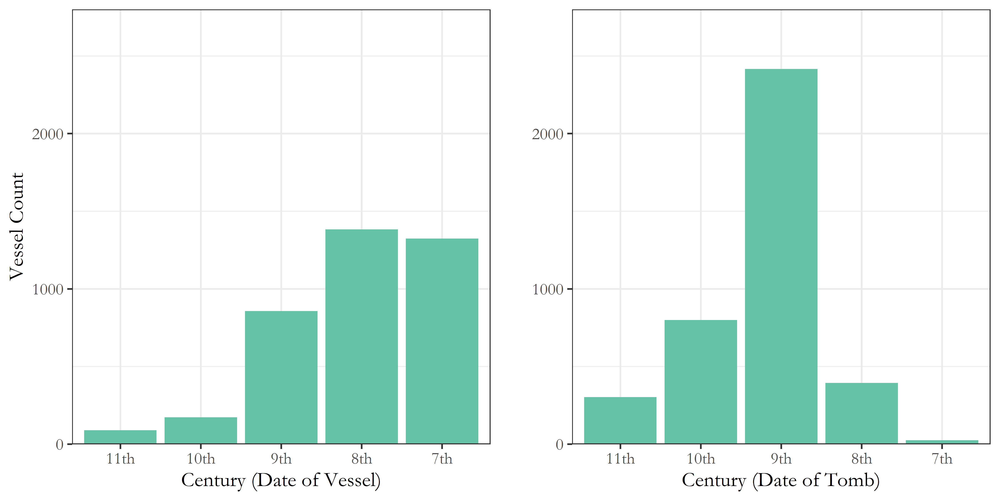

However, we see from Figure \@ref(fig:potsbydateandtombdate) that, although the late 8th and early 7th centuries represented the apex of burial activity across both cemeteries, it was tombs built back in the 9th and 10th which received the lion's share of the burials and associated ceramics. This is all the more notable when, as seen in Figure \@ref(fig:tombsinusebybuilddate), they were, at this time, declining in number.


*Table 1 goes around here*

The significance of these findings can be seen in Table 1. Using pithoi as a proxy for burials, we can estimate the changing rates of burial through time. And while these mostly remained around three per tomb per century, in the 8th and 7th centuries, tombs founded in the 9th century saw a rapid rise in the rate of burial, peaking at over 11 per tomb per century. Though no doubt rough estimates, the marked nature of this divergence suggests it is not simply an artefact of imperfect data.

But Table 1 also demonstrates the markedly low rates of burial which predominated at both cemeteries; two to four burials per tomb per century amounts to a very selective burial rite. It seems unlikely, then, that the rising rates of burial are, for instance, the direct result of population growth; the increase is too rapid, and concentrated only in older tombs, while, based on KULP’s survey data, the major population increase at EIA Knossos probably occurred back in the Protogeometric period (Whitelaw, pers. comm.).

##Isolating the Phenomenon

We are yet to draw out which older tombs precisely are responsible for the trend so far discussed. We might assume those which became the focus of such intense later burial activity would end up yielding the most burials and grave goods when excavated and, happily, this supposition proves true. 


The 12 tombs with the most associated vessels are all chamber tombs, 10 dating to the 9th century and two to the 10th, and seven of them did exhibit late, intense episodes of deposition (Figure \@ref(fig:toptombs)). In fact, Tombs P, 292, 75, 107, 285, II and 218 (henceforth 'Group A') between them account for 35.11% of the entire ceramic assemblage from both cemeteries. All but Tomb 285 date to the 9th century, and together they underpinned the discussed late spate of burials. 


Interestingly, Tombs X, G, Q, 219 and 283 ('Group B') evince a different pattern, with their respective peaks coming around a century earlier, another period of increased burial activity. So despite receiving the greatest quantities of burials and grave goods, these tombs nonetheless seem to have achieved that distinction via quite different histories, a divergence made clear in Figure \@ref(fig:groupsab). It is notable that tombs assinged to each group are seen in both cemeteries, suggesting from the outset that the differences between these may speak to social forces operating across the Knossian community.

##Not All Tombs are Created Equal

Having addressed some broad diachronic trends, let us now attempt some more synchronic comparisons, beginning with the physical dimensions of the tombs as built - a potentially rich context for the negotiation of social power and group membership. Perhaps the most bountiful tombs were also physically the largest, assertions of status embodied by the man-power invested in their construction.

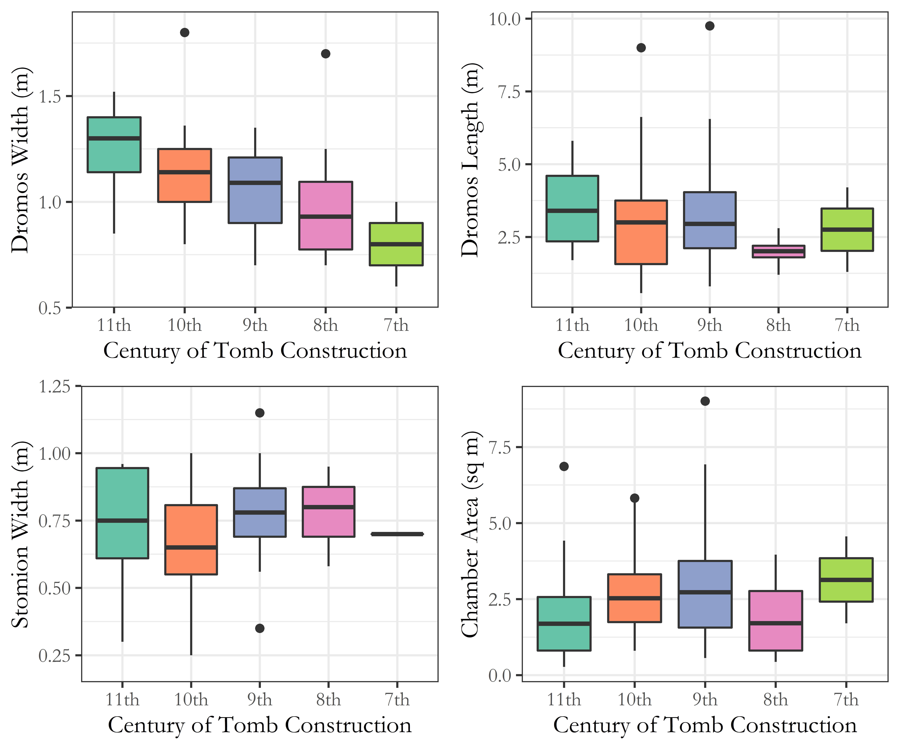

In Figure \@ref(fig:dimensionsboxplots), we see that, through the centuries, tomb dimensions did vary, and sometimes consistently, as with the trend toward narrower *dromoi*. The 9th-century tombs, though, which include all but two of the 12 discussed above, do not particularly stand out. It does seem their chambers were, on average, larger, as well as exhibiting greater variation than at any other time. But then again, even the largest chambers are not exactly cavernous, and the extra labour expended would have been limited. The *dromos* is a plausible area for conspicuous demonstrations of scale but, with their frequently poor preservation, little confidence is possible. It appears at any rate that they were gradually shrinking, albeit with some notable outliers.

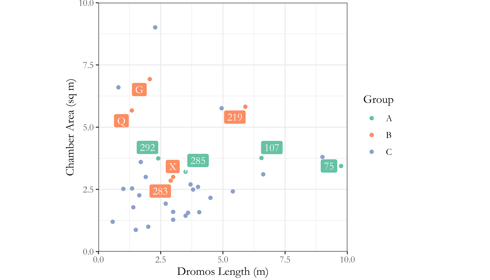

Looking more specifically at the tombs of Groups A and B, against the backdrop of the other 10th and 9th century tombs, there are perhaps hints of differentiation. All of them fall within the top 50% based on chamber area, and three have exceptionally long *dromoi*. But, later destruction notwithstanding, there appears nothing systematic about the variation visible here. If the size of one's tomb was intended to evoke or assert ideas of wealth or status, this appears to have occurred on a largely independent basis.

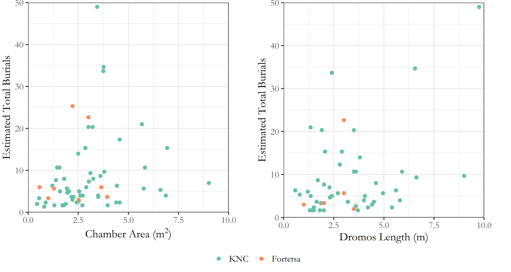

What we can say is that no clear relationship existed between the dimensions of a tomb and its eventual buried population (see Figure \@ref(fig:tombdimensions)). Many of the very largest tombs are middling when it comes to burial numbers, and vice versa. So whatever the scale of the tombs connoted when built, this proved irrelevant to their later reuse. Several had niches cut into their *dromoi*, or the *stomion* extended, to fit in later burial urns (including T. 292, 283 and 107; Cavanagh 1996: 658) and, sometimes, urns from within the chamber were relocated to make space for new interments (including T. 75 and TFT; ibid.: 658; Brock 1957: 3–4). The impression is of competition for inclusion into the sepulchral group, further confirming that the tombs’ original builders little anticipated their eventual popularity.

##Imports, Interments, and Indices of Wealth

Dimensions aside, we can investigate the contemporary use of these tombs through comparisons between the scale and composition of their respective assemblages through time. 

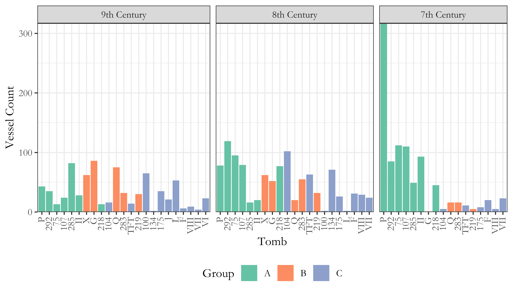

And in Figure \@ref(fig:tombscompthroughtime), we see that the tombs of Group A, while not paultry in the 9th century, were by no means exceptional. They clearly kept pace with the other popular tombs of the time, but their major divergence only occurred in the subsequent two hundred years. Group B, meanwhile, experienced similar, if not greater, use in the 9th century, and then gradually declined. That is, these tombs seem to have followed a more conventional trajectory viz. Figure \@ref(fig:tombsinusebybuilddate). What might account for this disparity? And if the patterns implied in Figure \@ref(fig:tombscompthroughtime) - relative diversity, giving way to effective bipolarity in depositions - are genuine, how might we further investigate their manifestations across the excavated assemblage?

## A Tale of Two Periods

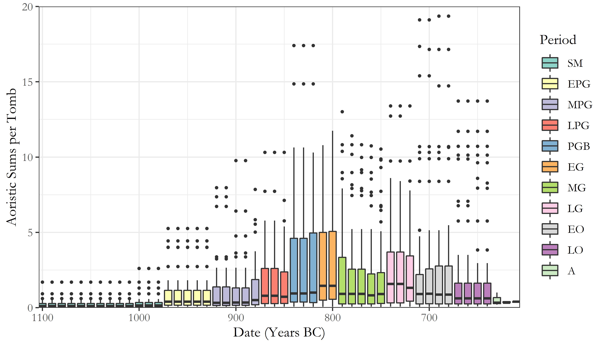

Figure \@ref(fig:bigbox) is a boxplot of the total aoristic sums across both cemeteries, colour-coded by ceramic phase. Looking at the PGB and EG, we see that they have the largest interquartile ranges (IQRs) of any period, and only a single outlier (beyond 1.5 times the IQR) each. The Orientalising period, on the other hand, exhibits much reduced IQRs, and a proliferation of outliers (namely, Group A) far and above the range of the other tombs. In other words, whilst both the PGB-EG and EO-LO periods witnessed an expanding volume of burial activity, in the earlier period this was distributed far more evenly across all tombs. One speaks of increasing plurality, the other of divergence.

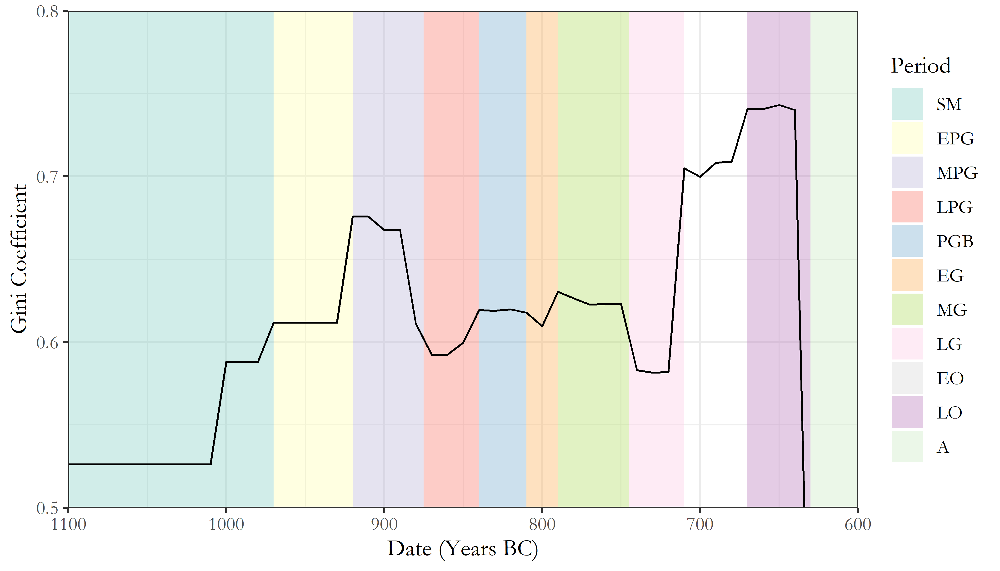

This characterisation is supported further by considering the Gini coefficient for the distribution of pottery between the tombs (see Figure \@ref(fig:gini)). Using aoristic sums as a probablistically-weighted estimate of the volume of material deposited in each tomb in each decade, the Gini coefficient can give an (albeit rough) estimate of how unequally distributed that material was. And, though values were always relatively high (i.e. unequal) within the cemeteries, the major spike in the Gini coefficient seen in the Orientalising period does contrast markedly with the plateau of the PGB-EG. 

This is not to suggest that the late 9th to early 8th century#ies was a time of egalitarian burial practices. The PGB and EG are consistently interpreted as periods of artistic development, increased overseas trade, and renewed vigour in the construction of tombs and the visibility of the burial rite [@Brock1957: 143-44; @Coldstream1994: 110-12]. The PGB style reflects a uniquely Cretan blend of Attic and Near Eastern forms, while the appearance of BA 'antiques' in the tombs from this period onwards is felt to reflect rejuvinated, even competitive interest in the Minoan past.

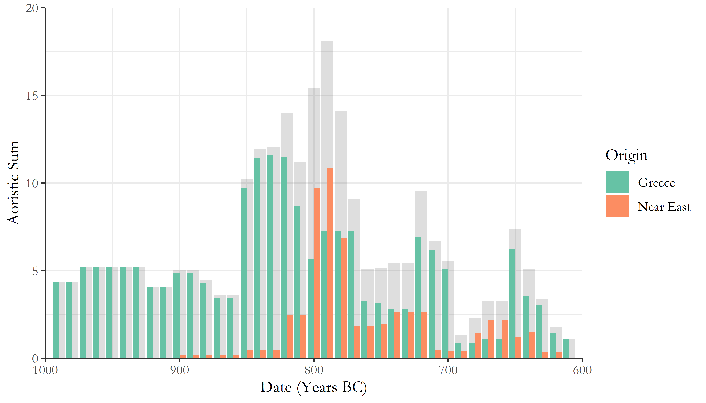

The rise in imported items is readily observable, with a succession of Greek and Near Eastern imports in the late 9th and early 8th centuries (Figure \@ref(fig:imports)). Likewise, the decline in Near Eastern imports, and concomitant rise in locally-made imitations thereof, is visible at the end of the 8th century. These trends being a very coarse proxy for its engagement with the wider Mediterranean, the late 9th and early 8th centuries would seem to encompass the most outward- (certainly,eastward-) looking phase of the EIA Knossian community [see @Whitley2004: 434].

In the Group B tombs, with their more limited flourescence centred on the PGB-EG periods, imported items constitute 11.24% of the total excavated assemblage, compared to 5% in Group C and 4.92% in Group A. Indeed, among 7th century vessels, when interments were higher than ever among Group A, the figure is a mere 1.36%. The impression grows stronger that the context for the late proliferation of burials in the Group A tombs was altogether different from that underpinning the comparative, competitive diversity of interments a century earlier.

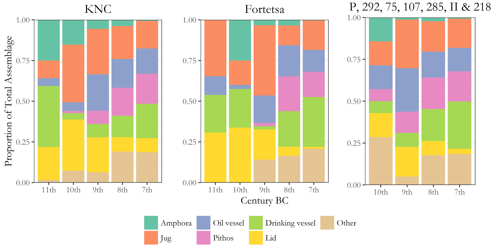

This is reflected further in the changing composition of the mortuary assemblage through time (Figure \@ref(fig:comps)). Across both cemeteries, there appears to have been the steady crystallisation of a basic 'burial kit', comprising a pithos and lid, an oil vessel or two, a jug, and a drinking vessel. The proportion of grave goods comprising 'other' vessels - pyxides, askoi, trays, stands, dinoi, kernoi, kraters and more - declines to become a near insignificant part of the standardised repertoire of the 7th century. The tombs of Group A did not break this mould, and their assemblages seem largely as conventional as any other by this time.

The main focus of this article has been on ceramics and not other artefacts of metal, stone, glass, and organic materials, due to their less well-developed chronologies, but even the raw distribution of such artefacts may make more sense in the light of the foregoing discussion. There is a relatively strong (Spearman's ρ=0.72) correlation between the number of ceramic and non-ceramic finds across the tombs, and, certainly, many of the most seemingly precious objects were recovered from among the tombs with the most burials. 


But this association, perhaps tempting one initially to speak of 'elite' or 'high-status' tombs, evaporates when the number of objects is divided by the number of burials represented. This fact has seldom, if ever, been appreciated in prior discussions of the cemeteries (Figure \@ref(fig:hists)). Whitley (2004: 437) has pointed out that the proportions of different decorative styles of Orientalising pithoi in Tomb P are replicated across Fortetsa as a whole, but it seems this situation may apply across most artefact classes. If so, the late surge in burial activity at both Fortetsa and the KNC was not linked in any straightforward way to simple principles of 'elite' or 'wealthy' burial; many of the most-used tombs prove exceptional only in their absolute quantities of artefacts, and not the accoutrements of each individual burial. This fact has seldom been appreciated in prior discussions of the cemeteries.

# Discussion

To summarise, towards the end of 8th century BC, a select group of tombs, all built back in the 9th or 10th, became the foci of a major increase in burials which didn't register among the tombs built during that time. Little about the physical dimensions or early use of these tombs presaged their later popularity, while a similar, if smaller, increase in burial activity around a century earlier, in the PGB-EG periods, contrasted in the comparative diversity and broader distribution of its associated assemblages. 

It remains to consider how we might characterise the burying groups behind these various, intriguing trends. The traditional view is that such groups were immediate families (Brock 1957, 41; @Boardman1967: 63; @Coldstream1996: 291). The relatively short lifespan of many tombs has been taken as evidence for direct, lineal inheritance, with the tomb going out of use as families moved, individuals founded new tombs, or the line fissioned or ended [@Cavanagh1996: 659]. The idea of family groups is supported by the, admittedly circumstantial, evidence of men, women and children being found within single tombs, and one instance of a (putatively) hereditary mandibular deformity in three skulls in the same tomb [@Musgrave1996].

The model of lineal inheritance has been recently challenged by Kotsonas [-@Kotsonas2011: 131], however, who considers it ‘probably the greatest factoid in the archaeology of Crete of the given period’. He argues that the rise in interments during the 8th century is too great to be explained by population growth, as would be necessary for the possibility of direct lineal inheritance to be preserved. Rather, the trend must reflect reconfigurations of the burying groups themselves, which Kotsonas feels may have (also or instead) comprised age- and sex-grades. We should take this possibility seriously, for one need only look at Tomb P in the 7th century to see that we cannot possibly be dealing with just immediate families.

Yet it is hard to be conclusive, as our current understanding of the social organisation of the early Cretan *poleis* remains patchy. Perlman and Gagarin's [-@Gagarin2016] recent study of the Cretan law codes reminds us that there is an often underappreciated degree of diversity in the offices, institutions, and social groups of the early city-states. In the traditional view, political authority was vested in the *kosmoi*, aristocratic magistrates selected from the leading, hereditary *startoi*, or ‘clans’, networks of extended lineages controlling the ancestral estates on which worked attendent serfs and/or slaves (Willetts 1982, 240). But despite elements of this account probably being accurate, others remain equivocal, such as the nature of the *pyla*, or 'tribe', and its relation to the *startos* (which may itself be a military grouping), the distinction between *astos* and *poliatas*, both probably formulations of the rights-bearing civic actor, and the ancestry and spread of the *agelaos*, an adolescent age-grade currently only attested at Eltynia [@Gagarin2016: 36; 78-80]. Indeed, many terms which might illuminate social divisions and groupings within the Archaic Cretan populace are only attested at one or two sites, and even then sometimes apparently differ in form or function.

My aim, however, is not to draw a simple parallel between the Knossian burial groups and, say, powerful *startoi*, a term not even attested outside of Gortyn in this period (ibid: 1-2). The fundamental conclusion of the disucussed contrasts between the late 9th and late 8th centuries, between the Group A and B tombs, is not that the burying groups changed, as such, it is that wider socio-economic and political contexts did, in ways which prompted reformulations of funerary practice, one of which being the intense, iterative burial activity evinced by the patrons of the Group A tombs. Such inferences, naturally, recall the conclusions of Morris [-@Morris1987: 171-211], who argued 30 years ago that the emergence of the *polis* across the Aegean led to a tension between elite preferences for ostentatious display, and a downplaying of social difference in death, as promoted by the ‘middling’ ideology of the city-state. In his well-known model of the *agathoi* and *kakoi*, Morris claimed that, at various times, the relevant spheres of kinship demonstrated in burial could widen and constrict, with more and less distantly related lineages drawn into association through changing social strategies, until the pre-eminence of kinship relations in the structuring of political power declined, along with its manifestiations in mortuary practice.

At Knossos, some aspects of the noted expansion in the burying population seem explicable within a model like Morris's. The basic principle, of elites employing access to burial as a strategic act of association and social signalling, is almost certainly in evidence here. That the noted spate of burials in the late 8th and early 7th centuries was concentrated solely in older tombs strongly implies that issues of heritage, lineage, and tradition were at play. In Tomb 107, the stratigraphy of the niches cut into the *dromos* suggest depositions continued to be made even after the main chamber fell into disrepair [@Coldstream1996a: 150]; it is the symbolic and associative, rather than physical qualities of these tombs seem instrumental to their extensive reuse.

Other features sit less easily with a Morrissian reading of the evidence, though. Firstly, the burials at issue are in many ways *not* ostentatious in comparison to the norm. We have seen that the 'richest' tombs in terms of finds are far less so when one accounts for the number of burials represented. Likewise, Morris claims that periods of expansion in the rite of burial will correspond to increased diversity in the associated assemblages. Yet, at Knossos, the range of grave goods diminished and crystallised during the late 8th and early 7th centuries. The PGB period better embodies such an expansion, with its greater variety in chamber dimensions and relatively broad distribution of (local and imported) grave goods, not to mention the innovative ceramic decoration and reuse of BA artefacts. In both the late 9th and late 8th centuries, then, certain burying groups found it propitious to broaden access to the tombs they patronised, but changing social contexts saw those expansions manifested in quite different ways. 

Elsewhere on Crete in the 7th century, we see a shift to unmarked, individual burials, and more austere grave goods, as well as an apparent reorientation of sanctuary deposits away from extra-mural to suburban spaces, and a rise in utilitarian, mass-produced votives [@Gagarin2016: 34-36]. At Knossos, a small number of pithos burials in pits do appear in the KNC and Fortetsa volumes (Brock 1957: 98; Coldstream and Catling 1996: 162), and recent re-excavation of the Teke plot identified numerous small pit burials around three chamber tombs [@Evely2012], raising the possibility that others exist, but have gone unrecognised in prior excavations. At Azoria, major urban remodelling in the 7th century saw the earlier, agglutinative house forms of neighbouring Kavousi Vronda and Kastro give way to larger, more formally planned dwellings with little evidence of remodelling, while larger, apparently civic, buildings were constructed to accommodate major public gatherings [@Haggis2011; @Haggis2011b; @Haggis2014]. 

Together, these varied threads suggest that, with the emergence of the archaic *poleis* on Crete, there was a concomitant restructuring of wider social groups, institutions, and behaviours. It seems not unreasonable to infer an emergent emphasis on the citizen, the state, and ideologies of relative egality, within which communal gatherings, intra-mural ritual, and individual graves replaced ostentatious, kin-centred acts of gathering, dedication, and burial. And in the Knossian cemeteries, we have seen a somewhat diverse set of burial practices give way to a more prolific, yet more restricted, suite of funerary rites, focussed on a small number of long-established tombs, in the context of diminishing collective tomb construction, replacement of imports with locally-made imitations, and an imminent cessation of such depositions. 

Whether the increasingly homogenous burials reflected some standard set of accoutrements intentionally shared by the hypothetical *agathoi*, or else nascent, egalitarian strictures over elaborate burial remains difficult to judge. Yet we need not adopt wholesale a model like Morris's "middling" ideology, nor link the diminishing range of burial goods to Archaic Crete's purported austerity. As a more nuanced picture emerges of the island's relationship with the wider Mediterranean, subtler characterisations are possible. It is telling that the peak for imported items came in the 9th century; the Orientalising as a time period feels increasingly misapplied to Crete [@Whitley2004: 434], when, at Knossos at least, it witnessed far lower rates of 'oriental' imports, and only limited adoption of the figural motifs which characterise its appearance elsewhere. 

The decline in imports was, however, counterpointed by a rise in imitations of Near Eastern vessels [@Antoniadis2012: 170], according with our growing awareness of the selective nature of Archaic and Classical Crete's external relations. Erickson [@Erickson2010], similarly, has argued that *symposia* were practised in Crete, something often disputed, but that their practitioners merely favoured simpler vessel forms than the figurally-decorated wares popular on the mainland. Local, selective adoption of, and responses to, wider social and material trends is perhaps becoming the hallmark of Archaic Crete, and finds further endorsement in the EIA cemeteries at Knossos. What seems certain is that this was a period of transition wherein, whatever their exact identity, certain actors invested heavily in a final flurry of burials in chamber tombs, with an emphasis on a traditional, established repertoire of items, rites, and venues for one's passage to the afterlife, before changing social forces effected their abandonment. 

# Conclusion

It is important that the present study was a comparative investigation of both the Fortetsa and Knossos North cemeteries. That both underwent comparable developments during the EIA suggests, not only that they catered to similar sub-sections of the Knossian population, but that some of the socio-economic and political changes inferred were significant and community-wide. Further work should seek to extend these comparisons, both into trends unexplored in the present study, and out to the wider funerary landscape of Knossos. I hope to do just this but, for the time being, the datasets I am making available alongside this article include the other published EIA tombs in the area, so that others may also explore their possible significance.

There were undeniable limitations to the present study. For one, non-ceramic artefacts were underrepresented due to difficulties with dating, and future work could seek to address this. Issues of gender were sadly little considered, though this was largely due to limitations in the data. There have also been a number of tombs discovered in the last 20 years that fill in the spaces between the Teke plot and the Medical Faculty Site, and ideally these unpublished tombs should be included in further analyses as they, along with the Teke tholos and associated tombs, are probably part of a single contiguous cemetery [@Blackman1999: 113; @Catling1983: 51; @French1991: 68-69]. Finally, a preliminary study was recently undertaken by the author of select boxes marked as 'unpublished' from the KNC deposits kept at the British School at Athens, at Knossos. Despite little mention in the publication, this material was not inconsiderable and so, regretably, future work will be necessary to determine whether it threatens the integrity of these analyses. Suffice to say that, at present, it is another pinch of salt with which to take the present findings.

These limitations notwithstanding, the foregoing analysis demonstrates the value of applying quantitative approaches to the archaeological record of the period. Though the construction of databases can be time consuming, once made they offer the opportunity to subdivide, compare, and plot the data in numerous ways, facilitating investigation of the material from multiple angles. By making datasets available for use by others, as with the data and code for the present study, one’s conclusions can also be independently tested, and alternative interpretations can be voiced. The databases produced for the above analysis contain a large of amount of unutilised data that could facilitate a range of future investigations, and all are welcome to it. With more such analyses, we could begin to a construct a fuller account of the regional diversity in mortuary, and wider social, practices that characterised the communities of EIA and archaic Crete.

##### pagebreak
# Acknowledgements

I would like to thank Borja Legarra Herrero and Corinna Riva for their help and advice from the earliest stages of the present research, as well as the BSA at Knossos for permitting me to examine some of the material from the Medical Faculty excavations. I am indebted most of all to Professor Todd Whitelaw, for his unstinting guidance, feedback and facilitation of my ongoing research. 

# About the Author

Dominic Pollard is a PhD candidate at University College London. His research focusses on the Early Iron Age of Crete, with particular interest in the use of computational methods to supplement traditional modes of archaeological inference.

##### pagebreak
# References 
<!-- The following line ensures the references appear here for the MS Word or HTML output files, rather than right at the end of the document (this will not work for PDF files):  -->
<div id="refs"></div>

##### pagebreak
# Captions

*Figure 1 Map of the Knossos area, showing the locations of the various EIA tomb clusters and cemeteries, with EIA pottery distributions from the Knossos Urban Landscape Project marked in orange, giving an impression of the contemporary urban extent (underlying image credit: T. Whitelaw).*

*Figure 2 Relationship between known interments, counts of pithoi, and counts of pithoi, amphorae and kraters across both cemeteries. The straight line represents the mean estimate based on these three values.*

*Figure 3 Counts of pithoi across both cemeteries through time. Vessel dates have here been based on the midpoint (or mean) of the absolute date range accompanying their respective ceramic periods.*

*Figure 4 Aoristic sums of all vessels across both cemeteries. This represents a probabilistically weighted visualisation of depositional activity through time.*

*Figure 5 Aoristic sums of pithoi (left), as a proxy for cremation burials, and of all vessels (right). The sums are colour coded to show the values of the two cemeteries, and the total values*

*Figure 6 Tomb construction through time at both cemeteries. On the left, counts are based on the ceramic phase considered most likely to correspond to the tomb's first use (including simply 'PG', 'G' and 'O' where no greater specificity was possible). On the right, aoristic sums are presented, spreading the uncertainty associated with those general assignations. In both cases, tombs lacking any securely dateable pottery are excluded.*
*Abbreviations*
*SM - Subminoan; (E/M/L)PG - (Early/Middle/Late) Protogeometric; PGB - Protogeometric B; (E/M/L)G - (Early/Middle/Late) Geometric; (E/L)O - (Early/Late) Orientalising*

*Figure 7 Estimates of the number of tombs in use during each of the ceramic phases attested in both cemetaries, based on counts of tombs yielding vessels of each period.*

*Figure 8 Estimates of the number of tombs in use through time across both cemeteries. The grey background represents the total number of tombs in use, while the smaller coloured bars correspond to tombs built in each of the five centuries of EIA activity at the cemeteries.*

*Figure 9 Counts of vessels from all tombs in both cemeteries, arranged, on the left, by the century to which they are assigned based on their ceramic period and, on the right, by the centuries in which the tombs they come from were built.*

*Figure 10 Aoristic sums for the 12 tombs with the largest ceramic assemblages, arranged in decreasing order. Note, for the sake of better illustrating the relative temporal patterns, rather than absolute values, the scales on each plot are distinct.*

*Figure 11 Aoristic sums for the Group A and Group B tombs, as defined above.*

*Figure 11 Boxplots comparing various tomb dimensions, divided, in each case, by the century of tomb construction.*

*Figure 12 Scatterplot comparing the dimensions of* dromos *length and chamber area. Groups A and B, defined earlier, are illustrated and labelled in green and orange respectively, while all remaining tombs ('Group C') are in blue.*

*Figure 13 Scatterplots comparing tomb dimensions (chamber area and* dromos *length) to the estimated total number of burials by tomb. The points area colour-coded as per Figure 12.*

*Figure 14 Counts of vessels dating to the 9th, 8th and 7th centuries respectively, found in tombs built in the 10th or 9th century which yielded upwards of 50 vessels when excavated. The tombs are colour-coded as per Figure 12.*

*Figure 15 Boxplot showing the aoristic sums of all vessels across both cemeteries through time, colour-coded by ceramic period. Boxes represent the interquartile range, horizontal lines the median value, whiskers values within 1.5 times the interquartile range, and points outliers beyond this. Note, the Y axis has been limited to 20 to aid readability, meaning the outliers Tomb G in the EG period, and Tomb P in the late EO-LO period are excluded, with values ranging from 29-34, and 36-44 respectively.*

*Figure 16 Gini coefficient values through time based on the aoristic sums for all vessels across both cemeteries. Background colours correspond to ceramic periods.*

*Figure 17 Aoristic sums of imported and 'oriental' imitation vessels through time across both cemeteries, colour-coded by regional origin in the case of imports.*

*Figure 18 The composition of the total pottery assemblage for each century across both cemeteries, and among the 7 notable tombs (Group A) drawn out earlier in the analysis.*

*Figure 19 Histograms corresponding, first, to counts of jewellery (beads, necklaces, rings, diadems etc.), metal objects, and imported items by tomb across both cemeteries and, secondly, to those counts divided by the estimated number of burials in each tomb.*

##### pagebreak
# Figures


##### pagebreak
# Tables


|**Tombs**          | **Date of pithoi (burials)**| **No. of pithoi (burials)**| **Number of tombs represented** | **Burials per tomb**                   |
|-------------------|--------------------------|-------------------------|-----------------------------|--------------------------------------------------|
|*10th century tombs*|                         |                         |                             |                                                  |
|                   |10th century              | 8        | 4         | 2 |
|                   |9th century               | 46         | 17          | 2.71   |
|                   |8th century               | 59         | 12          | 4.92   |
|                   |7th century               | 32         | 8          | 4   |
|*9th century tombs*|                          |                         |                             |                                                  |
|                   |9th century               | 54          | 19           | 2.84     |
|                   |8th century               | 184          | 29           | 6.34     |
|                   |7th century               | 167          | 15           | 11.13     |
|*8th century tombs*|                          |                         |                             |                                                  |
|                   |8th century               | 34          | 15           | 2.27     |
|                   |7th century               | 46          | 15           | 3.07     |
|*7th century tombs*|                          |                         |                             |                                                  |
|                   |7th century               | 5          | 2           | 2.5     |


*Table 1 The number of pithoi (as a proxy for burials) deposited in tombs dating to the 10th, 9th, 8th and 7th centuries respectively. For each of the centuries the tombs were in use (column two), counts of pithoi (column three) are divided by the number of tombs from which these vessels came (column 4), allowing calculation of the changing rate of burial through time (column five).*


#####pagebreak

### Colophon

This report was generated on 2019-07-15 15:20:53 using the following computational environment and dependencies: 


```
#> - Session info ----------------------------------------------------------
#>  setting  value                       
#>  version  R version 3.5.1 (2018-07-02)
#>  os       Windows 10 x64              
#>  system   x86_64, mingw32             
#>  ui       RTerm                       
#>  language (EN)                        
#>  collate  English_United Kingdom.1252 
#>  ctype    English_United Kingdom.1252 
#>  tz       Europe/London               
#>  date     2019-07-15                  
#> 
#> - Packages --------------------------------------------------------------
#>  package      * version date       lib source        
#>  assertthat     0.2.0   2017-04-11 [1] CRAN (R 3.5.2)
#>  backports      1.1.3   2018-12-14 [1] CRAN (R 3.5.2)
#>  bookdown       0.9     2018-12-21 [1] CRAN (R 3.5.2)
#>  callr          3.1.1   2018-12-21 [1] CRAN (R 3.5.2)
#>  cli            1.0.1   2018-09-25 [1] CRAN (R 3.5.2)
#>  colorspace     1.4-0   2019-01-13 [1] CRAN (R 3.5.2)
#>  cowplot        0.9.4   2019-01-08 [1] CRAN (R 3.5.3)
#>  crayon         1.3.4   2017-09-16 [1] CRAN (R 3.5.2)
#>  data.table   * 1.12.0  2019-01-13 [1] CRAN (R 3.5.3)
#>  desc           1.2.0   2018-05-01 [1] CRAN (R 3.5.2)
#>  devtools       2.0.1   2018-10-26 [1] CRAN (R 3.5.3)
#>  digest         0.6.18  2018-10-10 [1] CRAN (R 3.5.2)
#>  dplyr        * 0.8.0.1 2019-02-15 [1] CRAN (R 3.5.2)
#>  evaluate       0.13    2019-02-12 [1] CRAN (R 3.5.2)
#>  extrafont    * 0.17    2014-12-08 [1] CRAN (R 3.5.2)
#>  extrafontdb    1.0     2012-06-11 [1] CRAN (R 3.5.2)
#>  farver         1.1.0   2018-11-20 [1] CRAN (R 3.5.3)
#>  fs             1.2.6   2018-08-23 [1] CRAN (R 3.5.2)
#>  ggforce      * 0.2.2   2019-04-23 [1] CRAN (R 3.5.3)
#>  ggplot2      * 3.1.0   2018-10-25 [1] CRAN (R 3.5.2)
#>  ggpubr       * 0.2     2018-11-15 [1] CRAN (R 3.5.2)
#>  ggrepel      * 0.8.0   2018-05-09 [1] CRAN (R 3.5.3)
#>  glue           1.3.1   2019-03-12 [1] CRAN (R 3.5.3)
#>  gridExtra      2.3     2017-09-09 [1] CRAN (R 3.5.3)
#>  gtable         0.2.0   2016-02-26 [1] CRAN (R 3.5.2)
#>  highr          0.7     2018-06-09 [1] CRAN (R 3.5.2)
#>  htmltools      0.3.6   2017-04-28 [1] CRAN (R 3.5.2)
#>  ineq         * 0.2-13  2014-07-21 [1] CRAN (R 3.5.2)
#>  knitr          1.21    2018-12-10 [1] CRAN (R 3.5.2)
#>  labeling       0.3     2014-08-23 [1] CRAN (R 3.5.2)
#>  lazyeval       0.2.1   2017-10-29 [1] CRAN (R 3.5.2)
#>  magrittr     * 1.5     2014-11-22 [1] CRAN (R 3.5.2)
#>  MASS           7.3-50  2018-04-30 [2] CRAN (R 3.5.1)
#>  memoise        1.1.0   2017-04-21 [1] CRAN (R 3.5.2)
#>  munsell        0.5.0   2018-06-12 [1] CRAN (R 3.5.2)
#>  pillar         1.3.1   2018-12-15 [1] CRAN (R 3.5.2)
#>  pkgbuild       1.0.2   2018-10-16 [1] CRAN (R 3.5.2)
#>  pkgconfig      2.0.2   2018-08-16 [1] CRAN (R 3.5.2)
#>  pkgload        1.0.2   2018-10-29 [1] CRAN (R 3.5.2)
#>  plyr         * 1.8.4   2016-06-08 [1] CRAN (R 3.5.2)
#>  png          * 0.1-7   2013-12-03 [1] CRAN (R 3.5.2)
#>  polyclip       1.10-0  2019-03-14 [1] CRAN (R 3.5.3)
#>  prettyunits    1.0.2   2015-07-13 [1] CRAN (R 3.5.2)
#>  processx       3.2.1   2018-12-05 [1] CRAN (R 3.5.2)
#>  ps             1.3.0   2018-12-21 [1] CRAN (R 3.5.2)
#>  purrr          0.3.0   2019-01-27 [1] CRAN (R 3.5.2)
#>  R6             2.4.0   2019-02-14 [1] CRAN (R 3.5.2)
#>  RColorBrewer * 1.1-2   2014-12-07 [1] CRAN (R 3.5.2)
#>  Rcpp           1.0.0   2018-11-07 [1] CRAN (R 3.5.2)
#>  remotes        2.0.2   2018-10-30 [1] CRAN (R 3.5.2)
#>  reshape      * 0.8.8   2018-10-23 [1] CRAN (R 3.5.3)
#>  reshape2       1.4.3   2017-12-11 [1] CRAN (R 3.5.2)
#>  rlang          0.3.1   2019-01-08 [1] CRAN (R 3.5.2)
#>  rmarkdown      1.11    2018-12-08 [1] CRAN (R 3.5.2)
#>  rprojroot      1.3-2   2018-01-03 [1] CRAN (R 3.5.2)
#>  Rttf2pt1       1.3.7   2018-06-29 [1] CRAN (R 3.5.2)
#>  scales         1.0.0   2018-08-09 [1] CRAN (R 3.5.2)
#>  sessioninfo    1.1.1   2018-11-05 [1] CRAN (R 3.5.2)
#>  stringi        1.3.1   2019-02-13 [1] CRAN (R 3.5.2)
#>  stringr        1.4.0   2019-02-10 [1] CRAN (R 3.5.2)
#>  tibble         2.0.1   2019-01-12 [1] CRAN (R 3.5.2)
#>  tidyselect     0.2.5   2018-10-11 [1] CRAN (R 3.5.2)
#>  tweenr         1.0.1   2018-12-14 [1] CRAN (R 3.5.3)
#>  usethis        1.4.0   2018-08-14 [1] CRAN (R 3.5.2)
#>  withr          2.1.2   2018-03-15 [1] CRAN (R 3.5.2)
#>  xfun           0.5     2019-02-20 [1] CRAN (R 3.5.2)
#>  yaml           2.2.0   2018-07-25 [1] CRAN (R 3.5.2)
#> 
#> [1] C:/Users/dcpol/R/win-library/3.5
#> [2] C:/Program Files/R/R-3.5.1/library
```

The current Git commit details are:


```
#> Local:    master C:/Users/dcpol/domproject
#> Remote:   master @ origin (https://github.com/DCPollard94/knossoscemeteries.git)
#> Head:     [3c7bbad] 2019-06-06: Final edits
```
